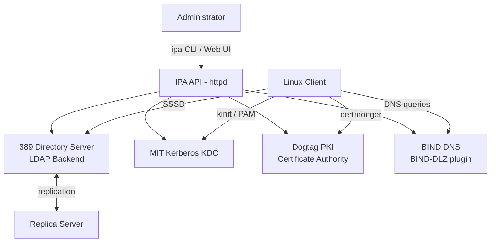
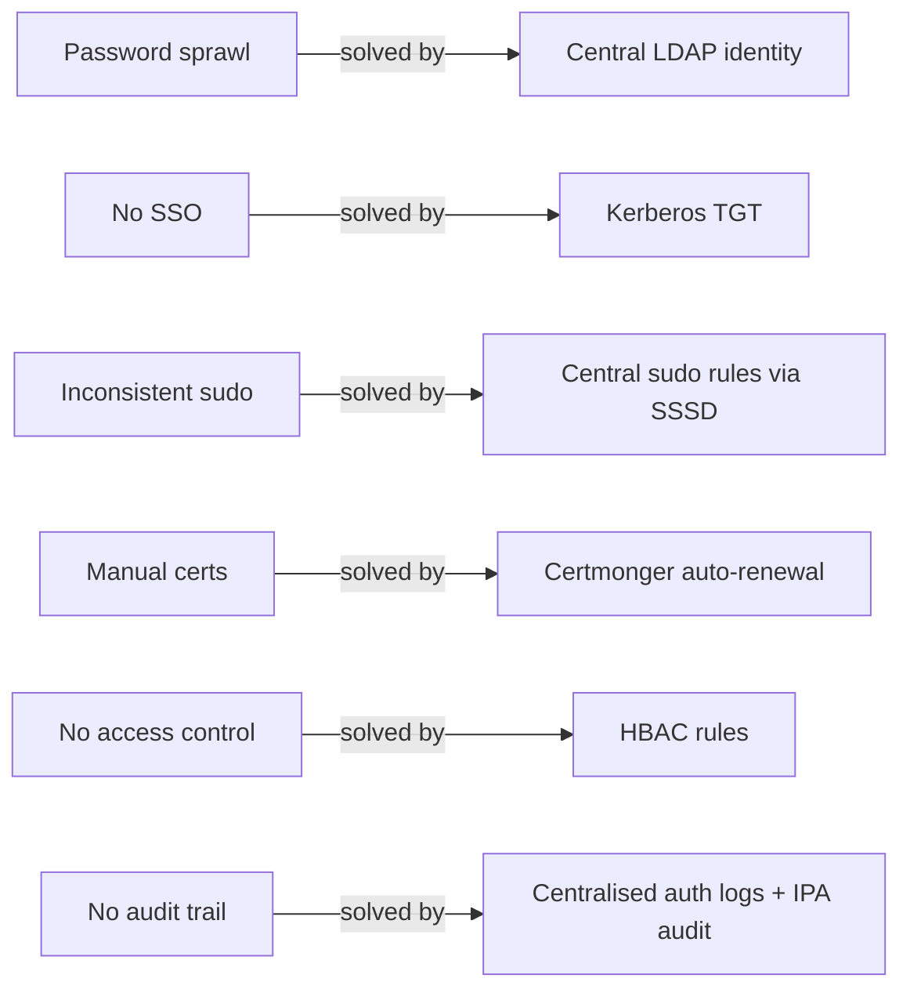
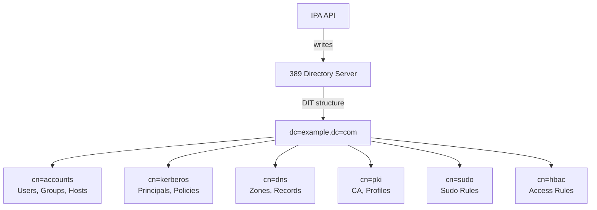
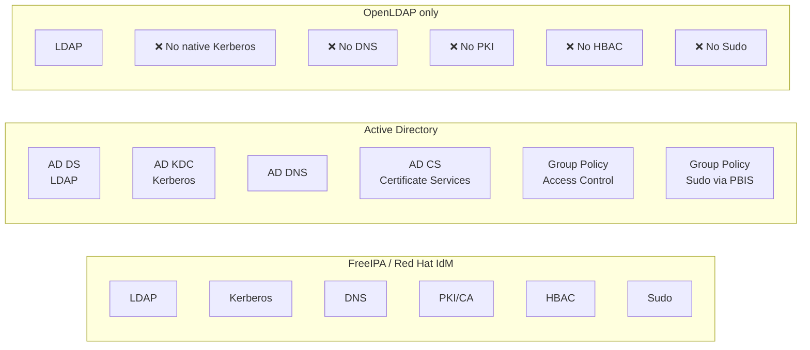

# Module 00 — Introduction to FreeIPA
[](./LICENSE.md)
[](https://access.redhat.com/products/red-hat-enterprise-linux)
[](https://www.freeipa.org)

> What FreeIPA is, the problems it solves, its major components, and how it compares
> to other identity management solutions. No prior IPA experience required.

## Table of Contents

- [1. What is FreeIPA?](#1-what-is-freeipa)
- [2. Problems FreeIPA Solves](#2-problems-freeipa-solves)
- [3. Core Components](#3-core-components)
  - [3.1 389 Directory Server (LDAP)](#31-389-directory-server-ldap)
  - [3.2 MIT Kerberos KDC](#32-mit-kerberos-kdc)
  - [3.3 Dogtag PKI (Certificate Authority)](#33-dogtag-pki-certificate-authority)
  - [3.4 BIND DNS Server](#34-bind-dns-server)
  - [3.5 SSSD (System Security Services Daemon)](#35-sssd-system-security-services-daemon)
  - [3.6 IPA HTTP API and Web UI](#36-ipa-http-api-and-web-ui)
- [4. FreeIPA vs Alternatives](#4-freeipa-vs-alternatives)
- [5. RHEL 10 Component Versions](#5-rhel-10-component-versions)
- [6. Key Terminology](#6-key-terminology)
- [7. Lab — Explore the Environment](#7-lab--explore-the-environment)

---

## 1. What is FreeIPA?

FreeIPA is an integrated **Identity, Policy, and Audit** solution for Linux/UNIX
environments. It is the upstream project for **Red Hat Identity Management (IdM)**,
which ships as a supported product in RHEL 10.

At its core, FreeIPA answers three questions for every actor in your infrastructure:

| Question | Mechanism |
|----------|-----------|
| **Who are you?** | Kerberos authentication + LDAP identity store |
| **What are you allowed to do?** | HBAC rules, sudo rules, RBAC roles |
| **What certificates can you have?** | Dogtag PKI Certificate Authority |

FreeIPA is **not** a simple LDAP server. It is a tightly integrated stack where
LDAP, Kerberos, DNS, and PKI share a single data model and are administered through
one unified API and CLI.



[↑ Back to TOC](#table-of-contents)

---

## 2. Problems FreeIPA Solves

Without a centralised identity system, organisations face:

- **Password sprawl** — each server has local `/etc/passwd` accounts, each with
  different passwords updated manually.
- **No single sign-on** — users re-authenticate to every service.
- **Inconsistent sudo** — `/etc/sudoers` files diverge across hundreds of hosts.
- **Manual certificate management** — TLS certs issued, tracked, and renewed
  by hand, leading to outages when they expire unnoticed.
- **No audit trail** — no central record of who logged into what, when.
- **No access control** — any user with an account can SSH to any server.

FreeIPA solves all of these with a single platform:



[↑ Back to TOC](#table-of-contents)

---

## 3. Core Components

### 3.1 389 Directory Server (LDAP)

**Package:** `389-ds-base`  
**Protocol:** LDAP (port 389) / LDAPS (port 636)

389-DS is the primary data store for FreeIPA. It stores:
- User accounts, groups, hosts, services
- Kerberos principal data
- DNS zone and record data
- Certificate profiles, CA entries
- HBAC rules, sudo rules, RBAC roles
- Replication agreements between IPA servers

FreeIPA uses a **custom schema** on top of 389-DS. You should never write directly
to the LDAP tree except through the IPA API, as bypassing the API can corrupt
internal state.



### 3.2 MIT Kerberos KDC

**Package:** `krb5-server`  
**Protocol:** Kerberos (port 88 TCP+UDP), kpasswd (port 464 TCP+UDP)

The Kerberos KDC (Key Distribution Centre) handles all authentication. It issues:
- **TGTs (Ticket-Granting Tickets)** — "master" tickets that prove identity
- **Service Tickets** — tickets for specific services (SSH, HTTP, LDAP, etc.)

The KDC's principal database is stored **inside 389-DS** (not a flat file), which
means it benefits from LDAP replication automatically.

### 3.3 Dogtag PKI (Certificate Authority)

**Package:** `pki-ca`  
**Version on RHEL 10:** 11.x  
**Port:** 8080/8443 (internal, proxied through httpd on 443)

Dogtag is a full-featured, enterprise PKI system. FreeIPA uses it to:
- Issue TLS certificates to services (`HTTP/`, `ldap/`, `nfs/`, custom services)
- Issue host certificates during client enrollment
- Manage certificate profiles (templates for different cert types)
- Provide OCSP and CRL services for certificate validation
- Support sub-CAs for organisational separation

> 🔁 **See Module 09** for a full Dogtag deep-dive.

### 3.4 BIND DNS Server

**Package:** `bind`, `bind-dyndb-ldap`  
**Version on RHEL 10:** BIND 9.18.x  
**Protocol:** DNS (port 53 TCP+UDP)

FreeIPA's DNS integration uses the `bind-dyndb-ldap` plugin, which makes BIND
serve zones that are stored in 389-DS. This means:
- DNS records are managed through the IPA API (`ipa dnsrecord-add`)
- DNS changes replicate automatically with LDAP replication
- Kerberos-authenticated dynamic DNS updates are supported
- DNSSEC is integrated with the IPA CA

The DNS component is **optional** — you can run FreeIPA without integrated DNS,
using your own external DNS servers. However, integrated DNS is strongly recommended
as it simplifies Kerberos configuration and SRV record management.

> 🔁 **See Module 06** for DNS and DNSSEC details.

### 3.5 SSSD (System Security Services Daemon)

**Package:** `sssd`, `sssd-ipa`  
**Version on RHEL 10:** 2.9.x+

SSSD runs on **client machines** (not the IPA server itself, though it also runs
there for local resolution). It is the bridge between the OS and FreeIPA:

- **NSS provider** — answers `getpwnam()`, `getgrnam()`, `getgrouplist()` calls
  (i.e., `id username`, `ls -l` showing usernames)
- **PAM provider** — handles `login`, `ssh`, `sudo` authentication
- **Kerberos provider** — obtains and caches Kerberos tickets
- **Offline cache** — stores credentials so users can log in when the IPA server
  is unreachable (configurable TTL)
- **sudo provider** — fetches sudo rules from IPA and enforces them locally
- **HBAC enforcement** — evaluates host-based access control rules

### 3.6 IPA HTTP API and Web UI

**Package:** `ipa-server` (includes the `ipaserver` Python package)  
**Port:** 443 (HTTPS)

The IPA API is a **JSON-RPC over HTTPS** interface. Both the `ipa` CLI tool and the
web browser UI use this same API. Every operation you perform with `ipa user-add`
is an API call to `https://ipa.example.com/ipa/json`.

This means:
- The `ipa` CLI is essentially an API client
- You can automate IPA operations with any HTTP client
- All operations go through a single authorisation layer (Kerberos + RBAC)

[↑ Back to TOC](#table-of-contents)

---

## 4. FreeIPA vs Alternatives



| Feature | FreeIPA | Active Directory | OpenLDAP |
|---------|---------|-----------------|----------|
| Identity store | 389-DS (LDAP) | AD DS (LDAP) | OpenLDAP |
| Authentication | MIT Kerberos | Microsoft Kerberos | LDAP bind only |
| DNS integration | BIND + LDAP backend | Microsoft DNS | ❌ |
| Certificate Authority | Dogtag PKI | AD Certificate Services | ❌ |
| Host-based access control | ✅ Native | Group Policy | ❌ |
| Sudo centralisation | ✅ Native | 3rd-party (PBIS, etc.) | ❌ |
| Linux-native | ✅ | ❌ Requires Winbind/SSSD | ✅ |
| GUI administration | Web UI + CLI | ADUC, GPMC | phpLDAPadmin |
| AD interop | Trust relationships | — | ❌ |
| Open source | ✅ GPLv3 | ❌ Proprietary | ✅ |

FreeIPA can also **trust** Active Directory domains (Module 11), allowing AD users
to authenticate to Linux resources managed by FreeIPA.

[↑ Back to TOC](#table-of-contents)

---

## 5. RHEL 10 Component Versions

| Component | Package | Version (RHEL 10) |
|-----------|---------|-------------------|
| FreeIPA | `ipa-server` | 4.12.x |
| 389 Directory Server | `389-ds-base` | 2.4.x |
| MIT Kerberos | `krb5-server` | 1.21.x |
| Dogtag PKI | `pki-ca` | 11.x |
| BIND DNS | `bind` | 9.18.x |
| SSSD | `sssd` | 2.9.x |
| Certmonger | `certmonger` | 0.79.x |
| Python | `python3` | 3.12 |
| OpenSSL | `openssl` | 3.2.x |

> 📝 Verify the exact version on your system with:
> ```bash
> ipa --version
> rpm -qa | grep -E "^(ipa|389-ds|krb5|pki|bind|sssd|certmonger)" | sort
> ```

[↑ Back to TOC](#table-of-contents)

---

## 6. Key Terminology

| Term | Definition |
|------|-----------|
| **Realm** | The Kerberos administrative domain, e.g. `EXAMPLE.COM` (always uppercase) |
| **Domain** | The DNS domain, e.g. `example.com` (always lowercase) |
| **Principal** | A unique Kerberos identity: `user@REALM`, `service/host@REALM` |
| **TGT** | Ticket-Granting Ticket — proof of identity, obtained with `kinit` |
| **Service ticket** | A Kerberos ticket for a specific service, obtained from the TGT |
| **Keytab** | A file containing long-term Kerberos keys for a service or host |
| **DN** | Distinguished Name — the unique LDAP path for an object |
| **IPA server** | A host running `ipa-server`, acting as a KDC + CA + LDAP master |
| **Replica** | A second (or more) IPA server with a copy of the directory |
| **Client** | A host enrolled with `ipa-client-install`; uses SSSD for auth |
| **HBAC** | Host-Based Access Control — rules controlling who can log into what |
| **ACI** | Access Control Instruction — a 389-DS LDAP access control rule |
| **Sub-CA** | A subordinate Certificate Authority beneath the IPA root CA |
| **Certmonger** | A daemon that requests, tracks, and auto-renews certificates |
| **Profile** | A certificate template in Dogtag defining key usage, validity, etc. |

[↑ Back to TOC](#table-of-contents)

---

## 7. Lab — Explore the Environment

These commands can be run on any fresh RHEL 10 system before IPA is installed.
They establish baseline knowledge of the environment.

```bash
# (server) Verify RHEL version
cat /etc/redhat-release

# (server) Check hostname resolution
hostname -f
getent hosts $(hostname -f)

# (server) Verify time sync
timedatectl status
chronyc tracking

# (server) Check available packages
dnf info ipa-server

# (server) List all IPA-related packages available
dnf search freeipa
dnf search ipa-server

# (server) View the IPA server install options (no install yet)
dnf install --assumeno ipa-server ipa-server-dns

# (server) Check current firewall state
firewall-cmd --list-all

# (server) Verify SELinux is enforcing
getenforce
sestatus
```

**Expected output for a correctly configured pre-install system:**
- `hostname -f` returns the FQDN (e.g. `ipa.example.com`)
- `getent hosts ipa.example.com` returns the server's static IP
- `timedatectl` shows `NTP service: active` and `System clock synchronized: yes`
- `getenforce` returns `Enforcing`

[↑ Back to TOC](#table-of-contents)

---

*Licensed under [CC BY-NC-SA 4.0](LICENSE.md) · © 2026 UncleJS*