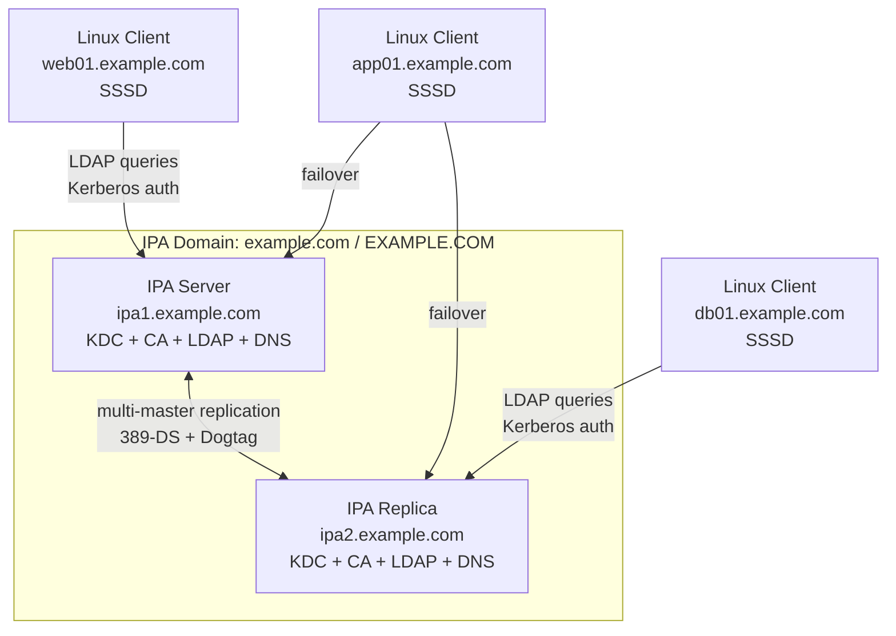
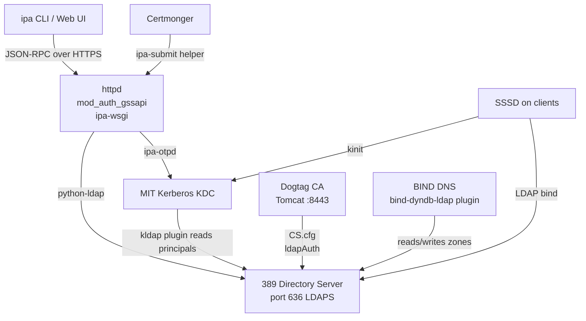
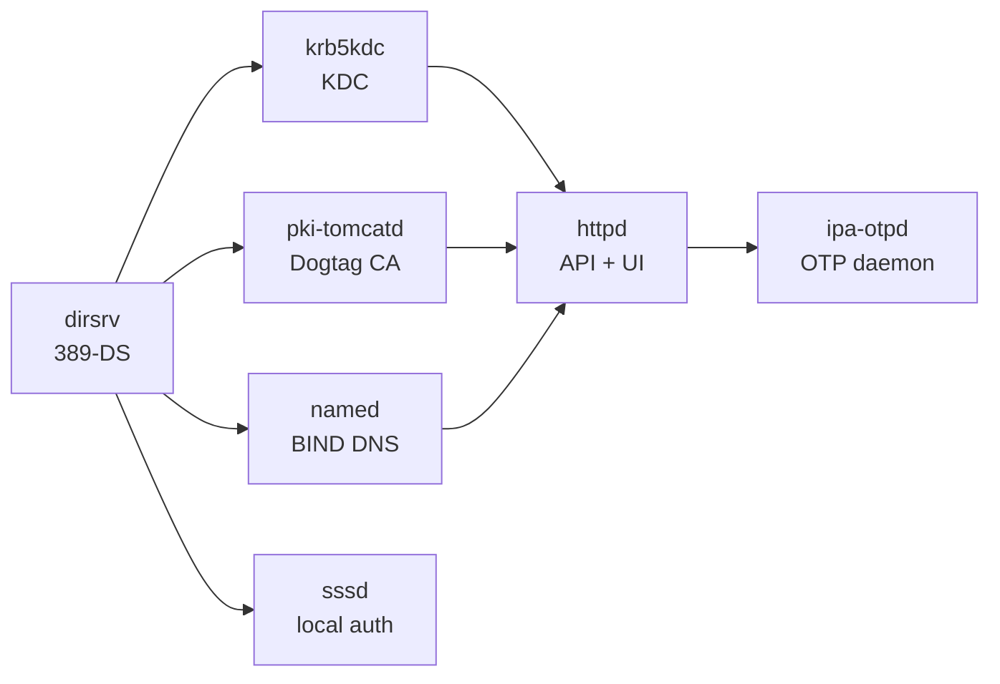
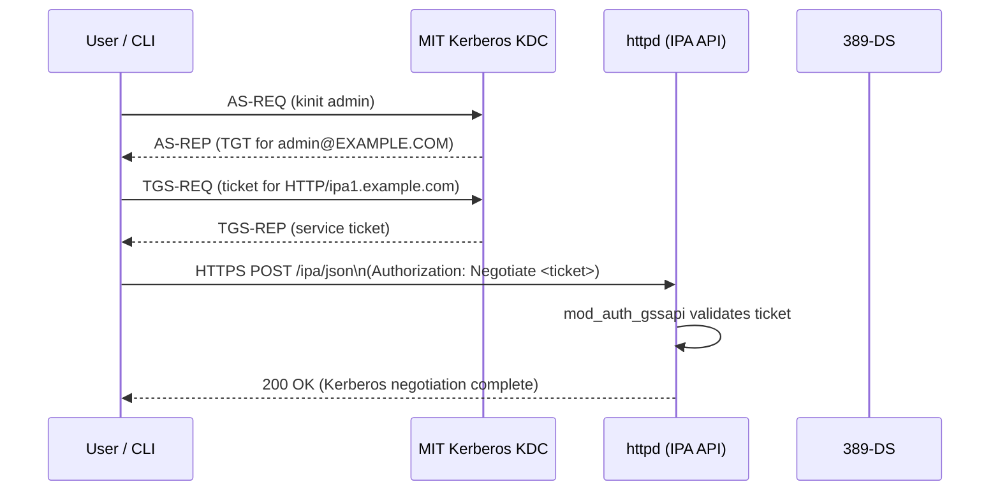
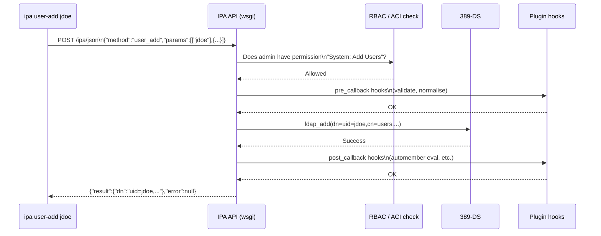
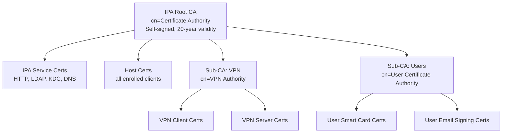
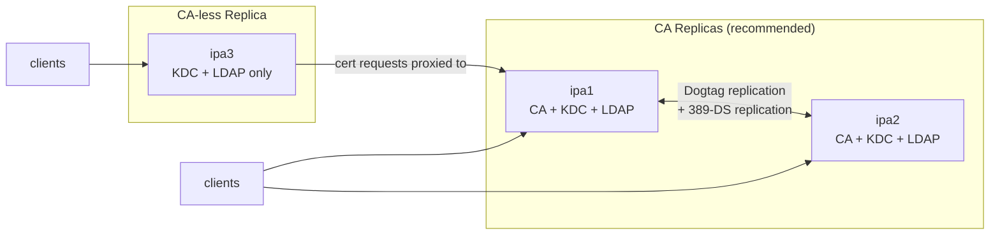
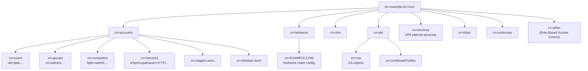
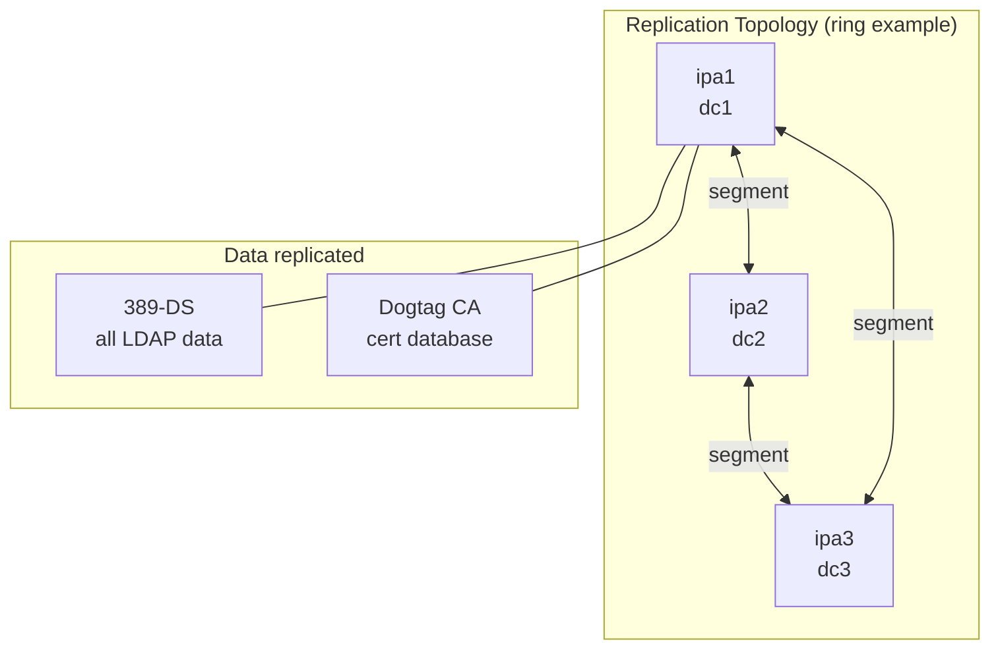

# Module 01 — FreeIPA Architecture

> A detailed look at how FreeIPA's components connect internally, how the server,
> replica, and client roles differ, and how requests flow through the system.

## Table of Contents

- [1. The Three Roles: Server, Replica, Client](#1-the-three-roles-server-replica-client)
  - [1.1 IPA Server](#11-ipa-server)
  - [1.2 IPA Replica](#12-ipa-replica)
  - [1.3 IPA Client](#13-ipa-client)
- [2. Internal Component Wiring](#2-internal-component-wiring)
  - [2.1 How Components Share Data](#21-how-components-share-data)
  - [2.2 Service Start Order](#22-service-start-order)
- [3. The IPA API Request Flow](#3-the-ipa-api-request-flow)
  - [3.1 Authentication to the API](#31-authentication-to-the-api)
  - [3.2 Command Execution Path](#32-command-execution-path)
- [4. CA Topology](#4-ca-topology)
  - [4.1 Root CA and Sub-CAs](#41-root-ca-and-sub-cas)
  - [4.2 CA Replica vs CA-less Replica](#42-ca-replica-vs-ca-less-replica)
- [5. Directory Information Tree (DIT) Layout](#5-directory-information-tree-dit-layout)
- [6. Replication Overview](#6-replication-overview)
- [7. Lab — Inspect a Running IPA Server](#7-lab--inspect-a-running-ipa-server)

---

## 1. The Three Roles: Server, Replica, Client



### 1.1 IPA Server

The first IPA server installed is the **initial master**. It runs:

| Component | Process | Port |
|-----------|---------|------|
| 389 Directory Server | `dirsrv@EXAMPLE-COM` | 389, 636 |
| MIT Kerberos KDC | `krb5kdc` | 88 |
| Kerberos kadmin | `kadmin` | 749 |
| Dogtag CA | `pki-tomcatd@pki-tomcat` | 8080, 8443 |
| BIND DNS | `named` | 53 |
| Apache httpd (API+UI) | `httpd` | 80, 443 |
| Certmonger | `certmonger` | — |
| SSSD (local) | `sssd` | — |
| Chronyd (NTP) | `chronyd` | 123 |

All services are managed by systemd. The `ipactl` wrapper starts/stops them
in the correct dependency order.

### 1.2 IPA Replica

A replica is a **full peer** of the IPA server. It runs the same services and
participates in multi-master replication. There is no "primary" — if ipa1 fails,
ipa2 continues serving all clients without any manual intervention.

A replica can be:
- **Full replica** — KDC + CA + DNS + LDAP (recommended)
- **CA-less replica** — KDC + DNS + LDAP, no local Dogtag instance (cert requests
  proxy to a CA replica)
- **Hidden replica** — participates in replication but is excluded from DNS SRV
  records; used for backups or maintenance

### 1.3 IPA Client

A client is any RHEL 10 host that has run `ipa-client-install`. It does **not**
run IPA server components. It runs:

- `sssd` — NSS + PAM + Kerberos + sudo + HBAC
- `certmonger` — requests and renews host/service certificates
- Kerberos client libs — `kinit`, keytab support

Clients discover IPA servers via **DNS SRV records**:
```
_ldap._tcp.example.com.   SRV  0 100 389 ipa1.example.com.
_kerberos._tcp.EXAMPLE.COM. SRV 0 100 88 ipa1.example.com.
```

[↑ Back to TOC](#table-of-contents)

---

## 2. Internal Component Wiring

### 2.1 How Components Share Data

All IPA components use **389-DS as the single source of truth**. There is no
separate database per component.



Key insight: **BIND, KDC, and Dogtag all read their runtime data from 389-DS**.
When you add a DNS record with `ipa dnsrecord-add`, it writes to LDAP — BIND picks
it up via the dyndb plugin within seconds, with no zone file reload needed.

### 2.2 Service Start Order

`ipactl start` starts services in this order (dependency chain):



> ⚠️ If `dirsrv` fails to start, everything else fails. Troubleshoot 389-DS first.

[↑ Back to TOC](#table-of-contents)

---

## 3. The IPA API Request Flow

### 3.1 Authentication to the API

Every API call requires a valid Kerberos ticket for the `admin` principal (or any
principal with sufficient RBAC permissions).



### 3.2 Command Execution Path

Once authenticated, each `ipa` command translates to a JSON-RPC call:



[↑ Back to TOC](#table-of-contents)

---

## 4. CA Topology

### 4.1 Root CA and Sub-CAs

FreeIPA installs a **self-signed root CA** (the IPA CA) during `ipa-server-install`.
This CA issues certificates for all IPA services and all enrolled hosts/services.

Sub-CAs can be created beneath the root CA, useful for:
- Segregating certificates by department, environment, or service type
- Applying different certificate policies per sub-CA
- Issuing certificates that appear to come from a named sub-authority



### 4.2 CA Replica vs CA-less Replica



> 📝 Always have at least **two CA replicas**. If your only CA replica goes down,
> you cannot issue or renew certificates until it comes back.

> 🔁 **See Module 12** for replica installation and topology management.

[↑ Back to TOC](#table-of-contents)

---

## 5. Directory Information Tree (DIT) Layout

Understanding the LDAP tree helps when troubleshooting or writing custom ACIs.



> 📝 The `cn=accounts` subtree is what SSSD queries. The `cn=kerberos` subtree is
> what the KDC reads. The `cn=dns` subtree is what BIND reads.

[↑ Back to TOC](#table-of-contents)

---

## 6. Replication Overview

FreeIPA uses **multi-master replication** — every replica can accept writes, and
changes propagate to all other replicas automatically.



Replication has two independent streams:
1. **389-DS replication** — replicates all LDAP data (users, groups, policies, DNS,
   Kerberos principals, etc.)
2. **Dogtag CA replication** — replicates the certificate database between CA replicas
   (uses its own 389-DS instance on port 7389)

Both streams must be healthy. `ipa-healthcheck` monitors both.

> 🔁 **See Module 12** for topology management, adding replicas, and monitoring
> replication status.

[↑ Back to TOC](#table-of-contents)

---

## 7. Lab — Inspect a Running IPA Server

After completing Module 02 (Installation), return here to explore the architecture
hands-on.

```bash
# (server) Show all IPA-managed systemd services and their status
ipactl status

# (server) Show the 389-DS instance name
systemctl list-units 'dirsrv@*'

# (server) Show the Dogtag CA instance
systemctl status pki-tomcatd@pki-tomcat

# (server) Show BIND status
systemctl status named

# (server) List all Kerberos principals in the realm
# (requires valid admin TGT)
kinit admin
ipa service-find --all | grep krbprincipalname

# (server) Explore the LDAP tree root
ldapsearch -Y GSSAPI -b "dc=example,dc=com" -s one "(objectClass=*)" dn

# (server) Show all users container
ldapsearch -Y GSSAPI -b "cn=users,cn=accounts,dc=example,dc=com" \
  -s one "(objectClass=*)" uid

# (server) Show IPA API version and capabilities
ipa ping
ipa env --all | grep -E "(version|domain|realm|host)"

# (server) Show certificate tracking by certmonger
getcert list

# (server) View DNS SRV records for service discovery
dig +short _ldap._tcp.example.com SRV
dig +short _kerberos._tcp.EXAMPLE.COM SRV
dig +short _kerberos._udp.EXAMPLE.COM SRV
```

[↑ Back to TOC](#table-of-contents)
