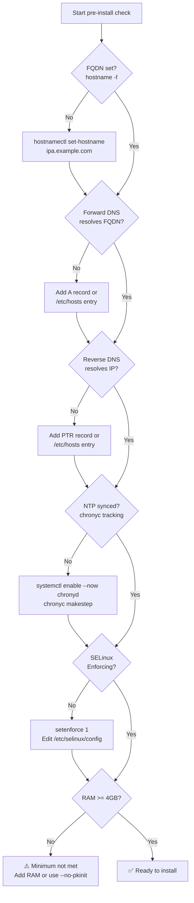
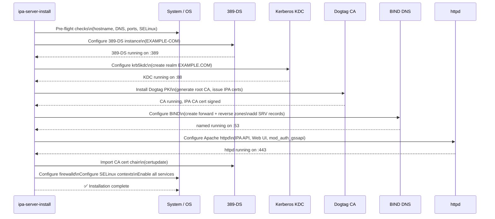
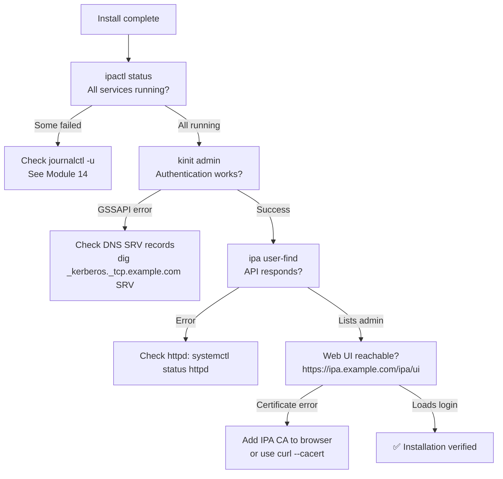
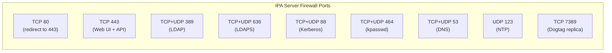

# Module 02 — Installation
[](./LICENSE.md)
[](https://access.redhat.com/products/red-hat-enterprise-linux)
[](https://www.freeipa.org)

> Step-by-step installation of the FreeIPA server on RHEL 10, covering all
> prerequisites, the installer phases, post-install verification, and firewall
> configuration.

## Table of Contents

- [Recommended Background](#recommended-background)
- [Learning Outcomes](#learning-outcomes)
- [1. Pre-Installation Checklist](#1-pre-installation-checklist)
  - [1.1 Hostname and DNS](#11-hostname-and-dns)
  - [1.2 Time Synchronisation](#12-time-synchronisation)
  - [1.3 Firewall](#13-firewall)
  - [1.4 SELinux](#14-selinux)
  - [1.5 System Resources](#15-system-resources)
- [2. Package Installation](#2-package-installation)
- [3. Running ipa-server-install](#3-running-ipa-server-install)
  - [3.1 Interactive Install](#31-interactive-install)
  - [3.2 Unattended Install](#32-unattended-install)
  - [3.3 Installer Phases](#33-installer-phases)
- [4. Post-Installation Verification](#4-post-installation-verification)
- [5. Opening the Web UI](#5-opening-the-web-ui)
- [6. Firewall Configuration](#6-firewall-configuration)
- [7. Uninstalling FreeIPA](#7-uninstalling-freeipa)
- [8. Lab — Full Install Walkthrough](#8-lab--full-install-walkthrough)
- [Key Takeaways](#key-takeaways)


---

## Recommended Background

- Complete Modules 00 and 01 first.
- Ability to manage RHEL packages, firewalld, Chrony, and static networking.
- Control of DNS records and the server hostname before running the installer.

## Learning Outcomes

By the end of this module, you should be able to:

- Verify the installation prerequisites that FreeIPA depends on.
- Install the required packages and run ipa-server-install safely.
- Validate service health after the initial deployment.
- Recognize the most common installation failure signals.

---

## 1. Pre-Installation Checklist



### 1.1 Hostname and DNS

FreeIPA is extremely sensitive to hostname and DNS configuration. Most installation
failures trace back to misconfigured DNS or hostname.

**Requirements:**
- Static IP address (do not use DHCP without a static DHCP reservation)
- FQDN (fully qualified domain name) configured as the system hostname
- Forward lookup: `FQDN → IP` must work **before** the installer runs
- Reverse lookup: `IP → FQDN` must work **before** the installer runs
- `/etc/hosts` must contain the FQDN (not just the short name)

```bash
# Correct /etc/hosts entry
192.168.1.10  ipa.example.com  ipa

# Verify forward lookup (via /etc/hosts or DNS)
getent hosts ipa.example.com    # must return 192.168.1.10
dig +short ipa.example.com      # test DNS independently of /etc/hosts
resolvectl query ipa.example.com 2>/dev/null || host ipa.example.com

# Verify reverse lookup
getent hosts 192.168.1.10       # must return ipa.example.com
dig +short -x 192.168.1.10      # DNS reverse lookup

# Verify FQDN
hostname -f                     # must return ipa.example.com
```

> ⚠️ If `hostname -f` returns a short name (`ipa` instead of `ipa.example.com`),
> the installer will fail. Fix with `hostnamectl set-hostname ipa.example.com`.

### 1.2 Time Synchronisation

Kerberos requires clocks to be within **5 minutes** of each other. A larger skew
causes authentication failures with `Clock skew too great`.

```bash
# Enable and start chronyd
systemctl enable --now chronyd

# Force immediate sync
chronyc makestep

# Verify sync
chronyc tracking | grep "System time"
timedatectl show | grep NTP
```

### 1.3 Firewall

`ipa-server-install` configures firewalld automatically, but pre-opening ports
helps if you have custom firewall policies.

```bash
# Open all required IPA ports
firewall-cmd --permanent --add-service=freeipa-ldap
firewall-cmd --permanent --add-service=freeipa-ldaps
firewall-cmd --permanent --add-service=freeipa-replication
firewall-cmd --permanent --add-service=dns
firewall-cmd --permanent --add-service=ntp
firewall-cmd --reload
```

### 1.4 SELinux

FreeIPA ships full SELinux policies and **requires** SELinux to be in Enforcing mode.
Running in Permissive mode is not supported in production.

```bash
getenforce   # must return Enforcing
```

### 1.5 System Resources

| Resource | Minimum | Recommended |
|----------|---------|-------------|
| vCPU | 2 | 4 |
| RAM | 4 GB | 8 GB |
| Disk (`/var`) | 10 GB | 20 GB |
| Disk (`/tmp`) | 1 GB | 2 GB |
| Swap | 2 GB | 4 GB |

> 📝 Dogtag (Tomcat/JVM) is the most memory-hungry component. It requires ~1.5 GB
> of heap alone. 4 GB total RAM is the true minimum for a stable server.

[↑ Back to TOC](#table-of-contents)

---

## 2. Package Installation

```bash
# (server) Install FreeIPA server with DNS support
dnf install -y ipa-server ipa-server-dns

# Optional: AD trust support (install before ipa-server-install if needed)
dnf install -y ipa-server-trust-ad

# Optional: Health check tool (recommended for production)
dnf install -y ipa-healthcheck
```

**What gets installed:**
- `ipa-server` — core IPA server (pulls in 389-DS, Kerberos, Dogtag, httpd, SSSD)
- `ipa-server-dns` — BIND + `bind-dyndb-ldap` plugin for integrated DNS
- `ipa-server-trust-ad` — Samba components for Active Directory trust
- `ipa-healthcheck` — monitoring checks for all IPA components

[↑ Back to TOC](#table-of-contents)

---

## 3. Running ipa-server-install

### 3.1 Interactive Install

The interactive installer prompts for all required values:

```bash
# (server) Launch interactive installer
ipa-server-install --setup-dns
```

You will be prompted for:
1. **Server host name** — auto-detected from `hostname -f`
2. **Domain name** — e.g. `example.com`
3. **Realm name** — e.g. `EXAMPLE.COM` (uppercase, auto-derived from domain)
4. **Directory Manager password** — LDAP root password (not used for day-to-day admin)
5. **IPA admin password** — password for the `admin` Kerberos principal
6. **DNS forwarders** — upstream DNS servers (or `no` to use root hints)
7. **Reverse zone** — whether to create a reverse DNS zone automatically

### 3.2 Unattended Install

For automation, scripted deployment, or reproducibility:

```bash
# (server) Fully unattended install with integrated DNS
ipa-server-install \
  --realm=EXAMPLE.COM \
  --domain=example.com \
  --ds-password='DirMgr_P@ssw0rd_Change_Me' \
  --admin-password='Admin_P@ssw0rd_Change_Me' \
  --setup-dns \
  --forwarder=8.8.8.8 \
  --forwarder=8.8.4.4 \
  --reverse-zone=1.168.192.in-addr.arpa. \
  --no-dnssec-validation \   # ⚠️ lab-only — omit in production
  --unattended
```

> ⚠️ Passwords on the command line appear in shell history and `ps` output.
> In production, use a vault or prompt interactively. The `--admin-password`
> and `--ds-password` flags are acceptable in automated provisioning pipelines
> where the environment is controlled.

> 🔒 **FIPS:** To install on a FIPS-enabled system:
> ```bash
> # Ensure FIPS mode is active before installing
> fips-mode-setup --check
> # Then run ipa-server-install normally — it detects FIPS automatically
> ```

### 3.3 Installer Phases



The installer typically takes **5–10 minutes** on a bare-metal server. In a VM
or on slower storage, allow up to **20 minutes** (Dogtag/Tomcat startup is the
slowest phase).

[↑ Back to TOC](#table-of-contents)

---

## 4. Post-Installation Verification



```bash
# (server) Check all IPA services
ipactl status

# (server) Obtain admin ticket
kinit admin

# (server) Test API
ipa user-find

# (server) Test DNS
dig ipa.example.com
dig -x 192.168.1.10

# (server) Test Kerberos SRV records
dig +short _kerberos._tcp.EXAMPLE.COM SRV
dig +short _ldap._tcp.example.com SRV

# (server) View installed CA certificate
ipa-cacert-manage list

# (server) Run health check
ipa-healthcheck --output-type human 2>&1 | grep -v SUCCESS
```

[↑ Back to TOC](#table-of-contents)

---

## 5. Opening the Web UI

Navigate to `https://ipa.example.com/ipa/ui` in a browser on a host that:
1. Has the IPA CA certificate trusted (or you accept the browser warning)
2. Can resolve `ipa.example.com`

**To trust the IPA CA in your browser:**

```bash
# (server) Export the IPA CA certificate
ipa-cacert-manage list
# or
curl -k https://ipa.example.com/ipa/config/ca.crt -o /etc/pki/ca-trust/source/anchors/ipa-ca.crt
update-ca-trust

# (client/workstation) Copy and trust
scp root@ipa.example.com:/etc/ipa/ca.crt /etc/pki/ca-trust/source/anchors/ipa-ca.crt
update-ca-trust
```

Log in with username `admin` and the admin password set during installation.

[↑ Back to TOC](#table-of-contents)

---

## 6. Firewall Configuration

`ipa-server-install` automatically adds the required firewall rules. Verify with:

```bash
# (server) Show all active firewall rules
firewall-cmd --list-all

# Expected services in the output:
# freeipa-ldap freeipa-ldaps freeipa-replication dns ntp https http
```

**Manually add missing rules (if needed):**

```bash
firewall-cmd --permanent --add-service=freeipa-ldap      # LDAP :389
firewall-cmd --permanent --add-service=freeipa-ldaps     # LDAPS :636
firewall-cmd --permanent --add-service=freeipa-replication  # replication :7389
firewall-cmd --permanent --add-service=kerberos          # Kerberos :88
firewall-cmd --permanent --add-service=kpasswd           # kpasswd :464
firewall-cmd --permanent --add-service=dns               # DNS :53
firewall-cmd --permanent --add-service=https             # HTTPS :443
firewall-cmd --permanent --add-service=http              # HTTP :80 (redirect)
firewall-cmd --permanent --add-service=ntp               # NTP :123
firewall-cmd --reload

# Verify
firewall-cmd --list-services
```

**Port reference:**



[↑ Back to TOC](#table-of-contents)

---

## 7. Uninstalling FreeIPA

> ⚠️ This is **destructive and irreversible**. All IPA data, certificates, and
> configuration will be removed. Always back up first (`ipa-backup`).

```bash
# (server) Uninstall IPA server (interactive confirmation)
ipa-server-install --uninstall

# (server) Unattended uninstall
ipa-server-install --uninstall --unattended
```

[↑ Back to TOC](#table-of-contents)

---

## 8. Lab — Full Install Walkthrough

This lab walks through a complete installation from a fresh RHEL 10 minimal install.

> Note: This walkthrough uses `ipa.example.com` as the single-server endpoint. In later replication labs, treat this same host as `ipa1.example.com` and keep `ipa.example.com` as the stable alias or CNAME.

```bash
# ── STEP 1: System preparation ──────────────────────────────────────────────

# (server) Set static hostname
hostnamectl set-hostname ipa.example.com

# (server) Set static IP (adjust interface name, e.g. ens3)
nmcli con modify ens3 \
  ipv4.method manual \
  ipv4.addresses 192.168.1.10/24 \
  ipv4.gateway 192.168.1.1 \
  ipv4.dns 192.168.1.1
nmcli con up ens3

# (server) Add /etc/hosts entry
echo "192.168.1.10  ipa.example.com  ipa" >> /etc/hosts

# (server) Verify hostname and DNS
hostname -f
getent hosts ipa.example.com
getent hosts 192.168.1.10

# (server) Sync time
systemctl enable --now chronyd
chronyc makestep
timedatectl

# ── STEP 2: Install packages ─────────────────────────────────────────────────

dnf install -y ipa-server ipa-server-dns ipa-healthcheck

# ── STEP 3: Run installer ────────────────────────────────────────────────────

ipa-server-install \
  --realm=EXAMPLE.COM \
  --domain=example.com \
  --ds-password='S3cur3DirMgr!2026' \
  --admin-password='S3cur3Admin!2026' \
  --setup-dns \
  --forwarder=8.8.8.8 \
  --auto-reverse \
  --unattended

# ── STEP 4: Verify installation ──────────────────────────────────────────────

ipactl status
kinit admin          # enter admin password
ipa user-find        # should list 'admin'

# ── STEP 5: Run health check ─────────────────────────────────────────────────

ipa-healthcheck --output-type human 2>&1 | grep -v SUCCESS

# ── STEP 6: Test Web UI ──────────────────────────────────────────────────────

# From a workstation that can reach the IPA server:
curl -s https://ipa.example.com/ipa/ui/ --cacert /etc/ipa/ca.crt | grep -i title
```

### 8.1 If ipa-server-install fails, check these first

```bash
# 1. DNS and hostname consistency
hostname -f
getent hosts ipa.example.com
getent hosts 192.168.1.10

# 2. Time sync and clock skew
timedatectl status
chronyc tracking

# 3. Required ports and local services
ss -tulpn | grep -E ':53 |:80 |:88 |:123 |:389 |:443 |:464 |:636 |:7389 '
firewall-cmd --list-services

# 4. Installer and service logs
journalctl -u ipa-server-install --since '30 minutes ago'
journalctl -u dirsrv@EXAMPLE-COM.service -u krb5kdc -u httpd --since '30 minutes ago'

# 5. Disk space for Dogtag, LDAP, and temporary files
df -h / /var /tmp
```

> If DNS, time, and disk space look healthy, re-run the installer only after reading the failure point in the logs. Avoid guessing and re-running blindly.

**Expected final state:**
- `ipactl status` shows all 8 services as `RUNNING` (dirsrv, krb5kdc, kadmin, pki-tomcatd, named, httpd, certmonger, sssd)
- `kinit admin` succeeds
- `ipa user-find` returns `admin`
- `ipa-healthcheck` shows no `ERROR` or `CRITICAL` results

> 🔁 **Next:** Enroll your first client in [Module 05](05_host_enrollment_sssd.md).
> Before that, create users and groups in [Module 03](03_identity_users_groups.md).


---

## Key Takeaways

- Most installation failures trace back to DNS, hostname, time, or ports.
- A clean post-install verification is as important as the install command itself.
- Use ipa-healthcheck immediately after deployment to catch hidden issues.
- Create users and groups before enrolling clients in later modules.

[↑ Back to TOC](#table-of-contents)

---

*Licensed under [CC BY-NC-SA 4.0](LICENSE.md) · © 2026 UncleJS*