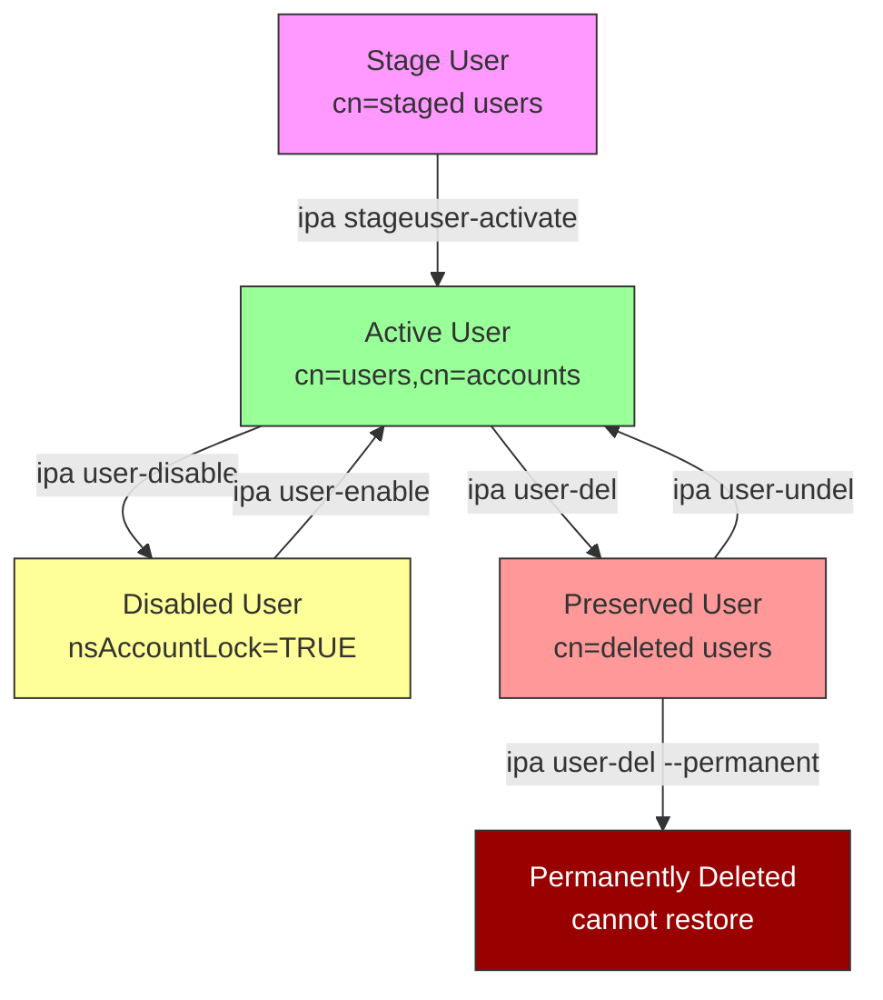
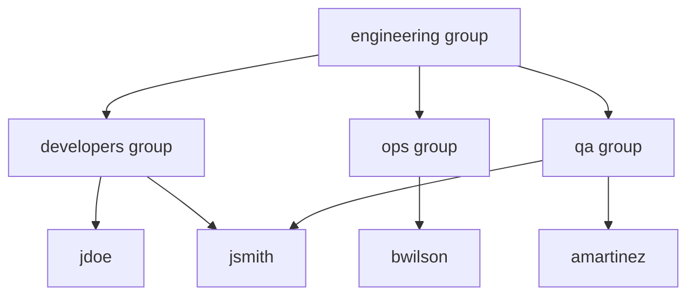
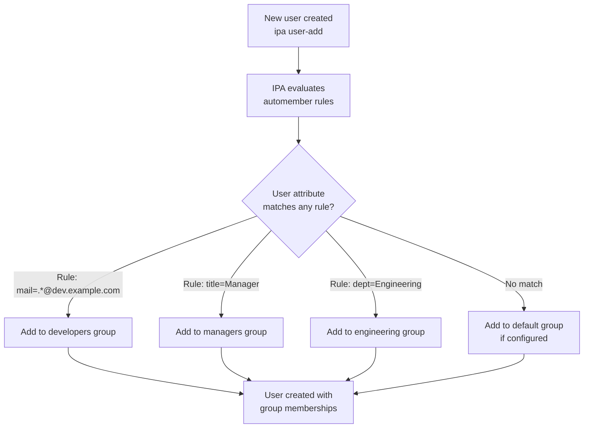
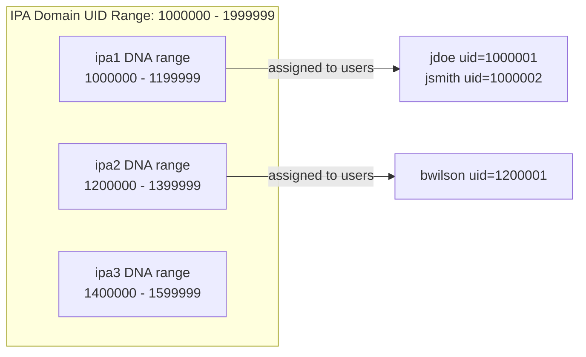
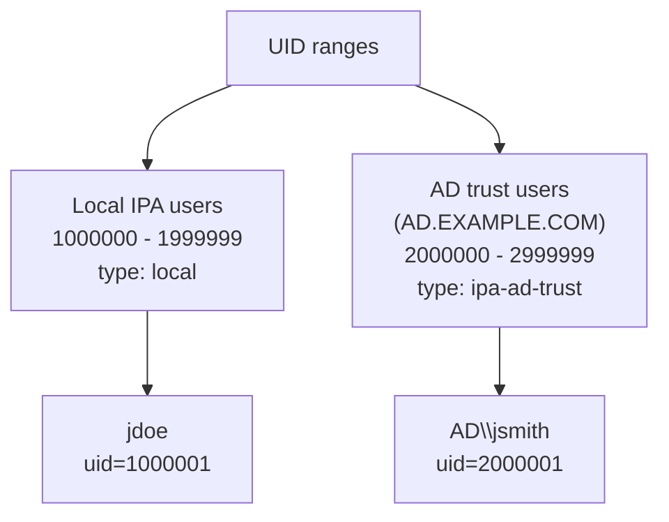
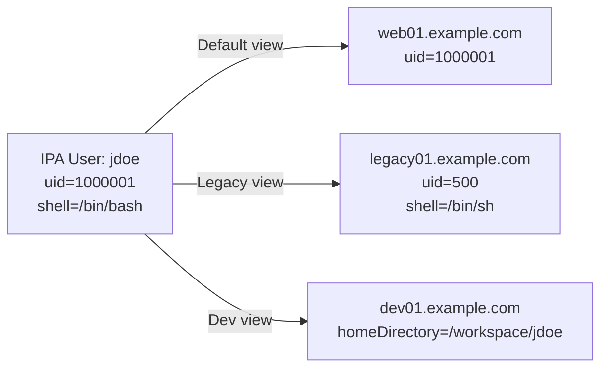
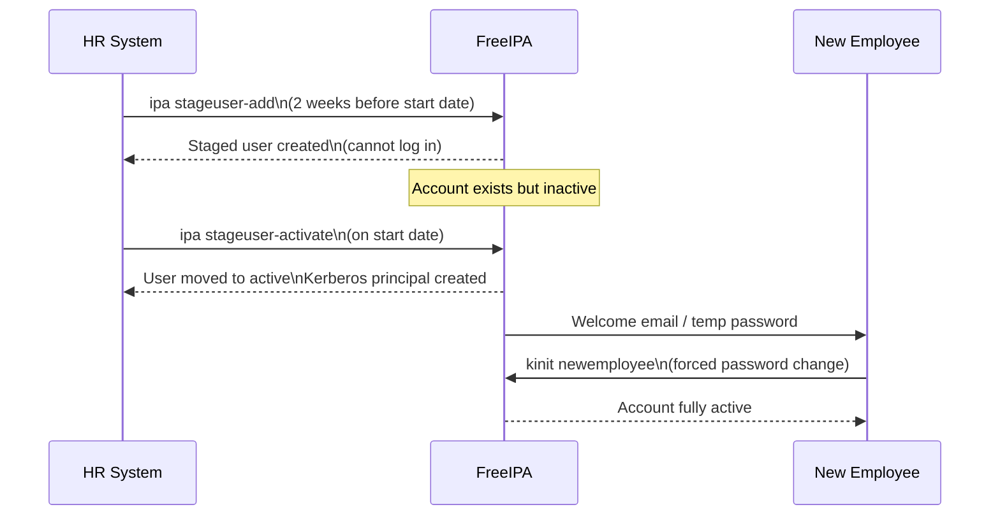
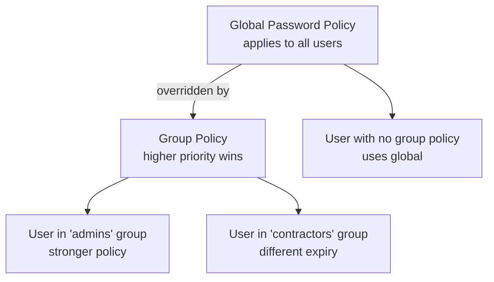

# Module 03 — Identity: Users, Groups, and ID Management

> Managing users, groups, automember rules, ID ranges, and the user lifecycle
> in FreeIPA. All operations use the `ipa` CLI or Web UI.

## Table of Contents

- [1. User Management](#1-user-management)
  - [1.1 User Attributes](#11-user-attributes)
  - [1.2 Creating Users](#12-creating-users)
  - [1.3 Modifying Users](#13-modifying-users)
  - [1.4 User Lifecycle](#14-user-lifecycle)
- [2. Group Management](#2-group-management)
  - [2.1 Group Types](#21-group-types)
  - [2.2 Creating and Managing Groups](#22-creating-and-managing-groups)
  - [2.3 Nested Groups](#23-nested-groups)
- [3. Automember Rules](#3-automember-rules)
  - [3.1 How Automember Works](#31-how-automember-works)
  - [3.2 Configuring Automember Rules](#32-configuring-automember-rules)
- [4. ID Ranges](#4-id-ranges)
  - [4.1 DNA ID Ranges](#41-dna-id-ranges)
  - [4.2 Trust ID Ranges](#42-trust-id-ranges)
- [5. ID Views](#5-id-views)
- [6. Staged Users and User Lifecycle](#6-staged-users-and-user-lifecycle)
- [7. Password Policies](#7-password-policies)
- [8. Lab — User and Group Operations](#8-lab--user-and-group-operations)

---

## 1. User Management

### 1.1 User Attributes

Every IPA user is an LDAP object with both standard POSIX attributes and
Kerberos principal attributes:

| Attribute | LDAP attr | Notes |
|-----------|-----------|-------|
| Username | `uid` | Login name, must be unique |
| UID | `uidNumber` | POSIX UID, assigned from DNA range |
| GID | `gidNumber` | Primary group GID |
| Full name | `cn` | Display name |
| First/last | `givenName`, `sn` | Required |
| Email | `mail` | Used for notifications |
| Shell | `loginShell` | Default `/bin/bash` |
| Home dir | `homeDirectory` | `/home/username` |
| Kerberos principal | `krbPrincipalName` | `uid@REALM` |
| Password | (krb5 key) | Stored as Kerberos keys, not plaintext |
| Account expiry | `krbPasswordExpiration` | Set by password policy |
| Account disabled | `nsAccountLock` | `TRUE` = locked |

### 1.2 Creating Users

```bash
# Minimal user creation
ipa user-add jdoe --first=John --last=Doe

# Full user creation
ipa user-add jdoe \
  --first=John \
  --last=Doe \
  --email=jdoe@example.com \
  --phone="+1 555-0100" \
  --title="Senior Engineer" \
  --shell=/bin/bash \
  --homedir=/home/jdoe \
  --password   # prompts for initial password

# Create user and set password non-interactively (CI/CD)
echo "TempP@ss2026!" | ipa user-add jdoe \
  --first=John --last=Doe --password
```

> 📝 New users are forced to change their password on first login. This is
> controlled by the password policy. The initial password set by admin is
> a "temporary" credential.

### 1.3 Modifying Users

```bash
# Change email
ipa user-mod jdoe --email=john.doe@example.com

# Change shell
ipa user-mod jdoe --shell=/bin/zsh

# Add SSH public key
ipa user-mod jdoe --sshpubkey="ssh-ed25519 AAAA... comment"

# Add a certificate (for smart card auth)
ipa user-add-cert jdoe --certificate="$(base64 /path/to/user.crt | tr -d '\n')"

# Set account expiration date
ipa user-mod jdoe --setattr=krbPrincipalExpiration=20270101000000Z

# Reset password (admin resets for user)
ipa passwd jdoe
```

### 1.4 User Lifecycle



| State | LDAP location | Description |
|-------|--------------|-------------|
| **Staged** | `cn=staged users` | Pre-provisioned, cannot log in yet |
| **Active** | `cn=users,cn=accounts` | Normal active account |
| **Disabled** | `cn=users,cn=accounts` | `nsAccountLock=TRUE`, cannot log in |
| **Preserved** | `cn=deleted users` | Soft-deleted, retains UID/data, can restore |
| **Deleted** | (gone) | Permanently removed |

```bash
# Disable a user (locked, cannot log in)
ipa user-disable jdoe

# Re-enable
ipa user-enable jdoe

# Soft-delete (preserve) — retains uid/gid for reference
ipa user-del jdoe   # goes to preserved by default

# View preserved users
ipa user-find --preserved=true

# Restore a preserved user
ipa user-undel jdoe

# Permanently delete (no restore possible)
ipa user-del jdoe --permanent
```

[↑ Back to TOC](#table-of-contents)

---

## 2. Group Management

### 2.1 Group Types

IPA supports four group types:

| Type | Description | Use case |
|------|-------------|---------|
| **POSIX** | Has `gidNumber`, visible to OS | Linux group membership, file permissions |
| **Non-POSIX** | No GID, LDAP-only | Email lists, policy grouping, AD trust |
| **External** | Contains AD SIDs as members | AD trust group mapping |
| **Special** | Built-in (`admins`, `ipausers`) | System groups, cannot be deleted |

### 2.2 Creating and Managing Groups

```bash
# Create a POSIX group (default)
ipa group-add developers --desc="Development team"

# Create a non-POSIX group
ipa group-add maillist-dev --nonposix --desc="Dev mailing list"

# Add user to group
ipa group-add-member developers --users=jdoe

# Add multiple users at once
ipa group-add-member developers --users=jdoe,jsmith,amartinez

# Remove user from group
ipa group-remove-member developers --users=jdoe

# Show group details
ipa group-show developers

# Find groups a user belongs to
ipa user-show jdoe --all | grep memberof

# List all groups
ipa group-find
```

### 2.3 Nested Groups

IPA supports groups-within-groups (nested membership):

```bash
# Add a group as a member of another group
ipa group-add-member engineering --groups=developers
ipa group-add-member engineering --groups=ops
ipa group-add-member engineering --groups=qa
```



> 📝 SSSD resolves nested group membership automatically. A user in `developers`
> who is also in `engineering` via nesting will be shown as a member of both when
> you run `id jdoe` on a client.

[↑ Back to TOC](#table-of-contents)

---

## 3. Automember Rules

### 3.1 How Automember Works

Automember rules automatically add users (or hosts) to groups when they are
created, based on matching attributes. This eliminates the need to manually
assign group memberships for new users.



### 3.2 Configuring Automember Rules

```bash
# Create an automember rule for a user group
ipa automember-add developers --type=group

# Add a condition: users whose uid matches regex
ipa automember-add-condition developers \
  --type=group \
  --key=uid \
  --inclusive-regex='^dev-'

# Add a condition: users with a specific email domain
ipa automember-add-condition developers \
  --type=group \
  --key=mail \
  --inclusive-regex='.*@dev\.example\.com$'

# Add an exclusive condition (exclude contractors)
ipa automember-add-condition employees \
  --type=group \
  --key=uid \
  --exclusive-regex='^contractor-'

# Set a default group (catch-all for no match)
ipa automember-default-set --type=group --default-group=ipausers

# Preview what rule would do (dry run)
ipa automember-find-orphans --type=group

# Rebuild automember for existing users (apply rules retroactively)
ipa automember-rebuild --type=group
ipa automember-rebuild --type=hostgroup
```

[↑ Back to TOC](#table-of-contents)

---

## 4. ID Ranges

ID ranges control which UIDs and GIDs are assigned to users and groups in FreeIPA.
This prevents UID/GID collisions between IPA domains, replicas, and AD trust domains.

### 4.1 DNA ID Ranges

The **Distributed Numeric Assignment (DNA)** plugin in 389-DS automatically assigns
UIDs/GIDs to new users. Each replica has its own non-overlapping range.



```bash
# View current ID range
ipa idrange-find

# Show detailed range info
ipa idrange-show "EXAMPLE.COM_id_range"

# View DNA plugin config (389-DS level)
ldapsearch -Y GSSAPI -b "cn=Distributed Numeric Assignment Plugin,cn=plugins,cn=config" \
  -s base "(objectClass=*)"
```

### 4.2 Trust ID Ranges

When you establish an AD trust, a separate ID range is created for AD users. This
ensures AD users' UIDs/GIDs do not collide with local IPA users:



```bash
# View all ID ranges (local + trust)
ipa idrange-find --all

# Trust range is created automatically during 'ipa trust-add'
# To manually adjust base ID of a range:
ipa idrange-mod "AD.EXAMPLE.COM_id_range" --base-id=2000000
```

[↑ Back to TOC](#table-of-contents)

---

## 5. ID Views

ID views allow you to **override POSIX attributes** (uid, gid, home dir, shell,
SSH keys) for specific users on specific hosts or host groups. This is useful for:
- Migration: keeping legacy UIDs on old servers while using IPA UIDs on new servers
- Per-host customisation: different shell or home dir on specific systems
- AD user overrides: assigning custom UIDs to AD trust users



```bash
# Create an ID view
ipa idview-add legacy-view --desc="Legacy UID mappings for old servers"

# Add a user override in the view
ipa idoverrideuser-add legacy-view jdoe \
  --uid=500 \
  --gidnumber=500 \
  --shell=/bin/sh \
  --homedir=/home/jdoe

# Apply the view to a host
ipa idview-apply legacy-view --hosts=legacy01.example.com

# Apply to a host group
ipa idview-apply legacy-view --hostgroups=legacy-servers

# Show current view applied to a host
ipa idview-show legacy-view
```

[↑ Back to TOC](#table-of-contents)

---

## 6. Staged Users and User Lifecycle

**Staged users** are pre-provisioned accounts that exist in IPA but cannot
authenticate until activated. This is useful for HR/provisioning workflows where
accounts are created in advance.

```bash
# Create a staged user
ipa stageuser-add newemployee \
  --first=New --last=Employee \
  --email=newemployee@example.com

# List staged users
ipa stageuser-find

# Activate a staged user (moves to cn=users,cn=accounts)
ipa stageuser-activate newemployee

# Show staged user
ipa stageuser-show newemployee
```



[↑ Back to TOC](#table-of-contents)

---

## 7. Password Policies

IPA password policies define complexity, history, lockout, and expiry rules.
Policies are applied at the **global** level or to specific **groups**.



```bash
# Show global password policy
ipa pwpolicy-show

# Modify global policy
ipa pwpolicy-mod \
  --minlife=1 \           # min days before change allowed
  --maxlife=90 \          # days until expiry
  --history=10 \          # number of old passwords remembered
  --minclasses=3 \        # min character classes (upper,lower,digit,special)
  --minlength=12 \        # min password length
  --maxfail=5 \           # failed attempts before lockout
  --failinterval=60 \     # window (seconds) for counting failures
  --lockouttime=600       # lockout duration (seconds, 0=permanent)

# Create a policy for a specific group
ipa pwpolicy-add admins-policy \
  --group=admins \
  --priority=1 \          # lower number = higher priority
  --minlength=16 \
  --minclasses=4 \
  --maxlife=60 \
  --history=24

# Show all policies
ipa pwpolicy-find

# Check effective policy for a user
ipa pwpolicy-show --user=jdoe
```

[↑ Back to TOC](#table-of-contents)

---

## 8. Lab — User and Group Operations

```bash
# ── STEP 1: Create users ──────────────────────────────────────────────────────

kinit admin

ipa user-add alice \
  --first=Alice --last=Smith \
  --email=alice@example.com \
  --password

ipa user-add bob \
  --first=Bob --last=Jones \
  --email=bob@example.com \
  --password

ipa user-add carol \
  --first=Carol --last=White \
  --email=carol@example.com \
  --password

# ── STEP 2: Create groups ─────────────────────────────────────────────────────

ipa group-add developers --desc="Development Team"
ipa group-add ops --desc="Operations Team"
ipa group-add engineering --desc="Engineering Umbrella"

# ── STEP 3: Add members ───────────────────────────────────────────────────────

ipa group-add-member developers --users=alice,bob
ipa group-add-member ops --users=carol
ipa group-add-member engineering --groups=developers,ops

# ── STEP 4: Verify membership ─────────────────────────────────────────────────

ipa user-show alice --all | grep -i memberof
ipa group-show engineering

# ── STEP 5: Automember rule ───────────────────────────────────────────────────

ipa automember-add contractors --type=group
ipa automember-add-condition contractors \
  --type=group \
  --key=uid \
  --inclusive-regex='^c-'

# Test: create a contractor
ipa user-add c-vendor1 --first=Vendor --last=One --password
ipa group-show contractors   # should contain c-vendor1 automatically

# ── STEP 6: Password policy ───────────────────────────────────────────────────

ipa pwpolicy-show
ipa pwpolicy-add dev-policy \
  --group=developers \
  --priority=10 \
  --minlength=14 \
  --maxlife=60 \
  --history=12

ipa pwpolicy-show --user=alice  # should show dev-policy

# ── STEP 7: User lifecycle ────────────────────────────────────────────────────

# Disable bob
ipa user-disable bob
ipa user-show bob | grep "Account disabled"

# Re-enable bob
ipa user-enable bob

# Soft-delete carol (preserved)
ipa user-del carol
ipa user-find --preserved=true

# Restore carol
ipa user-undel carol
ipa user-show carol
```

[↑ Back to TOC](#table-of-contents)
