# Module 04 — Authentication and Kerberos Deep-Dive

> A comprehensive examination of how Kerberos works inside FreeIPA: the AS/TGS
> exchange, principal namespaces, keytabs, OTP, 2FA, PKINIT, RADIUS proxy, and
> password policies. The most important module for understanding IPA authentication.

## Table of Contents

- [1. Kerberos Fundamentals](#1-kerberos-fundamentals)
  - [1.1 Why Kerberos?](#11-why-kerberos)
  - [1.2 Kerberos Actors](#12-kerberos-actors)
  - [1.3 The Ticket Model](#13-the-ticket-model)
- [2. The Full Authentication Exchange](#2-the-full-authentication-exchange)
  - [2.1 AS-REQ / AS-REP — Getting a TGT](#21-as-req--as-rep--getting-a-tgt)
  - [2.2 TGS-REQ / TGS-REP — Getting a Service Ticket](#22-tgs-req--tgs-rep--getting-a-service-ticket)
  - [2.3 AP-REQ — Using the Service Ticket](#23-ap-req--using-the-service-ticket)
- [3. Principal Namespace in FreeIPA](#3-principal-namespace-in-freeipa)
  - [3.1 User Principals](#31-user-principals)
  - [3.2 Host Principals](#32-host-principals)
  - [3.3 Service Principals](#33-service-principals)
- [4. Keytabs](#4-keytabs)
  - [4.1 What is a Keytab?](#41-what-is-a-keytab)
  - [4.2 Creating and Managing Keytabs](#42-creating-and-managing-keytabs)
- [5. OTP and Two-Factor Authentication](#5-otp-and-two-factor-authentication)
  - [5.1 OTP Pre-Authentication Flow](#51-otp-pre-authentication-flow)
  - [5.2 Configuring OTP Tokens](#52-configuring-otp-tokens)
  - [5.3 RADIUS Proxy for 2FA](#53-radius-proxy-for-2fa)
- [6. PKINIT — Certificate-Based Authentication](#6-pkinit--certificate-based-authentication)
- [7. Kerberos Encryption Types on RHEL 10](#7-kerberos-encryption-types-on-rhel-10)
- [8. Password Policies and Lockout](#8-password-policies-and-lockout)
  - [8.1 Policy Inheritance](#81-policy-inheritance)
  - [8.2 Account Lockout](#82-account-lockout)
- [9. kinit Decision Tree](#9-kinit-decision-tree)
- [10. Common Kerberos Errors](#10-common-kerberos-errors)
- [11. Lab — Kerberos Authentication Exercises](#11-lab--kerberos-authentication-exercises)

---

## 1. Kerberos Fundamentals

### 1.1 Why Kerberos?

Traditional password-based authentication sends the password (or a hash) over the
network, creating interception risks. Kerberos solves this with a **ticket-based
system** where the password is never sent after the initial exchange:

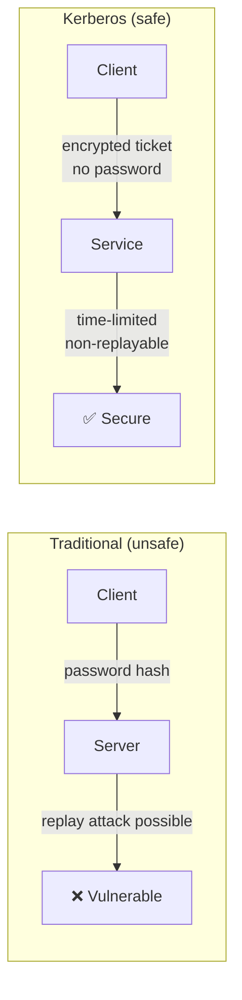

Key Kerberos properties:
- **No plaintext passwords** over the network (ever)
- **Mutual authentication** — the client verifies the server too
- **Time-limited tickets** — compromise is bounded (default 10 hours)
- **Single Sign-On** — one `kinit` gives access to all Kerberized services
- **Delegation** — services can act on behalf of users (with `forwardable` tickets)

### 1.2 Kerberos Actors

| Actor | Role | FreeIPA component |
|-------|------|--------------------|
| **KDC** | Key Distribution Centre — issues all tickets | `krb5kdc` service |
| **AS** | Authentication Service — issues TGTs | Part of KDC |
| **TGS** | Ticket Granting Service — issues service tickets | Part of KDC |
| **Client** | The user or service requesting access | Any enrolled host |
| **Application Server** | The service being accessed (SSH, HTTP, etc.) | Service principal |

### 1.3 The Ticket Model

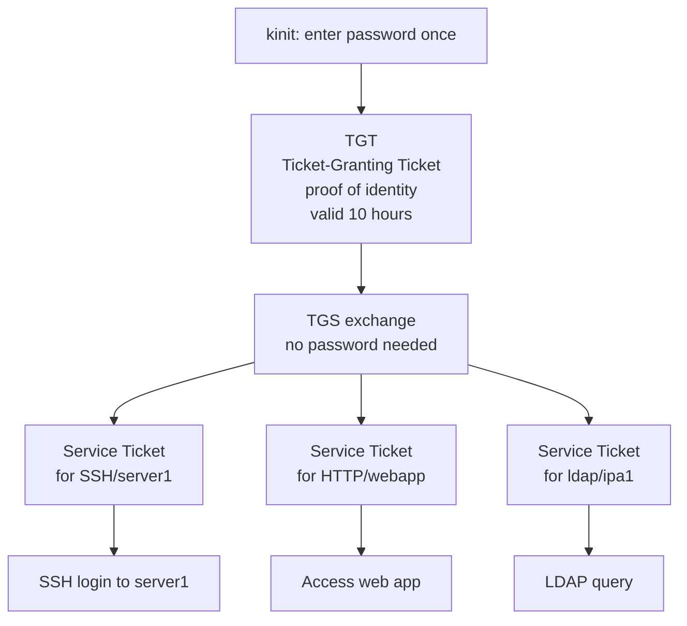

Tickets are stored in a **credential cache** on the client:
- Default location: `/tmp/krb5cc_<uid>` (file-based)
- Systemd-managed: `KEYRING:persistent:<uid>` (in-kernel, preferred)
- View with: `klist`

[↑ Back to TOC](#table-of-contents)

---

## 2. The Full Authentication Exchange

### 2.1 AS-REQ / AS-REP — Getting a TGT

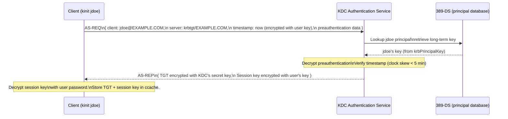

**What is in the TGT?**
- Client principal (`jdoe@EXAMPLE.COM`)
- Session key (shared between client and TGS)
- Validity period (default: 10 hours, renewable for 7 days)
- Client's IP address (optional, configurable)
- Encrypted with the **KDC's** secret key (client cannot read it)

### 2.2 TGS-REQ / TGS-REP — Getting a Service Ticket

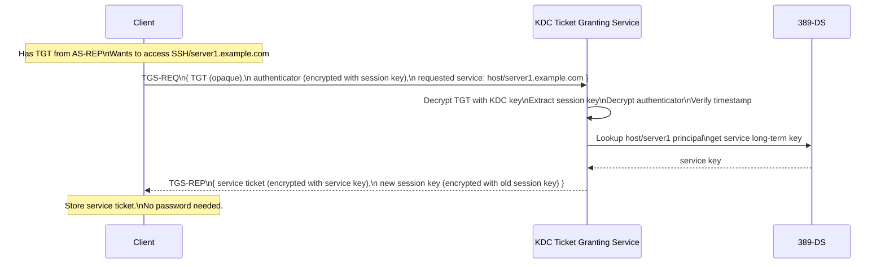

### 2.3 AP-REQ — Using the Service Ticket

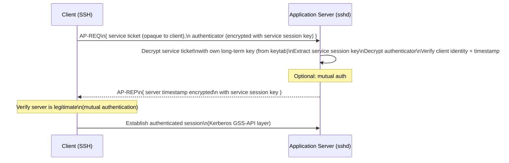

[↑ Back to TOC](#table-of-contents)

---

## 3. Principal Namespace in FreeIPA

### 3.1 User Principals

```
jdoe@EXAMPLE.COM
│    └── Kerberos realm (uppercase)
└──── uid (username)
```

Every IPA user automatically gets a Kerberos principal when their account is
created. The principal is `uid@REALM`.

Special user principals:
- `admin@EXAMPLE.COM` — IPA admin (full RBAC access)
- `kadmin/admin@EXAMPLE.COM` — Kerberos admin principal
- `K/M@EXAMPLE.COM` — Kerberos master key (internal, never used directly)

### 3.2 Host Principals

```
host/server1.example.com@EXAMPLE.COM
│    └─────────────────── FQDN
└──── fixed prefix "host"
```

Host principals are created when a client enrolls with `ipa-client-install`.
They allow the host to authenticate to IPA services (LDAP, certificate renewal).

### 3.3 Service Principals

```
HTTP/ipa.example.com@EXAMPLE.COM
│    └─────────────── FQDN of the host running the service
└──── Service type (HTTP, ldap, nfs, cifs, DNS, etc.)
```

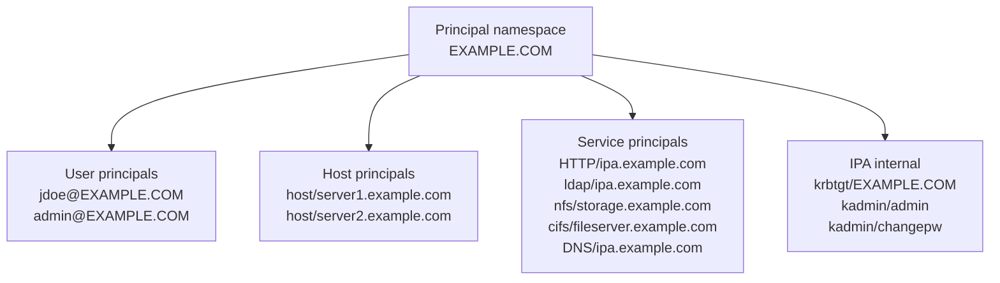

```bash
# Create a service principal
ipa service-add HTTP/webapp.example.com

# Create an NFS service principal
ipa service-add nfs/storage.example.com

# List all service principals
ipa service-find

# Show a service principal
ipa service-show HTTP/webapp.example.com

# Allow a host to manage a service (needed for certmonger on that host)
ipa service-add-host HTTP/webapp.example.com --hosts=webapp.example.com
```

[↑ Back to TOC](#table-of-contents)

---

## 4. Keytabs

### 4.1 What is a Keytab?

A **keytab** (key table) is a file containing one or more Kerberos principal names
and their long-term encryption keys. Services use keytabs to authenticate without
a human entering a password.

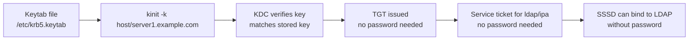

**Key properties:**
- A keytab can contain **multiple key versions** (kvno — key version number)
- When a key is rotated, the new key gets kvno+1
- Services use the latest kvno by default
- Keytabs must be **protected** (root-readable only, `chmod 600`)

### 4.2 Creating and Managing Keytabs

```bash
# Retrieve keytab for a service (from the IPA server or any enrolled client)
# (requires admin TGT or host-level permission)
ipa-getkeytab -s ipa.example.com \
  -p HTTP/webapp.example.com \
  -k /etc/httpd/conf/http.keytab

# Retrieve host keytab (usually done by ipa-client-install)
ipa-getkeytab -s ipa.example.com \
  -p host/server1.example.com \
  -k /etc/krb5.keytab

# Retrieve keytab and append to existing file
ipa-getkeytab -s ipa.example.com \
  -p nfs/storage.example.com \
  -k /etc/krb5.keytab \
  --append

# Inspect a keytab
klist -k /etc/krb5.keytab
klist -k /etc/krb5.keytab -e    # show encryption types

# Test authentication with keytab
kinit -k -t /etc/krb5.keytab host/server1.example.com
klist   # verify ticket obtained

# Rotate a service key (invalidates old keytab!)
ipa service-mod HTTP/webapp.example.com
# Then re-retrieve the keytab with ipa-getkeytab

# Check current key version number
kvno HTTP/webapp.example.com
```

> ⚠️ After rotating a key (`ipa-getkeytab` with new key generation), all copies of
> the old keytab for that principal become invalid immediately. Update all hosts that
> use the keytab before rotating.

[↑ Back to TOC](#table-of-contents)

---

## 5. OTP and Two-Factor Authentication

### 5.1 OTP Pre-Authentication Flow

FreeIPA supports TOTP (Time-based OTP, e.g. Google Authenticator) and HOTP
(HMAC-based OTP) as a second factor.

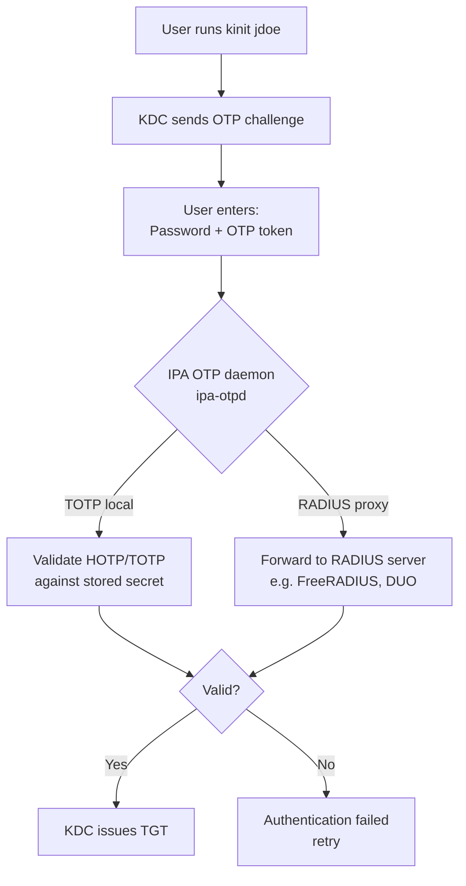

When 2FA is enabled for a user, the `kinit` password prompt accepts
`<password><OTP>` concatenated (e.g. `MyPassword123456` where `123456` is the
current TOTP code).

### 5.2 Configuring OTP Tokens

```bash
# Add a TOTP token for a user (admin adds it)
ipa otptoken-add \
  --owner=jdoe \
  --type=totp \
  --desc="jdoe phone authenticator"
# Output includes: URI (otpauth://) and QR code for authenticator app

# List tokens for a user
ipa otptoken-find --owner=jdoe

# Show token details
ipa otptoken-show <token-id>

# Add an HOTP token (counter-based)
ipa otptoken-add \
  --owner=jdoe \
  --type=hotp \
  --desc="jdoe hardware token"

# Delete a token
ipa otptoken-del <token-id>

# Enable 2FA for a specific user (require OTP)
ipa user-mod jdoe --user-auth-type=otp

# Allow both password-only and OTP (user can choose)
ipa user-mod jdoe --user-auth-type=password --user-auth-type=otp

# Reset to default (uses global policy)
ipa user-mod jdoe --user-auth-type=''

# Set global 2FA policy
ipa config-mod --user-auth-type=otp
```

### 5.3 RADIUS Proxy for 2FA

FreeIPA can proxy OTP validation to an external RADIUS server (e.g. DUO, RSA,
FreeRADIUS). This allows using existing MFA infrastructure.

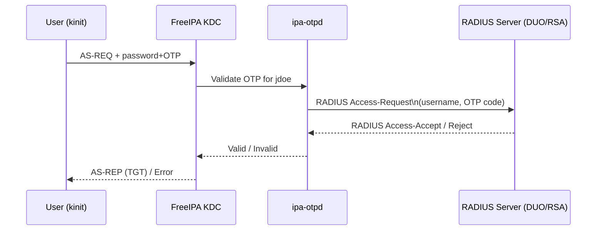

```bash
# Add a RADIUS proxy configuration
ipa radiusproxy-add duo-proxy \
  --server=duo.radius.example.com:1812 \
  --secret='radius-shared-secret'

# Assign a user to authenticate via RADIUS
ipa user-mod jdoe \
  --user-auth-type=radius \
  --radius=duo-proxy \
  --radius-username=jdoe@example.com

# List RADIUS proxies
ipa radiusproxy-find
```

[↑ Back to TOC](#table-of-contents)

---

## 6. PKINIT — Certificate-Based Authentication

PKINIT (Public Key Cryptography for Initial Authentication) allows users to
authenticate to Kerberos using an X.509 certificate (smart card or software cert)
instead of a password.

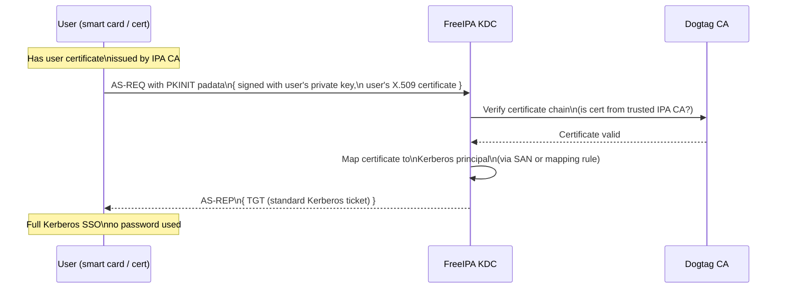

```bash
# Enable PKINIT for a user certificate mapping
ipa certmaprule-add smartcard-rule \
  --matchrule='<ISSUER>CN=Certificate Authority,O=EXAMPLE.COM' \
  --maprule='(|(ipacertmapdata=X509:<I>{issuer_dn!nss_x500}<S>{subject_dn!nss_x500})(objectClass=ipaUser)(uid={subject_nt_principal.0}))' \
  --domain=example.com

# Add a certificate to a user (for PKINIT mapping)
ipa user-add-cert jdoe --certificate="$(base64 /path/to/jdoe.crt | tr -d '\n')"

# Test PKINIT auth
kinit -X X509_user_identity=PKCS11:/usr/lib64/pkcs11/opensc-pkcs11.so jdoe
```

> 🔒 **FIPS:** PKINIT is fully supported in FIPS mode. RSA-2048+ and ECDSA P-256+
> are the only accepted key types. SHA-1 is rejected.
>
> 🔁 **See Module 09** for issuing user certificates via Dogtag.

[↑ Back to TOC](#table-of-contents)

---

## 7. Kerberos Encryption Types on RHEL 10

RHEL 10 enforces the **DEFAULT** crypto policy. The following encryption types
are supported for Kerberos:

| Encryption type | Status | Notes |
|----------------|--------|-------|
| `aes256-cts-hmac-sha384-192` | ✅ Preferred | RFC 8009, FIPS approved |
| `aes128-cts-hmac-sha256-128` | ✅ Supported | RFC 8009, FIPS approved |
| `aes256-cts-hmac-sha1-96` | ✅ Supported | Legacy AES, common |
| `aes128-cts-hmac-sha1-96` | ✅ Supported | Legacy AES, common |
| `camellia256-cts-cmac` | ⚠️ Optional | Non-FIPS environments only |
| `arcfour-hmac` (RC4) | ❌ Removed | Disabled in DEFAULT policy |
| `des-cbc-md5` | ❌ Removed | Disabled, insecure |
| `des3-cbc-sha1` | ❌ Removed | Disabled in DEFAULT policy |

```bash
# Check current supported encryption types
ipa config-show | grep "Supported enctypes"

# View KDC encryption type config
grep -i enctypes /etc/krb5.conf /var/kerberos/krb5kdc/kdc.conf

# Show encryption type of existing tickets
klist -e

# Show encryption type in a keytab
klist -k -e /etc/krb5.keytab
```

> ⚠️ If you have Windows clients or AD trusts, ensure `arcfour-hmac` (RC4) is not
> required. Modern Windows (2012+) supports AES. If you have old Windows clients
> still requiring RC4, address that before migrating to RHEL 10.

[↑ Back to TOC](#table-of-contents)

---

## 8. Password Policies and Lockout

### 8.1 Policy Inheritance

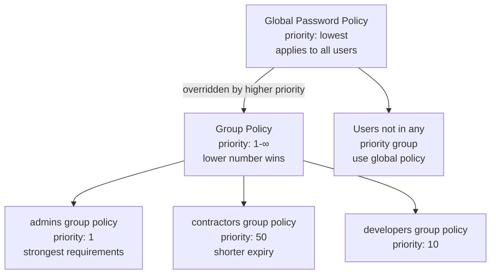

```bash
# Show all policies with priorities
ipa pwpolicy-find --all

# Show effective policy for a specific user
ipa pwpolicy-show --user=jdoe
```

### 8.2 Account Lockout

When a user exceeds `--maxfail` failed attempts within `--failinterval` seconds,
the account is locked for `--lockouttime` seconds.

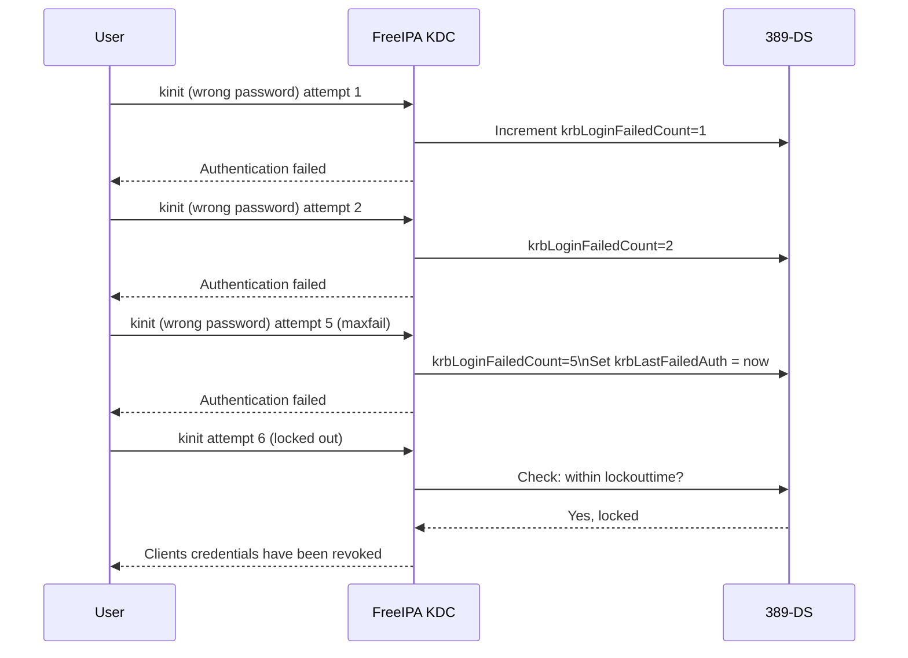

```bash
# View lockout status for a user
ipa user-show jdoe --all | grep -i "failed\|lock\|last"

# Unlock a locked account immediately (admin)
ipa user-unlock jdoe

# View current failure count
ldapsearch -Y GSSAPI \
  -b "uid=jdoe,cn=users,cn=accounts,dc=example,dc=com" \
  krbLoginFailedCount krbLastFailedAuth krbLastSuccessfulAuth
```

[↑ Back to TOC](#table-of-contents)

---

## 9. kinit Decision Tree

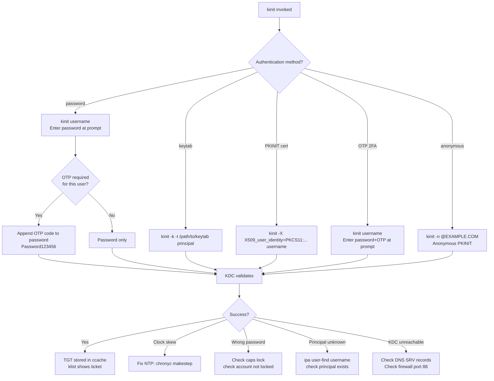

[↑ Back to TOC](#table-of-contents)

---

## 10. Common Kerberos Errors

| Error message | Cause | Fix |
|--------------|-------|-----|
| `Clock skew too great` | Client clock differs from KDC by >5 min | `chronyc makestep` |
| `KDC has no support for encryption type` | Client requests enc type not enabled | Check `krb5.conf` enctypes vs RHEL 10 DEFAULT policy |
| `Client not found in Kerberos database` | Principal does not exist | `ipa user-find` or `ipa service-find` |
| `Clients credentials have been revoked` | Account locked (too many failures) | `ipa user-unlock username` |
| `Ticket expired` | TGT is older than max lifetime | `kinit` again |
| `Credentials cache file permissions incorrect` | Wrong ownership on `/tmp/krb5cc_*` | `kdestroy && kinit` |
| `Cannot contact any KDC for realm` | Network/DNS issue | `dig _kerberos._tcp.REALM SRV` |
| `Preauthentication failed` | Wrong password | Check password, check account lock status |
| `Server not found in Kerberos database` | Service principal missing | `ipa service-add service/host.example.com` |
| `Key version number for principal in key table is incorrect` | Keytab kvno mismatch after key rotation | Re-retrieve keytab with `ipa-getkeytab` |

[↑ Back to TOC](#table-of-contents)

---

## 11. Lab — Kerberos Authentication Exercises

```bash
# ── EXERCISE 1: Basic TGT lifecycle ─────────────────────────────────────────

# Obtain TGT
kinit admin

# Inspect the TGT
klist -v          # full details including enc type, flags
klist -e          # show encryption types

# Destroy ticket cache
kdestroy
klist             # should show "No credentials cache found"

# Obtain TGT with specific lifetime
kinit -l 2h admin        # 2-hour ticket
kinit -r 3d admin        # renewable for 3 days
klist                    # check Times

# Renew TGT (extends without re-entering password, within renew window)
kinit -R

# ── EXERCISE 2: Service ticket acquisition ───────────────────────────────────

kinit admin
kvno ldap/ipa.example.com       # fetch service ticket
klist                            # shows both TGT and service ticket
klist -v                         # shows service ticket details

# ── EXERCISE 3: Keytab operations ────────────────────────────────────────────

# Create a test service principal
ipa service-add test/ipa.example.com

# Retrieve its keytab
ipa-getkeytab -s ipa.example.com \
  -p test/ipa.example.com \
  -k /tmp/test.keytab

# Inspect the keytab
klist -k /tmp/test.keytab -e

# Authenticate with the keytab (no password)
kdestroy
kinit -k -t /tmp/test.keytab test/ipa.example.com
klist     # should show TGT for test/ipa.example.com

# Clean up
kdestroy
rm /tmp/test.keytab
ipa service-del test/ipa.example.com

# ── EXERCISE 4: OTP token setup ──────────────────────────────────────────────

# Create OTP token for alice (scan QR code with authenticator app)
kinit admin
ipa otptoken-add --owner=alice --type=totp --desc="alice totp"
# Note the URI/QR code output — add to Google Authenticator or similar

# Enable OTP for alice
ipa user-mod alice --user-auth-type=otp

# Test (in a new terminal):
kinit alice
# Password prompt: enter alice's password + TOTP code concatenated
# e.g. if password=MyPass and OTP=482931, enter: MyPass482931

# Reset alice back to password-only
kinit admin
ipa user-mod alice --user-auth-type=password

# ── EXERCISE 5: Account lockout ──────────────────────────────────────────────

# Check current lockout policy
ipa pwpolicy-show

# Intentionally fail login 5+ times (use wrong password)
for i in {1..6}; do
  echo "wrongpassword" | kinit bob 2>&1 || true
done

# Check lock status
ipa user-show bob --all | grep -i "failed\|lock"

# Unlock the account
ipa user-unlock bob

# Verify unlock
kinit bob   # should succeed with correct password
```

[↑ Back to TOC](#table-of-contents)
