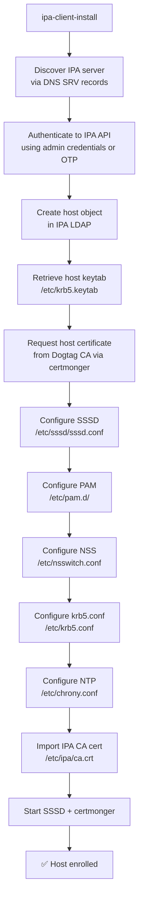
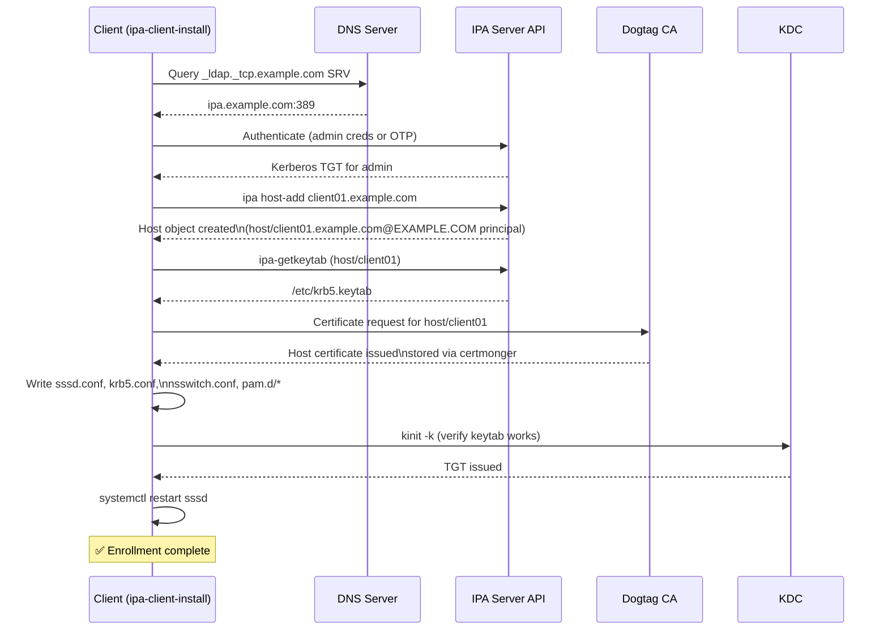
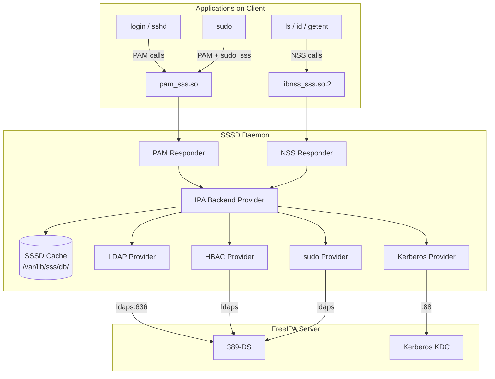
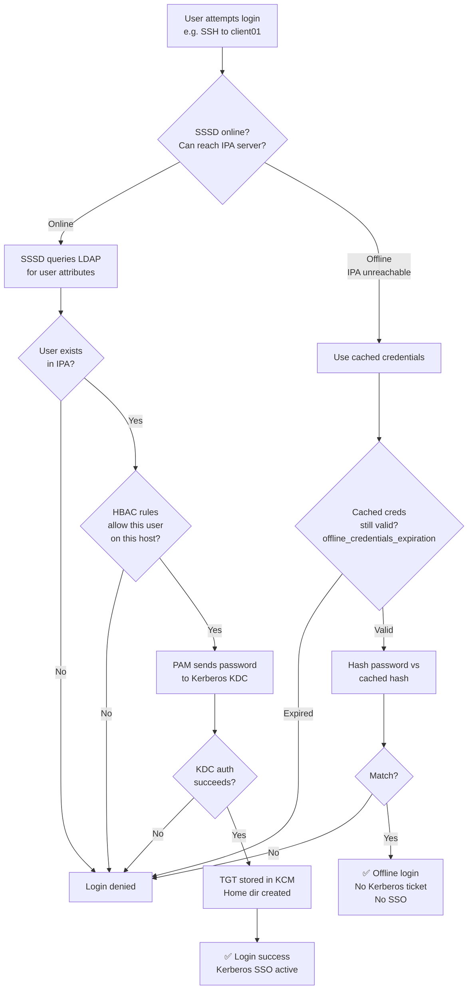
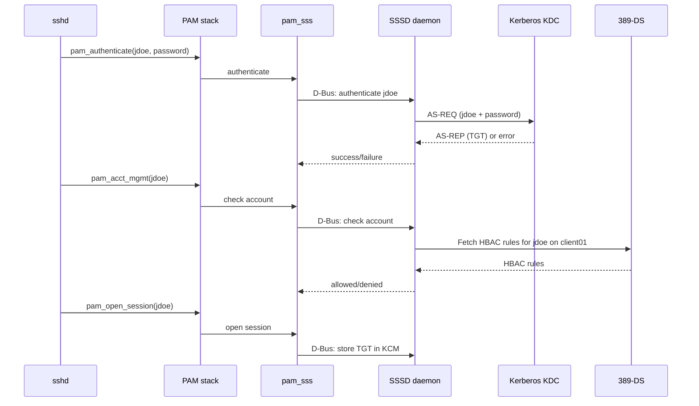

# Module 05 — Host Enrollment and SSSD
[](./LICENSE.md)
[](https://access.redhat.com/products/red-hat-enterprise-linux)
[](https://www.freeipa.org)

> Enrolling Linux clients into FreeIPA, understanding the SSSD architecture,
> PAM/NSS integration, offline authentication, and host group management.

## Table of Contents

- [Recommended Background](#recommended-background)
- [Learning Outcomes](#learning-outcomes)
- [1. Host Enrollment Overview](#1-host-enrollment-overview)
  - [1.1 What ipa-client-install Does](#11-what-ipa-client-install-does)
  - [1.2 Pre-Enrollment Requirements](#12-pre-enrollment-requirements)
- [2. Running ipa-client-install](#2-running-ipa-client-install)
  - [2.1 Interactive Enrollment](#21-interactive-enrollment)
  - [2.2 Unattended Enrollment](#22-unattended-enrollment)
  - [2.3 Enrollment Sequence](#23-enrollment-sequence)
- [3. SSSD Architecture](#3-sssd-architecture)
  - [3.1 SSSD Component Map](#31-sssd-component-map)
  - [3.2 SSSD Configuration File](#32-sssd-configuration-file)
  - [3.3 SSSD Cache](#33-sssd-cache)
- [4. Online vs Offline Authentication](#4-online-vs-offline-authentication)
- [5. PAM and NSS Integration](#5-pam-and-nss-integration)
  - [5.1 NSS Configuration](#51-nss-configuration)
  - [5.2 PAM Stack](#52-pam-stack)
- [6. Host Groups](#6-host-groups)
- [7. Host-Level Certificates](#7-host-level-certificates)
- [8. Unenrolling a Client](#8-unenrolling-a-client)
- [9. Lab — Client Enrollment Walkthrough](#9-lab--client-enrollment-walkthrough)
- [Key Takeaways](#key-takeaways)


---

## Recommended Background

- Complete Modules 00 through 04 and create at least one non-admin user in Module 03.
- Administrative access to both the IPA server and the client host.
- Working DNS and NTP between the client and the IPA environment.

## Learning Outcomes

By the end of this module, you should be able to:

- Enroll a Linux host into IPA using admin credentials or an OTP.
- Explain what SSSD, PAM, NSS, and certmonger configure during enrollment.
- Test online and offline authentication behavior safely.
- Manage host groups and host-level certificates for enrolled systems.

---

## 1. Host Enrollment Overview

### 1.1 What ipa-client-install Does

When you run `ipa-client-install` on a Linux host, it:



### 1.2 Pre-Enrollment Requirements

Same DNS/hostname requirements as the server:
- FQDN set (`hostname -f` returns `client01.example.com`)
- Forward DNS: `client01.example.com → IP`
- Reverse DNS: `IP → client01.example.com`
- NTP synced (clock skew < 5 min relative to IPA server)
- Port 88 (Kerberos), 389/636 (LDAP), 443 (HTTPS) reachable to IPA server

[↑ Back to TOC](#table-of-contents)

---

## 2. Running ipa-client-install

### 2.1 Interactive Enrollment

```bash
# (client) Install client packages
dnf install -y ipa-client

# (client) Run interactive enrollment
ipa-client-install --mkhomedir
```

You will be prompted for:
1. IPA server hostname (auto-discovered from DNS SRV)
2. IPA domain (auto-discovered)
3. IPA realm (auto-derived)
4. Admin username (default: `admin`)
5. Admin password

### 2.2 Unattended Enrollment

```bash
# (client) Unattended enrollment with admin credentials
ipa-client-install \
  --server=ipa.example.com \
  --domain=example.com \
  --realm=EXAMPLE.COM \
  --principal=admin \
  --password='Admin_P@ssw0rd_Change_Me' \
  --mkhomedir \
  --unattended

# (client) Enrollment using a one-time password (OTP) — more secure
# First generate OTP on IPA server:
# (server) ipa host-add client01.example.com --random
# Then on client:
ipa-client-install \
  --server=ipa.example.com \
  --domain=example.com \
  --hostname=client01.example.com \
  --password='<one-time-password>' \
  --mkhomedir \
  --unattended
```

> 📝 Using `--random` to generate a one-time enrollment password is the **recommended
> production approach**. Admin credentials are never transmitted to the client host.

> 📝 In the beginner path, `--server=ipa.example.com` points at the single IPA server. In multi-server labs, use `ipa1.example.com` or a stable alias that resolves to the active IPA node.

### 2.3 Enrollment Sequence



[↑ Back to TOC](#table-of-contents)

---

## 3. SSSD Architecture

### 3.1 SSSD Component Map



### 3.2 SSSD Configuration File

`/etc/sssd/sssd.conf` is written by `ipa-client-install`. Understanding it is
essential for troubleshooting.

```ini
# /etc/sssd/sssd.conf (typical IPA client config)

[sssd]
domains = example.com
config_file_version = 2
services = nss, pam, ssh, sudo

[domain/example.com]
# Provider settings
id_provider = ipa
auth_provider = ipa
access_provider = ipa
chpass_provider = ipa
sudo_provider = ipa

# IPA-specific settings
ipa_domain = example.com
ipa_server = _srv_, ipa.example.com    # _srv_ = use DNS SRV
ipa_hostname = client01.example.com

# Kerberos settings
krb5_realm = EXAMPLE.COM
krb5_store_password_if_offline = true

# Cache settings
cache_credentials = true
krb5_ccachedir = /tmp
krb5_ccname_template = KCM:

# Home directory creation
override_homedir = /home/%u
fallback_homedir = /home/%u
default_shell = /bin/bash

# HBAC
ipa_hbac_refresh = 5         # seconds between HBAC rule refresh

[nss]
homedir_substring = /home

[pam]
offline_credentials_expiration = 3   # days offline credentials last
```

### 3.3 SSSD Cache

SSSD caches identity and credential data to:
1. Improve performance (avoid repeated LDAP queries)
2. Enable offline authentication when the IPA server is unreachable

```bash
# View cache contents (user info)
sss_cache -u jdoe           # invalidate specific user cache
sss_cache -g developers     # invalidate specific group cache
sss_cache -E                # invalidate entire cache (forces refresh)

# Inspect the cache database directly
dbscan -f /var/lib/sss/db/cache_example.com.ldb | less

# Show cached user
getent passwd jdoe          # hits SSSD cache if online entry available

# Clear SSSD logs and restart for clean troubleshooting
rm -f /var/log/sssd/*.log
systemctl restart sssd
journalctl -u sssd -f       # follow logs
```

[↑ Back to TOC](#table-of-contents)

---

## 4. Online vs Offline Authentication



> 📝 Offline login gives shell access but **no Kerberos ticket**. The most recent successful online lookup determines what SSSD can still reuse:
> - Cached credentials can still allow a user to log in locally.
> - Cached HBAC decisions can still allow or deny a login until the cache expires.
> - `sudo` policy that was never cached, or that needs a fresh lookup, usually fails until IPA is reachable again.
> - Kerberos-backed services such as NFSv4 with Kerberos still fail because no new TGT is issued.

```bash
# Prefer a reversible route blackhole instead of modifying firewalld policy
# Adjust the IP if your active IPA server is ipa1.example.com or a VIP
sudo ip route add blackhole 192.168.1.10/32

# Now test with a user who has already logged in successfully while online
klist          # should show no new TGT after an offline login
sudo -l        # may fail if sudo policy needs a fresh IPA lookup

# Re-enable access to the IPA server
sudo ip route del blackhole 192.168.1.10/32

# Check how long offline credentials and cached policy survive
grep offline_credentials /etc/sssd/sssd.conf
grep cache_credentials /etc/sssd/sssd.conf
```

[↑ Back to TOC](#table-of-contents)

---

## 5. PAM and NSS Integration

### 5.1 NSS Configuration

`/etc/nsswitch.conf` tells the OS where to look up identity information:

```
# /etc/nsswitch.conf (after ipa-client-install)
passwd:     sss files systemd
shadow:     files
group:      sss files systemd
hosts:      files dns myhostname
netgroup:   sss
automount:  sss files
```

- `sss` — query SSSD (which queries IPA)
- `files` — query local `/etc/passwd`, `/etc/group`

The order matters: `sss files` means "check SSSD first, then local files".

### 5.2 PAM Stack

`ipa-client-install` configures the PAM stack by modifying `/etc/pam.d/`:

```bash
# View the PAM stack for password-auth
cat /etc/pam.d/password-auth
```

Key PAM modules added by IPA:

| Module | Type | Purpose |
|--------|------|---------|
| `pam_sss.so` | auth | Authenticate via SSSD (Kerberos) |
| `pam_sss.so` | account | Account validity check (expiry, lock, HBAC) |
| `pam_sss.so` | password | Change password via SSSD |
| `pam_sss.so` | session | Session setup (ticket cache, homedir) |
| `pam_oddjob_mkhomedir.so` | session | Create home dir if it doesn't exist |



[↑ Back to TOC](#table-of-contents)

---

## 6. Host Groups

Host groups organise enrolled hosts and are used by HBAC rules, sudo rules,
automember rules, and ID views.

```bash
# Create host groups
ipa hostgroup-add webservers --desc="Web server tier"
ipa hostgroup-add dbservers --desc="Database server tier"
ipa hostgroup-add production --desc="Production hosts"

# Add hosts to groups
ipa hostgroup-add-member webservers --hosts=web01.example.com
ipa hostgroup-add-member webservers --hosts=web02.example.com
ipa hostgroup-add-member dbservers --hosts=db01.example.com

# Nested host groups
ipa hostgroup-add-member production --hostgroups=webservers
ipa hostgroup-add-member production --hostgroups=dbservers

# Automember rule for hosts (based on FQDN pattern)
ipa automember-add webservers --type=hostgroup
ipa automember-add-condition webservers \
  --type=hostgroup \
  --key=fqdn \
  --inclusive-regex='^web.*\.example\.com$'

ipa automember-add-condition dbservers \
  --type=hostgroup \
  --key=fqdn \
  --inclusive-regex='^db.*\.example\.com$'

# Rebuild automember for existing hosts
ipa automember-rebuild --type=hostgroup
```

[↑ Back to TOC](#table-of-contents)

---

## 7. Host-Level Certificates

Every enrolled host gets a certificate for its `host/` principal, managed by
certmonger. This cert is used for LDAP client auth and service-level operations.

```bash
# (client) View certmonger-tracked certificates
getcert list

# (client) View the host certificate details
getcert list -f /var/lib/ipa/certs/host.crt   # or path shown in getcert list
openssl x509 -in /var/lib/ipa/certs/host.crt -text -noout | grep -A2 Subject

# (client) Check when certificates expire
getcert list | grep -E "(subject|expires|status)"

# (server) View host certificate from IPA
ipa host-show client01.example.com --all | grep -i cert
```

> 🔁 **See Module 09** for full certmonger and certificate management details.
> Certmonger automatically renews host certificates before expiry.

[↑ Back to TOC](#table-of-contents)

---

## 8. Unenrolling a Client

```bash
# (client) Unenroll and remove IPA configuration (⚠️ irreversible)
ipa-client-install --uninstall

# (server) Remove the host object from IPA (if client-side uninstall failed)
ipa host-del client01.example.com --updatedns

# (server) Disable a host without removing it (revokes keytab + cert)
ipa host-disable client01.example.com
```

[↑ Back to TOC](#table-of-contents)

---

## 9. Lab — Client Enrollment Walkthrough

```bash
# ── PRE-REQUISITES (on the client VM) ────────────────────────────────────────

# Set hostname
hostnamectl set-hostname client01.example.com

# Add IPA server to /etc/hosts (if no DNS yet)
echo "192.168.1.10  ipa.example.com  ipa" >> /etc/hosts
echo "192.168.1.20  client01.example.com  client01" >> /etc/hosts

# Sync time
systemctl enable --now chronyd
chronyc makestep

# ── ENROLLMENT ───────────────────────────────────────────────────────────────

dnf install -y ipa-client

ipa-client-install \
  --server=ipa.example.com \
  --domain=example.com \
  --principal=admin \
  --password='S3cur3Admin!2026' \
  --mkhomedir \
  --unattended

# ── VERIFY ENROLLMENT ────────────────────────────────────────────────────────

# Test SSSD is working
id admin                              # should show uid/gid from IPA
getent passwd admin                   # should return IPA admin entry
getent group admins                   # should return IPA admins group

# Test Kerberos
kinit admin
klist
ssh admin@localhost                   # Kerberos SSO — no password if TGT present

# Test host principal
klist -k /etc/krb5.keytab             # should show host/client01.example.com

# Check certmonger tracking
getcert list

# Check SSSD status
systemctl status sssd
journalctl -u sssd --since "10 min ago"

# ── HOST GROUPS ───────────────────────────────────────────────────────────────

# (server) Add client01 to a host group
kinit admin
ipa hostgroup-add-member webservers --hosts=client01.example.com
ipa hostgroup-show webservers

# ── SSSD CACHE OPERATIONS ─────────────────────────────────────────────────────

# (client) Force SSSD cache refresh for a user
sss_cache -u jdoe
id jdoe

# (client) View SSSD debug logs (set debug_level = 9 in sssd.conf first)
# Edit /etc/sssd/sssd.conf:
# [domain/example.com]
# debug_level = 9
systemctl restart sssd
tail -f /var/log/sssd/sssd_example.com.log
```


---

## Key Takeaways

- Enrollment is successful only when DNS, time, and host identity all line up.
- SSSD caching improves resilience but changes what still works during outages.
- OTP-based enrollment is safer than reusing the admin password on clients.
- Host enrollment is the bridge from identity setup to policy enforcement.

[↑ Back to TOC](#table-of-contents)

---

*Licensed under [CC BY-NC-SA 4.0](LICENSE.md) · © 2026 UncleJS*