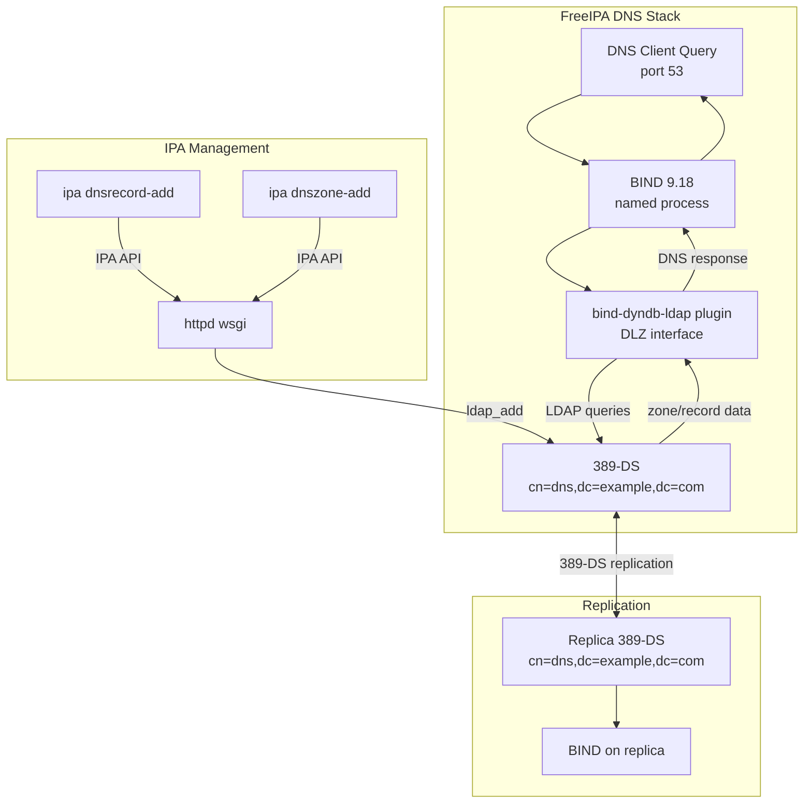
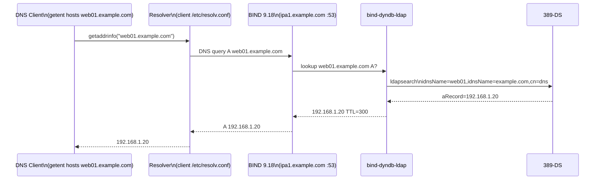
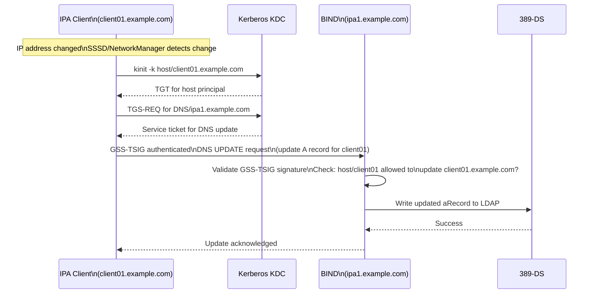
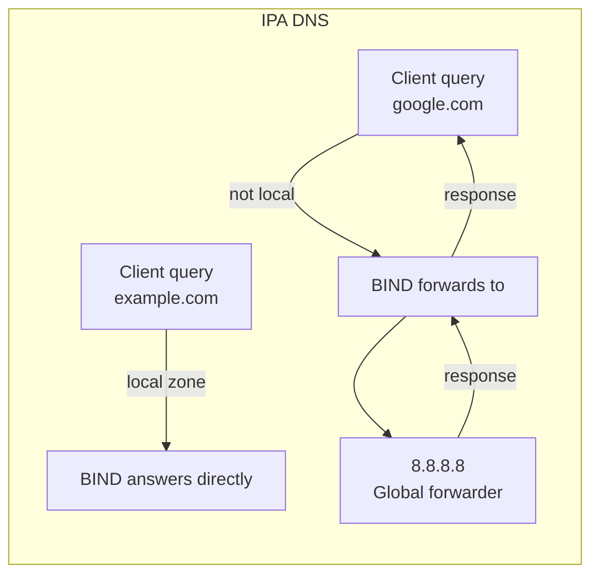
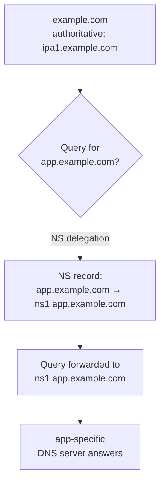
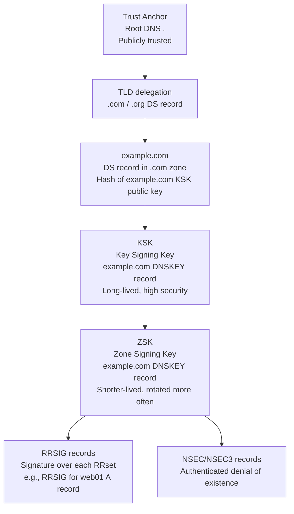
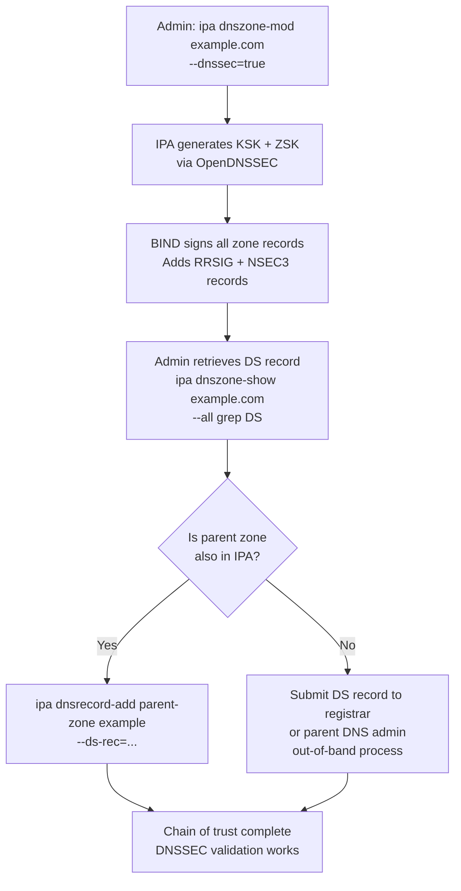
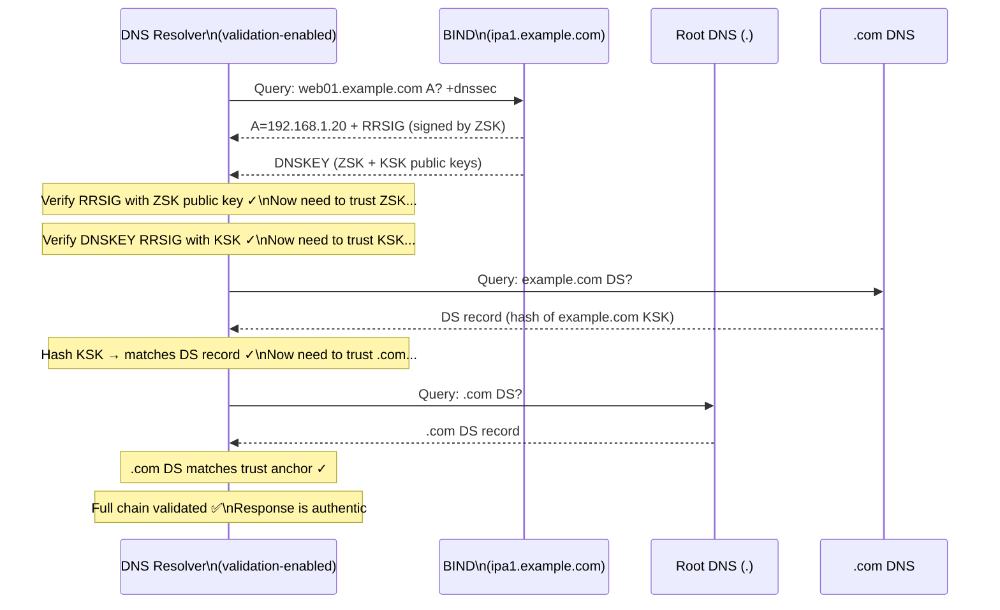

# Module 06 — DNS and DNSSEC
[](./LICENSE.md)
[](https://access.redhat.com/products/red-hat-enterprise-linux)
[](https://www.freeipa.org)

> FreeIPA's integrated DNS architecture, managing zones and records, configuring
> DNSSEC, dynamic DNS updates, and forwarder/delegation topologies.

## Table of Contents

- [Recommended Background](#recommended-background)
- [Learning Outcomes](#learning-outcomes)
- [1. DNS Architecture in FreeIPA](#1-dns-architecture-in-freeipa)
  - [1.1 BIND-DLZ Integration](#11-bind-dlz-integration)
  - [1.2 Why Use Integrated DNS?](#12-why-use-integrated-dns)
- [2. Managing DNS Zones](#2-managing-dns-zones)
  - [2.1 Forward Zones](#21-forward-zones)
  - [2.2 Reverse Zones](#22-reverse-zones)
  - [2.3 Zone Options](#23-zone-options)
- [3. Managing DNS Records](#3-managing-dns-records)
  - [3.1 Common Record Types](#31-common-record-types)
  - [3.2 Adding and Removing Records](#32-adding-and-removing-records)
- [4. DNS Query Resolution Flow](#4-dns-query-resolution-flow)
- [5. Kerberos Dynamic DNS Updates](#5-kerberos-dynamic-dns-updates)
- [6. Forwarders and Zone Delegation](#6-forwarders-and-zone-delegation)
  - [6.1 Global Forwarders](#61-global-forwarders)
  - [6.2 Per-Zone Forwarders](#62-per-zone-forwarders)
  - [6.3 Zone Delegation](#63-zone-delegation)
- [7. DNSSEC Deep-Dive](#7-dnssec-deep-dive)
  - [7.1 DNSSEC Key Hierarchy](#71-dnssec-key-hierarchy)
  - [7.2 Enabling DNSSEC on a Zone](#72-enabling-dnssec-on-a-zone)
  - [7.3 DNSSEC Validation Chain](#73-dnssec-validation-chain)
  - [7.4 DNSSEC Key Rollover](#74-dnssec-key-rollover)
- [8. Lab — DNS and DNSSEC Exercises](#8-lab--dns-and-dnssec-exercises)
- [Key Takeaways](#key-takeaways)


---

## Recommended Background

- Complete Modules 00 through 05.
- Comfort with basic DNS record types, zones, and recursive resolution.
- An IPA deployment with integrated DNS enabled.

## Learning Outcomes

By the end of this module, you should be able to:

- Manage zones, records, forwarders, and dynamic updates in IPA.
- Explain how IPA stores DNS data and serves it through BIND.
- Describe how DNSSEC signing and validation work in the integrated stack.
- Operate a basic DNSSEC rollover workflow without breaking trust.

---

## 1. DNS Architecture in FreeIPA

### 1.1 BIND-DLZ Integration

FreeIPA uses the `bind-dyndb-ldap` plugin, which implements BIND's DLZ (Dynamically
Loadable Zones) interface. Instead of reading zone files from disk, BIND reads and
writes zone data directly from/to 389-DS.



**Key consequence:** DNS changes replicate automatically to all IPA replicas that
run integrated DNS. No zone transfers, no secondary servers, no zone file sync.

### 1.2 Why Use Integrated DNS?

| Feature | Integrated DNS | External DNS |
|---------|---------------|-------------|
| SRV records for Kerberos | Auto-created | Must create manually |
| SRV records for LDAP | Auto-created | Must create manually |
| Client auto-discovery | ✅ Works | Requires manual SRV |
| DNSSEC | Integrated with IPA CA | Separate management |
| Dynamic updates (clients) | Kerberos-authenticated | TSIG key management |
| DNS replication | Via 389-DS replication | Separate DNS infra |
| Reverse zones | Auto-managed | Manual |

[↑ Back to TOC](#table-of-contents)

---

## 2. Managing DNS Zones

### 2.1 Forward Zones

```bash
# List all DNS zones
ipa dnszone-find

# Show a zone
ipa dnszone-show example.com

# Add a new forward zone
ipa dnszone-add app.example.com \
  --name-server=ipa1.example.com. \
  --admin-email=dnsadmin@example.com

# Disable a zone (stops answering queries for it)
ipa dnszone-disable app.example.com

# Enable a zone
ipa dnszone-enable app.example.com

# Delete a zone
ipa dnszone-del app.example.com
```

### 2.2 Reverse Zones

```bash
# Add a reverse zone for 192.168.1.0/24
ipa dnszone-add 1.168.192.in-addr.arpa. \
  --name-server=ipa1.example.com.

# Add a reverse zone for IPv6
ipa dnszone-add 0.0.0.0.0.0.0.0.8.b.d.0.1.0.0.2.ip6.arpa. \
  --name-server=ipa1.example.com.

# Auto-create reverse zone during install
# (handled by --auto-reverse in ipa-server-install)
```

### 2.3 Zone Options

```bash
# Set SOA refresh/retry/expire/TTL
ipa dnszone-mod example.com \
  --refresh=3600 \
  --retry=900 \
  --expire=1209600 \
  --minimum=300

# Set default TTL for zone
ipa dnszone-mod example.com --default-ttl=300

# Allow only specific IPs to query the zone
ipa dnszone-mod example.com \
  --allow-query="192.168.1.0/24;localhost"

# Enable/disable zone transfers
ipa dnszone-mod example.com --allow-transfer="none"
```

[↑ Back to TOC](#table-of-contents)

---

## 3. Managing DNS Records

### 3.1 Common Record Types

| Type | Command flag | Example use |
|------|-------------|-------------|
| A | `--a-rec` | `web01 → 192.168.1.20` |
| AAAA | `--aaaa-rec` | `web01 → 2001:db8::1` |
| CNAME | `--cname-rec` | `www → web01.example.com.` |
| MX | `--mx-rec` | Mail server |
| SRV | `--srv-rec` | Kerberos/LDAP service discovery |
| TXT | `--txt-rec` | SPF, DKIM, verification |
| PTR | `--ptr-rec` | Reverse lookup |
| NS | `--ns-rec` | Name server delegation |

### 3.2 Adding and Removing Records

```bash
# A record
ipa dnsrecord-add example.com web01 --a-rec=192.168.1.20
ipa dnsrecord-add example.com web01 --a-rec=192.168.1.21  # round-robin

# AAAA record
ipa dnsrecord-add example.com web01 --aaaa-rec=2001:db8::20

# CNAME record (note trailing dot on target)
ipa dnsrecord-add example.com www --cname-rec=web01.example.com.

# MX record (priority weight)
ipa dnsrecord-add example.com @ --mx-rec="10 mail.example.com."

# TXT record (SPF example)
ipa dnsrecord-add example.com @ \
  --txt-rec="v=spf1 mx a:mail.example.com -all"

# SRV record (format: priority weight port target)
ipa dnsrecord-add example.com _https._tcp \
  --srv-rec="0 100 443 web01.example.com."

# PTR record (in reverse zone)
ipa dnsrecord-add 1.168.192.in-addr.arpa. 20 \
  --ptr-rec=web01.example.com.

# Show all records in a zone
ipa dnsrecord-find example.com

# Show records for a specific name
ipa dnsrecord-show example.com web01

# Delete a specific record value
ipa dnsrecord-del example.com web01 --a-rec=192.168.1.21

# Delete all records for a name
ipa dnsrecord-del example.com web01 --del-all

# Modify TTL of a record
ipa dnsrecord-mod example.com web01 --ttl=60 --a-rec=192.168.1.20
```

[↑ Back to TOC](#table-of-contents)

---

## 4. DNS Query Resolution Flow



[↑ Back to TOC](#table-of-contents)

---

## 5. Kerberos Dynamic DNS Updates

Enrolled clients can update their own DNS A/AAAA records using Kerberos-authenticated
dynamic updates. This ensures DNS stays current when IP addresses change (DHCP
environments).



```bash
# (client) Manually trigger DNS update
ipa-client-install --force-join  # re-runs full enrollment including DNS update

# Or use nsupdate with GSS-TSIG directly:
kinit -k -t /etc/krb5.keytab host/client01.example.com
nsupdate -g << EOF
server ipa1.example.com
update delete client01.example.com. A
update add client01.example.com. 300 A 192.168.1.50
send
EOF

# (server) Allow a host to update specific DNS names
ipa dnsrecord-mod example.com client01 --setattr="idnsallowdynupdate=TRUE"
```

[↑ Back to TOC](#table-of-contents)

---

## 6. Forwarders and Zone Delegation

### 6.1 Global Forwarders

Global forwarders handle queries for zones that IPA does not manage locally.



```bash
# Show current global forwarders
ipa dnsconfig-show

# Add a global forwarder
ipa dnsconfig-mod --forwarder=8.8.8.8 --forwarder=8.8.4.4

# Set forward policy (first = try forwarder first, then local; only = forwarder only)
ipa dnsconfig-mod --forward-policy=first

# Remove a forwarder
ipa dnsconfig-mod --delattr=idnsforwarders=8.8.8.8
```

### 6.2 Per-Zone Forwarders

```bash
# Add a per-zone forwarder (for specific domains)
ipa dnszone-mod ad.example.com \
  --forwarder=10.0.0.1 \
  --forward-policy=only   # only use forwarder, don't recurse

# Show zone forwarder
ipa dnszone-show ad.example.com | grep forward
```

### 6.3 Zone Delegation



```bash
# Create a delegated zone (add NS + glue records)
# 1. Create NS record in parent zone
ipa dnsrecord-add example.com app --ns-rec=ns1.app.example.com.

# 2. Create glue A record (if ns1 is in the delegated zone)
ipa dnsrecord-add example.com ns1.app --a-rec=10.0.1.1

# 3. The delegated zone (app.example.com) is managed elsewhere
#    OR create it in IPA with a different name server:
ipa dnszone-add app.example.com --name-server=ns1.app.example.com.
```

[↑ Back to TOC](#table-of-contents)

---

## 7. DNSSEC Deep-Dive

### 7.1 DNSSEC Key Hierarchy

DNSSEC uses asymmetric cryptography to sign DNS records, allowing resolvers to
verify authenticity. FreeIPA integrates DNSSEC key management with the IPA CA.



**Key types:**
- **KSK (Key Signing Key)** — signs the DNSKEY RRset. Its hash (DS record) must
  be published in the parent zone. Long lifetime (1-2 years).
- **ZSK (Zone Signing Key)** — signs all other resource records. Shorter lifetime
  (30-90 days), rotated automatically.
- **RRSIG** — a digital signature over a set of DNS records.
- **DS (Delegation Signer)** — a record in the parent zone that anchors the chain
  of trust down to the child zone.

### 7.2 Enabling DNSSEC on a Zone



```bash
# Enable DNSSEC on a zone
ipa dnszone-mod example.com --dnssec=true

# View DNSSEC keys and DS record
ipa dnszone-show example.com --all | grep -E "(DS|DNSKEY|dnssec)"

# Get the DS record to submit to parent/registrar
dig example.com DNSKEY | grep 257   # KSK
dig example.com DS                   # if parent already has it

# Verify DNSSEC is working
dig +dnssec example.com A
dig +dnssec web01.example.com A

# Use delv for full chain-of-trust validation
delv @ipa1.example.com web01.example.com A
# Expected: "fully validated" in output

# Check DNSSEC status for a zone
ipa dnszone-show example.com --all | grep nsec
```

### 7.3 DNSSEC Validation Chain



### 7.4 DNSSEC Key Rollover

FreeIPA/OpenDNSSEC handles ZSK rollover automatically. KSK rollover requires
manual intervention because it involves updating the DS record in the parent zone.

```bash
# View current DNSSEC keys and their states
ipa dnskey-find example.com

# Initiate a manual KSK rollover (when required)
# Step 1: Generate new KSK
ipa dnszone-mod example.com --dnssec=false
ipa dnszone-mod example.com --dnssec=true

# Step 2: Get new DS record
ipa dnszone-show example.com --all | grep -i DS

# Step 3: Submit new DS to parent zone/registrar
# Step 4: Wait for DS to propagate (check with dig +dnssec)
# Step 5: Remove old KSK (automatic after TTL expires)

# Monitor DNSSEC status
journalctl -u named | grep -i "dnssec\|sign\|key"
```

### 7.5 Worked KSK Rollover Checklist

Use this sequence when the parent zone is external and you must coordinate DS updates with a registrar or upstream DNS team.

```bash
# 1. Record the current DNSSEC state before changing anything
ipa dnszone-show example.com --all
dig +dnssec example.com SOA @ipa1.example.com

# 2. Trigger the new KSK and confirm a second key appears
ipa dnszone-mod example.com --dnssec=false
ipa dnszone-mod example.com --dnssec=true
ipa dnskey-find example.com

# 3. Capture the new DS record for the parent zone
ipa dnszone-show example.com --all | grep -i DS

# 4. Submit the new DS record to the parent zone or registrar
# Keep the old DS published until the new one is visible everywhere.

# 5. Validate the new chain of trust from outside the IPA server
dig +dnssec example.com SOA @8.8.8.8
dig +trace +dnssec example.com

# 6. Watch signing logs until the new key is active and the old key ages out
journalctl -u named | grep -i "dnssec\|sign\|key"
```

> Keep both DS records published during the overlap window. Removing the old DS too early breaks validation for resolvers that have not yet observed the new KSK.

[↑ Back to TOC](#table-of-contents)

---

## 8. Lab — DNS and DNSSEC Exercises

```bash
# ── EXERCISE 1: Zone and record management ───────────────────────────────────

kinit admin

# Add records
ipa dnsrecord-add example.com web01 --a-rec=192.168.1.20
ipa dnsrecord-add example.com web02 --a-rec=192.168.1.21
ipa dnsrecord-add example.com www --cname-rec=web01.example.com.
ipa dnsrecord-add example.com mail --a-rec=192.168.1.30
ipa dnsrecord-add example.com @ --mx-rec="10 mail.example.com."

# Verify with dig
dig @ipa1.example.com web01.example.com A
dig @ipa1.example.com www.example.com CNAME
dig @ipa1.example.com example.com MX

# Add reverse PTR records
ipa dnsrecord-add 1.168.192.in-addr.arpa. 20 --ptr-rec=web01.example.com.
dig @ipa1.example.com -x 192.168.1.20

# ── EXERCISE 2: Forwarder configuration ─────────────────────────────────────

ipa dnsconfig-show
ipa dnsconfig-mod --forwarder=8.8.8.8
dig @ipa1.example.com google.com A   # should resolve via forwarder

# ── EXERCISE 3: DNSSEC ───────────────────────────────────────────────────────

# Enable DNSSEC on the zone
ipa dnszone-mod example.com --dnssec=true

# Verify DNSSEC records are present
dig @ipa1.example.com example.com DNSKEY
dig @ipa1.example.com web01.example.com A +dnssec
# Should show RRSIG record alongside A record

# Validate with delv
delv @127.0.0.1 web01.example.com A
# Expect: "; fully validated" in output (if trust anchor configured)

# Check NSEC3 records (authenticated denial of existence)
dig @ipa1.example.com nonexistent.example.com A +dnssec
# Should return NSEC3 record proving the name doesn't exist

# Check DNSSEC validation in BIND logs
journalctl -u named --since "5 min ago" | grep -i dnssec

# ── EXERCISE 4: SRV record inspection ────────────────────────────────────────

# View auto-created SRV records (from ipa-server-install)
dig @ipa1.example.com _ldap._tcp.example.com SRV
dig @ipa1.example.com _kerberos._tcp.EXAMPLE.COM SRV
dig @ipa1.example.com _kerberos._udp.EXAMPLE.COM SRV
dig @ipa1.example.com _kpasswd._tcp.EXAMPLE.COM SRV
```


---

## Key Takeaways

- Integrated DNS simplifies identity-aware service discovery for IPA clients.
- DNS mistakes cascade into Kerberos, enrollment, and trust failures quickly.
- DNSSEC adds authenticity but also introduces parent-zone coordination work.
- Documenting rollover steps is essential before enabling DNSSEC in production.

[↑ Back to TOC](#table-of-contents)

---

*Licensed under [CC BY-NC-SA 4.0](LICENSE.md) · © 2026 UncleJS*