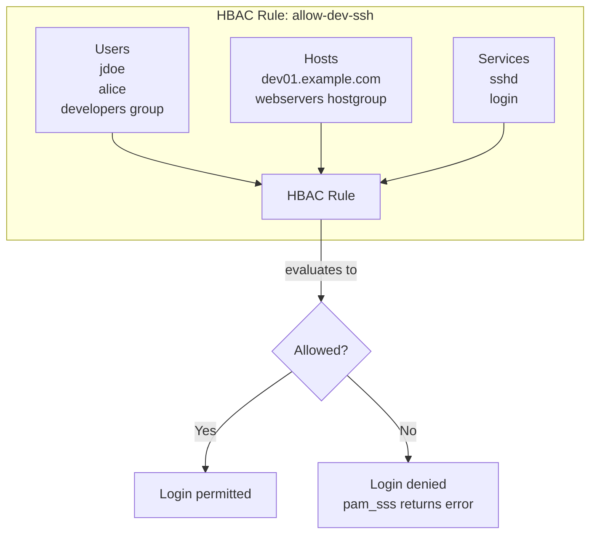
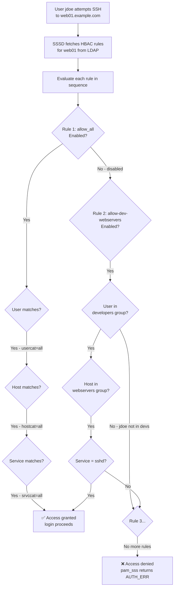
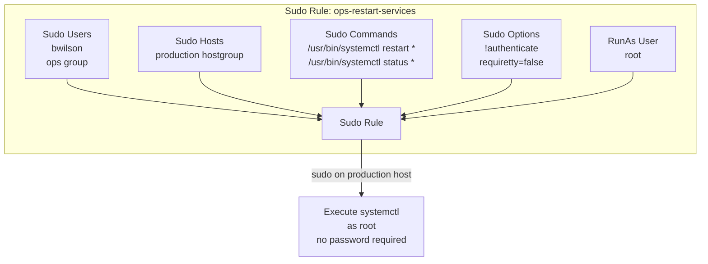
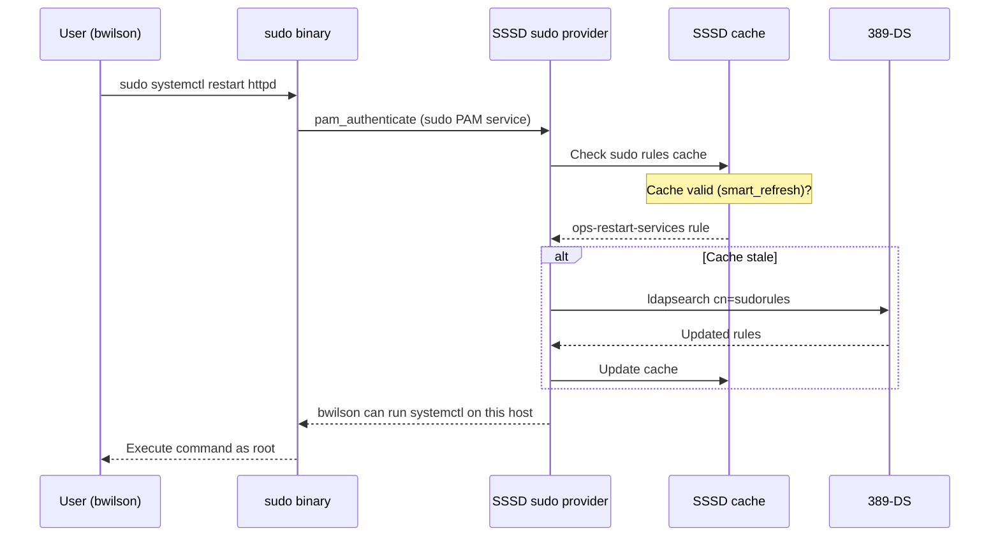

# Module 07 — Sudo Rules and Host-Based Access Control (HBAC)
[](./LICENSE.md)
[](https://access.redhat.com/products/red-hat-enterprise-linux)
[](https://www.freeipa.org)

> Controlling which users can log into which hosts, and what they can run as root.
> HBAC and sudo are two of the most important policy engines in FreeIPA.

## Table of Contents

- [Recommended Background](#recommended-background)
- [Learning Outcomes](#learning-outcomes)
- [1. Host-Based Access Control (HBAC)](#1-host-based-access-control-hbac)
  - [1.1 HBAC Model](#11-hbac-model)
  - [1.2 Default HBAC Behaviour](#12-default-hbac-behaviour)
  - [1.3 Creating HBAC Rules](#13-creating-hbac-rules)
  - [1.4 HBAC Services and Service Groups](#14-hbac-services-and-service-groups)
  - [1.5 HBAC Rule Evaluation](#15-hbac-rule-evaluation)
  - [1.6 Testing HBAC Rules](#16-testing-hbac-rules)
- [2. Sudo Rules](#2-sudo-rules)
  - [2.1 Sudo Rule Model](#21-sudo-rule-model)
  - [2.2 Creating Sudo Rules](#22-creating-sudo-rules)
  - [2.3 Sudo Commands and Command Groups](#23-sudo-commands-and-command-groups)
  - [2.4 Sudo Options](#24-sudo-options)
  - [2.5 Sudo Rule Lookup via SSSD](#25-sudo-rule-lookup-via-sssd)
- [2.6 HBAC and Sudo Precedence](#26-hbac-and-sudo-precedence)
- [3. Lab — HBAC and Sudo Exercises](#3-lab--hbac-and-sudo-exercises)
- [Key Takeaways](#key-takeaways)


---

## Recommended Background

- Complete Modules 00 through 06.
- A set of enrolled hosts, users, and groups to use in policy testing.
- Basic understanding of Linux login flow and sudo behavior.

## Learning Outcomes

By the end of this module, you should be able to:

- Model who can log in to which hosts with HBAC.
- Define sudo rules for controlled privilege escalation.
- Test policy behavior before removing permissive defaults.
- Explain how HBAC and sudo decisions interact during login and command execution.

---

## 1. Host-Based Access Control (HBAC)

### 1.1 HBAC Model

An HBAC rule defines: **who** (users/groups) can access **what** (hosts/hostgroups)
using **which services** (SSH, FTP, login, sudo, etc.).



A rule grants access when **all three conditions match**:
- The user (or their group) is in the rule's user list
- The host is in the rule's host list
- The service being accessed is in the rule's service list

### 1.2 Default HBAC Behaviour

After IPA installation, one default rule exists:

```bash
ipa hbacrule-show allow_all
```

**`allow_all`** — permits every user to access every host via every service.
This is permissive and suitable only for initial setup. In production, you should:

1. Create specific allow rules for your use cases
2. Disable `allow_all`

```bash
# Disable the catch-all rule (do this after creating specific rules!)
ipa hbacrule-disable allow_all
```

> ⚠️ Disabling `allow_all` before creating specific rules **will lock everyone out**
> of all hosts. Always test with `ipa hbactest` first.

### 1.3 Creating HBAC Rules

```bash
# Create a rule allowing developers to SSH to webservers
ipa hbacrule-add allow-dev-webservers \
  --desc="Developers can SSH to web servers"

# Add users to the rule
ipa hbacrule-add-user allow-dev-webservers \
  --users=alice,bob \
  --groups=developers

# Add target hosts
ipa hbacrule-add-host allow-dev-webservers \
  --hosts=web01.example.com \
  --hostgroups=webservers

# Add services (sshd, login)
ipa hbacrule-add-service allow-dev-webservers \
  --hbacsvcs=sshd

# Enable the rule (rules are enabled by default when created)
ipa hbacrule-enable allow-dev-webservers

# Show the rule
ipa hbacrule-show allow-dev-webservers

# List all rules
ipa hbacrule-find
```

**Rule targeting all hosts:**
```bash
# Create a rule that applies to ALL hosts
ipa hbacrule-add allow-admins-everywhere \
  --desc="Admins can access all hosts"
ipa hbacrule-mod allow-admins-everywhere --hostcat=all
ipa hbacrule-mod allow-admins-everywhere --srvccat=all
ipa hbacrule-add-user allow-admins-everywhere --groups=admins
```

### 1.4 HBAC Services and Service Groups

HBAC services correspond to **PAM service names** — the string passed as the first
argument to PAM (`/etc/pam.d/<service-name>`).

```bash
# List built-in HBAC services
ipa hbacsvc-find

# Common services:
# sshd      — SSH logins
# login     — console/TTY logins
# sudo      — sudo privilege escalation
# su        — su command
# vsftpd    — FTP
# httpd     — Apache HTTP basic auth

# Create a custom HBAC service (for a custom PAM-enabled application)
ipa hbacsvc-add myapp --desc="Custom application PAM service"

# Create a service group
ipa hbacsvcgroup-add remote-access --desc="SSH and console access"
ipa hbacsvcgroup-add-member remote-access --hbacsvcs=sshd --hbacsvcs=login

# Use the service group in a rule
ipa hbacrule-add-service allow-dev-webservers \
  --hbacsvcgroups=remote-access
```

### 1.5 HBAC Rule Evaluation



> 📝 HBAC uses **any-match-allow** logic. SSSD evaluates **all** applicable rules
> and grants access if **any single rule** matches all four conditions (user, host,
> service, time). Rule ordering is not guaranteed — there is no first-match
> short-circuit. If no rule grants access, the default is **deny**.

### 1.6 Testing HBAC Rules

Always test rules before disabling `allow_all`:

```bash
# Test if a user can access a host via a service
ipa hbactest \
  --user=jdoe \
  --host=web01.example.com \
  --service=sshd

# Test with a group member
ipa hbactest \
  --user=alice \
  --host=db01.example.com \
  --service=sshd

# Show which rules matched
ipa hbactest \
  --user=admin \
  --host=ipa1.example.com \
  --service=sshd \
  --rules=allow_all,allow-admins-everywhere
```

[↑ Back to TOC](#table-of-contents)

---

## 2. Sudo Rules

### 2.1 Sudo Rule Model

IPA sudo rules define which users can run which commands as which target users on
which hosts.



### 2.2 Creating Sudo Rules

```bash
# Create a sudo rule
ipa sudorule-add ops-restart-services \
  --desc="Ops team can restart services on production"

# Add sudo users
ipa sudorule-add-user ops-restart-services \
  --users=bwilson \
  --groups=ops

# Add target hosts
ipa sudorule-add-host ops-restart-services \
  --hosts=web01.example.com \
  --hostgroups=production

# Add allowed commands
ipa sudorule-add-allow-command ops-restart-services \
  --sudocmds="/usr/bin/systemctl restart httpd" \
  --sudocmdgroups=service-commands

# Set RunAs (who the command runs as — default: root)
ipa sudorule-mod ops-restart-services \
  --runasusercat=all    # can run as any user

# Add sudo options (NOPASSWD, NOEXEC, etc.)
ipa sudorule-add-option ops-restart-services --sudooption="!authenticate"

# Show the rule
ipa sudorule-show ops-restart-services

# List all sudo rules
ipa sudorule-find

# Disable a rule
ipa sudorule-disable ops-restart-services
```

**Rule applying to all hosts:**
```bash
ipa sudorule-add allow-devs-all-hosts
ipa sudorule-mod allow-devs-all-hosts --hostcat=all
ipa sudorule-add-user allow-devs-all-hosts --groups=developers
ipa sudorule-add-allow-command allow-devs-all-hosts --sudocmdgroups=dev-commands
```

### 2.3 Sudo Commands and Command Groups

```bash
# Add individual sudo commands
ipa sudocmd-add "/usr/bin/systemctl restart httpd"
ipa sudocmd-add "/usr/bin/systemctl restart nginx"
ipa sudocmd-add "/usr/bin/systemctl status *"
ipa sudocmd-add "/usr/bin/journalctl *"

# Deny list (explicitly deny a command within a broader allow)
ipa sudocmd-add "/usr/bin/passwd root"

# Create a command group
ipa sudocmdgroup-add service-commands \
  --desc="Service management commands"

ipa sudocmdgroup-add-member service-commands \
  --sudocmds="/usr/bin/systemctl restart httpd" \
  --sudocmds="/usr/bin/systemctl restart nginx" \
  --sudocmds="/usr/bin/journalctl *"

# Add deny commands to the rule
ipa sudorule-add-deny-command ops-restart-services \
  --sudocmds="/usr/bin/passwd root"
```

### 2.4 Sudo Options

Common sudo options you can set on IPA sudo rules:

| Option | Effect |
|--------|--------|
| `!authenticate` | No password required (NOPASSWD) |
| `authenticate` | Password always required |
| `noexec` | Prevent command from spawning subshells/executables |
| `requiretty` | Require TTY (prevents cron sudo) |
| `!requiretty` | Allow sudo without TTY |
| `setenv` | Allow user to set environment variables |
| `env_keep+=VAR` | Preserve specific env vars |

```bash
# Add NOPASSWD to a rule
ipa sudorule-add-option allow-devs --sudooption="!authenticate"

# Add multiple options
ipa sudorule-add-option allow-devs --sudooption="!noexec"
ipa sudorule-add-option allow-devs --sudooption="!requiretty"
```

### 2.5 Sudo Rule Lookup via SSSD



```bash
# (client) Verify sudo rules are fetched
sudo -l -U bwilson           # shows what bwilson can sudo
sudo -l                      # shows what current user can sudo

# (client) Force SSSD sudo cache refresh
sss_cache -s sudo            # invalidate sudo cache
sudo -l                      # will re-fetch from LDAP

# (client) Debug SSSD sudo lookups
# In /etc/sssd/sssd.conf, set debug_level = 9 under [domain/...]
systemctl restart sssd
journalctl -u sssd | grep -i sudo
```

### 2.6 HBAC and Sudo Precedence

HBAC decides whether the user gets a session on the host at all. Sudo rules are evaluated only after login succeeds.

| Scenario | HBAC result | Sudo result | User experience |
|----------|-------------|-------------|-----------------|
| User not allowed to SSH to `web01` | Deny | Not evaluated | Login fails before a shell starts |
| User can log in to `web01` but lacks a sudo rule | Allow | Deny | Login succeeds, `sudo` is denied |
| User can log in and has a matching sudo rule | Allow | Allow | Login succeeds and approved commands work |

```bash
# Example 1: test the login gate first
ipa hbactest --user=jdoe --host=web01.example.com --service=sshd

# Example 2: after a successful login, inspect the sudo policy view
sudo -l
```

> If HBAC denies the session, troubleshooting sudo is wasted effort because the PAM login path never reaches sudo policy evaluation.

[↑ Back to TOC](#table-of-contents)

---

## 3. Lab — HBAC and Sudo Exercises

```bash
# ── SETUP: Create users and groups ──────────────────────────────────────────

kinit admin

ipa user-add alice --first=Alice --last=Dev --password
ipa user-add bob --first=Bob --last=Ops --password
ipa group-add developers
ipa group-add ops
ipa group-add-member developers --users=alice
ipa group-add-member ops --users=bob

ipa hostgroup-add webservers
ipa hostgroup-add dbservers
ipa hostgroup-add-member webservers --hosts=web01.example.com
ipa hostgroup-add-member dbservers --hosts=db01.example.com

# ── HBAC: Restrict access ────────────────────────────────────────────────────

# Create specific rules before disabling allow_all
ipa hbacrule-add allow-devs-web \
  --desc="Developers can SSH to webservers"
ipa hbacrule-add-user allow-devs-web --groups=developers
ipa hbacrule-add-host allow-devs-web --hostgroups=webservers
ipa hbacrule-add-service allow-devs-web --hbacsvcs=sshd

ipa hbacrule-add allow-ops-all \
  --desc="Ops can access all hosts"
ipa hbacrule-mod allow-ops-all --hostcat=all --srvccat=all
ipa hbacrule-add-user allow-ops-all --groups=ops

ipa hbacrule-add allow-admins-all \
  --desc="Admins have full access"
ipa hbacrule-mod allow-admins-all --hostcat=all --srvccat=all
ipa hbacrule-add-user allow-admins-all --groups=admins

# Test BEFORE disabling allow_all
ipa hbactest --user=alice --host=web01.example.com --service=sshd
ipa hbactest --user=alice --host=db01.example.com --service=sshd   # should deny
ipa hbactest --user=bob --host=db01.example.com --service=sshd     # should allow
ipa hbactest --user=admin --host=ipa1.example.com --service=sshd    # should allow

# Only disable allow_all after tests pass
ipa hbacrule-disable allow_all

# Verify again
ipa hbactest --user=alice --host=web01.example.com --service=sshd

# ── SUDO: Service management for ops team ───────────────────────────────────

# Create sudo commands
ipa sudocmd-add "/usr/bin/systemctl restart httpd"
ipa sudocmd-add "/usr/bin/systemctl restart nginx"
ipa sudocmd-add "/usr/bin/journalctl -u httpd"

# Create command group
ipa sudocmdgroup-add web-service-commands
ipa sudocmdgroup-add-member web-service-commands \
  --sudocmds="/usr/bin/systemctl restart httpd" \
  --sudocmds="/usr/bin/systemctl restart nginx" \
  --sudocmds="/usr/bin/journalctl -u httpd"

# Create sudo rule
ipa sudorule-add ops-web-restart
ipa sudorule-add-user ops-web-restart --groups=ops
ipa sudorule-add-host ops-web-restart --hostgroups=webservers
ipa sudorule-add-allow-command ops-web-restart \
  --sudocmdgroups=web-service-commands
ipa sudorule-add-option ops-web-restart --sudooption="!authenticate"

# On a web client, verify bob can sudo:
# (client) su - bob
# (client) sudo systemctl restart httpd   # should work
# (client) sudo -l                         # shows allowed commands

# ── CLEANUP: Re-enable allow_all if needed for testing ──────────────────────

# ipa hbacrule-enable allow_all
```


---

## Key Takeaways

- HBAC gates session access before sudo rules are even considered.
- Policy testing with hbactest and sudo -l prevents broad accidental lockouts.
- Host groups and user groups keep policy manageable as environments grow.
- These policy patterns feed directly into later delegation and trust scenarios.

[↑ Back to TOC](#table-of-contents)

---

*Licensed under [CC BY-NC-SA 4.0](LICENSE.md) · © 2026 UncleJS*