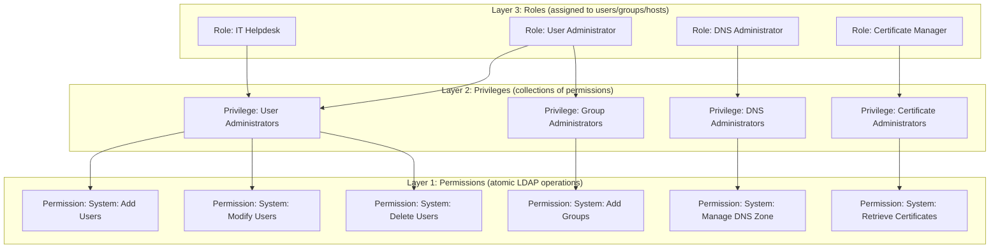
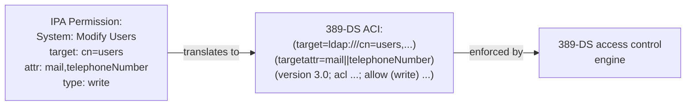
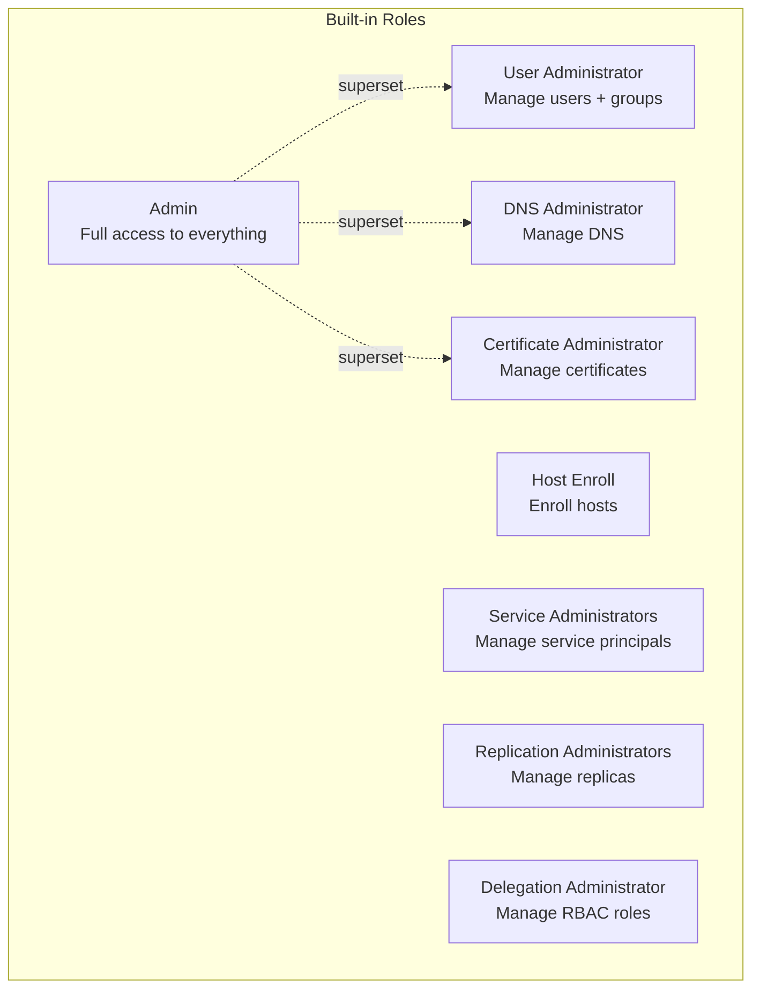
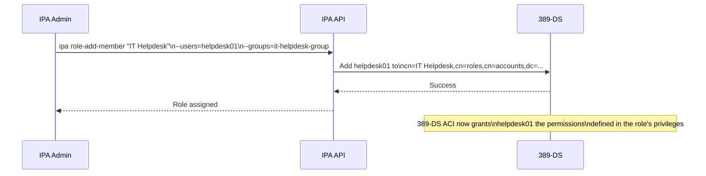
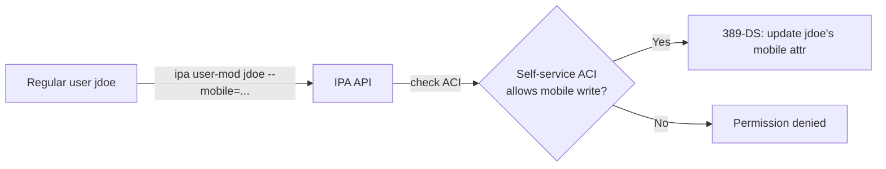
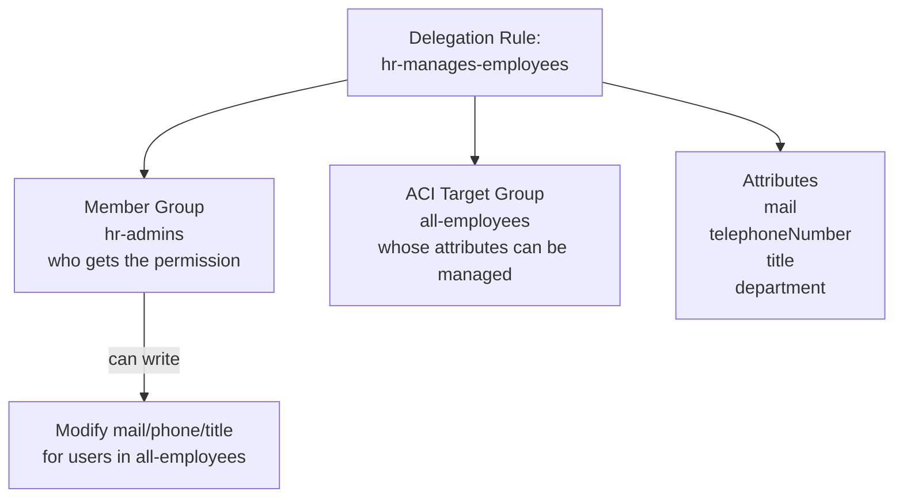
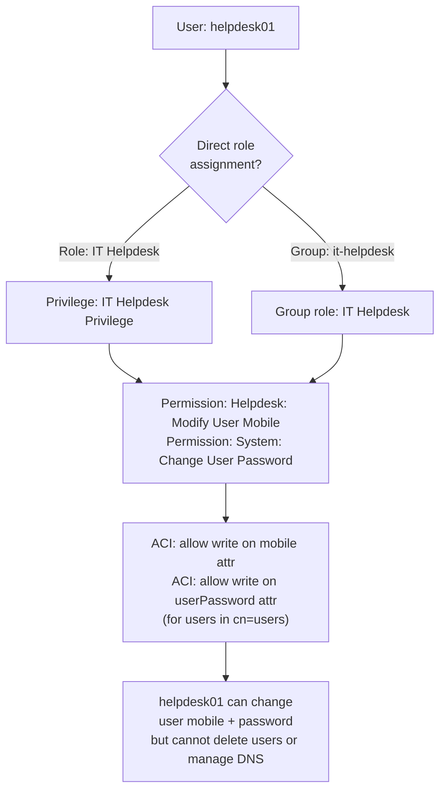
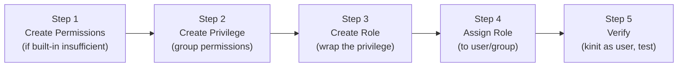

# Module 08 — RBAC and Delegation Deep-Dive

> FreeIPA's Role-Based Access Control system: permissions, privileges, roles, ACIs,
> self-service rules, and delegation. Understand how to build fine-grained custom
> administrative roles.

## Table of Contents

- [1. RBAC Overview](#1-rbac-overview)
  - [1.1 The Three-Layer Model](#11-the-three-layer-model)
  - [1.2 How RBAC Differs from HBAC](#12-how-rbac-differs-from-hbac)
- [2. Permissions](#2-permissions)
  - [2.1 What a Permission Is](#21-what-a-permission-is)
  - [2.2 Built-in Permissions](#22-built-in-permissions)
  - [2.3 Creating Custom Permissions](#23-creating-custom-permissions)
  - [2.4 ACI Structure in 389-DS](#24-aci-structure-in-389-ds)
- [3. Privileges](#3-privileges)
  - [3.1 Built-in Privileges](#31-built-in-privileges)
  - [3.2 Creating Custom Privileges](#32-creating-custom-privileges)
- [4. Roles](#4-roles)
  - [4.1 Built-in Roles](#41-built-in-roles)
  - [4.2 Creating Custom Roles](#42-creating-custom-roles)
  - [4.3 Assigning Roles](#43-assigning-roles)
- [5. Self-Service Permissions](#5-self-service-permissions)
- [6. Delegation](#6-delegation)
  - [6.1 Delegation Rules](#61-delegation-rules)
  - [6.2 Effective Permissions for a User](#62-effective-permissions-for-a-user)
- [7. Building a Custom Role — End to End](#7-building-a-custom-role--end-to-end)
- [8. Lab — RBAC Exercises](#8-lab--rbac-exercises)

---

## 1. RBAC Overview

### 1.1 The Three-Layer Model

FreeIPA RBAC uses a strict three-layer hierarchy:



| Layer | What it is | Who uses it |
|-------|-----------|-------------|
| **Permission** | An atomic LDAP ACI — e.g., "can write `mail` attribute of users in `cn=users`" | Never assigned directly |
| **Privilege** | A named collection of related permissions | Never assigned directly |
| **Role** | A named collection of privileges, assigned to users/groups | Assigned to principals |

### 1.2 How RBAC Differs from HBAC

| | RBAC | HBAC |
|--|------|------|
| **Controls** | Who can administer IPA itself | Who can log into managed hosts |
| **Enforcement point** | IPA API (httpd / 389-DS ACIs) | SSSD on client hosts |
| **Examples** | "Can create users", "Can manage DNS zones" | "Can SSH to webservers", "Can sudo systemctl" |
| **Applies to** | IPA administrators | End users |

[↑ Back to TOC](#table-of-contents)

---

## 2. Permissions

### 2.1 What a Permission Is

A permission is a thin wrapper around a **389-DS ACI (Access Control Instruction)**.
When you create a permission, FreeIPA writes an ACI into the LDAP directory that
grants a specific operation on a specific set of LDAP objects.



### 2.2 Built-in Permissions

FreeIPA ships with hundreds of built-in permissions. View them:

```bash
# List all permissions
ipa permission-find | head -80

# Search by name
ipa permission-find --name="*user*"

# Show a specific permission
ipa permission-show "System: Add Users"

# Example output:
# Permission name: System: Add Users
# Granted to privilege: User Administrators
# Subtree: cn=users,cn=accounts,dc=example,dc=com
# ACI type: permission
# Permissions: add
# Object type: user
```

### 2.3 Creating Custom Permissions

```bash
# Create a permission to allow writing the 'mobile' attribute of users
ipa permission-add "Helpdesk: Modify User Mobile" \
  --right=write \
  --attr=mobile \
  --type=user

# Create a permission to allow reading service details
ipa permission-add "ReadOnly: View Services" \
  --right=read \
  --type=service \
  --attr=krbprincipalname,krbcanonicalname,managedby

# Create a permission scoped to a specific subtree
ipa permission-add "Dept: Manage Dept01 Users" \
  --right=write \
  --attr=mail,telephoneNumber,title \
  --subtree="cn=users,cn=accounts,dc=example,dc=com" \
  --filter="(departmentNumber=01)"

# Show the permission
ipa permission-show "Helpdesk: Modify User Mobile"

# List permissions for a privilege
ipa privilege-show "User Administrators"
```

**Permission rights:**
| Right | LDAP operation | Example |
|-------|---------------|---------|
| `add` | Create new objects | Add a user |
| `delete` | Remove objects | Delete a host |
| `write` | Modify attributes | Change email |
| `read` | Read attributes | View user details |
| `search` | Search the directory | Find users |
| `compare` | Compare attribute value | Bind operations |

### 2.4 ACI Structure in 389-DS

Understanding the underlying ACI syntax helps when debugging permission issues:

```mermaid
graph TD
    ACI["389-DS ACI string:\n(targetattr = \"mail || telephoneNumber\")\n(target = \"ldap:///cn=users,cn=accounts,dc=example,dc=com\")\n(version 3.0;\nacl \"permission:Helpdesk: Modify User Mobile\";\nallow (write)\ngroupdn = \"ldap:///cn=Helpdesk: Modify User Mobile,cn=permissions,cn=pbac,dc=example,dc=com\"\n)"] --> T[Target:\nwhat LDAP objects]
    ACI --> A[Targetattr:\nwhich attributes]
    ACI --> P[Principal:\nwho is allowed]
    ACI --> O[Operation:\nadd/delete/write/read]
```

```bash
# View ACIs on the users container (389-DS level)
ldapsearch -Y GSSAPI \
  -b "cn=users,cn=accounts,dc=example,dc=com" \
  -s base "(objectClass=*)" aci

# View all ACIs in the PBAC container
ldapsearch -Y GSSAPI \
  -b "cn=pbac,dc=example,dc=com" \
  -s sub "(objectClass=groupofnames)" cn member
```

[↑ Back to TOC](#table-of-contents)

---

## 3. Privileges

### 3.1 Built-in Privileges

```bash
# List all privileges
ipa privilege-find

# Key built-in privileges:
# "User Administrators"        — full user management
# "Group Administrators"       — full group management
# "Host Administrators"        — manage hosts
# "Service Administrators"     — manage service principals
# "DNS Administrators"         — manage DNS zones and records
# "Certificate Administrators" — manage certificates
# "HBAC Administrator"         — manage HBAC rules
# "Sudo Administrator"         — manage sudo rules

# Show all permissions in a privilege
ipa privilege-show "User Administrators"
ipa privilege-show "DNS Administrators"
```

### 3.2 Creating Custom Privileges

```bash
# Create a privilege for a helpdesk team
ipa privilege-add "IT Helpdesk Privilege" \
  --desc="Limited user management for helpdesk staff"

# Add permissions to the privilege
ipa privilege-add-permission "IT Helpdesk Privilege" \
  --permissions="Helpdesk: Modify User Mobile" \
  --permissions="System: Modify Users" \
  --permissions="System: Change User password"

# Remove a permission from a privilege
ipa privilege-remove-permission "IT Helpdesk Privilege" \
  --permissions="System: Modify Users"

# Show the privilege
ipa privilege-show "IT Helpdesk Privilege"
```

[↑ Back to TOC](#table-of-contents)

---

## 4. Roles

### 4.1 Built-in Roles



```bash
# List all roles
ipa role-find

# Show a role's privileges and members
ipa role-show "User Administrator"
```

### 4.2 Creating Custom Roles

```bash
# Create a custom role
ipa role-add "IT Helpdesk" \
  --desc="Helpdesk staff with limited user management"

# Add privileges to the role
ipa role-add-privilege "IT Helpdesk" \
  --privileges="IT Helpdesk Privilege"

# You can also add built-in privileges
ipa role-add-privilege "IT Helpdesk" \
  --privileges="HBAC Administrator"

# Show the role
ipa role-show "IT Helpdesk"
```

### 4.3 Assigning Roles

Roles can be assigned to users, groups, hosts, or host groups:



```bash
# Assign role to a user
ipa role-add-member "IT Helpdesk" --users=helpdesk01

# Assign role to a group
ipa role-add-member "IT Helpdesk" --groups=it-helpdesk-group

# Assign role to a host (for service accounts)
ipa role-add-member "Certificate Administrator" --hosts=certbot.example.com

# Remove a member from a role
ipa role-remove-member "IT Helpdesk" --users=helpdesk01

# Show role members
ipa role-show "IT Helpdesk"
```

[↑ Back to TOC](#table-of-contents)

---

## 5. Self-Service Permissions

Self-service permissions allow **regular users** to modify their own LDAP attributes
without requiring admin rights. These are stored in `cn=selfservice,cn=configuration`.

```bash
# List existing self-service permissions
ipa selfservice-find

# Built-in: "Users can manage their own name, phone, etc."
ipa selfservice-show "Users can manage their own name, phone, etc."

# Create a self-service permission to allow users to update their SSH key
ipa selfservice-add "Users can manage their own SSH keys" \
  --permissions=write \
  --attrs=ipasshpubkey

# Create a permission for users to update their own mobile number
ipa selfservice-add "Users can update their mobile number" \
  --permissions=write \
  --attrs=mobile

# Show what attributes users can self-modify
ipa selfservice-find --all
```



[↑ Back to TOC](#table-of-contents)

---

## 6. Delegation

### 6.1 Delegation Rules

Delegation allows one group of users to manage LDAP attributes of another group of
users. This is different from roles — it is a direct user-to-user (or group-to-group)
permission grant, not mediated through privileges/roles.



```bash
# Create a delegation rule
# --group: group that GETS permission
# --memberof: group BEING managed (target group)
ipa delegation-add "HR manages employee contacts" \
  --group=hr-admins \
  --memberof=all-employees \
  --attrs=mail,telephoneNumber,title,departmentNumber

# Show the delegation rule
ipa delegation-show "HR manages employee contacts"

# List all delegation rules
ipa delegation-find

# Modify a delegation rule (add more attributes)
ipa delegation-mod "HR manages employee contacts" \
  --attrs=mail,telephoneNumber,title,departmentNumber,employeeNumber

# Delete a delegation rule
ipa delegation-del "HR manages employee contacts"
```

### 6.2 Effective Permissions for a User

To understand what a user can do in IPA, trace their membership through roles:



```bash
# Show all roles a user has (directly or via group)
ipa user-show helpdesk01 --all | grep -i "member of"

# Show a role's privileges
ipa role-show "IT Helpdesk" | grep -i privilege

# Show a privilege's permissions
ipa privilege-show "IT Helpdesk Privilege" | grep -i permission

# Show a permission's ACI
ipa permission-show "Helpdesk: Modify User Mobile" --all

# Test: Try an operation as helpdesk01 (use kinit)
kinit helpdesk01
ipa user-mod jdoe --mobile="+1 555-9999"   # should work
ipa user-del jdoe                          # should fail (permission denied)
kinit admin                                # switch back
```

[↑ Back to TOC](#table-of-contents)

---

## 7. Building a Custom Role — End to End

A complete walkthrough: create a DNS-only administrator role.



```bash
# ── Step 1: Permissions (use built-in DNS permissions) ───────────────────────

ipa permission-find --name="*DNS*"
# Built-in:
# "System: Add DNS Entries"
# "System: Remove DNS Entries"
# "System: Update DNS Entries"
# "System: Read DNS Entries"

# ── Step 2: Create a custom privilege ───────────────────────────────────────

ipa privilege-add "DNS Zone Operator" \
  --desc="Can manage DNS zones and records but not IPA server config"

ipa privilege-add-permission "DNS Zone Operator" \
  --permissions="System: Add DNS Entries" \
  --permissions="System: Remove DNS Entries" \
  --permissions="System: Update DNS Entries" \
  --permissions="System: Read DNS Entries"

# ── Step 3: Create the role ──────────────────────────────────────────────────

ipa role-add "DNS Zone Operator" \
  --desc="DNS management role — cannot modify users or hosts"

ipa role-add-privilege "DNS Zone Operator" \
  --privileges="DNS Zone Operator"

# ── Step 4: Assign to user/group ─────────────────────────────────────────────

ipa role-add-member "DNS Zone Operator" --users=dnsadmin
ipa role-add-member "DNS Zone Operator" --groups=network-team

# ── Step 5: Verify ───────────────────────────────────────────────────────────

kinit dnsadmin
ipa dnsrecord-add example.com testhost --a-rec=192.168.1.99   # should work
ipa user-add testuser --first=Test --last=User                # should FAIL
kinit admin
ipa dnsrecord-del example.com testhost --a-rec=192.168.1.99
```

[↑ Back to TOC](#table-of-contents)

---

## 8. Lab — RBAC Exercises

```bash
# ── SETUP ────────────────────────────────────────────────────────────────────

kinit admin

# Create test users
ipa user-add helpdesk01 --first=Help --last=Desk --password
ipa user-add dnsop01 --first=DNS --last=Operator --password

# Create groups
ipa group-add helpdesk-staff
ipa group-add dns-ops
ipa group-add-member helpdesk-staff --users=helpdesk01
ipa group-add-member dns-ops --users=dnsop01

# ── EXERCISE 1: Self-service permission ──────────────────────────────────────

ipa selfservice-add "Users manage their own mobile" \
  --permissions=write \
  --attrs=mobile

# Test as a regular user
kinit helpdesk01
ipa user-mod helpdesk01 --mobile="+1 555-0001"  # should work (self-service)
ipa user-mod dnsop01 --mobile="+1 555-0002"     # should fail
kinit admin

# ── EXERCISE 2: Custom permission ────────────────────────────────────────────

ipa permission-add "Helpdesk: Reset User Password" \
  --right=write \
  --attr=userpassword \
  --type=user

ipa permission-add "Helpdesk: View Users" \
  --right=read \
  --right=search \
  --type=user \
  --attr=uid,givenname,sn,mail,mobile,telephoneNumber

# ── EXERCISE 3: Custom privilege ─────────────────────────────────────────────

ipa privilege-add "Helpdesk Staff Privilege" \
  --desc="Password reset and user viewing"

ipa privilege-add-permission "Helpdesk Staff Privilege" \
  --permissions="Helpdesk: Reset User Password" \
  --permissions="Helpdesk: View Users"

# ── EXERCISE 4: Custom role ───────────────────────────────────────────────────

ipa role-add "IT Helpdesk" --desc="Helpdesk staff role"
ipa role-add-privilege "IT Helpdesk" \
  --privileges="Helpdesk Staff Privilege"
ipa role-add-member "IT Helpdesk" --groups=helpdesk-staff

# ── EXERCISE 5: Verify ───────────────────────────────────────────────────────

kinit helpdesk01
ipa user-show dnsop01              # should work (view)
ipa passwd dnsop01                 # should work (reset password)
ipa user-del dnsop01               # should FAIL
ipa dnsrecord-find example.com     # should FAIL (no DNS permission)
kinit admin

# ── EXERCISE 6: DNS operator role ─────────────────────────────────────────────

ipa privilege-add "DNS Operator Privilege"
ipa privilege-add-permission "DNS Operator Privilege" \
  --permissions="System: Add DNS Entries" \
  --permissions="System: Remove DNS Entries" \
  --permissions="System: Update DNS Entries" \
  --permissions="System: Read DNS Entries"

ipa role-add "DNS Operator"
ipa role-add-privilege "DNS Operator" --privileges="DNS Operator Privilege"
ipa role-add-member "DNS Operator" --groups=dns-ops

kinit dnsop01
ipa dnsrecord-add example.com lab-test --a-rec=192.168.1.99  # should work
ipa user-add baduser --first=Bad --last=User                  # should FAIL
kinit admin
ipa dnsrecord-del example.com lab-test --a-rec=192.168.1.99
```

[↑ Back to TOC](#table-of-contents)
