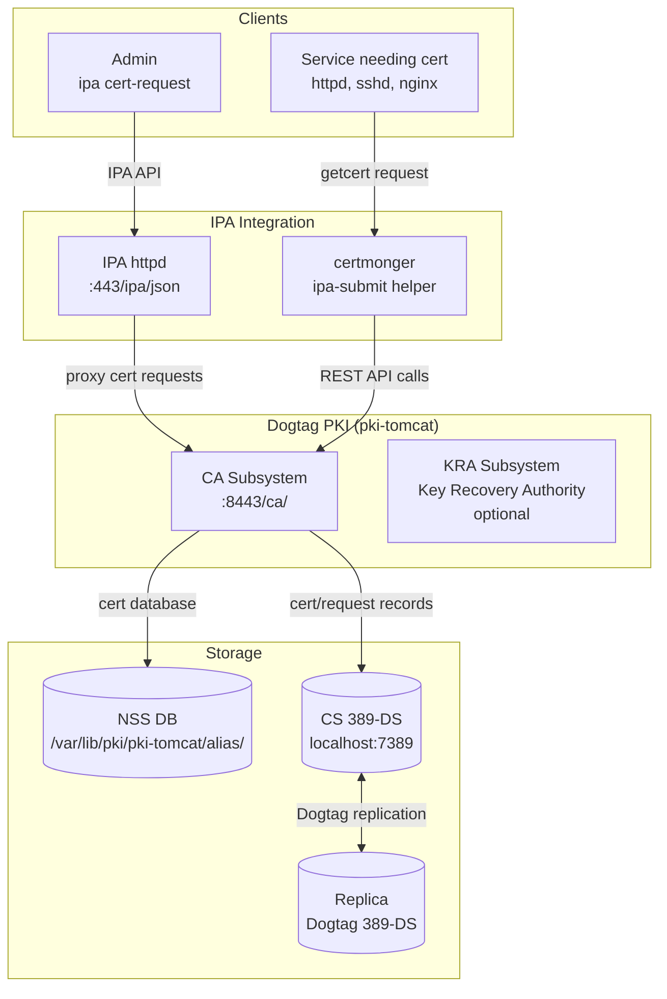
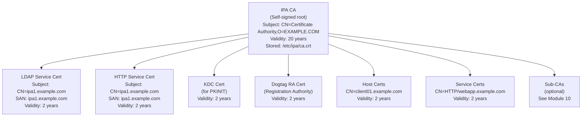
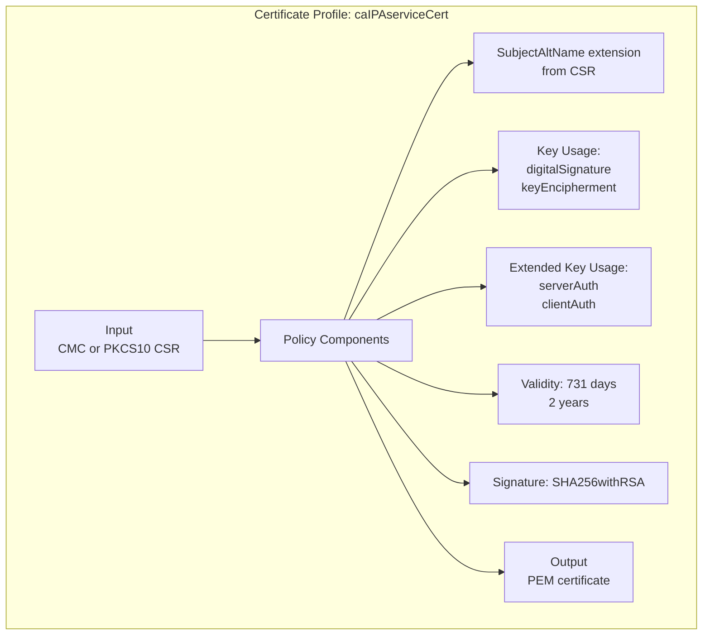
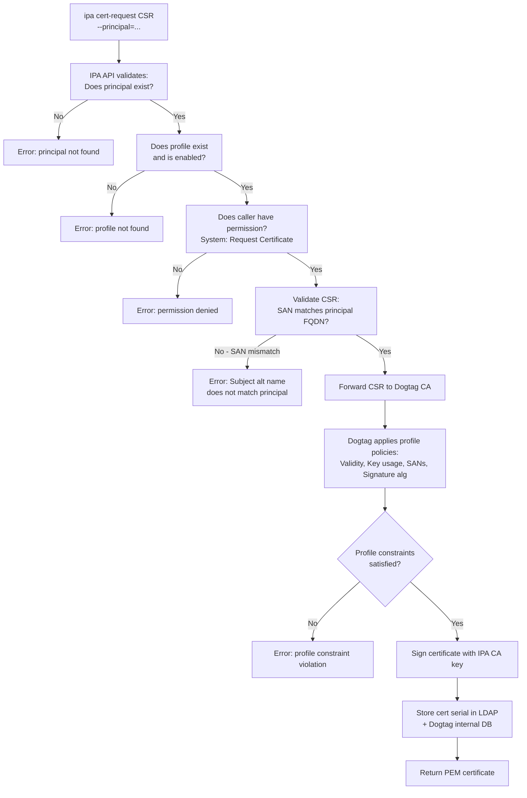
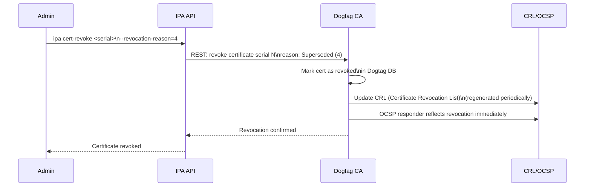
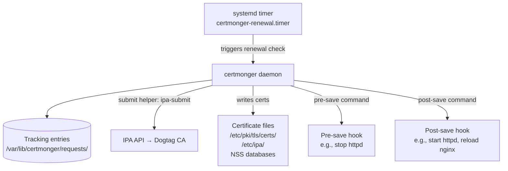
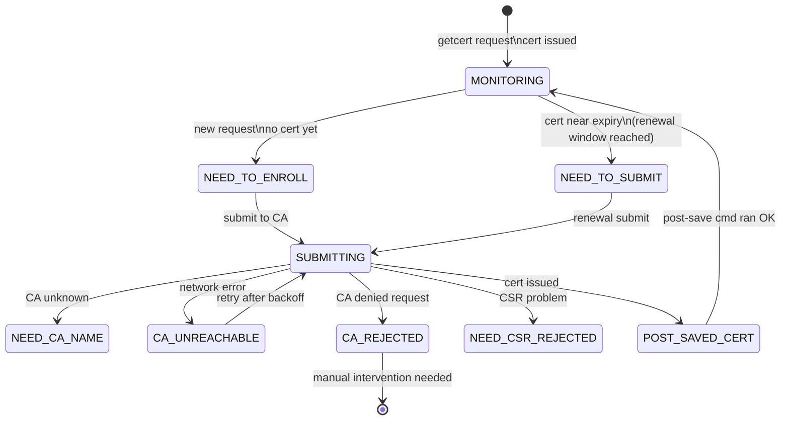
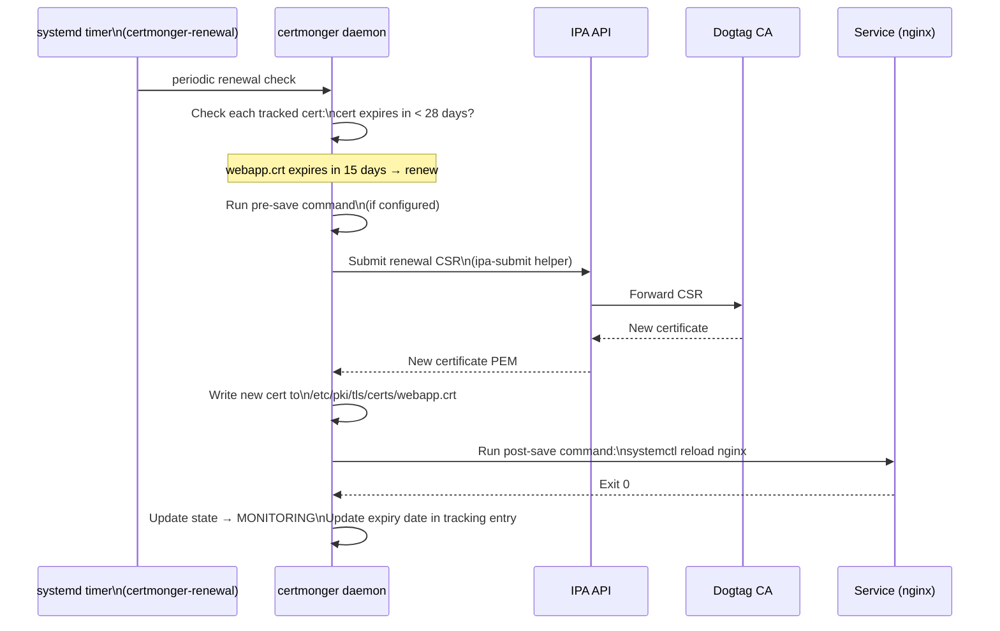
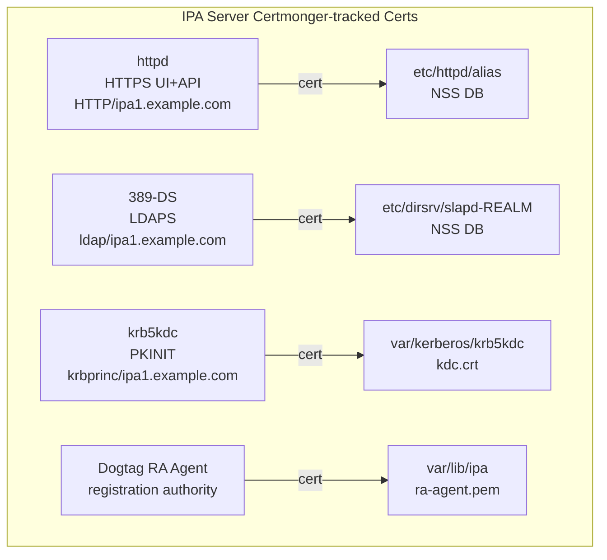

# Module 09 — Certificate Management: Fundamentals
[](./LICENSE.md)
[](https://access.redhat.com/products/red-hat-enterprise-linux)
[](https://www.freeipa.org)

> The FreeIPA integrated CA (Dogtag PKI), certificate profiles, requesting and
> managing certificates with `ipa cert-*`, and automating renewal with Certmonger.
>
> 🔁 Certificate topics referenced in other modules:
> - Modules 02, 05: host certs issued during install/enrollment
> - Module 04: PKINIT (cert-based Kerberos auth)
> - Module 10: sub-CAs, ACME, external CA, OCSP, FIPS

## Table of Contents

- [1. Dogtag CA Architecture](#1-dogtag-ca-architecture)
  - [1.1 Components](#11-components)
  - [1.2 IPA CA Certificate Chain](#12-ipa-ca-certificate-chain)
- [2. Certificate Profiles](#2-certificate-profiles)
  - [2.1 Built-in Profiles](#21-built-in-profiles)
  - [2.2 Profile Structure](#22-profile-structure)
- [3. Requesting Certificates with ipa cert-request](#3-requesting-certificates-with-ipa-cert-request)
  - [3.1 Generating a CSR](#31-generating-a-csr)
  - [3.2 Requesting a Certificate](#32-requesting-a-certificate)
  - [3.3 Certificate Issuance Decision Path](#33-certificate-issuance-decision-path)
- [4. Managing Certificates](#4-managing-certificates)
  - [4.1 Listing and Viewing Certificates](#41-listing-and-viewing-certificates)
  - [4.2 Revoking Certificates](#42-revoking-certificates)
- [5. Certmonger](#5-certmonger)
  - [5.1 What Certmonger Does](#51-what-certmonger-does)
  - [5.2 Certmonger State Machine](#52-certmonger-state-machine)
  - [5.3 Tracking Certificates](#53-tracking-certificates)
  - [5.4 Renewal Cycle](#54-renewal-cycle)
  - [5.5 Pre-save and Post-save Commands](#55-pre-save-and-post-save-commands)
- [6. IPA Service Certificates](#6-ipa-service-certificates)
  - [6.1 Built-in IPA Certs](#61-built-in-ipa-certs)
  - [6.2 Adding a Certificate to a Custom Service](#62-adding-a-certificate-to-a-custom-service)
- [7. Propagating CA Certificate Changes](#7-propagating-ca-certificate-changes)
- [8. Lab — Certificate Operations](#8-lab--certificate-operations)

---

## 1. Dogtag CA Architecture

### 1.1 Components

Dogtag PKI is an enterprise certificate authority embedded in FreeIPA. It runs
as a Tomcat web application and exposes both a REST API and a web admin interface.



### 1.2 IPA CA Certificate Chain



[↑ Back to TOC](#table-of-contents)

---

## 2. Certificate Profiles

### 2.1 Built-in Profiles

| Profile ID | Purpose | Key usage |
|------------|---------|-----------|
| `caIPAserviceCert` | Default service/host TLS cert | Digital signature, Key encipherment |
| `IECUserRoles` | User certificates with roles | Digital signature |
| `caServerCert` | Server certificates | Digital signature, Key encipherment |
| `caCACert` | Sub-CA certificates | CA:TRUE, key cert sign |
| `KDCs_PKINIT_Certs` | KDC PKINIT certificate | id-pkinit-KPKdc |
| `acmeIPAServerCert` | ACME-issued server certs | Digital signature, Key encipherment |

```bash
# List all certificate profiles
ipa certprofile-find

# Show a profile's details
ipa certprofile-show caIPAserviceCert

# Show the profile configuration file
ipa certprofile-show caIPAserviceCert --out /tmp/profile.cfg
cat /tmp/profile.cfg
```

### 2.2 Profile Structure

A certificate profile configuration file controls every aspect of the issued cert:



Key profile configuration parameters:

```ini
# Excerpt from caIPAserviceCert profile
profileId=caIPAserviceCert
desc=Standard profile for IPA service certs

# Validity
policyset.serverCertSet.1.constraint.class_id=noConstraintImpl
policyset.serverCertSet.2.default.class_id=validityDefaultImpl
policyset.serverCertSet.2.default.params.range=731   # days

# Key usage
policyset.serverCertSet.7.default.params.keyUsageCritical=true
policyset.serverCertSet.7.default.params.keyUsageDigitalSignature=true
policyset.serverCertSet.7.default.params.keyUsageKeyEncipherment=true

# Extended key usage
policyset.serverCertSet.8.default.params.exKeyUsageOIDs=1.3.6.1.5.5.7.3.1,1.3.6.1.5.5.7.3.2
# serverAuth, clientAuth
```

[↑ Back to TOC](#table-of-contents)

---

## 3. Requesting Certificates with ipa cert-request

### 3.1 Generating a CSR

Before requesting a certificate from IPA, you need a Certificate Signing Request (CSR):

```bash
# Generate a private key and CSR for a service
openssl req -newkey rsa:4096 -nodes \
  -keyout /etc/pki/tls/private/webapp.key \
  -out /tmp/webapp.csr \
  -subj "/CN=webapp.example.com"

# Or use a config file to include SANs
cat > /tmp/webapp-openssl.cnf << 'EOF'
[req]
default_bits = 4096
prompt = no
default_md = sha256
distinguished_name = dn
req_extensions = req_ext

[dn]
CN = webapp.example.com

[req_ext]
subjectAltName = @alt_names

[alt_names]
DNS.1 = webapp.example.com
DNS.2 = webapp
IP.1 = 192.168.1.25
EOF

openssl req -newkey rsa:4096 -nodes \
  -keyout /etc/pki/tls/private/webapp.key \
  -out /tmp/webapp.csr \
  -config /tmp/webapp-openssl.cnf

# Verify the CSR
openssl req -verify -in /tmp/webapp.csr -noout -text | grep -A5 "Subject Alternative"
```

### 3.2 Requesting a Certificate

```bash
# Request a certificate for a service principal
kinit admin
ipa cert-request /tmp/webapp.csr \
  --principal=HTTP/webapp.example.com \
  --profile-id=caIPAserviceCert \
  --certificate-out=/etc/pki/tls/certs/webapp.crt

# Verify the issued certificate
openssl x509 -in /etc/pki/tls/certs/webapp.crt -text -noout \
  | grep -E "(Subject:|Issuer:|Not Before|Not After|DNS:)"

# Request a user certificate
ipa cert-request /tmp/jdoe.csr \
  --principal=jdoe \
  --profile-id=IECUserRoles \
  --certificate-out=/home/jdoe/jdoe.crt
```

### 3.3 Certificate Issuance Decision Path



[↑ Back to TOC](#table-of-contents)

---

## 4. Managing Certificates

### 4.1 Listing and Viewing Certificates

```bash
# List all certificates issued by IPA CA
ipa cert-find

# Filter by principal
ipa cert-find --subject=webapp.example.com

# Filter by validity
ipa cert-find --validnotafter-from=2026-01-01

# Show a specific certificate (by serial number)
ipa cert-show 42

# Show certificate in PEM format
ipa cert-show 42 --certificate-out=/tmp/cert42.pem
openssl x509 -in /tmp/cert42.pem -text -noout

# Find certificates expiring within 30 days
ipa cert-find --validnotafter-to=$(date -d "+30 days" +%Y-%m-%d)

# Show all certs for a host
ipa host-show web01.example.com --all | grep -i "certificate:"
```

### 4.2 Revoking Certificates



**Revocation reason codes:**

| Code | Reason | Use case |
|------|--------|---------|
| 0 | Unspecified | General revocation |
| 1 | Key Compromise | Private key exposed |
| 2 | CA Compromise | CA key exposed |
| 3 | Affiliation Changed | User moved to different org |
| 4 | Superseded | Cert replaced by new one |
| 5 | Cessation of Operation | Service decommissioned |
| 6 | Certificate Hold | Temporary (can be restored) |
| 9 | Remove from CRL | Remove hold |

```bash
# Revoke a certificate by serial number
ipa cert-revoke 42 --revocation-reason=4

# Find and revoke all certs for a decommissioned service
ipa cert-find --subject=oldservice.example.com \
  | grep "Serial number:" \
  | awk '{print $3}' \
  | while read serial; do
      ipa cert-revoke "$serial" --revocation-reason=5
    done

# Check revocation status with OCSP
openssl ocsp \
  -issuer /etc/ipa/ca.crt \
  -cert /etc/pki/tls/certs/webapp.crt \
  -url http://ipa1.example.com/ca/ocsp
```

[↑ Back to TOC](#table-of-contents)

---

## 5. Certmonger

### 5.1 What Certmonger Does

Certmonger is a daemon that **requests, stores, tracks, and auto-renews** certificates.
It runs on both the IPA server (managing IPA's own service certs) and on all
enrolled clients (managing host and service certs).



### 5.2 Certmonger State Machine

Each tracked certificate moves through a state machine:



| State | Meaning |
|-------|---------|
| `MONITORING` | Cert is valid, certmonger is watching expiry |
| `NEED_TO_SUBMIT` | Cert is within renewal window (default: 28 days before expiry) |
| `SUBMITTING` | Request sent to CA, waiting for response |
| `CA_UNREACHABLE` | Cannot reach CA, will retry |
| `CA_REJECTED` | CA refused the request (check logs) |
| `POST_SAVED_CERT` | Cert saved, running post-save command |

```bash
# View all tracked certificates and their states
getcert list

# Compact view showing only state and subject
getcert list | grep -E "(Request ID|status|subject)"

# View a specific tracking entry
getcert list -i 20240101120000   # by request ID

# Check for any non-MONITORING states (potential problems)
getcert list | grep -v "status: MONITORING"
```

### 5.3 Tracking Certificates

```bash
# Track an existing certificate file (already have key + cert)
getcert start-tracking \
  -f /etc/pki/tls/certs/webapp.crt \
  -k /etc/pki/tls/private/webapp.key \
  -p HTTP/webapp.example.com \
  -c IPA

# Request a NEW certificate and start tracking it
getcert request \
  -f /etc/pki/tls/certs/myservice.crt \
  -k /etc/pki/tls/private/myservice.key \
  -N CN=myservice.example.com \
  -D myservice.example.com \
  -K host/myservice.example.com \
  -T caIPAserviceCert \
  -C "systemctl reload nginx"    # post-save command

# Track a certificate in an NSS database
getcert request \
  -d /etc/dirsrv/slapd-EXAMPLE-COM \
  -n "Server-Cert" \
  -K ldap/ipa1.example.com \
  -T caIPAserviceCert

# Stop tracking a certificate (does NOT revoke it)
getcert stop-tracking -f /etc/pki/tls/certs/webapp.crt
```

### 5.4 Renewal Cycle



### 5.5 Pre-save and Post-save Commands

```bash
# Set a post-save command on an existing tracking entry
getcert start-tracking \
  -f /etc/pki/tls/certs/webapp.crt \
  -k /etc/pki/tls/private/webapp.key \
  -C "systemctl reload nginx"    # runs after cert is saved

# Example post-save commands for common services:
# Apache: systemctl reload httpd
# nginx: systemctl reload nginx
# HAProxy: systemctl reload haproxy
# 389-DS: restart-dirsrv EXAMPLE-COM (done by IPA automatically)
# Dogtag: pki-server subsystem-enable ca (done by IPA automatically)

# Force immediate renewal (don't wait for expiry window)
getcert resubmit -f /etc/pki/tls/certs/webapp.crt

# Resubmit by request ID
getcert resubmit -i 20240101120000
```

[↑ Back to TOC](#table-of-contents)

---

## 6. IPA Service Certificates

### 6.1 Built-in IPA Certs

The IPA server itself has several certificates managed by certmonger:

```bash
# View all certs tracked by certmonger on the IPA server
getcert list

# Typical tracked certs on an IPA server:
# /etc/httpd/alias   - HTTPD (Web UI + API) cert
# /etc/dirsrv/slapd-EXAMPLE-COM - LDAP service cert
# /var/lib/ipa/ra-agent.pem - Dogtag RA agent cert
# /var/kerberos/krb5kdc/kdc.crt - KDC PKINIT cert
# /var/lib/ipa/certs/httpd.crt - another HTTP cert
```



### 6.2 Adding a Certificate to a Custom Service

```bash
# (server) Create the service principal first
ipa service-add HTTP/webapp.example.com

# (client) Request and track the certificate using certmonger
getcert request \
  -f /etc/pki/tls/certs/webapp.crt \
  -k /etc/pki/tls/private/webapp.key \
  -N CN=webapp.example.com \
  -D webapp.example.com \
  -K HTTP/webapp.example.com \
  -T caIPAserviceCert \
  -C "systemctl reload httpd"

# Wait for issuance (or force)
getcert list -f /etc/pki/tls/certs/webapp.crt
# Status should change: SUBMITTING → POST_SAVED_CERT → MONITORING

# Verify the certificate
openssl x509 -in /etc/pki/tls/certs/webapp.crt -text -noout \
  | grep -E "(Subject:|Issuer:|Not Before|Not After)"
```

[↑ Back to TOC](#table-of-contents)

---

## 7. Propagating CA Certificate Changes

When the IPA CA certificate is renewed or replaced, all enrolled clients must
receive the updated CA cert chain.

```bash
# (server) Renew/update the CA cert chain
ipa-cacert-manage renew

# (server) After renewal, update all server components
ipa-certupdate

# (client) Update a client's CA cert trust store
ipa-certupdate   # run on each client

# (server) Check CA cert expiry
ipa-cacert-manage list

# (server) Check all tracked certs + CA expiry via healthcheck
ipa-healthcheck --source ipahealthcheck.ipa.certs --output-type human
```

[↑ Back to TOC](#table-of-contents)

---

## 8. Lab — Certificate Operations

```bash
# ── SETUP ────────────────────────────────────────────────────────────────────

kinit admin

# Create a service principal for our test web app
ipa service-add HTTP/webapp.example.com

# ── STEP 1: Manual certificate request ──────────────────────────────────────

# Generate private key + CSR
mkdir -p /etc/pki/tls/{certs,private}
openssl req -newkey rsa:4096 -nodes \
  -keyout /etc/pki/tls/private/webapp.key \
  -out /tmp/webapp.csr \
  -subj "/CN=webapp.example.com"

chmod 600 /etc/pki/tls/private/webapp.key

# Request the certificate from IPA
ipa cert-request /tmp/webapp.csr \
  --principal=HTTP/webapp.example.com \
  --profile-id=caIPAserviceCert \
  --certificate-out=/etc/pki/tls/certs/webapp.crt

# Verify it
openssl x509 -in /etc/pki/tls/certs/webapp.crt -text -noout \
  | grep -E "(Subject:|Issuer:|Not Before|Not After|DNS:)"

# ── STEP 2: Certmonger tracking ──────────────────────────────────────────────

# Track the certificate we just issued
getcert start-tracking \
  -f /etc/pki/tls/certs/webapp.crt \
  -k /etc/pki/tls/private/webapp.key \
  -K HTTP/webapp.example.com \
  -C "echo 'Cert renewed at $(date)' >> /tmp/cert-renewal.log"

# View tracking status
getcert list -f /etc/pki/tls/certs/webapp.crt

# ── STEP 3: Force renewal ────────────────────────────────────────────────────

# Force an immediate renewal
getcert resubmit -f /etc/pki/tls/certs/webapp.crt
sleep 5
getcert list -f /etc/pki/tls/certs/webapp.crt
# Status should cycle through SUBMITTING → POST_SAVED_CERT → MONITORING

# Check the post-save command ran
cat /tmp/cert-renewal.log

# ── STEP 4: View and revoke ───────────────────────────────────────────────────

# Get the certificate serial number
SERIAL=$(openssl x509 -in /etc/pki/tls/certs/webapp.crt -noout -serial \
  | awk -F= '{print $2}' \
  | xargs printf "%d\n")
echo "Serial (decimal): $SERIAL"

# View the cert in IPA
ipa cert-show $SERIAL

# Revoke it (superseded)
ipa cert-revoke $SERIAL --revocation-reason=4

# Check OCSP
openssl ocsp \
  -issuer /etc/ipa/ca.crt \
  -cert /etc/pki/tls/certs/webapp.crt \
  -url http://ipa1.example.com/ca/ocsp \
  -noverify

# ── STEP 5: Health check ──────────────────────────────────────────────────────

ipa-healthcheck \
  --source ipahealthcheck.ipa.certs \
  --output-type human \
  2>&1 | grep -v SUCCESS

# Stop tracking
getcert stop-tracking -f /etc/pki/tls/certs/webapp.crt

# Clean up
ipa service-del HTTP/webapp.example.com
```

> 🔁 **Next:** Continue with [Module 10 — Certificate Management: Advanced](10_certificate_management_advanced.md)
> to explore sub-CAs, custom profiles, OCSP, CRL management, external CA chaining,
> certmonger hooks, and FIPS-mode constraints.

[↑ Back to TOC](#table-of-contents)

---

*Licensed under [CC BY-NC-SA 4.0](LICENSE.md) · © 2026 UncleJS*