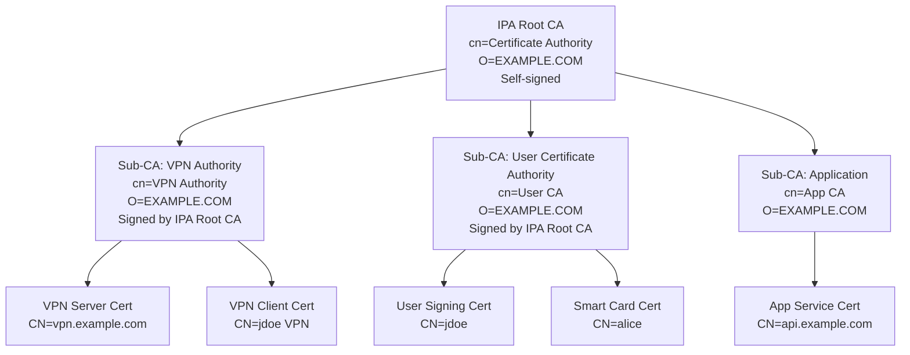
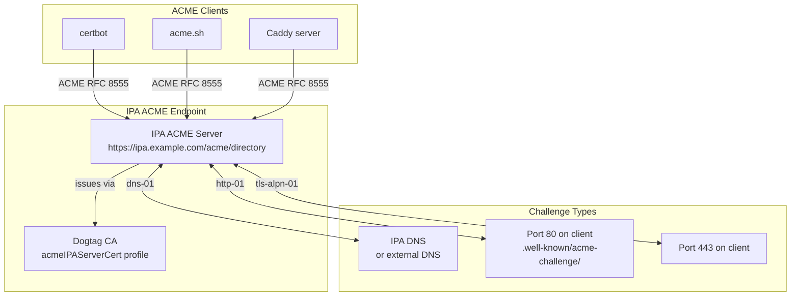
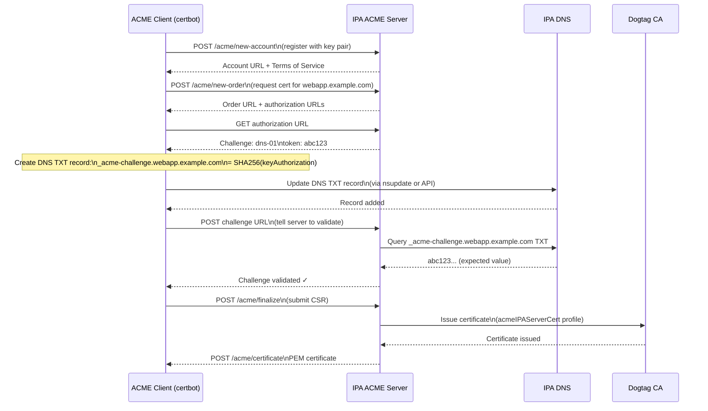
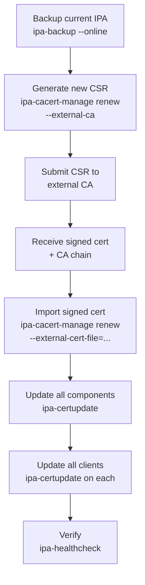
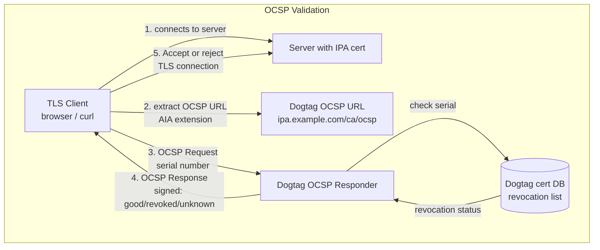
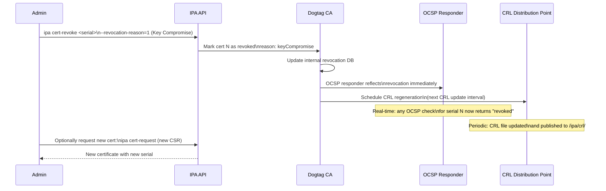
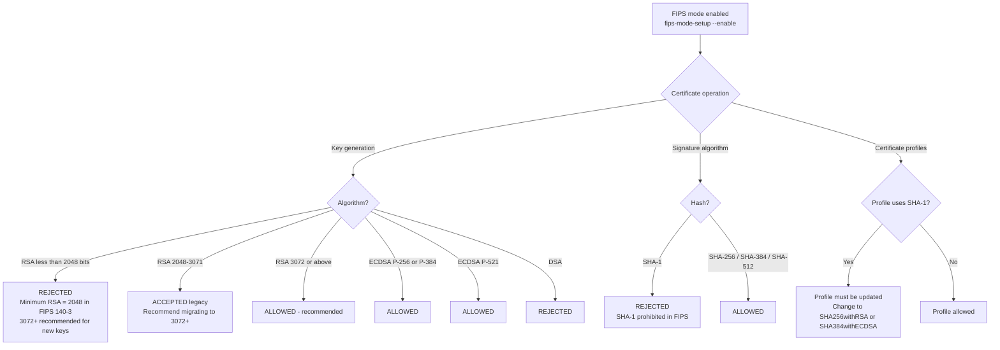
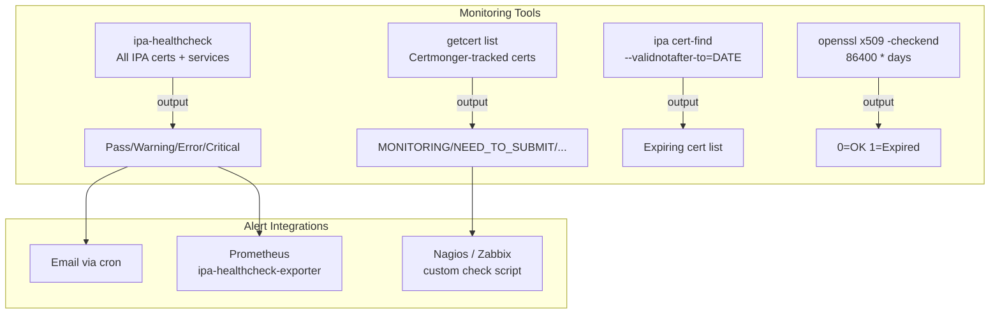

# Module 10 — Certificate Management: Advanced

> Sub-CAs, custom certificate profiles, ACME, external CA signing, OCSP/CRL,
> certificate expiry monitoring, and FIPS-mode constraints.
>
> 🔁 Prerequisite: [Module 09 — Certificate Management Fundamentals](09_certificate_management_fundamentals.md)

## Table of Contents

- [1. Sub-CAs](#1-sub-cas)
  - [1.1 Sub-CA Topology](#11-sub-ca-topology)
  - [1.2 Creating Sub-CAs](#12-creating-sub-cas)
  - [1.3 Issuing Certificates from a Sub-CA](#13-issuing-certificates-from-a-sub-ca)
- [2. Custom Certificate Profiles](#2-custom-certificate-profiles)
  - [2.1 Cloning a Profile](#21-cloning-a-profile)
  - [2.2 Creating a Profile from Scratch](#22-creating-a-profile-from-scratch)
  - [2.3 Importing and Exporting Profiles](#23-importing-and-exporting-profiles)
- [3. ACME Protocol](#3-acme-protocol)
  - [3.1 IPA ACME Architecture](#31-ipa-acme-architecture)
  - [3.2 Enabling IPA ACME](#32-enabling-ipa-acme)
  - [3.3 ACME Certificate Issuance Flow](#33-acme-certificate-issuance-flow)
  - [3.4 Using certbot with IPA ACME](#34-using-certbot-with-ipa-acme)
- [4. External CA Signing](#4-external-ca-signing)
  - [4.1 Installing with an External CA](#41-installing-with-an-external-ca)
  - [4.2 Replacing the IPA CA with an External CA](#42-replacing-the-ipa-ca-with-an-external-ca)
- [5. OCSP and CRL](#5-ocsp-and-crl)
  - [5.1 OCSP Architecture](#51-ocsp-architecture)
  - [5.2 CRL Generation and Distribution](#52-crl-generation-and-distribution)
- [6. Certificate Revocation Workflow](#6-certificate-revocation-workflow)
- [7. FIPS Mode and Certificate Constraints](#7-fips-mode-and-certificate-constraints)
- [8. Certificate Expiry Monitoring](#8-certificate-expiry-monitoring)
- [9. Lab — Advanced Certificate Operations](#9-lab--advanced-certificate-operations)

---

## 1. Sub-CAs

### 1.1 Sub-CA Topology

Sub-CAs allow you to issue certificates from a named subordinate authority beneath
the IPA root CA. Use cases:
- Department segregation (HR certs from `HR-CA`, Engineering from `Eng-CA`)
- Environment separation (prod/staging/dev certs from different CAs)
- Service-type separation (VPN certs from `VPN-CA`, user certs from `User-CA`)



### 1.2 Creating Sub-CAs

```bash
# Create a sub-CA
ipa ca-add vpn-ca \
  --subject="CN=VPN Authority,O=EXAMPLE.COM" \
  --desc="Sub-CA for VPN certificates"

# Create a sub-CA with specific validity
ipa ca-add user-ca \
  --subject="CN=User Certificate Authority,O=EXAMPLE.COM" \
  --desc="Sub-CA for user and smart card certificates"

# List all CAs
ipa ca-find

# Show a sub-CA
ipa ca-show vpn-ca

# Show the sub-CA certificate
ipa ca-show vpn-ca --all | grep "Certificate:"
ipa ca-show vpn-ca --chain    # show full chain

# Disable a sub-CA (prevent new issuance, does not revoke existing)
ipa ca-disable vpn-ca

# Delete a sub-CA (all certs from it are unaffected, still valid)
ipa ca-del vpn-ca
```

### 1.3 Issuing Certificates from a Sub-CA

To use a sub-CA for certificate issuance, you need a profile that references it,
and then specify the CA when requesting:

```bash
# Request a certificate from a specific sub-CA
ipa cert-request /tmp/vpnclient.csr \
  --principal=jdoe \
  --profile-id=caIPAserviceCert \
  --ca=vpn-ca \
  --certificate-out=/tmp/jdoe-vpn.crt

# Via certmonger
getcert request \
  -f /etc/pki/tls/certs/vpnserver.crt \
  -k /etc/pki/tls/private/vpnserver.key \
  -N CN=vpn.example.com \
  -D vpn.example.com \
  -K host/vpn.example.com \
  -T caIPAserviceCert \
  -X vpn-ca                # -X specifies the CA
```

[↑ Back to TOC](#table-of-contents)

---

## 2. Custom Certificate Profiles

### 2.1 Cloning a Profile

The easiest way to create a custom profile is to clone a built-in one:

```bash
# Export the base profile
ipa certprofile-show caIPAserviceCert \
  --out /tmp/myprofile.cfg

# Edit the profile
vi /tmp/myprofile.cfg

# Key parameters to modify:
# desc=My Custom Profile
# profileId=myCustomProfile
# policyset.serverCertSet.2.default.params.range=365  (1 year instead of 2)
# policyset.serverCertSet.7.default.params.keyUsageKeyEncipherment=false (for EC)
```

### 2.2 Creating a Profile from Scratch

Common customisations:

```ini
# /tmp/shortlived-profile.cfg — 90-day certificate profile
profileId=shortLivedServiceCert
classId=caEnrollImpl
name=Short-Lived Service Certificate
desc=90-day service certificate for ephemeral services
visible=true
enable=true
auth.instance_id=raCertAuth

# Input
input.list=i1
input.i1.class_id=certReqInputImpl

# Output
output.list=o1
output.i1.class_id=certOutputImpl

# Policy set
policyset.list=serverCertSet
policyset.serverCertSet.list=1,2,3,4,5,6,7,8,9,10

# 1: Subject Name (from CSR)
policyset.serverCertSet.1.constraint.class_id=subjectNameConstraintImpl
policyset.serverCertSet.1.constraint.name=Subject Name Constraint
policyset.serverCertSet.1.default.class_id=subjectNameDefaultImpl

# 2: Validity — 90 days
policyset.serverCertSet.2.constraint.class_id=validityConstraintImpl
policyset.serverCertSet.2.constraint.params.range=90
policyset.serverCertSet.2.default.class_id=validityDefaultImpl
policyset.serverCertSet.2.default.params.range=90

# 7: Key Usage
policyset.serverCertSet.7.constraint.class_id=keyUsageExtConstraintImpl
policyset.serverCertSet.7.default.class_id=keyUsageExtDefaultImpl
policyset.serverCertSet.7.default.params.keyUsageCritical=true
policyset.serverCertSet.7.default.params.keyUsageDigitalSignature=true
policyset.serverCertSet.7.default.params.keyUsageNonRepudiation=false
policyset.serverCertSet.7.default.params.keyUsageKeyEncipherment=true
policyset.serverCertSet.7.default.params.keyUsageDataEncipherment=false
policyset.serverCertSet.7.default.params.keyUsageKeyAgreement=false
policyset.serverCertSet.7.default.params.keyUsageKeyCertSign=false
policyset.serverCertSet.7.default.params.keyUsageCrlSign=false
policyset.serverCertSet.7.default.params.keyUsageEncipherOnly=false
policyset.serverCertSet.7.default.params.keyUsageDecipherOnly=false

# 8: Extended Key Usage
policyset.serverCertSet.8.constraint.class_id=noConstraintImpl
policyset.serverCertSet.8.default.class_id=extendedKeyUsageExtDefaultImpl
policyset.serverCertSet.8.default.params.exKeyUsageCritical=false
policyset.serverCertSet.8.default.params.exKeyUsageOIDs=1.3.6.1.5.5.7.3.1,1.3.6.1.5.5.7.3.2

# 9: SAN from CSR
policyset.serverCertSet.9.constraint.class_id=noConstraintImpl
policyset.serverCertSet.9.default.class_id=subjectAltNameExtDefaultImpl
policyset.serverCertSet.9.default.params.subjAltNameExtCritical=false
policyset.serverCertSet.9.default.params.subjAltExtType_0=DNSName
policyset.serverCertSet.9.default.params.subjAltExtPattern_0=$request.req_subject_name.cn$
```

### 2.3 Importing and Exporting Profiles

```bash
# Import the custom profile
ipa certprofile-import shortLivedServiceCert \
  --file=/tmp/shortlived-profile.cfg \
  --store=true \
  --desc="90-day service certificate"

# List profiles to confirm
ipa certprofile-find

# Export a profile for backup or modification
ipa certprofile-show shortLivedServiceCert --out /tmp/backup-profile.cfg

# Delete a profile
ipa certprofile-del shortLivedServiceCert
```

[↑ Back to TOC](#table-of-contents)

---

## 3. ACME Protocol

### 3.1 IPA ACME Architecture

IPA implements the ACME protocol (RFC 8555), the same protocol used by Let's Encrypt.
This allows standard ACME clients (certbot, acme.sh, Caddy, Traefik) to obtain
certificates from the IPA CA automatically.



### 3.2 Enabling IPA ACME

```bash
# (server) Enable ACME service
ipa-acme-manage enable

# Verify ACME is available
curl https://ipa.example.com/acme/directory

# Disable ACME (if needed)
ipa-acme-manage disable

# Show ACME status
ipa-acme-manage status
```

### 3.3 ACME Certificate Issuance Flow



### 3.4 Using certbot with IPA ACME

```bash
# (client) Install certbot
dnf install -y certbot

# HTTP-01 challenge (requires port 80 accessible from IPA ACME server)
certbot certonly \
  --standalone \
  --server https://ipa.example.com/acme/directory \
  --domain webapp.example.com \
  --email admin@example.com \
  --no-eff-email \
  --agree-tos

# DNS-01 challenge with IPA DNS (using manual DNS)
certbot certonly \
  --manual \
  --preferred-challenges=dns \
  --server https://ipa.example.com/acme/directory \
  --domain webapp.example.com

# Or use dns-01 with nsupdate for automated DNS challenge
certbot certonly \
  --authenticator dns-rfc2136 \
  --dns-rfc2136-credentials /etc/certbot/rfc2136.ini \
  --server https://ipa.example.com/acme/directory \
  --domain webapp.example.com

# /etc/certbot/rfc2136.ini:
# dns_rfc2136_server = ipa.example.com
# dns_rfc2136_port = 53
# dns_rfc2136_name = webapp.example.com.
# dns_rfc2136_secret = <TSIG key>
# dns_rfc2136_algorithm = HMAC-SHA512

# Renew certificates (cron/systemd timer auto-runs this)
certbot renew --dry-run

# Certificates issued by certbot are stored in:
ls /etc/letsencrypt/live/webapp.example.com/
```

[↑ Back to TOC](#table-of-contents)

---

## 4. External CA Signing

### 4.1 Installing with an External CA

Instead of IPA generating a self-signed root CA, you can have an external CA sign
the IPA CA certificate during installation:

```bash
# (server) Step 1: Generate IPA CSR (first pass — no CA installed yet)
ipa-server-install \
  --realm=EXAMPLE.COM \
  --domain=example.com \
  --ds-password='...' \
  --admin-password='...' \
  --external-ca \
  --unattended

# This creates /root/ipa.csr — submit this to your external CA

# (external CA) Sign the CSR, get back ipa.crt + external CA chain file

# (server) Step 2: Complete installation with signed cert
ipa-server-install \
  --realm=EXAMPLE.COM \
  --domain=example.com \
  --ds-password='...' \
  --admin-password='...' \
  --external-cert-file=/root/ipa.crt \
  --external-cert-file=/root/external-ca-chain.pem \
  --unattended
```

### 4.2 Replacing the IPA CA with an External CA



```bash
# Renew IPA CA with external signing
ipa-cacert-manage renew \
  --external-ca \
  --external-ca-type=generic

# After external CA signs it:
ipa-cacert-manage renew \
  --external-cert-file=/root/new-ipa-ca.crt \
  --external-cert-file=/root/root-ca-chain.pem

# Propagate to all IPA components
ipa-certupdate

# Propagate to all enrolled clients (run on each client)
ipa-certupdate
```

[↑ Back to TOC](#table-of-contents)

---

## 5. OCSP and CRL

### 5.1 OCSP Architecture

OCSP (Online Certificate Status Protocol) allows clients to check if a certificate
is revoked in real-time, without downloading the full CRL.



```bash
# Check OCSP manually
openssl ocsp \
  -issuer /etc/ipa/ca.crt \
  -cert /etc/pki/tls/certs/webapp.crt \
  -url http://ipa.example.com/ca/ocsp \
  -text

# Check with more verbose output
openssl s_client -connect ipa.example.com:443 -status 2>&1 \
  | grep -A5 "OCSP response"
```

### 5.2 CRL Generation and Distribution

The CRL (Certificate Revocation List) is a signed file listing all revoked certs.
IPA generates it automatically.

```bash
# View CRL update schedule
ipa config-show | grep -i crl

# Fetch current CRL
curl -s http://ipa.example.com/ipa/crl/MasterCRL.bin | openssl crl -inform DER -text -noout | head -30

# Or get it as PEM
curl -s http://ipa.example.com/ipa/crl/MasterCRL.bin \
  | openssl crl -inform DER -out /tmp/ipa-crl.pem

# View CRL contents (revoked certificates)
openssl crl -in /tmp/ipa-crl.pem -text -noout | grep -A3 "Revoked"

# Check when CRL expires
openssl crl -in /tmp/ipa-crl.pem -text -noout | grep "Next Update"
```

[↑ Back to TOC](#table-of-contents)

---

## 6. Certificate Revocation Workflow



[↑ Back to TOC](#table-of-contents)

---

## 7. FIPS Mode and Certificate Constraints

On RHEL 10 with FIPS mode enabled, additional constraints apply to certificate
operations:



```bash
# Check if FIPS mode is active
fips-mode-setup --check

# Verify Dogtag is FIPS-aware
grep -i fips /etc/pki/pki-tomcat/ca/CS.cfg | head -5

# Generate FIPS-compliant key (RSA-3072 minimum in strict FIPS 140-3)
openssl genrsa -out /etc/pki/tls/private/fips-service.key 3072

# Or use ECDSA P-256 (preferred for performance)
openssl ecparam -genkey -name prime256v1 \
  | openssl pkcs8 -topk8 -nocrypt \
  -out /etc/pki/tls/private/ecdsa-service.key

# Generate CSR from EC key
openssl req -new \
  -key /etc/pki/tls/private/ecdsa-service.key \
  -out /tmp/ecdsa-service.csr \
  -subj "/CN=secureservice.example.com"

# Request cert — IPA will use SHA256withECDSA automatically
ipa cert-request /tmp/ecdsa-service.csr \
  --principal=HTTP/secureservice.example.com \
  --profile-id=caIPAserviceCert \
  --certificate-out=/etc/pki/tls/certs/ecdsa-service.crt

# Verify signature algorithm
openssl x509 -in /etc/pki/tls/certs/ecdsa-service.crt -noout \
  -text | grep "Signature Algorithm"
# Should show: ecdsa-with-SHA256
```

> 🔒 **FIPS 140-3 (RHEL 10):** RSA-2048 remains the FIPS-approved minimum (per NIST
> SP 800-131A Rev 2, valid through 2030). RSA-3072 is strongly recommended for all
> new keys as it aligns with post-2030 NIST guidance. RHEL 10's FIPS crypto policy
> enforces RSA-2048 as the hard minimum; use ECDSA P-256 or RSA-3072+ for new
> deployments.

[↑ Back to TOC](#table-of-contents)

---

## 8. Certificate Expiry Monitoring

Multiple tools monitor certificate expiry in an IPA environment:



```bash
# ipa-healthcheck: comprehensive cert check
ipa-healthcheck \
  --source ipahealthcheck.ipa.certs \
  --output-type human \
  2>&1 | grep -v SUCCESS

# Check specific cert sources
ipa-healthcheck \
  --source ipahealthcheck.dogtag.ca.dogtagCACertsExpiration \
  --output-type human

# getcert: all tracked certs
getcert list | grep -E "(subject|expires|status)"

# Find all IPA-issued certs expiring in next 90 days
ipa cert-find \
  --validnotafter-to=$(date -d "+90 days" +%Y-%m-%d)

# Check a specific cert file expiry
DAYS=30
if ! openssl x509 -checkend $((DAYS * 86400)) -in /etc/pki/tls/certs/webapp.crt -noout; then
  echo "WARNING: webapp.crt expires within $DAYS days!"
  openssl x509 -in /etc/pki/tls/certs/webapp.crt -noout -enddate
fi

# Shell script to check all pem files in a directory
for cert in /etc/pki/tls/certs/*.crt; do
  expiry=$(openssl x509 -in "$cert" -noout -enddate 2>/dev/null | cut -d= -f2)
  echo "$cert: $expiry"
done

# Check the IPA CA certificate itself
openssl x509 -in /etc/ipa/ca.crt -noout -enddate
```

[↑ Back to TOC](#table-of-contents)

---

## 9. Lab — Advanced Certificate Operations

```bash
# ── EXERCISE 1: Create a sub-CA ──────────────────────────────────────────────

kinit admin

ipa ca-add webapp-ca \
  --subject="CN=WebApp Certificate Authority,O=EXAMPLE.COM" \
  --desc="Sub-CA for web application certificates"

ipa ca-find
ipa ca-show webapp-ca

# ── EXERCISE 2: Issue a cert from the sub-CA ────────────────────────────────

ipa service-add HTTP/api.example.com

openssl req -newkey rsa:3072 -nodes \
  -keyout /tmp/api.key \
  -out /tmp/api.csr \
  -subj "/CN=api.example.com"

ipa cert-request /tmp/api.csr \
  --principal=HTTP/api.example.com \
  --profile-id=caIPAserviceCert \
  --ca=webapp-ca \
  --certificate-out=/tmp/api.crt

# Verify issuer is the sub-CA
openssl x509 -in /tmp/api.crt -noout -text | grep "Issuer:"
# Should show: Issuer: CN=WebApp Certificate Authority, O=EXAMPLE.COM

# ── EXERCISE 3: Custom 30-day profile ────────────────────────────────────────

# Export base profile
ipa certprofile-show caIPAserviceCert --out /tmp/base.cfg

# Create modified version (30 days)
sed -e 's/^profileId=.*/profileId=shortTermCert/' \
    -e 's/^desc=.*/desc=30-day certificate/' \
    -e 's/params.range=731/params.range=30/' \
    /tmp/base.cfg > /tmp/shortterm.cfg

ipa certprofile-import shortTermCert \
  --file=/tmp/shortterm.cfg \
  --store=true

# Issue a 30-day cert
ipa cert-request /tmp/api.csr \
  --principal=HTTP/api.example.com \
  --profile-id=shortTermCert \
  --ca=webapp-ca \
  --certificate-out=/tmp/api-30day.crt

openssl x509 -in /tmp/api-30day.crt -noout -text \
  | grep -E "Not Before|Not After"

# ── EXERCISE 4: Enable and test ACME ─────────────────────────────────────────

ipa-acme-manage enable
ipa-acme-manage status
curl -s https://ipa.example.com/acme/directory | python3 -m json.tool

# ── EXERCISE 5: OCSP check ───────────────────────────────────────────────────

# Check cert status
openssl ocsp \
  -issuer /etc/ipa/ca.crt \
  -cert /tmp/api.crt \
  -url http://ipa.example.com/ca/ocsp

# Revoke the cert and re-check
SERIAL=$(openssl x509 -in /tmp/api.crt -noout -serial \
  | awk -F= '{print $2}' | xargs printf "%d\n")
ipa cert-revoke $SERIAL --revocation-reason=5

openssl ocsp \
  -issuer /etc/ipa/ca.crt \
  -cert /tmp/api.crt \
  -url http://ipa.example.com/ca/ocsp
# Should now show: revoked

# ── EXERCISE 6: Health check for certs ───────────────────────────────────────

ipa-healthcheck \
  --source ipahealthcheck.ipa.certs \
  --output-type human 2>&1

# Clean up
ipa service-del HTTP/api.example.com
ipa ca-del webapp-ca
ipa certprofile-del shortTermCert
```

[↑ Back to TOC](#table-of-contents)
