# Module 11 — Active Directory Trust

> End-to-end guide to establishing, operating, and troubleshooting cross-forest Kerberos trusts between FreeIPA and Active Directory on RHEL 10.

## Table of Contents

- [1. Concepts and Terminology](#1-concepts-and-terminology)
- [2. Trust Architecture](#2-trust-architecture)
- [3. Prerequisites](#3-prerequisites)
- [4. DNS Configuration for Trust](#4-dns-configuration-for-trust)
- [5. Establishing the Trust](#5-establishing-the-trust)
- [6. ID Mapping and POSIX Attributes](#6-id-mapping-and-posix-attributes)
- [7. User and Group Resolution](#7-user-and-group-resolution)
- [8. HBAC and Sudo for AD Users](#8-hbac-and-sudo-for-ad-users)
- [9. External Groups and Role Assignment](#9-external-groups-and-role-assignment)
- [10. SID Filtering and Selective Authentication](#10-sid-filtering-and-selective-authentication)
- [11. Troubleshooting AD Trust](#11-troubleshooting-ad-trust)
- [12. Lab — Build and Verify an AD Trust](#12-lab--build-and-verify-an-ad-trust)

---

## 1. Concepts and Terminology

### 1.1 Trust Types

| Term | Meaning |
|------|---------|
| **Forest trust** | Trust between two AD forests or between IPA and an AD forest; most common FreeIPA scenario |
| **Cross-forest trust** | Bi-directional trust spanning entire forests including all child domains |
| **One-way trust** | AD trusts IPA (AD users log in to IPA-enrolled hosts) |
| **Two-way trust** | Both sides trust each other; IPA users can authenticate to AD resources too |
| **Transitive trust** | Trust flows through intermediate domains automatically |
| **External trust** | Trust to a single AD domain, not the full forest |

FreeIPA creates a **one-way forest trust by default**: AD users can log in to Linux hosts enrolled in IPA. Two-way trust (IPA users to AD resources) requires additional AD-side configuration and is rarely needed.

### 1.2 Key Components

| Component | Role |
|-----------|------|
| **ipa-adtrust-install** | Configures Samba/winbind, adds `trust` service principal, creates IPA-AD trust account |
| **SSSD** | Resolves AD users/groups on IPA clients via the `ad` provider sub-domain |
| **Winbind** | Running on IPA server only — handles Netlogon/LSA calls toward AD |
| **SID** | Windows Security Identifier; every AD user/group has a globally unique SID |
| **ID range** | Maps Windows RIDs to POSIX UIDs/GIDs on Linux |
| **Trust controller** | IPA master that has `ipa-adtrust-install` applied |
| **Global Catalog** | AD service on port 3268/3269 used for forest-wide object lookups |

### 1.3 Authentication Flow (AD User → IPA Host)

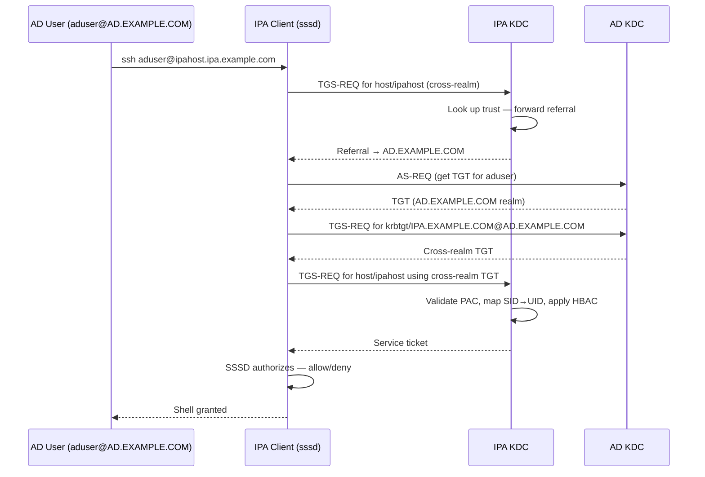

[↑ Back to TOC](#table-of-contents)

---

## 2. Trust Architecture

### 2.1 Forest-Level Trust Diagram

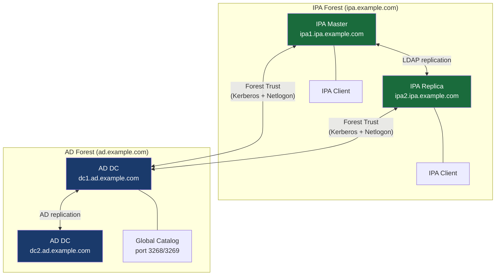

### 2.2 Component Interaction on IPA Trust Controller

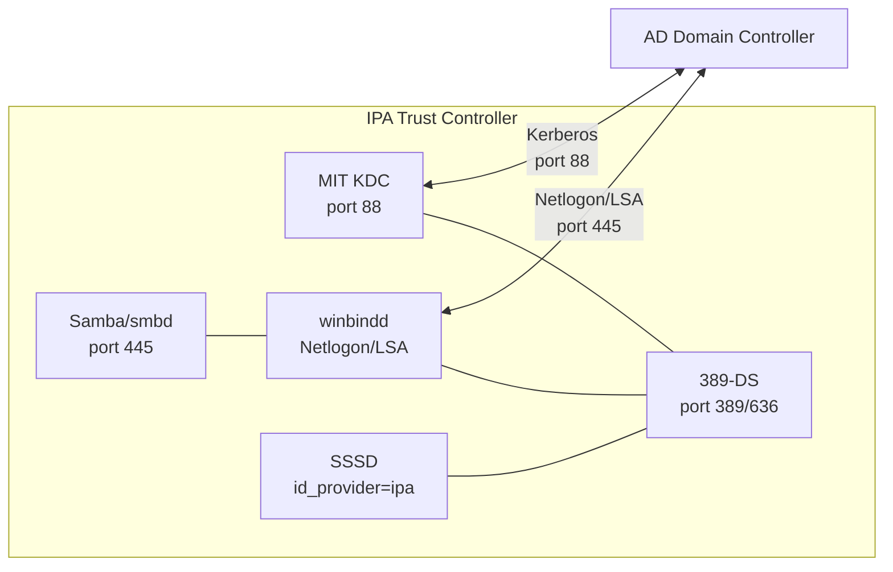

### 2.3 Trust Account Structure

When `ipa-adtrust-install` runs, IPA creates:

- A **Samba machine account** in IPA LDAP (`cn=adtrust agents`)
- An **inter-realm trust key** (`krbtgt/AD.EXAMPLE.COM@IPA.EXAMPLE.COM`)
- An **ID range** entry mapping AD SIDs to Linux UIDs

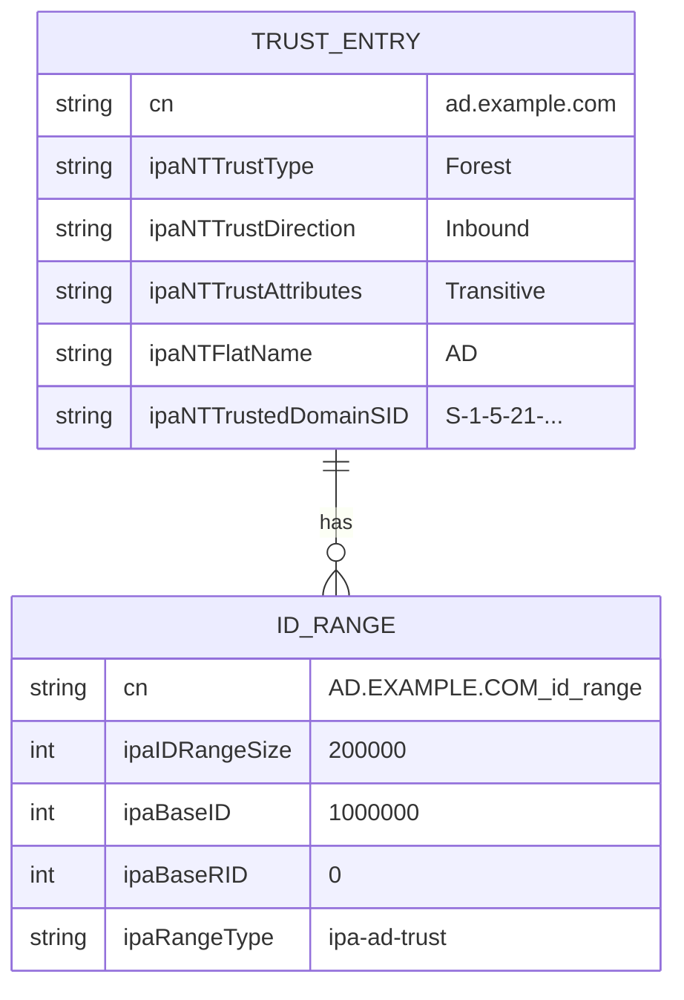

[↑ Back to TOC](#table-of-contents)

---

## 3. Prerequisites

### 3.1 Software Requirements

```bash
# Install AD trust packages on EVERY IPA master that will be a trust controller
sudo dnf install -y ipa-server-trust-ad

# Verify Samba and winbind are available
rpm -q samba samba-winbind samba-client
```

### 3.2 Network Requirements

All ports must be open **bidirectionally** between IPA trust controllers and AD DCs:

| Port | Protocol | Service |
|------|----------|---------|
| 88 | TCP/UDP | Kerberos |
| 135 | TCP | RPC Endpoint Mapper |
| 389 | TCP | LDAP |
| 445 | TCP | SMB/Netlogon |
| 464 | TCP/UDP | Kerberos password |
| 636 | TCP | LDAPS |
| 3268 | TCP | Global Catalog |
| 3269 | TCP | Global Catalog SSL |
| 49152–65535 | TCP | RPC dynamic ports |

```bash
# Open required ports on IPA server firewall
sudo firewall-cmd --permanent --add-service=freeipa-trust
sudo firewall-cmd --reload

# Verify
sudo firewall-cmd --list-services
```

### 3.3 DNS Requirements

Both DNS namespaces must be mutually resolvable. Options:

**Option A — DNS Forwarders (recommended for most environments)**

```bash
# On IPA server: add conditional forwarder for AD domain
ipa dnsforwardzone-add ad.example.com \
    --forwarder=192.168.10.10 \
    --forwarder=192.168.10.11 \
    --forward-policy=only

# Verify AD SRV records are reachable
dig +short SRV _ldap._tcp.ad.example.com @192.168.10.10
dig +short SRV _kerberos._tcp.ad.example.com @192.168.10.10
```

**Option B — DNS Delegation from AD to IPA**

```
# In AD DNS (PowerShell on AD DC):
Add-DnsServerConditionalForwarderZone `
    -Name "ipa.example.com" `
    -MasterServers 192.168.1.10, 192.168.1.11
```

### 3.4 Time Synchronization

```bash
# Kerberos requires < 5 minutes clock skew between IPA and AD
sudo timedatectl status
chronyc tracking | grep "System time"

# Verify IPA and AD are both synced to reliable NTP
```

### 3.5 Prerequisite Check Summary

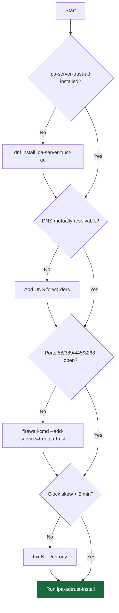

[↑ Back to TOC](#table-of-contents)

---

## 4. DNS Configuration for Trust

### 4.1 Verifying DNS Resolution

Before creating the trust, confirm that both sides can resolve each other's critical SRV records:

```bash
# From IPA server — resolve AD services
dig +short SRV _ldap._tcp.ad.example.com
dig +short SRV _kerberos._tcp.ad.example.com
dig +short SRV _gc._tcp.ad.example.com
nslookup dc1.ad.example.com

# From AD DC (PowerShell) — resolve IPA services
Resolve-DnsName -Name "_ldap._tcp.ipa.example.com" -Type SRV
Resolve-DnsName -Name "_kerberos._tcp.ipa.example.com" -Type SRV
```

### 4.2 IPA DNS Zone Configuration

```bash
# Ensure IPA DNS has correct SRV records for its own realm
# Note: dnsrecord-find has no --type filter; list all and grep for SRV records
ipa dnsrecord-find ipa.example.com | grep -A2 "kerberos"

# Add missing SRV records if needed
ipa dnsrecord-add ipa.example.com _kerberos._tcp \
    --srv-rec="0 100 88 ipa1.ipa.example.com."

# Check _msdcs zone (required for AD compatibility)
ipa dnszone-show _msdcs.ipa.example.com 2>/dev/null || \
    echo "WARNING: _msdcs zone missing — run ipa-adtrust-install"
```

### 4.3 DNS Topology for Trust

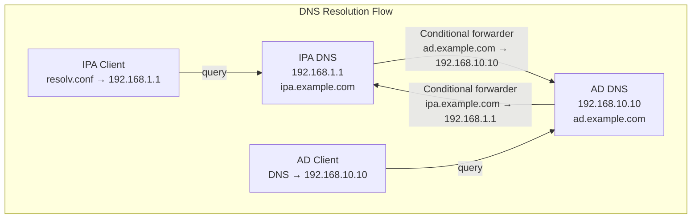

[↑ Back to TOC](#table-of-contents)

---

## 5. Establishing the Trust

### 5.1 Run ipa-adtrust-install

This must be run on every IPA master you want to act as a trust controller:

```bash
sudo ipa-adtrust-install \
    --netbios-name=IPA \
    --add-sids \
    --add-agents \
    --admin-password='AdminPassword123!'

# Flags:
#   --netbios-name   NetBIOS name for the IPA domain (≤15 chars, uppercase)
#   --add-sids       Generate SIDs for all existing IPA users/groups
#   --add-agents     Register all IPA masters as adtrust agents
```

**What this does:**
1. Configures Samba (`smb.conf`) to present IPA as an AD-compatible domain
2. Starts `winbindd` and `smb` services
3. Creates `_msdcs.ipa.example.com` DNS zone
4. Adds `cifs/` and `host/` service principals to KDC
5. Assigns SIDs to all existing users/groups

### 5.2 Verify ipa-adtrust-install

```bash
# Check services
sudo systemctl status smb winbind

# Verify Samba config
sudo testparm -s /etc/samba/smb.conf

# Verify SPN was created
ipa service-show cifs/ipa1.ipa.example.com

# Check _msdcs DNS zone
ipa dnszone-show _msdcs.ipa.example.com
```

### 5.3 Create the Trust

```bash
# Authenticate as IPA admin first
kinit admin

# Create the trust (will prompt for AD admin password)
ipa trust-add ad.example.com \
    --admin=Administrator \
    --password \
    --type=ad

# Or pass password directly (non-interactive, less secure)
ipa trust-add ad.example.com \
    --admin=Administrator \
    --password='ADAdminPass123!' \
    --type=ad
```

**Trust creation flow:**

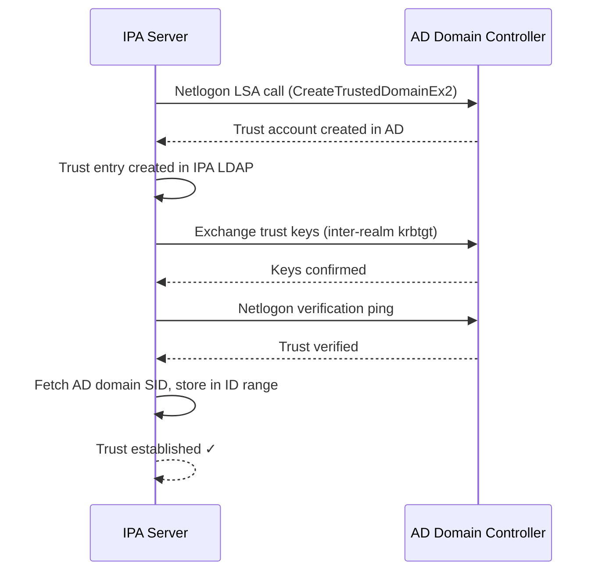

### 5.4 Verify the Trust

```bash
# List trusts
ipa trust-find

# Show trust details
ipa trust-show ad.example.com

# Fetch trusted domains (validates Netlogon connectivity)
ipa trust-fetch-domains ad.example.com

# Test with wbinfo (from Samba/winbind tooling)
sudo wbinfo --ping-dc --domain=ad.example.com
sudo wbinfo -u --domain=ad.example.com | head -20
sudo wbinfo -g --domain=ad.example.com | head -20

# Resolve a specific AD user
sudo wbinfo --name-to-sid='AD\aduser1'
id aduser1@ad.example.com
```

### 5.5 Trust Status Verification

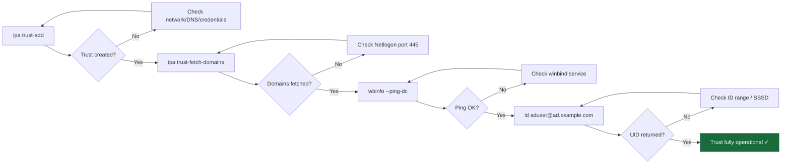

[↑ Back to TOC](#table-of-contents)

---

## 6. ID Mapping and POSIX Attributes

### 6.1 ID Mapping Modes

FreeIPA supports two ID mapping strategies for AD users:

| Mode | Description | When to use |
|------|-------------|-------------|
| **ipa-ad-trust** (RID-based) | UIDs calculated from `BaseID + RID`; no POSIX attrs needed in AD | Default; AD schema unchanged |
| **ipa-ad-trust-posix** | UIDs/GIDs read directly from AD's `uidNumber`/`gidNumber` LDAP attrs | AD already has POSIX attrs (Unix Attributes schema extension) |

### 6.2 RID-Based ID Mapping (Default)

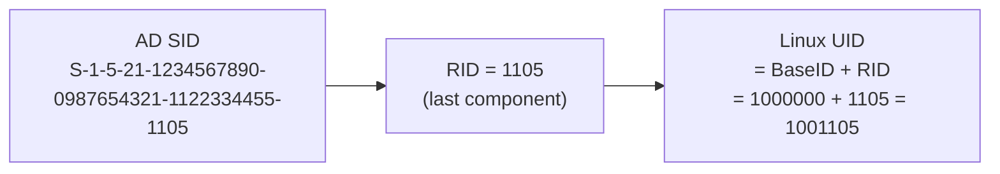

```bash
# View the ID range for the AD trust
ipa idrange-show 'AD.EXAMPLE.COM_id_range'

# Example output:
#   Range name: AD.EXAMPLE.COM_id_range
#   First Posix ID of the range: 1000000
#   Number of IDs in the range: 200000
#   First RID of the corresponding RID range: 0
#   Range type: Active Directory domain range
```

### 6.3 Modifying the ID Range

```bash
# Change the base ID (e.g., avoid conflict with local IPA range)
ipa idrange-mod 'AD.EXAMPLE.COM_id_range' --base-id=2000000

# Restart SSSD after range changes
sudo systemctl restart sssd

# Clear SSSD cache to force re-resolution
sudo sss_cache -E
```

### 6.4 POSIX Mode (ipa-ad-trust-posix)

```bash
# If AD has uidNumber/gidNumber attributes populated:
ipa trust-mod ad.example.com --range-type=ipa-ad-trust-posix

# Verify the range type changed
ipa idrange-show 'AD.EXAMPLE.COM_id_range' | grep "Range type"

# AD user must have uidNumber and gidNumber set in AD
# Test:
id aduser1@ad.example.com
# Should show the UID/GID from AD's uidNumber/gidNumber attributes
```

### 6.5 Multiple AD Domains (Sub-domains)

If the AD forest has child domains, each gets its own ID range:

```bash
# Fetch child domains
ipa trust-fetch-domains ad.example.com

# View all ID ranges
ipa idrange-find

# Each child domain gets its own range automatically:
#   AD.EXAMPLE.COM_id_range        base=1000000
#   CHILD.AD.EXAMPLE.COM_id_range  base=1200000
```

[↑ Back to TOC](#table-of-contents)

---

## 7. User and Group Resolution

### 7.1 SSSD Configuration for AD Trust

On IPA clients, SSSD is configured automatically by `ipa-client-install`. The `ipa` provider transparently handles AD sub-domains:

```ini
# /etc/sssd/sssd.conf (auto-generated — do NOT hand-edit)
[domain/ipa.example.com]
id_provider = ipa
ipa_domain = ipa.example.com
ipa_server = _srv_

# The AD sub-domain is discovered automatically:
# [domain/ipa.example.com/ad.example.com]
# id_provider = ad   (implicit)
```

### 7.2 User Lookup

```bash
# Look up AD user by full UPN
id aduser1@ad.example.com
getent passwd aduser1@ad.example.com

# Look up with short name (if default_domain_suffix set)
getent passwd aduser1

# Look up group
getent group 'domain users@ad.example.com'

# Enumerate all AD users (use with caution in large AD environments)
getent passwd | grep '@ad.example.com'
```

### 7.3 User Override

IPA allows overriding AD user attributes (shell, home dir, SSH keys) without modifying AD:

```bash
# Create a user override for an AD user
ipa idoverrideuser-add 'Default Trust View' aduser1@ad.example.com \
    --login=aduser1 \
    --homedir=/home/aduser1 \
    --shell=/bin/bash \
    --uid=1001105

# Add SSH public key override
ipa idoverrideuser-add-cert 'Default Trust View' aduser1@ad.example.com \
    --certificate="$(cat aduser1_pubkey.pem)"

# Verify
ipa idoverrideuser-show 'Default Trust View' aduser1@ad.example.com
```

### 7.4 ID Views

ID views allow different attribute overrides for different hosts:

```mermaid
graph TD
    ADU[AD User: aduser1@ad.example.com<br/>SID: S-1-5-21-...-1105]

    subgraph "Default Trust View (all hosts)"
        OV1[Override: shell=/bin/bash<br/>homedir=/home/aduser1]
    end

    subgraph "DMZ View (DMZ hosts only)"
        OV2[Override: shell=/bin/sh<br/>homedir=/tmp/aduser1]
    end

    ADU --> OV1
    ADU --> OV2

    H1[IPA Client (internal)] -->|applies| OV1
    H2[IPA Client (DMZ)] -->|applies| OV2
```

```bash
# Create a custom ID view
ipa idview-add DMZView --desc="Restricted shell for DMZ hosts"

# Apply to specific hosts
ipa idview-apply DMZView --hosts=dmzhost1.ipa.example.com

# Add override in that view
ipa idoverrideuser-add DMZView aduser1@ad.example.com \
    --shell=/bin/sh \
    --homedir=/tmp/aduser1
```

### 7.5 Auto-Private Groups

```bash
# By default IPA creates private groups for AD users at login
# Control this behavior:
ipa config-mod --user-default-group=''   # Remove default group assignment

# Verify auto-private group creation
ipa config-show | grep "Default user group"
```

[↑ Back to TOC](#table-of-contents)

---

## 8. HBAC and Sudo for AD Users

### 8.1 HBAC for AD Users

AD users cannot be added directly to HBAC rules — they must be members of **external groups** which are then added to **IPA groups**, which are then added to HBAC rules.

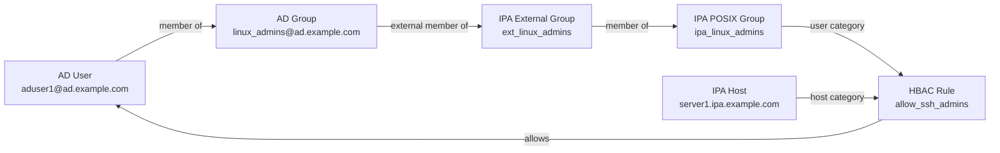

```bash
# Step 1: Create external group (references AD group by SID)
ipa group-add ext_linux_admins \
    --desc="External wrapper for AD linux_admins group" \
    --external

# Step 2: Add AD group to external group (by SID or name)
ipa group-add-member ext_linux_admins \
    --external='AD\linux_admins'

# Or by SID:
# ipa group-add-member ext_linux_admins \
#     --external='S-1-5-21-...-1234'

# Step 3: Create POSIX group and add external group
ipa group-add ipa_linux_admins \
    --desc="POSIX group for AD linux admins"
ipa group-add-member ipa_linux_admins \
    --groups=ext_linux_admins

# Step 4: Create HBAC rule using the POSIX group
ipa hbacrule-add allow_ad_admins_ssh \
    --desc="Allow AD linux_admins to SSH to managed hosts" \
    --servicecat=all
ipa hbacrule-add-user allow_ad_admins_ssh \
    --groups=ipa_linux_admins
ipa hbacrule-add-host allow_ad_admins_ssh \
    --hosts=server1.ipa.example.com

# Step 5: Test HBAC
ipa hbactest --user=aduser1@ad.example.com \
             --host=server1.ipa.example.com \
             --service=sshd
```

### 8.2 Sudo Rules for AD Users

Same pattern — AD users must go through external groups:

```bash
# Reuse the POSIX group from above, or create a new one
ipa group-add ext_sudo_users --external
ipa group-add-member ext_sudo_users --external='AD\sudo_users'

ipa group-add ipa_sudo_users
ipa group-add-member ipa_sudo_users --groups=ext_sudo_users

# Create sudo rule
ipa sudorule-add ad_sudo_all \
    --desc="Full sudo for AD sudo_users"
ipa sudorule-add-user ad_sudo_all \
    --groups=ipa_sudo_users
ipa sudorule-add-runasuser ad_sudo_all \
    --users=root
ipa sudorule-add-option ad_sudo_all \
    --sudooption='!authenticate'

# Verify
ipa sudorule-show ad_sudo_all
```

[↑ Back to TOC](#table-of-contents)

---

## 9. External Groups and Role Assignment

### 9.1 External Group Patterns

External groups are the bridge between AD and IPA. They hold AD SIDs and can be nested in IPA POSIX groups.

```bash
# List all external groups
ipa group-find --external=true

# Show members (SIDs) of an external group
ipa group-show ext_linux_admins --all | grep member

# Remove an AD group from an external group
ipa group-remove-member ext_linux_admins \
    --external='AD\linux_admins'
```

### 9.2 Assigning IPA Roles to AD Users

```bash
# Grant IPA User Administrator role to AD admins
ipa role-add-member 'User Administrator' \
    --groups=ipa_linux_admins

# Grant helpdesk role to AD helpdesk group
ipa group-add ext_helpdesk --external
ipa group-add-member ext_helpdesk --external='AD\helpdesk'
ipa group-add ipa_helpdesk
ipa group-add-member ipa_helpdesk --groups=ext_helpdesk
ipa role-add-member 'Helpdesk' --groups=ipa_helpdesk
```

### 9.3 Group Membership Flow

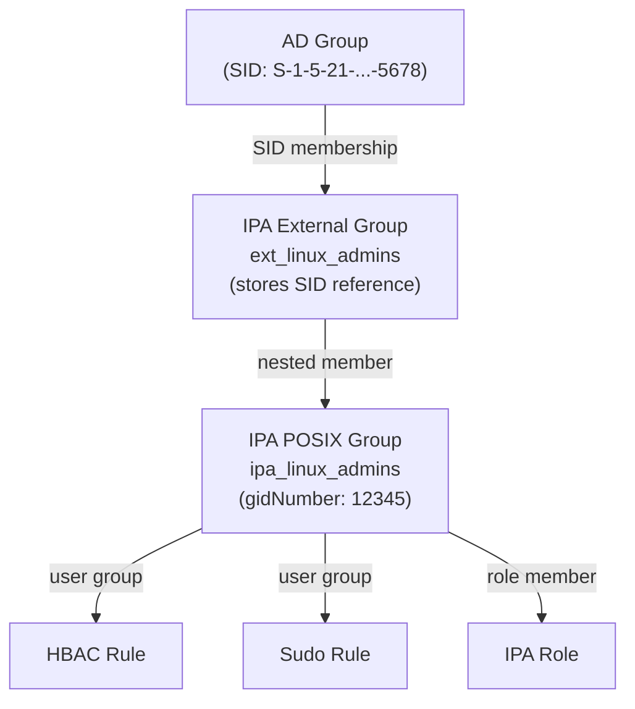

[↑ Back to TOC](#table-of-contents)

---

## 10. SID Filtering and Selective Authentication

### 10.1 SID Filtering

SID filtering prevents privilege escalation by blocking SIDs from the trusted domain that could grant elevated privileges in the trusting domain. FreeIPA enables SID filtering by default.

```bash
# Check current SID filtering status
ipa trust-show ad.example.com | grep -i filter

# SID filtering is ON by default (recommended)
# Disabling it is a significant security risk — avoid unless strictly required
```

### 10.2 PAC (Privilege Attribute Certificate)

Every Kerberos ticket from an AD realm includes a **PAC** — a Microsoft extension carrying the user's SIDs, group memberships, and account flags. IPA's KDC validates the PAC on every cross-realm ticket.

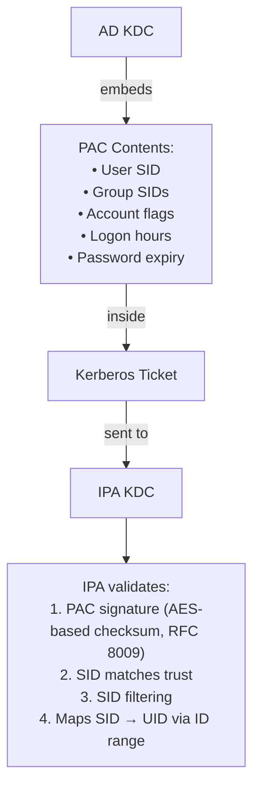

### 10.3 Selective Authentication

By default, any user in the trusted AD forest can authenticate to IPA-enrolled hosts (subject to HBAC). Selective authentication restricts this:

```bash
# View current trust authentication policy
ipa trust-show ad.example.com | grep auth

# To restrict which AD users can authenticate, rely on:
# 1. HBAC deny-all default + explicit allow rules (recommended)
# 2. AD-side "Allowed to Authenticate" policy in AD
```

### 10.4 Trust Hardening Checklist

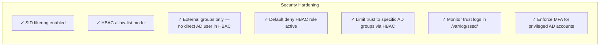

[↑ Back to TOC](#table-of-contents)

---

## 11. Troubleshooting AD Trust

### 11.1 Diagnostic Decision Tree

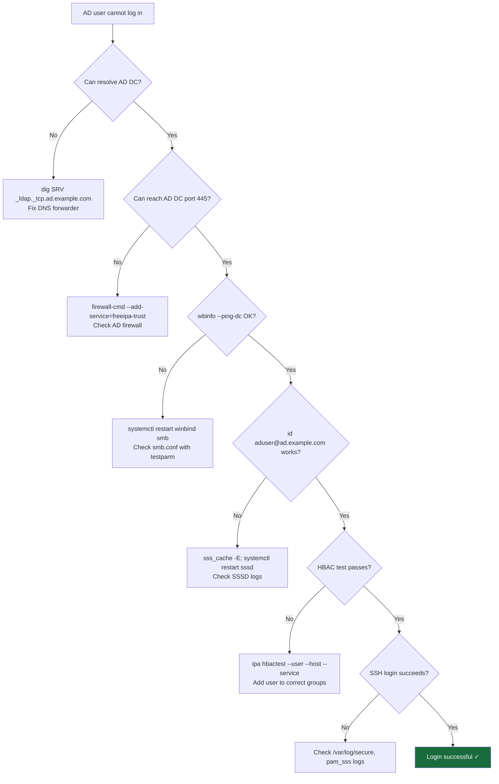

### 11.2 DNS Troubleshooting

```bash
# Verify AD SRV records from IPA server
dig +short SRV _ldap._tcp.ad.example.com
dig +short SRV _kerberos._tcp.ad.example.com
dig +short SRV _gc._tcp.ad.example.com
dig +short SRV _ldap._tcp.dc._msdcs.ad.example.com

# Expected: should return AD DC hostnames with port/priority/weight
# If empty: fix DNS forwarder zone

# Verify IPA SRV records are visible from AD side
dig +short SRV _ldap._tcp.ipa.example.com @192.168.1.1
dig +short SRV _kerberos._tcp.ipa.example.com @192.168.1.1
```

### 11.3 Samba/Winbind Troubleshooting

```bash
# Check Samba config validity
sudo testparm -s

# Check winbind connectivity
sudo wbinfo --ping-dc --domain=ad.example.com
sudo wbinfo --check-secret --domain=ad.example.com

# List trusted domains known to winbind
sudo wbinfo --trusted-domains

# Look up AD user SID
sudo wbinfo --name-to-sid='AD\aduser1'

# Samba logs
sudo journalctl -u smb -u winbind --since "1 hour ago"
sudo tail -100 /var/log/samba/log.wb-AD
```

### 11.4 SSSD Troubleshooting

```bash
# Enable debug logging temporarily
sudo sss_debuglevel --all 9

# Or edit /etc/sssd/sssd.conf and set:
# debug_level = 9
# in [domain/ipa.example.com] section, then restart

sudo systemctl restart sssd

# Tail SSSD logs
sudo tail -f /var/log/sssd/sssd_ipa.example.com.log
sudo tail -f /var/log/sssd/sssd_ad.example.com.log

# Force cache refresh
sudo sss_cache -E
sudo sss_cache -u aduser1@ad.example.com

# Check SSSD enumeration
getent passwd aduser1@ad.example.com
id aduser1@ad.example.com
```

### 11.5 Kerberos Troubleshooting

```bash
# Test cross-realm ticket acquisition
KRB5_TRACE=/dev/stderr kinit aduser1@AD.EXAMPLE.COM
klist -v

# Verify inter-realm keys exist
sudo kadmin.local -q "getprinc krbtgt/AD.EXAMPLE.COM@IPA.EXAMPLE.COM"

# Check KDC logs for cross-realm errors
sudo journalctl -u krb5kdc --since "1 hour ago" | grep -i "ad.example"

# Test PAC validation
kvno -S host server1.ipa.example.com
```

### 11.6 Common Errors and Fixes

| Error | Likely Cause | Fix |
|-------|-------------|-----|
| `NT_STATUS_NO_TRUST_SAM_ACCOUNT` | Trust account deleted in AD | Re-run `ipa trust-add` |
| `NT_STATUS_INVALID_PARAMETER` | NetBIOS name conflict | Change `--netbios-name` |
| `id: aduser: no such user` | SSSD cache stale or ID range mismatch | `sss_cache -E; systemctl restart sssd` |
| `Clock skew too great` | NTP drift > 5 min | Sync clocks with `chronyc makestep` |
| `KDC has no support for encryption type` | AD still using RC4/DES | Enable AES on AD DCs |
| `Trust already exists` | Duplicate trust creation attempt | `ipa trust-del` then re-add |
| Empty `wbinfo -u` output | DNS SRV lookup failure | Fix conditional forwarder |
| `Access denied` after login | HBAC rule missing | Run `ipa hbactest` and add rule |

[↑ Back to TOC](#table-of-contents)

---

## 12. Lab — Build and Verify an AD Trust

> **Environment:** One IPA master (`ipa1.ipa.example.com`), one AD DC (`dc1.ad.example.com`), one IPA client (`client1.ipa.example.com`).

### Lab 12.1 — Install AD Trust Packages

```bash
# On ipa1
sudo dnf install -y ipa-server-trust-ad

# Verify
rpm -q ipa-server-trust-ad samba samba-winbind
```

### Lab 12.2 — Configure DNS Forwarder

```bash
# Add conditional forwarder for AD domain
kinit admin
ipa dnsforwardzone-add ad.example.com \
    --forwarder=192.168.10.10 \
    --forward-policy=only

# Test resolution
dig +short SRV _ldap._tcp.ad.example.com
dig +short A dc1.ad.example.com
```

### Lab 12.3 — Run ipa-adtrust-install

```bash
sudo ipa-adtrust-install \
    --netbios-name=IPA \
    --add-sids \
    --admin-password='AdminPassword123!'

# Verify services
sudo systemctl status smb winbind
sudo testparm -s | grep workgroup

# Verify _msdcs zone
ipa dnszone-show _msdcs.ipa.example.com
```

### Lab 12.4 — Open Firewall Ports

```bash
sudo firewall-cmd --permanent --add-service=freeipa-trust
sudo firewall-cmd --reload
sudo firewall-cmd --list-services | grep trust
```

### Lab 12.5 — Create the Trust

```bash
# On AD DC first (PowerShell) — add conditional forwarder back to IPA
# Add-DnsServerConditionalForwarderZone -Name "ipa.example.com" -MasterServers 192.168.1.10

# On IPA master:
kinit admin
ipa trust-add ad.example.com \
    --admin=Administrator \
    --password \
    --type=ad

# Verify
ipa trust-find
ipa trust-show ad.example.com
```

### Lab 12.6 — Verify Trust Operation

```bash
# Fetch domains
ipa trust-fetch-domains ad.example.com

# Winbind ping
sudo wbinfo --ping-dc --domain=ad.example.com

# Look up AD users
sudo wbinfo -u --domain=ad.example.com | head -5
id testaduser@ad.example.com
getent passwd testaduser@ad.example.com
```

### Lab 12.7 — Configure HBAC for AD Users

```bash
# Create external group and link AD group
ipa group-add ext_ad_users --external
ipa group-add-member ext_ad_users --external='AD\domain users'

# Create POSIX group
ipa group-add ipa_ad_users
ipa group-add-member ipa_ad_users --groups=ext_ad_users

# Create HBAC rule (allow SSH for AD users on client1)
ipa hbacrule-add allow_ad_ssh \
    --servicecat=all
ipa hbacrule-add-user allow_ad_ssh --groups=ipa_ad_users
ipa hbacrule-add-host allow_ad_ssh \
    --hosts=client1.ipa.example.com

# Test HBAC
ipa hbactest \
    --user=testaduser@ad.example.com \
    --host=client1.ipa.example.com \
    --service=sshd
```

### Lab 12.8 — Test AD User Login

```bash
# From an external host, SSH as AD user
ssh testaduser@ad.example.com@client1.ipa.example.com

# Verify Kerberos ticket
klist

# Verify group membership
id
groups
```

### Lab 12.9 — Cleanup (Optional)

```bash
# Remove the trust
ipa trust-del ad.example.com

# Remove DNS forwarder zone
ipa dnsforwardzone-del ad.example.com

# Remove external/POSIX groups
ipa group-del ipa_ad_users
ipa group-del ext_ad_users
ipa hbacrule-del allow_ad_ssh
```

[↑ Back to TOC](#table-of-contents)
