# Module 12 — Replication and Topology
[](./LICENSE.md)
[](https://access.redhat.com/products/red-hat-enterprise-linux)
[](https://www.freeipa.org)

> Deep dive into FreeIPA's multi-master replication model: designing topologies, adding/removing replicas, monitoring health, and recovering from failures on RHEL 10.

## Table of Contents

- [1. Replication Concepts](#1-replication-concepts)
- [2. Topology Architecture](#2-topology-architecture)
- [3. Replication Agreements and Segments](#3-replication-agreements-and-segments)
- [4. Installing a Replica](#4-installing-a-replica)
- [5. Managing Topology Segments](#5-managing-topology-segments)
- [6. CA Replica and CRL Management](#6-ca-replica-and-crl-management)
- [7. DNS Replica](#7-dns-replica)
- [8. Monitoring Replication Health](#8-monitoring-replication-health)
- [9. Replication Conflict Resolution](#9-replication-conflict-resolution)
- [10. Decommissioning a Replica](#10-decommissioning-a-replica)
- [11. Disaster Recovery](#11-disaster-recovery)
- [12. Lab — Multi-Master Replication Setup](#12-lab--multi-master-replication-setup)

---

## 1. Replication Concepts

### 1.1 Multi-Master Model

FreeIPA uses **multi-master replication** (MMR): every server can accept writes, and changes propagate to all peers. There is no single-point-of-failure and no dedicated "primary" — all replicas are equal.

| Concept | Description |
|---------|-------------|
| **Replica** | Any FreeIPA server; all replicas are peers |
| **Replication agreement** | A configured channel between two replicas |
| **Topology segment** | IPA's logical representation of a replication agreement (introduced in FreeIPA 4.3) |
| **CSN** | Change Sequence Number — uniquely identifies every LDAP change |
| **RUV** | Replica Update Vector — tracks the highest CSN each replica has seen from all others |
| **Changelog** | 389-DS persistent log of all changes, used to replay missed updates |
| **Suffix** | LDAP subtree being replicated (e.g., `dc=ipa,dc=example,dc=com`, `o=ipaca`) |

### 1.2 Replication Suffixes

FreeIPA maintains **three independent replicated suffixes**:

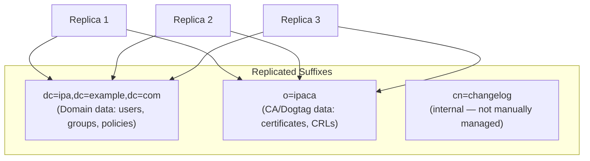

The `o=ipaca` suffix only exists on replicas that have a CA installed.

### 1.3 Replication Flow

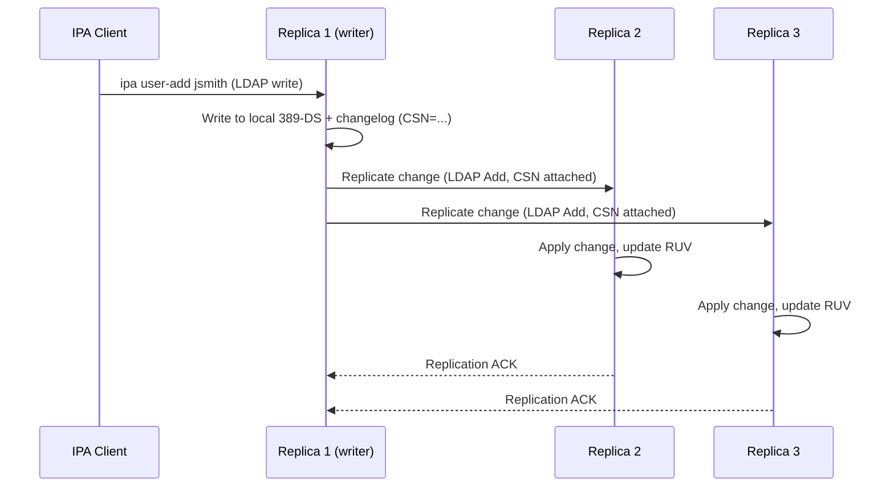

[↑ Back to TOC](#table-of-contents)

---

## 2. Topology Architecture

### 2.1 Minimum Viable Topology (2 Replicas)

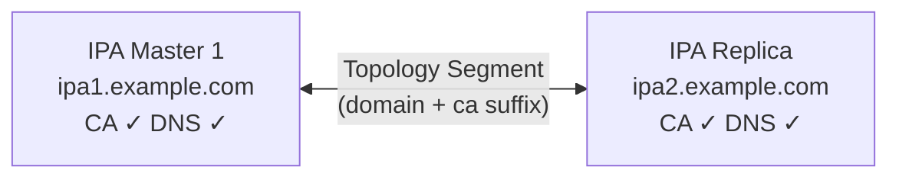

**Minimum for production:** 2 replicas with CA on both. Never run a single IPA server in production.

### 2.2 Hub-and-Spoke Topology

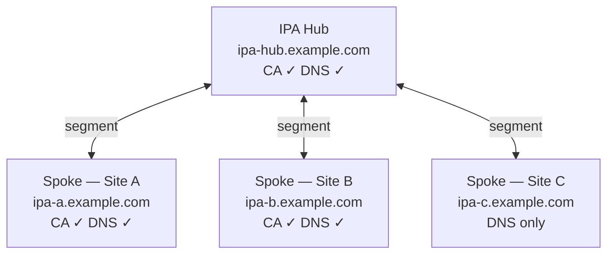

**Risk:** Hub is a single point of replication failure. If hub is down, spokes cannot replicate with each other.

### 2.3 Ring / Mesh Topology (Recommended for Multi-Site)

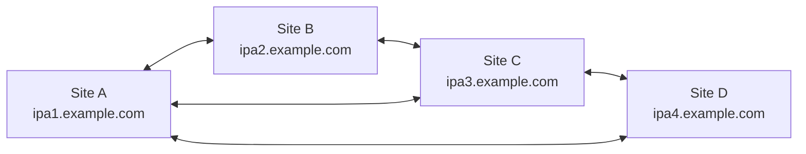

**Best practice:** Every replica should have at least **2 replication agreements**. Avoid single-agreement chains.

### 2.4 Topology Design Rules

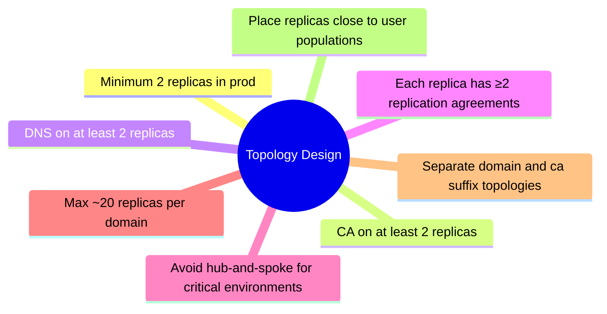

[↑ Back to TOC](#table-of-contents)

---

## 3. Replication Agreements and Segments

### 3.1 Topology Segments vs. Replication Agreements

In FreeIPA 4.3+, **topology segments** are the management abstraction. IPA automatically creates the underlying 389-DS replication agreements from segments.

```bash
# List all topology segments (domain suffix)
ipa topologysegment-find --topologysuffix=domain

# List CA suffix segments
ipa topologysegment-find --topologysuffix=ca

# Show details of a segment
ipa topologysegment-show domain ipa1-to-ipa2

# Segment attributes:
#   iparepltoposegmentleftnode  = ipa1.example.com
#   iparepltoposegmentrightnode = ipa2.example.com
#   iparepltoposegmentdirection = both (bidirectional)
```

### 3.2 Checking Raw Replication Agreements (389-DS Level)

```bash
# Check replication agreements directly in 389-DS
sudo ldapsearch -x -H ldap://localhost \
    -D "cn=Directory Manager" \
    -W \
    -b "cn=mapping tree,cn=config" \
    "(objectClass=nsDS5ReplicationAgreement)" \
    cn nsDS5ReplicaHost nsDS5ReplicaLastUpdateStatus

# Check changelog
sudo ldapsearch -x -H ldap://localhost \
    -D "cn=Directory Manager" \
    -W \
    -b "cn=replica,cn=dc\3Dipa\2Cdc\3Dexample\2Cdc\3Dcom,cn=mapping tree,cn=config" \
    "(objectClass=nsDS5Replica)" \
    nsDS5ReplicaId nsDS5ReplicaType nsds5replicaUpdateSchedule
```

### 3.3 Replication Status

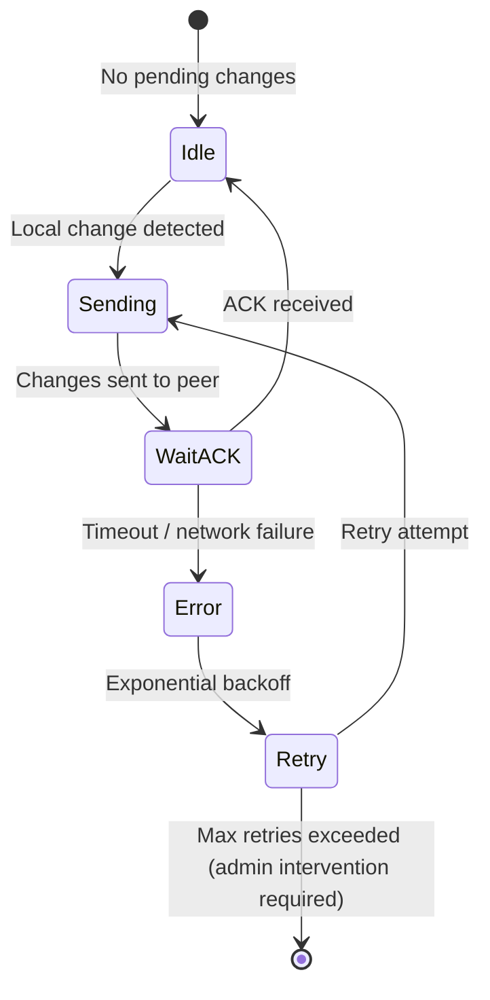

[↑ Back to TOC](#table-of-contents)

---

## 4. Installing a Replica

### 4.1 Prerequisites

```bash
# On the NEW replica host (before install):
# 1. RHEL 10 with valid hostname
sudo hostnamectl set-hostname ipa2.example.com

# 2. DNS must resolve the new hostname
dig +short ipa2.example.com    # should return the new host's IP
dig +short -x 192.168.1.11         # reverse lookup should return ipa2.example.com

# 3. Time synced
sudo timedatectl status

# 4. Required packages
sudo dnf install -y ipa-server ipa-server-dns

# 5. Firewall ports (same as primary installation)
sudo firewall-cmd --permanent --add-service=freeipa
sudo firewall-cmd --reload
```

### 4.2 Enroll the Replica Host

```bash
# Method 1: One-step (requires admin Kerberos credentials)
sudo ipa-replica-install \
    --setup-ca \
    --setup-dns \
    --forwarder=8.8.8.8 \
    --auto-forwarders \
    --principal=admin \
    --admin-password='AdminPassword123!'

# Method 2: Pre-create the host entry (then install without admin creds)
# On existing IPA master:
ipa host-add ipa2.example.com --ip-address=192.168.1.11

# On new replica:
sudo ipa-replica-install \
    --setup-ca \
    --setup-dns \
    --forwarder=8.8.8.8 \
    --principal=admin \
    --admin-password='AdminPassword123!'
```

### 4.3 Replica Install Options

| Flag | Description |
|------|-------------|
| `--setup-ca` | Install a CA (Dogtag) on this replica — strongly recommended |
| `--setup-dns` | Install BIND DNS service on this replica |
| `--no-forwarders` | Disable DNS forwarders (use if internal DNS only) |
| `--forwarder=IP` | Set DNS forwarder |
| `--skip-conncheck` | Skip connectivity checks (use carefully) |
| `--ip-address=IP` | Specify IP address for this replica |
| `--principal=USER` | IPA admin user for enrollment |

### 4.4 Installation Flow

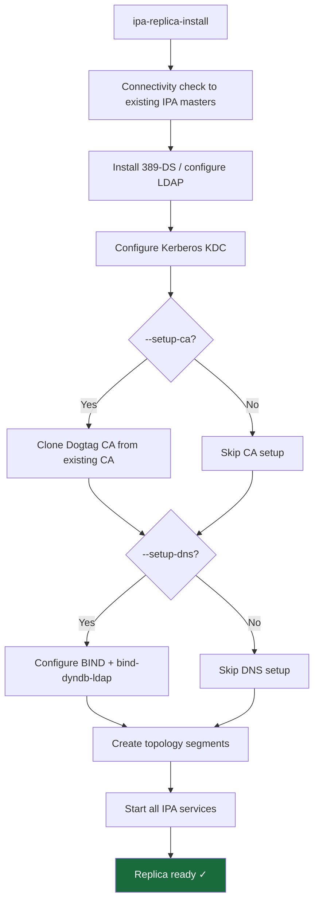

### 4.5 Post-Install Verification

```bash
# Verify replica services
sudo ipactl status

# Check replication agreement is established
ipa topologysegment-find --topologysuffix=domain
ipa topologysegment-find --topologysuffix=ca

# Verify replica is a CA
ipa server-show ipa2.example.com | grep "CA enabled"

# Verify DNS
ipa server-show ipa2.example.com | grep "DNS enabled"

# Force replication check (modern API)
ipa topologysegment-find dc=ipa,dc=example,dc=com
# To force a sync, restart the replication agreement via 389-DS:
# sudo ldapmodify -x -H ldap://localhost -D "cn=Directory Manager" -W <<'EOF'
# dn: cn=<agreement-cn>,cn=replica,...
# changetype: modify
# replace: nsds5replicaUpdateSchedule
# nsds5replicaUpdateSchedule: 0000-2359 0123456
# EOF

# Run diagnostics
sudo ipa-healthcheck --all
```

[↑ Back to TOC](#table-of-contents)

---

## 5. Managing Topology Segments

### 5.1 Adding a Segment

When you add a new replica with `ipa-replica-install`, segments are created automatically. But you can add segments manually:

```bash
# Add a direct segment between two existing replicas
ipa topologysegment-add domain \
    --leftnode=ipa1.example.com \
    --rightnode=ipa3.example.com \
    --direction=both

# For CA suffix (only if both replicas have CA)
ipa topologysegment-add ca \
    --leftnode=ipa1.example.com \
    --rightnode=ipa3.example.com \
    --direction=both
```

### 5.2 Removing a Segment

```bash
# List segments to find the name
ipa topologysegment-find --topologysuffix=domain

# Remove a specific segment
ipa topologysegment-del domain ipa2-to-ipa3

# WARNING: Removing all segments to/from a replica isolates it.
# Ensure connectivity is maintained before removing segments.
```

### 5.3 Viewing the Full Topology Graph

```bash
# Text-based topology view
ipa topologysuffix-verify domain
ipa topologysuffix-verify ca

# List all servers and their roles
ipa server-find --all

# Show server details
ipa server-show ipa1.example.com
```

### 5.4 Segment Direction Options

| Direction | Meaning |
|-----------|---------|
| `both` | Bidirectional — both replicas send and receive (recommended) |
| `left-right` | Only left node pushes changes to right node |
| `right-left` | Only right node pushes changes to left node |

```bash
# Check segment direction
ipa topologysegment-show domain ipa1-to-ipa2 | grep direction
```

### 5.5 Topology Verification

```bash
# Verify topology is connected and consistent
ipa topologysuffix-verify domain
# Output: Replication topology graph is connected.
# If disconnected: "WARNING: Topology is disconnected!" — fix immediately

ipa topologysuffix-verify ca
```

[↑ Back to TOC](#table-of-contents)

---

## 6. CA Replica and CRL Management

### 6.1 CA Replica Roles

Not all CA replicas are equal. One CA replica serves as the **CRL master** — it generates and distributes Certificate Revocation Lists.

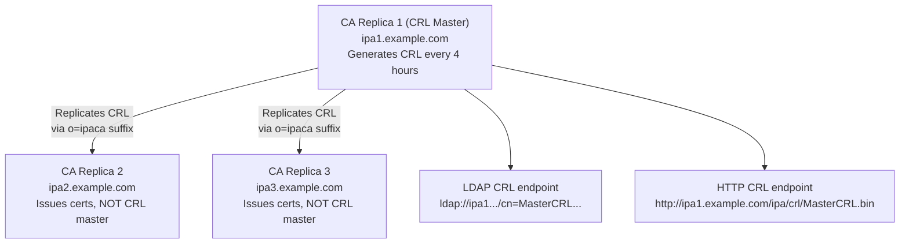

### 6.2 Identifying the CRL Master

```bash
# Check which server is CRL master
ipa config-show | grep "IPA CA renewal master"

# Or check Dogtag config
sudo grep -r "ca.crl.MasterCRL.enable" \
    /etc/pki/pki-tomcat/ca/CS.cfg
# CRL master: ca.crl.MasterCRL.enable=true
# Non-master: ca.crl.MasterCRL.enable=false
```

### 6.3 Moving the CRL Master

```bash
# Move CRL master to ipa2
ipa config-mod --ca-renewal-master-server=ipa2.example.com

# On OLD CRL master (ipa1): disable CRL generation
sudo sed -i \
    's/^ca.crl.MasterCRL.enable=true/ca.crl.MasterCRL.enable=false/' \
    /etc/pki/pki-tomcat/ca/CS.cfg

# On NEW CRL master (ipa2): enable CRL generation
sudo sed -i \
    's/^ca.crl.MasterCRL.enable=false/ca.crl.MasterCRL.enable=true/' \
    /etc/pki/pki-tomcat/ca/CS.cfg

# Restart pki-tomcatd on both
sudo systemctl restart pki-tomcatd@pki-tomcat.service

# Verify
ipa config-show | grep "CA renewal master"
```

### 6.4 CA Renewal Master

The CA renewal master is responsible for renewing the IPA CA certificate itself and all IPA service certificates. By default it is the first IPA master.

```bash
# Show current renewal master
ipa config-show | grep "IPA CA renewal master"

# Move renewal master (e.g., before decommissioning a server)
ipa config-mod --ca-renewal-master-server=ipa2.example.com

# Verify certmonger tracks are updated
sudo getcert list | grep -E "status|ca-error"
```

[↑ Back to TOC](#table-of-contents)

---

## 7. DNS Replica

### 7.1 DNS Replication

DNS zones in FreeIPA are stored in LDAP and automatically replicated as part of the `dc=ipa,dc=example,dc=com` suffix. No separate DNS replication agreement is needed.

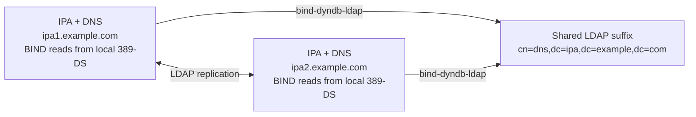

### 7.2 Adding DNS to an Existing Replica

```bash
# On existing replica that doesn't have DNS:
sudo ipa-dns-install \
    --forwarder=8.8.8.8 \
    --auto-forwarders

# Verify DNS is running
sudo systemctl status named

# Verify DNS records are visible
dig @ipa2.example.com ipa1.example.com
```

### 7.3 DNS Load Balancing

Clients should be configured to query multiple DNS servers:

```bash
# /etc/resolv.conf should list multiple IPA DNS servers
cat /etc/resolv.conf
# nameserver 192.168.1.10   (ipa1)
# nameserver 192.168.1.11   (ipa2)
# search example.com

# Or via NetworkManager
nmcli connection modify "System eth0" \
    ipv4.dns "192.168.1.10 192.168.1.11"
nmcli connection up "System eth0"
```

[↑ Back to TOC](#table-of-contents)

---

## 8. Monitoring Replication Health

### 8.1 ipa-healthcheck

`ipa-healthcheck` is the primary tool for checking replication and overall IPA health:

```bash
# Run all health checks
sudo ipa-healthcheck --all

# Run only replication checks
sudo ipa-healthcheck --source ipahealthcheck.ds.replication

# Output as JSON for monitoring integration
sudo ipa-healthcheck --all --output-type json | \
    python3 -m json.tool | \
    grep -A3 '"result": "ERROR"'

# Exit codes:
#   0 = all checks passed
#   1 = at least one WARNING
#   2 = at least one ERROR
#   3 = at least one CRITICAL
```

### 8.2 Replication Lag Monitoring

```bash
# Check replication status via ipa-replica-manage
sudo ipa-replica-manage -p 'DM_Password' list
sudo ipa-replica-manage -p 'DM_Password' list ipa1.example.com

# Check last update time for each agreement
sudo ipa-replica-manage -p 'DM_Password' status ipa2.example.com

# Force immediate sync
sudo ipa-replica-manage -p 'DM_Password' force-sync \
    --from=ipa1.example.com
```

### 8.3 389-DS Replication Monitoring

```bash
# Monitor replication via cn=monitor
sudo ldapsearch -x -H ldap://localhost \
    -D "cn=Directory Manager" -W \
    -b "cn=monitor" \
    "(objectClass=nsds5replicationagreement)" \
    nsds5replicaLastUpdateStatus \
    nsds5replicaLastUpdateStart \
    nsds5replicaLastUpdateEnd \
    nsds5replicaUpdateInProgress

# Status meanings:
#   "0 Replica acquired successfully: Incremental update succeeded" = OK
#   "19 Replication error acquiring replica: Busy" = peer busy, will retry
#   "1 Can't acquire busy replica" = temporary congestion
#   "-1 Fatal replication error" = needs admin attention
```

### 8.4 Replication Health Dashboard Concept

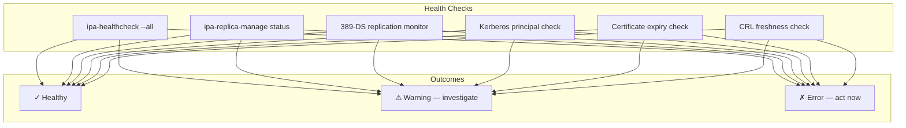

### 8.5 Key Metrics to Monitor

| Metric | Healthy Value | Alert Threshold |
|--------|--------------|-----------------|
| Replication lag | < 60 seconds | > 300 seconds |
| Changelog entries | Draining to 0 | > 10,000 pending |
| `nsds5replicaLastUpdateStatus` | `0 … succeeded` | Any non-zero code |
| CA cert expiry | > 30 days | < 30 days |
| IPA service cert expiry | > 30 days | < 30 days |
| CRL age | < 4 hours | > 8 hours |
| KDC service status | `active (running)` | `failed` or `inactive` |

[↑ Back to TOC](#table-of-contents)

---

## 9. Replication Conflict Resolution

### 9.1 How Conflicts Occur

When two replicas simultaneously modify the same entry before replication synchronizes, a **conflict** occurs. 389-DS uses a **timestamp-based last-write-wins** strategy for attribute conflicts, but for **naming conflicts** (DN conflicts) it creates special conflict entries.

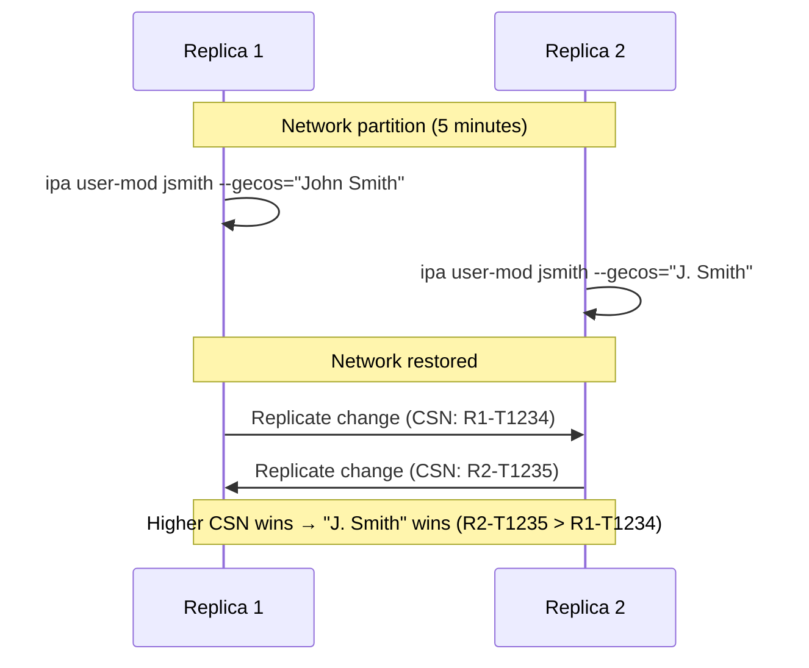

### 9.2 Finding Conflict Entries

```bash
# Search for conflict entries (they have nsds5ReplConflict attribute)
sudo ldapsearch -x -H ldap://localhost \
    -D "cn=Directory Manager" -W \
    -b "dc=ipa,dc=example,dc=com" \
    "(nsds5ReplConflict=*)" \
    dn nsds5ReplConflict

# Conflict DNs look like:
# nsuniqueid=xxxxxxxx-...,uid=jsmith,cn=users,...
```

### 9.3 Resolving Conflicts

```bash
# Step 1: Identify the conflict
sudo ldapsearch -x -H ldap://localhost \
    -D "cn=Directory Manager" -W \
    -b "dc=ipa,dc=example,dc=com" \
    "(nsds5ReplConflict=*)" dn nsds5ReplConflict uid

# Step 2: Review conflicting entries
# Conflict entry: nsuniqueid=<uuid>+uid=jsmith,...
# Original entry: uid=jsmith,...

# Step 3: Keep the correct one — delete the conflict entry
sudo ldapdelete -x -H ldap://localhost \
    -D "cn=Directory Manager" -W \
    "nsuniqueid=xxxxxxxx-xxxx-xxxx-xxxx-xxxxxxxxxxxx+uid=jsmith,cn=users,cn=accounts,dc=ipa,dc=example,dc=com"

# OR: if the conflict entry is the correct one, rename it to the proper DN
# (use ldapmodrdn to remove the nsuniqueid prefix)
```

### 9.4 Tombstone and Resurrect

When an entry is deleted during a network partition and then modified on the other side:

```bash
# Find tombstone entries
sudo ldapsearch -x -H ldap://localhost \
    -D "cn=Directory Manager" -W \
    -b "dc=ipa,dc=example,dc=com" \
    "(objectClass=nsTombstone)" dn

# Tombstones are cleaned up automatically after 30 days (default)
# To force cleanup:
sudo ldapmodify -x -H ldap://localhost \
    -D "cn=Directory Manager" -W << 'EOF'
dn: cn=cleanallruv_task,cn=tasks,cn=config
changetype: add
objectClass: extensibleObject
cn: cleanallruv_task
replica-id: 7
replica-base-dn: dc=ipa,dc=example,dc=com
replica-force-cleaning: yes
EOF
```

[↑ Back to TOC](#table-of-contents)

---

## 10. Decommissioning a Replica

### 10.1 Pre-Decommission Checklist

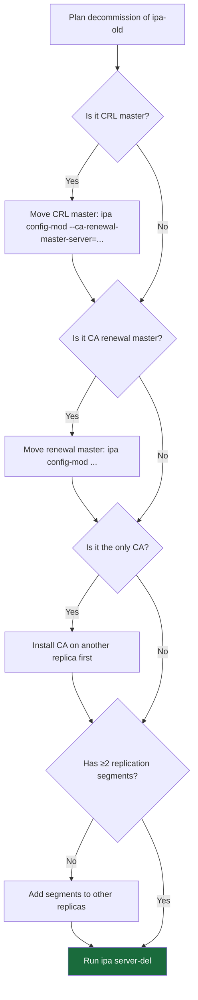

### 10.2 Clean Removal

> ⚠️ **IRREVERSIBLE** — Take a backup with `ipa-backup` before proceeding. This removes all IPA data from the replica.

```bash
# Preferred method: remove from the replica being decommissioned
sudo ipa-server-install --uninstall

# Alternative: remove from a different active replica (if target is unreachable)
ipa server-del ipa-old.example.com

# Force removal if server is unreachable:
ipa server-del ipa-old.example.com --force --ignore-topology-disconnect

# Verify removal
ipa server-find
ipa topologysegment-find --topologysuffix=domain
```

### 10.3 Clean Replica IDs

After removing a replica, clean its Replica Update Vector (RUV) to prevent stale data:

```bash
# Find the replica ID of the removed server
sudo ipa-replica-manage -p 'DM_Password' list

# Clean the RUV for the removed replica (run on each remaining replica)
sudo ipa-replica-manage -p 'DM_Password' clean-ruv <replica-id>

# Verify
sudo ipa-replica-manage -p 'DM_Password' list
```

### 10.4 DNS Cleanup After Decommission

```bash
# Remove the old replica's DNS records
ipa dnsrecord-del example.com ipa-old --a-rec=192.168.1.99
ipa dnsrecord-del example.com ipa-old --aaaa-rec=...

# Remove SRV records if BIND doesn't auto-update
ipa dnsrecord-find example.com | grep ipa-old
```

[↑ Back to TOC](#table-of-contents)

---

## 11. Disaster Recovery

### 11.1 Backup Strategy

```bash
# Full IPA backup (includes LDAP data, certs, Kerberos DB, config)
sudo ipa-backup

# Backup stored in:
ls -lh /var/lib/ipa/backup/

# Online backup (no downtime, LDAP only)
sudo ipa-backup --online

# Offline backup (complete, including Kerberos keytabs)
sudo ipactl stop
sudo ipa-backup
sudo ipactl start
```

### 11.2 Backup Contents

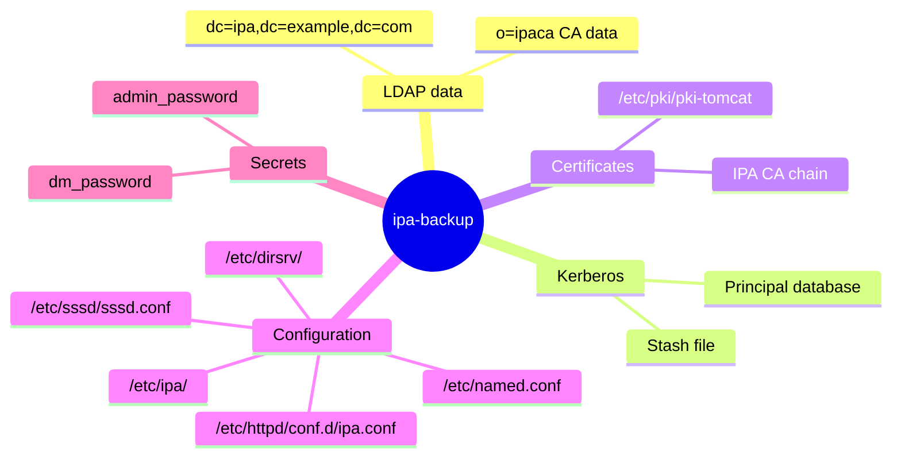

### 11.3 Restore from Backup

```bash
# Restore on the SAME host (single master rebuild)
sudo ipa-restore /var/lib/ipa/backup/ipa-full-YYYY-MM-DD-HH-MM-SS

# Restore prompts for Directory Manager password
# After restore, re-initialize all other replicas from this one

# Re-initialize replica from restored master
sudo ipa-replica-manage -p 'DM_Password' re-initialize \
    --from=ipa1.example.com
```

### 11.4 Rebuilding a Lost Replica

```bash
# If one replica is lost (hardware failure, etc.):
# 1. Remove old server entry from IPA
ipa server-del lost-replica.example.com --force

# 2. Provision a new RHEL 10 host with same or new hostname
# 3. Install replica normally
sudo ipa-replica-install \
    --setup-ca \
    --setup-dns \
    --principal=admin \
    --admin-password='AdminPassword123!'
# IPA will replicate all data to the new replica
```

### 11.5 Recovery from Total Loss (All Replicas Down)

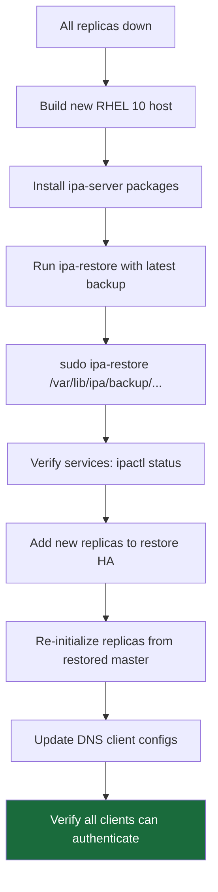

[↑ Back to TOC](#table-of-contents)

---

## 12. Lab — Multi-Master Replication Setup

> **Environment:** Two RHEL 10 hosts: `ipa1.example.com` (existing master) and `ipa2.example.com` (new replica).

### Lab 12.1 — Prepare the Replica Host

```bash
# On ipa2
sudo hostnamectl set-hostname ipa2.example.com

# Verify DNS resolves both hosts
dig +short ipa1.example.com  # → 192.168.1.10
dig +short ipa2.example.com  # → 192.168.1.11

# Install packages
sudo dnf install -y ipa-server ipa-server-dns

# Open firewall
sudo firewall-cmd --permanent --add-service=freeipa
sudo firewall-cmd --reload

# Sync time
sudo chronyc makestep
timedatectl status
```

### Lab 12.2 — Install the Replica

```bash
# On ipa2 — enroll as replica
sudo ipa-replica-install \
    --setup-ca \
    --setup-dns \
    --forwarder=8.8.8.8 \
    --principal=admin \
    --admin-password='AdminPassword123!'

# Watch progress — takes 5–15 minutes
# Key milestones in output:
#   "Configuring directory server"
#   "Configuring certificate server"
#   "Configuring Kerberos KDC"
#   "Configuring DNS"
#   "Adding DNS service records"
#   "Done configuring replica"
```

### Lab 12.3 — Verify Replication

```bash
# On ipa2: verify all services are up
sudo ipactl status

# Check topology from either server
kinit admin
ipa topologysegment-find --topologysuffix=domain
ipa topologysegment-find --topologysuffix=ca

# Should show one segment: ipa1-to-ipa2 (or similar)

# Force replication test: create user on ipa1, verify on ipa2
# On ipa1:
ipa user-add repl-test --first=Repl --last=Test

# On ipa2 (within seconds):
ipa user-show repl-test

# Clean up
ipa user-del repl-test
```

### Lab 12.4 — Run Health Checks

```bash
# On each server
sudo ipa-healthcheck --all

# Check replication specifically
sudo ipa-healthcheck \
    --source ipahealthcheck.ds.replication \
    --output-type human

# Check 389-DS replication status
sudo ipa-replica-manage -p 'DM_Password' status ipa1.example.com
```

### Lab 12.5 — Test CA on Replica

```bash
# Issue a certificate using the replica's CA
ipa cert-request \
    --principal=host/ipa2.example.com \
    ipa2_csr.pem

# Or use certmonger
sudo getcert request \
    -K host/ipa2.example.com \
    -f /tmp/test-replica.crt \
    -k /tmp/test-replica.key \
    -w

sudo getcert list -f /tmp/test-replica.crt
```

### Lab 12.6 — Simulate Failure and Recovery

```bash
# Stop ipa1 to simulate failure
# (On ipa1)
sudo ipactl stop

# From a client — verify it still works via ipa2
kinit admin@EXAMPLE.COM
ipa user-find | head -5

# Add a user while ipa1 is down (writes to ipa2)
ipa user-add failtest --first=Fail --last=Test

# Restart ipa1
# (On ipa1)
sudo ipactl start

# Wait for replication to sync (seconds to minutes)
# Verify the user created during outage is now on ipa1
ipa user-show failtest

# Clean up
ipa user-del failtest
```

### Lab 12.7 — Backup and Restore

```bash
# On ipa1: create a backup
sudo ipa-backup
ls -lh /var/lib/ipa/backup/

# Simulate restore (on a test host, not production)
# sudo ipa-restore /var/lib/ipa/backup/ipa-full-YYYY-MM-DD-HH-MM-SS
```

[↑ Back to TOC](#table-of-contents)

---

*Licensed under [CC BY-NC-SA 4.0](LICENSE.md) · © 2026 UncleJS*