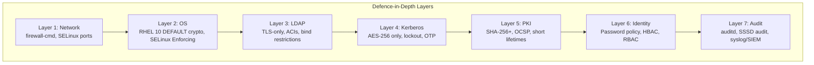
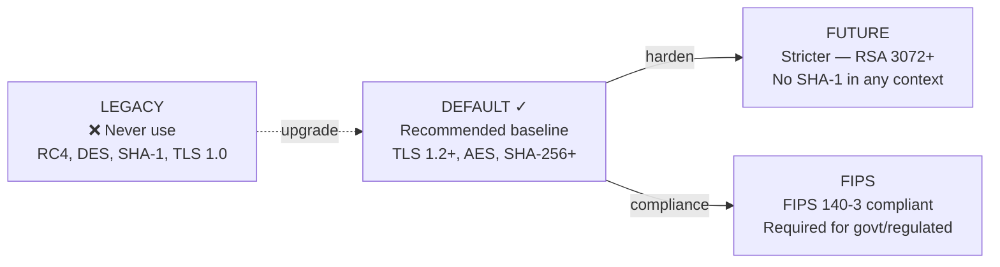
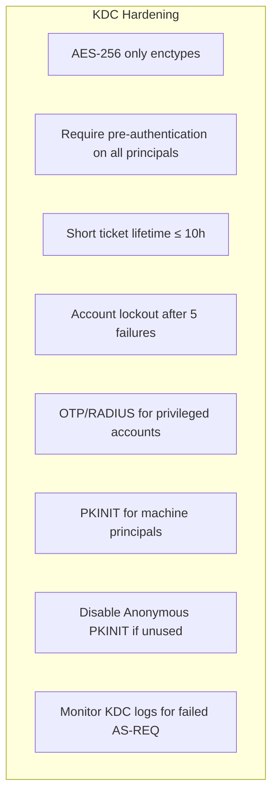
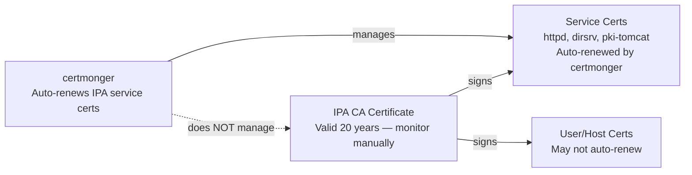
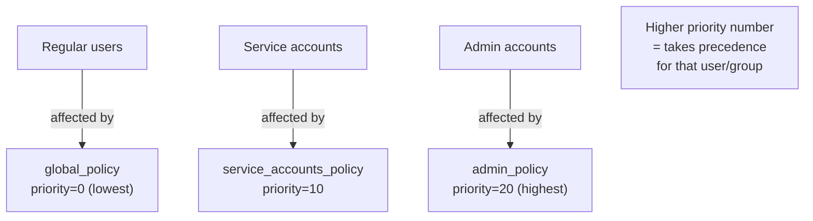
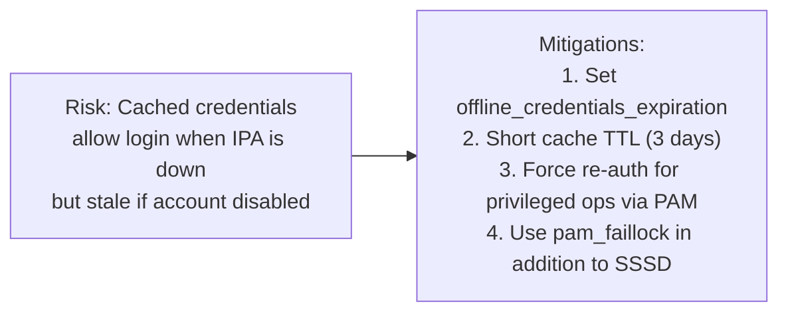
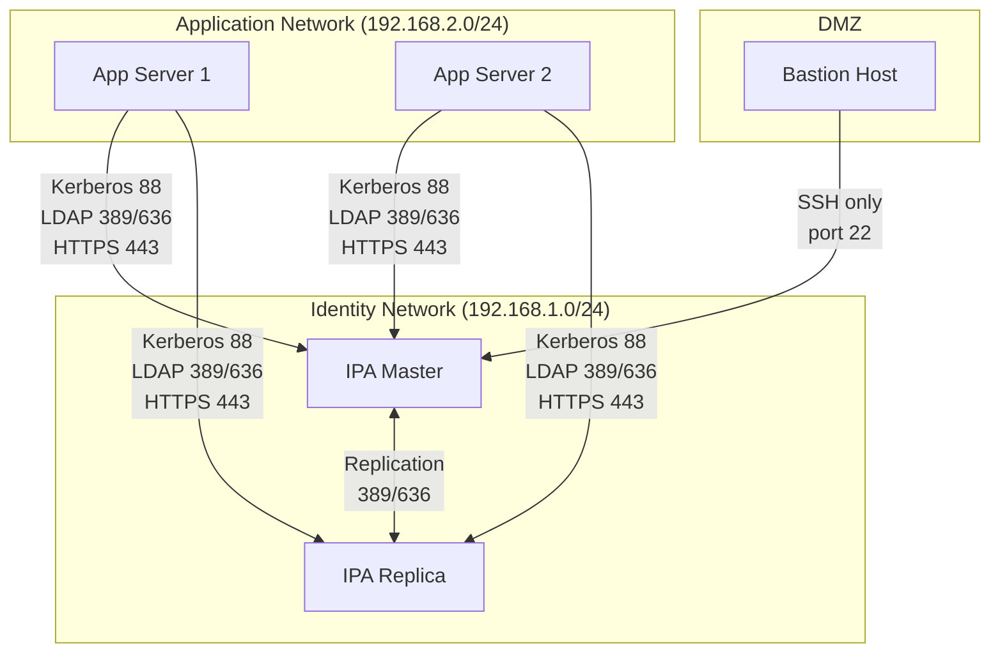
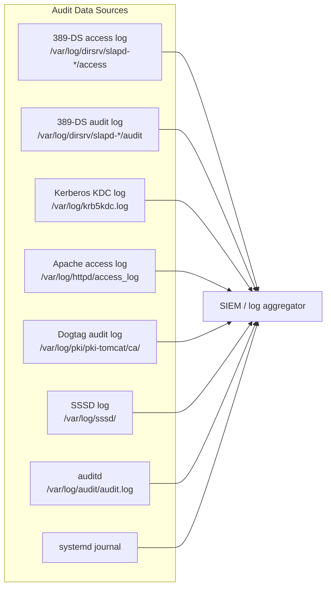
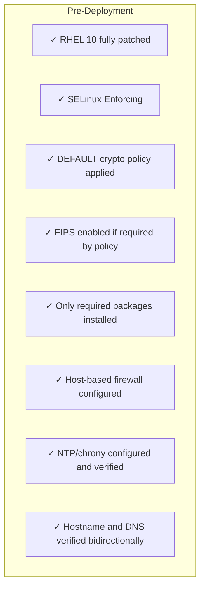

# Module 13 — Security Hardening

> Systematic hardening of FreeIPA servers and clients on RHEL 10: crypto policies, Kerberos lockout, LDAP security, certificate hygiene, audit logging, network hardening, and FIPS 140-3.

## Table of Contents

- [1. Hardening Philosophy](#1-hardening-philosophy)
- [2. RHEL 10 Crypto Policies](#2-rhel-10-crypto-policies)
- [3. FIPS 140-3 Mode](#3-fips-140-3-mode)
- [4. Kerberos Hardening](#4-kerberos-hardening)
- [5. LDAP / 389-DS Hardening](#5-ldap--389-ds-hardening)
- [6. Certificate and PKI Hardening](#6-certificate-and-pki-hardening)
- [7. Password and Account Policy](#7-password-and-account-policy)
- [8. SSSD Hardening on Clients](#8-sssd-hardening-on-clients)
- [9. Network and Firewall Hardening](#9-network-and-firewall-hardening)
- [10. Audit Logging and SIEM Integration](#10-audit-logging-and-siem-integration)
- [11. SELinux and System Hardening](#11-selinux-and-system-hardening)
- [12. Hardening Checklist](#12-hardening-checklist)
- [13. Lab — Apply a Hardening Baseline](#13-lab--apply-a-hardening-baseline)

---

## 1. Hardening Philosophy

### 1.1 Defence-in-Depth Model



### 1.2 RHEL 10 Security Baseline Assumptions

| Baseline | Setting |
|----------|---------|
| Crypto policy | `DEFAULT` (no LEGACY, no SHA-1, no RC4) |
| SELinux | Enforcing |
| Firewalld | Active, default zone = `public` |
| FIPS | Optional (`FIPS:DEFAULT` or `FIPS`) |
| Minimum key size | RSA 2048 (DEFAULT), RSA 3072 (FIPS) |
| TLS minimum | TLS 1.2 (DEFAULT), TLS 1.2 (FIPS), TLS 1.3 available |

[↑ Back to TOC](#table-of-contents)

---

## 2. RHEL 10 Crypto Policies

### 2.1 Policy Overview



### 2.2 Applying and Verifying the Crypto Policy

```bash
# Check current policy
sudo update-crypto-policies --show

# Apply DEFAULT (IPA requires at minimum DEFAULT)
sudo update-crypto-policies --set DEFAULT

# Apply FUTURE (stricter — test thoroughly before applying to IPA)
sudo update-crypto-policies --set FUTURE

# Apply FIPS (see Module 3 for full FIPS setup)
sudo update-crypto-policies --set FIPS

# Never apply LEGACY in an IPA environment
# LEGACY allows RC4/DES which IPA explicitly rejects

# Verify effective ciphers
openssl ciphers -v 'DEFAULT' | grep -v 'SSLv3\|RC4\|DES\|MD5'
```

### 2.3 IPA-Specific Crypto Policy Subpolicies

```bash
# List available subpolicies
ls /usr/share/crypto-policies/policies/modules/

# Example: enforce SHA2 minimum everywhere
sudo update-crypto-policies --set DEFAULT:SHA2

# Example: enable GOST (Russian crypto — rarely needed)
# sudo update-crypto-policies --set DEFAULT:GOST

# Verify OpenSSL respects policy
openssl s_client -connect ipa1.ipa.example.com:636 2>&1 | \
    grep -E "Protocol|Cipher"
```

### 2.4 Verify IPA Services Use Correct TLS

```bash
# Check HTTPS (Apache)
openssl s_client -connect ipa1.ipa.example.com:443 </dev/null 2>&1 | \
    grep -E "Protocol|Cipher|Server certificate"

# Check LDAPS
openssl s_client -connect ipa1.ipa.example.com:636 </dev/null 2>&1 | \
    grep -E "Protocol|Cipher"

# Check Dogtag CA TLS
openssl s_client -connect ipa1.ipa.example.com:8443 </dev/null 2>&1 | \
    grep -E "Protocol|Cipher"

# All should show TLSv1.2 or TLSv1.3, AES-256-GCM or CHACHA20-POLY1305
```

[↑ Back to TOC](#table-of-contents)

---

## 3. FIPS 140-3 Mode

### 3.1 What Changes in FIPS Mode

| Area | Non-FIPS | FIPS 140-3 |
|------|----------|-----------|
| RSA minimum key size | 2048 bits | 3072 bits |
| Hash in signatures | SHA-256+ | SHA-256+ (SHA-1 forbidden everywhere) |
| Kerberos enctypes | AES-128, AES-256 | AES-256 only (AES-128 allowed in FIPS 140-3) |
| HMAC | HMAC-MD5 allowed in Kerberos internal | Forbidden |
| PBKDF | PBKDF2-SHA256 | PBKDF2-SHA256 (minimum) |
| TLS | 1.2+ | 1.2+ (TLS 1.0/1.1 forbidden) |
| Random | /dev/urandom (CSPRNG) | /dev/urandom + FIPS-validated DRBG |

### 3.2 Enabling FIPS Before IPA Install

```bash
# FIPS must be enabled BEFORE ipa-server-install
# It cannot be toggled after IPA is installed

# Enable FIPS mode
sudo fips-mode-setup --enable

# Reboot required
sudo reboot

# After reboot — verify FIPS is active
sudo fips-mode-setup --check
# Output: FIPS mode is enabled.

cat /proc/sys/crypto/fips_enabled
# Output: 1
```

### 3.3 Install IPA in FIPS Mode

```bash
# After FIPS is enabled and system rebooted:
sudo update-crypto-policies --set FIPS

sudo ipa-server-install \
    --ds-password='DMPassword123!' \
    --admin-password='AdminPassword123!' \
    --domain=ipa.example.com \
    --realm=IPA.EXAMPLE.COM \
    --hostname=ipa1.ipa.example.com \
    --ip-address=192.168.1.10 \
    --setup-dns \
    --forwarder=8.8.8.8 \
    --mkhomedir
# IPA auto-detects FIPS and configures accordingly
```

### 3.4 FIPS Kerberos Enctype Configuration

```bash
# In FIPS mode, verify only approved enctypes are configured
sudo kadmin.local -q "listprincs" | head -5
sudo kadmin.local -q "getprinc krbtgt/IPA.EXAMPLE.COM" | grep "MKey"

# Check permitted enctypes in krb5.conf
grep -A10 '\[libdefaults\]' /etc/krb5.conf | grep enctype

# FIPS-safe /etc/krb5.conf snippet (auto-set by IPA in FIPS mode):
# [libdefaults]
#  default_tkt_enctypes = aes256-cts-hmac-sha384-192 aes256-cts-hmac-sha1-96
#  default_tgs_enctypes = aes256-cts-hmac-sha384-192 aes256-cts-hmac-sha1-96
#  permitted_enctypes   = aes256-cts-hmac-sha384-192 aes256-cts-hmac-sha1-96
```

### 3.5 FIPS and AD Trust Compatibility

```bash
# AD trusts in FIPS mode require AD to support AES enctypes
# Verify AD KDC supports AES-256:
# On AD DC (PowerShell):
# Get-ADDefaultDomainPasswordPolicy | Select KerberosEncryptionType

# If AD uses RC4 only, FIPS mode will break the trust
# Fix: enable AES encryption on AD accounts and trust
```

[↑ Back to TOC](#table-of-contents)

---

## 4. Kerberos Hardening

### 4.1 Enctype Restriction

```bash
# Restrict to AES-256 only (strongest available)
# Edit /etc/krb5.conf (on all IPA servers and clients):
sudo tee -a /etc/krb5.conf.d/ipa-hardened-enctypes.conf << 'EOF'
[libdefaults]
 default_tkt_enctypes = aes256-cts-hmac-sha384-192 aes256-cts-hmac-sha1-96
 default_tgs_enctypes = aes256-cts-hmac-sha384-192 aes256-cts-hmac-sha1-96
 permitted_enctypes   = aes256-cts-hmac-sha384-192 aes256-cts-hmac-sha1-96
 allow_weak_crypto    = false
EOF

# Verify existing service keys use AES-256
sudo kadmin.local -q "getprinc host/ipa1.ipa.example.com" | grep "Key:"
```

### 4.2 Ticket Lifetime Policy

```bash
# View current global Kerberos policy
ipa krbtpolicy-show

# Tighten ticket lifetimes
ipa krbtpolicy-mod \
    --maxlife=36000 \
    --maxrenew=604800
# maxlife=36000s (10 hours), maxrenew=604800s (7 days)

# Per-user override (e.g., service accounts get shorter tickets)
ipa user-mod svc_batch \
    --krbmaxpwdlife=0 \
    --krbminpwdlife=0

ipa krbtpolicy-mod --user=svc_batch \
    --maxlife=3600 \
    --maxrenew=3600
```

### 4.3 Account Lockout Policy

```bash
# View current lockout policy
ipa pwpolicy-show global_policy

# Tighten lockout
ipa pwpolicy-mod global_policy \
    --maxfail=5 \
    --failinterval=60 \
    --lockouttime=600
# maxfail=5 attempts, within 60s window → lock for 600s (10 min)

# Unlock a locked account
ipa user-unlock jsmith

# Check if an account is locked
ipa user-show jsmith | grep "Account disabled\|Locked"
```

### 4.4 Kerberos Anonymous PKINIT

```bash
# Anonymous PKINIT allows unauthenticated clients to obtain an anonymous TGT
# for service discovery. Disable it if not required.
# The correct method is to disable the anonymous PKINIT flag in the KDC config:

# Check if anonymous PKINIT is enabled
sudo grep -r "pkinit_allow_upn\|no_auth_data_required" /etc/krb5.conf /etc/krb5.conf.d/ 2>/dev/null

# Disable anonymous PKINIT by adding 'no_anonymous' to the IPA KDC config:
sudo grep -r "pkinit" /var/kerberos/krb5kdc/kdc.conf

# Disable via kadmin — flag the WELLKNOWN/ANONYMOUS principal as requiring pre-auth
# (this prevents unauthenticated AS-REQ from obtaining an anonymous TGT):
sudo kadmin.local -q "modprinc +requires_preauth WELLKNOWN/ANONYMOUS@IPA.EXAMPLE.COM"

# Verify:
sudo kadmin.local -q "getprinc WELLKNOWN/ANONYMOUS@IPA.EXAMPLE.COM" | \
    grep "Requires pre-authentication"
```

### 4.5 KDC Hardening



```bash
# Require pre-auth on all new principals (default in IPA)
# Verify:
sudo kadmin.local -q "getprinc admin" | grep "Requires pre-authentication"

# Enable pre-auth requirement on existing principals
sudo kadmin.local -q "modprinc +requires_preauth admin"
```

[↑ Back to TOC](#table-of-contents)

---

## 5. LDAP / 389-DS Hardening

### 5.1 Disable Anonymous LDAP Binds

```bash
# Check current anonymous access setting
sudo ldapsearch -x -H ldap://localhost \
    -b "cn=config" \
    "(objectClass=nsslapd-config)" \
    nsslapd-allow-anonymous-access

# Disable anonymous access
sudo ldapmodify -x -H ldap://localhost \
    -D "cn=Directory Manager" -W << 'EOF'
dn: cn=config
changetype: modify
replace: nsslapd-allow-anonymous-access
nsslapd-allow-anonymous-access: off
EOF

# Verify
sudo ldapsearch -x -H ldap://localhost \
    -b "dc=ipa,dc=example,dc=com" \
    "(uid=admin)" uid 2>&1 | head -5
# Should return: "Anonymous access not allowed"
```

### 5.2 Enforce TLS / LDAPS

```bash
# Disable plain LDAP (port 389) — require LDAPS (636) or StartTLS only
# WARNING: Ensure all clients use LDAPS before disabling port 389

# Check if StartTLS is enforced
sudo ldapsearch -x -H ldap://localhost \
    -b "cn=config" \
    nsslapd-require-secure-binds

# Require secure binds (TLS or SASL)
sudo ldapmodify -x -H ldap://localhost \
    -D "cn=Directory Manager" -W << 'EOF'
dn: cn=config
changetype: modify
replace: nsslapd-require-secure-binds
nsslapd-require-secure-binds: on
EOF

# Verify LDAPS works
ldapsearch -x -H ldaps://ipa1.ipa.example.com \
    -D "uid=admin,cn=users,cn=accounts,dc=ipa,dc=example,dc=com" \
    -W -b "dc=ipa,dc=example,dc=com" \
    "(uid=admin)" uid
```

### 5.3 Minimum TLS Version for 389-DS

```bash
# Check current TLS minimum
sudo ldapsearch -x -H ldap://localhost \
    -D "cn=Directory Manager" -W \
    -b "cn=encryption,cn=config" \
    nsSSL3 nsTLS1 sslVersionMin

# Set minimum TLS to 1.2
sudo ldapmodify -x -H ldap://localhost \
    -D "cn=Directory Manager" -W << 'EOF'
dn: cn=encryption,cn=config
changetype: modify
replace: sslVersionMin
sslVersionMin: TLS1.2
EOF

# Restart 389-DS to apply
sudo systemctl restart dirsrv@IPA-EXAMPLE-COM.service
```

### 5.4 LDAP ACIs Review

```bash
# List all ACIs in the DIT
sudo ldapsearch -x -H ldaps://ipa1.ipa.example.com \
    -D "cn=Directory Manager" -W \
    -b "dc=ipa,dc=example,dc=com" \
    "(aci=*)" aci | grep "^aci:"

# Key ACIs to review:
# - Anonymous read should be off
# - Authenticated users should have minimal read access
# - Admins should not have write to cn=config from LDAP client

# IPA manages ACIs — avoid manual modification
# Use 'ipa permission-show' to review:
ipa permission-find | grep -i "read\|write" | head -20
```

### 5.5 Directory Manager Password Rotation

```bash
# The Directory Manager (DM) password is set at install time
# It should be rotated periodically

# Change DM password
sudo ldappasswd -x -H ldap://localhost \
    -D "cn=Directory Manager" -W \
    -s 'NewDMPassword456!' \
    "cn=Directory Manager"

# Update IPA's stored DM password
sudo python3 -c "
import os, pwd
from ipaserver.install.dsinstance import DsInstance
ds = DsInstance()
ds.change_dm_password('NewDMPassword456!')
"
# Or use ipa-ldap-updater for safe password rotation
```

[↑ Back to TOC](#table-of-contents)

---

## 6. Certificate and PKI Hardening

### 6.1 CA Certificate Policies

```bash
# Review Dogtag CA profile for minimum key size
sudo grep -r "keySize\|signingAlg" \
    /etc/pki/pki-tomcat/ca/profiles/ca/

# Key size enforcement in default profiles:
# caServerCert, caIPAserviceCert → should require RSA ≥ 2048 (≥ 3072 for FIPS)
```

### 6.2 Certificate Lifetime Reduction

```bash
# View default certificate lifetime
ipa config-show | grep "Certificate"

# Reduce service certificate validity
# Edit Dogtag profile: /etc/pki/pki-tomcat/ca/profiles/ca/caIPAserviceCert.cfg
sudo grep "policyset.serverCertSet.2.default.params.range" \
    /etc/pki/pki-tomcat/ca/profiles/ca/caIPAserviceCert.cfg

# Change validity from 2 years to 1 year (365 days)
# Always take a backup before modifying Dogtag profile files:
sudo cp /etc/pki/pki-tomcat/ca/profiles/ca/caIPAserviceCert.cfg \
    /etc/pki/pki-tomcat/ca/profiles/ca/caIPAserviceCert.cfg.bak
sudo sed -i \
    's/policyset.serverCertSet.2.default.params.range=730/policyset.serverCertSet.2.default.params.range=365/' \
    /etc/pki/pki-tomcat/ca/profiles/ca/caIPAserviceCert.cfg

sudo systemctl restart pki-tomcatd@pki-tomcat.service
```

### 6.3 OCSP Enforcement

```bash
# Verify OCSP is configured in IPA Apache config
grep -r "OCSPEnable\|SSLOCSPEnable" /etc/httpd/conf.d/

# Enforce OCSP stapling in Apache
sudo tee /etc/httpd/conf.d/ipa-ssl-hardening.conf << 'EOF'
SSLUseStapling on
SSLStaplingCache "shmcb:logs/ssl_stapling(32768)"
SSLStaplingReturnResponderErrors off
SSLOCSPEnable leaf
EOF

sudo systemctl reload httpd
```

### 6.4 Certificate Pinning for IPA Clients

```bash
# Distribute IPA CA certificate to all clients during enrollment
# Verify CA cert is installed
certutil -L -d /etc/pki/nssdb | grep IPA

# On clients: verify /etc/ipa/ca.crt is the correct IPA CA
openssl x509 -in /etc/ipa/ca.crt -noout -fingerprint -sha256

# Cross-verify with server:
# (on IPA server)
openssl x509 -in /etc/ipa/ca.crt -noout -fingerprint -sha256
# Fingerprints must match
```

### 6.5 Certificate Expiry Monitoring



```bash
# Check all certmonger-tracked certs
sudo getcert list

# Check IPA CA cert expiry
openssl x509 -in /etc/ipa/ca.crt -noout -dates

# Check all IPA certs (ipa-healthcheck covers this)
sudo ipa-healthcheck --source ipahealthcheck.ipa.certs
```

[↑ Back to TOC](#table-of-contents)

---

## 7. Password and Account Policy

### 7.1 Global Password Policy

```bash
# View global policy
ipa pwpolicy-show global_policy

# Harden global policy
ipa pwpolicy-mod global_policy \
    --minlength=16 \
    --minclasses=3 \
    --history=24 \
    --maxlife=90 \
    --minlife=1 \
    --maxfail=5 \
    --failinterval=120 \
    --lockouttime=900 \
    --priority=0
```

### 7.2 Policy Parameters Reference

| Parameter | Recommended | Description |
|-----------|------------|-------------|
| `--minlength` | 16 | Minimum password length |
| `--minclasses` | 3 | Min character classes (upper, lower, digit, special) |
| `--history` | 24 | Number of previous passwords to remember |
| `--maxlife` | 90 days | Maximum password age |
| `--minlife` | 1 day | Minimum password age (prevent cycling) |
| `--maxfail` | 5 | Failed attempts before lockout |
| `--failinterval` | 120 seconds | Window for counting failures |
| `--lockouttime` | 900 seconds | Lockout duration (0 = permanent until unlocked) |

### 7.3 Service Account Policy

```bash
# Service accounts should have non-expiring passwords
# but be tightly managed in other ways
ipa group-add service_accounts \
    --desc="Service accounts with non-expiring passwords"

ipa pwpolicy-add service_accounts_policy \
    --group=service_accounts \
    --minlength=32 \
    --maxlife=0 \
    --maxfail=10 \
    --lockouttime=86400 \
    --priority=10

# Add service account to the group
ipa group-add-member service_accounts --users=svc_app1
```

### 7.4 Password Policy Hierarchy



### 7.5 Privileged Account Controls

```bash
# Admin accounts: require OTP in addition to password
ipa user-mod admin \
    --user-auth-type=otp \
    --user-auth-type=password

# Force password reset on next login
ipa user-mod suspicious_user --setattr=krbPasswordExpiration=19700101000000Z

# Disable account immediately
ipa user-disable compromised_user

# Check account status
ipa user-show compromised_user | grep "Account disabled"
```

[↑ Back to TOC](#table-of-contents)

---

## 8. SSSD Hardening on Clients

### 8.1 SSSD Security Settings

```bash
# /etc/sssd/sssd.conf — key hardening settings
# (IPA sets most of these; verify they are correct)

sudo grep -E "ldap_tls|use_fully|krb5|cache_credentials" \
    /etc/sssd/sssd.conf
```

```ini
# Recommended SSSD security settings (verify, don't blindly overwrite)
[domain/ipa.example.com]
id_provider = ipa
auth_provider = ipa
chpass_provider = ipa

# Enforce TLS for LDAP
ldap_tls_reqcert = demand
ldap_tls_cacert = /etc/ipa/ca.crt

# Cache credentials (needed for offline auth — accept the risk)
cache_credentials = true

# Offline credential TTL
offline_credentials_expiration = 3

# Use fully qualified names if multiple domains
use_fully_qualified_names = false  # true if AD trust in use

# Enumerate (disable in large environments)
enumerate = false
```

### 8.2 Offline Credential Caching Risk



### 8.3 PAM Configuration Hardening

```bash
# Verify pam_sss is correctly configured
grep -r "pam_sss\|pam_faillock\|pam_unix" /etc/pam.d/sshd

# Ensure pam_faillock is active for additional local lockout
authselect current
# Should show: sssd  (or sssd with-smartcard, sssd with-mkhomedir)

# Add faillock:
authselect select sssd with-faillock --force

# Configure faillock
sudo tee /etc/security/faillock.conf << 'EOF'
deny = 5
unlock_time = 900
fail_interval = 120
even_deny_root = false
audit
EOF
```

### 8.4 SSH Hardening on IPA Clients

```bash
# /etc/ssh/sshd_config hardening
sudo tee -a /etc/ssh/sshd_config.d/ipa-hardening.conf << 'EOF'
# Kerberos / GSSAPI authentication (preferred for IPA)
GSSAPIAuthentication yes
GSSAPICleanupCredentials yes
GSSAPIKeyExchange yes

# Disable password auth where feasible
PasswordAuthentication no
ChallengeResponseAuthentication yes

# Disable root login
PermitRootLogin no

# Allowed ciphers (aligned with RHEL 10 DEFAULT policy)
# (Let crypto-policies manage this — do NOT set manually unless required)
# Ciphers chacha20-poly1305@openssh.com,aes256-gcm@openssh.com,...

# Restrict access
AllowGroups ipa_admins wheel
EOF

sudo systemctl reload sshd
```

[↑ Back to TOC](#table-of-contents)

---

## 9. Network and Firewall Hardening

### 9.1 IPA Server Firewall

```bash
# View current IPA firewall rules
sudo firewall-cmd --list-all

# Remove unnecessary services
sudo firewall-cmd --permanent --remove-service=cockpit   # if not needed
sudo firewall-cmd --permanent --remove-service=dhcpv6-client

# IPA service definition covers all required ports:
sudo firewall-cmd --permanent --add-service=freeipa
sudo firewall-cmd --reload

# Verify IPA service ports
sudo firewall-cmd --info-service=freeipa
```

### 9.2 Port Table

| Port | Protocol | Service | Hardening Note |
|------|----------|---------|---------------|
| 22 | TCP | SSH | Restrict source IPs; use AllowGroups |
| 80 | TCP | HTTP | Redirect to HTTPS only |
| 88 | TCP/UDP | Kerberos | Required; cannot be blocked |
| 389 | TCP | LDAP | Restrict to LDAPS if possible |
| 443 | TCP | HTTPS | IPA web UI + API |
| 464 | TCP/UDP | Kerberos passchg | Required |
| 636 | TCP | LDAPS | Prefer over 389 |
| 8080/8443 | TCP | Dogtag | Block from external; IPA-internal only |

```bash
# Block Dogtag ports 8080/8443 from external access
# (these should only be reachable by IPA agents, not end users)
sudo firewall-cmd --permanent \
    --add-rich-rule='rule family="ipv4" port port="8080" protocol="tcp" source address="192.168.1.0/24" accept'
sudo firewall-cmd --permanent \
    --add-rich-rule='rule family="ipv4" port port="8080" protocol="tcp" reject'
sudo firewall-cmd --permanent \
    --add-rich-rule='rule family="ipv4" port port="8443" protocol="tcp" source address="192.168.1.0/24" accept'
sudo firewall-cmd --permanent \
    --add-rich-rule='rule family="ipv4" port port="8443" protocol="tcp" reject'
sudo firewall-cmd --reload
```

### 9.3 Network Segmentation



[↑ Back to TOC](#table-of-contents)

---

## 10. Audit Logging and SIEM Integration

### 10.1 IPA Audit Sources



### 10.2 Enable 389-DS Audit Log

```bash
# Enable detailed audit logging in 389-DS
sudo ldapmodify -x -H ldap://localhost \
    -D "cn=Directory Manager" -W << 'EOF'
dn: cn=config
changetype: modify
replace: nsslapd-auditlog-enable
nsslapd-auditlog-enable: on
-
replace: nsslapd-auditlog-logging-enabled
nsslapd-auditlog-logging-enabled: on
-
replace: nsslapd-auditlog
nsslapd-auditlog: /var/log/dirsrv/slapd-IPA-EXAMPLE-COM/audit
EOF

# Verify audit log is writing
sudo tail -20 /var/log/dirsrv/slapd-IPA-EXAMPLE-COM/audit
```

### 10.3 Dogtag (CA) Audit Logging

```bash
# Dogtag audit logging is enabled by default
# Verify:
sudo ls -lh /var/log/pki/pki-tomcat/ca/

# Key audit events logged by Dogtag:
# - Certificate issuance (CERT_REQUEST_PROCESSED)
# - Certificate revocation (CERT_STATUS_CHANGE_REQUEST)
# - Key archival / recovery
# - Admin logins
# - Profile changes

# Set up log rotation
sudo cat /etc/logrotate.d/pki-tomcat
```

### 10.4 auditd Rules for IPA

```bash
# Add auditd rules for IPA-critical files
sudo tee /etc/audit/rules.d/ipa-hardening.rules << 'EOF'
# Monitor IPA config changes
-w /etc/ipa/ -p wa -k ipa_config
-w /etc/krb5.conf -p wa -k krb5_config
-w /etc/krb5.conf.d/ -p wa -k krb5_config
-w /etc/sssd/sssd.conf -p wa -k sssd_config
-w /etc/named.conf -p wa -k named_config

# Monitor certificate stores
-w /etc/pki/ -p wa -k pki_config
-w /var/lib/ipa/certs/ -p wa -k ipa_certs

# Monitor key administrative binaries
-w /usr/sbin/ipa-server-install -p x -k ipa_admin
-w /usr/sbin/ipa-replica-install -p x -k ipa_admin
-w /usr/sbin/kadmin.local -p x -k krb5_admin
EOF

sudo augenrules --load
sudo systemctl restart auditd
```

### 10.5 Structured Syslog Forwarding

```bash
# Forward all IPA-related logs to central syslog (rsyslog example)
sudo tee /etc/rsyslog.d/ipa-forward.conf << 'EOF'
# Forward auth, daemon, and audit events to SIEM
:programname, isequal, "krb5kdc"  @@siem.example.com:514
:programname, isequal, "sshd"     @@siem.example.com:514
if $syslogfacility-text == 'authpriv' then @@siem.example.com:514
EOF

sudo systemctl restart rsyslog
```

[↑ Back to TOC](#table-of-contents)

---

## 11. SELinux and System Hardening

### 11.1 SELinux Status

```bash
# IPA requires SELinux in Enforcing mode
getenforce
# Must return: Enforcing

# Never run IPA with SELinux Permissive or Disabled in production
sudo setenforce 1  # temporary if was disabled

# Make permanent
sudo sed -i 's/SELINUX=permissive/SELINUX=enforcing/' /etc/selinux/config
sudo sed -i 's/SELINUX=disabled/SELINUX=enforcing/' /etc/selinux/config
```

### 11.2 SELinux IPA Policy

```bash
# IPA ships its own SELinux policy module
rpm -q ipa-server-selinux 2>/dev/null || echo "Included in ipa-server"

# Check for SELinux denials related to IPA
sudo ausearch -m avc -ts recent | grep -E "ipa|dirsrv|httpd|krb5kdc|named"

# Generate and apply custom policy for legitimate denials
sudo ausearch -m avc -ts recent | \
    audit2allow -M ipa-local-fix
sudo semodule -i ipa-local-fix.pp
```

### 11.3 OS Hardening

```bash
# Ensure only required services run on IPA server
sudo systemctl list-units --type=service --state=running

# Disable unnecessary services (examples)
sudo systemctl disable --now cups bluetooth avahi-daemon 2>/dev/null || true

# Kernel hardening via sysctl
sudo tee /etc/sysctl.d/ipa-hardening.conf << 'EOF'
# Restrict core dumps
fs.suid_dumpable = 0
kernel.core_pattern = |/bin/false

# Network hardening
net.ipv4.conf.all.rp_filter = 1
net.ipv4.conf.default.rp_filter = 1
net.ipv4.conf.all.accept_redirects = 0
net.ipv4.conf.all.send_redirects = 0
net.ipv4.icmp_echo_ignore_broadcasts = 1
net.ipv4.tcp_syncookies = 1

# Restrict dmesg access
kernel.dmesg_restrict = 1
kernel.perf_event_paranoid = 3
EOF

sudo sysctl -p /etc/sysctl.d/ipa-hardening.conf
```

### 11.4 File Permission Hardening

```bash
# Verify IPA critical file permissions
ls -la /etc/ipa/ca.crt          # Should be 644 root:root
ls -la /etc/ipa/default.conf    # Should be 644 root:root
ls -la /etc/dirsrv/slapd-*/    # Should be 700 dirsrv:dirsrv
ls -la /etc/pki/pki-tomcat/    # Should be restricted

# Check for world-readable private keys
sudo find /etc/dirsrv /etc/pki -name "*.key" -perm /o+r 2>/dev/null
# Should return nothing
```

[↑ Back to TOC](#table-of-contents)

---

## 12. Hardening Checklist

### 12.1 Pre-Deployment Checklist



### 12.2 Post-Deployment Hardening

| # | Check | Command / Action |
|---|-------|-----------------|
| 1 | Disable anonymous LDAP | `nsslapd-allow-anonymous-access: off` |
| 2 | Enforce LDAP TLS | `nsslapd-require-secure-binds: on` |
| 3 | AES-256 Kerberos only | Set `permitted_enctypes` in krb5.conf |
| 4 | Account lockout policy | `ipa pwpolicy-mod --maxfail=5` |
| 5 | Strong password policy | min 16 chars, 3 classes, 90-day max |
| 6 | Enable 389-DS audit log | `nsslapd-auditlog-enable: on` |
| 7 | auditd rules for IPA files | `/etc/audit/rules.d/ipa-hardening.rules` |
| 8 | Syslog forwarding to SIEM | `/etc/rsyslog.d/ipa-forward.conf` |
| 9 | Dogtag 8080/8443 not exposed | `firewall-cmd --add-rich-rule` |
| 10 | Run ipa-healthcheck | `sudo ipa-healthcheck --all` |
| 11 | Certificate expiry check | `sudo ipa-healthcheck --source ipahealthcheck.ipa.certs` |
| 12 | CRL freshness check | Verify CRL master is running |
| 13 | SSH hardening on all hosts | `PermitRootLogin no`, `AllowGroups` |
| 14 | Kernel sysctl hardening | `/etc/sysctl.d/ipa-hardening.conf` |
| 15 | pam_faillock active | `authselect select sssd with-faillock` |

### 12.3 Ongoing Operations

```bash
# Weekly tasks
sudo ipa-healthcheck --all
sudo getcert list | grep -v MONITORING
sudo ausearch -m avc -ts week | grep -E "ipa|dirsrv"

# Monthly tasks
ipa user-find --disabled=true | grep "User login"  # review disabled accounts
ipa cert-find --revocation-reason=0 --validnotafter-from="$(date -d '30 days' +%Y%m%d)000000Z"

# Quarterly tasks
ipa pwpolicy-show global_policy   # review and update if needed
# Review HBAC rules — remove stale entries
# Review sudo rules — remove stale entries
# Rotate Directory Manager password
# Test backup/restore procedure
```

[↑ Back to TOC](#table-of-contents)

---

## 13. Lab — Apply a Hardening Baseline

> **Environment:** IPA master (`ipa1.ipa.example.com`) with admin access.

### Lab 13.1 — Verify and Apply Crypto Policy

```bash
# Check current policy
sudo update-crypto-policies --show

# Apply DEFAULT if not already set
sudo update-crypto-policies --set DEFAULT

# Verify TLS on IPA services
openssl s_client -connect ipa1.ipa.example.com:443 </dev/null 2>&1 | \
    grep -E "Protocol|Cipher"

openssl s_client -connect ipa1.ipa.example.com:636 </dev/null 2>&1 | \
    grep -E "Protocol|Cipher"
```

### Lab 13.2 — Harden LDAP

```bash
# Disable anonymous LDAP access
sudo ldapmodify -x -H ldap://localhost \
    -D "cn=Directory Manager" -W << 'EOF'
dn: cn=config
changetype: modify
replace: nsslapd-allow-anonymous-access
nsslapd-allow-anonymous-access: off
-
replace: nsslapd-auditlog-enable
nsslapd-auditlog-enable: on
-
replace: nsslapd-auditlog-logging-enabled
nsslapd-auditlog-logging-enabled: on
EOF

# Verify anonymous is blocked
ldapsearch -x -H ldap://localhost \
    -b "dc=ipa,dc=example,dc=com" "(uid=admin)" uid 2>&1
# Expected: "Anonymous access not allowed"
```

### Lab 13.3 — Harden Password Policy

```bash
kinit admin

# Apply hardened global policy
ipa pwpolicy-mod global_policy \
    --minlength=16 \
    --minclasses=3 \
    --history=12 \
    --maxlife=90 \
    --maxfail=5 \
    --failinterval=120 \
    --lockouttime=600

# Verify
ipa pwpolicy-show global_policy
```

### Lab 13.4 — Enable auditd Rules

```bash
sudo tee /etc/audit/rules.d/ipa-hardening.rules << 'EOF'
-w /etc/ipa/ -p wa -k ipa_config
-w /etc/krb5.conf -p wa -k krb5_config
-w /etc/sssd/sssd.conf -p wa -k sssd_config
-w /etc/pki/ -p wa -k pki_config
EOF

sudo augenrules --load
sudo systemctl restart auditd

# Trigger a rule and verify it logs
touch /etc/ipa/test-audit-trigger
sudo ausearch -k ipa_config -ts recent
rm /etc/ipa/test-audit-trigger
```

### Lab 13.5 — Run Full Health Check

```bash
sudo ipa-healthcheck --all --output-type human

# Check for any ERRORs or WARNINGs:
sudo ipa-healthcheck --all --output-type json | \
    python3 -c "
import json, sys
data = json.load(sys.stdin)
issues = [r for r in data if r['result'] in ('ERROR','WARNING','CRITICAL')]
for i in issues:
    print(f\"[{i['result']}] {i['source']}: {i['check']}: {i.get('msg','')}\")
print(f\"\nTotal issues: {len(issues)}\")
"
```

### Lab 13.6 — Verify SELinux

```bash
# Confirm Enforcing
getenforce

# Check for recent AVC denials
sudo ausearch -m avc -ts recent 2>/dev/null | head -20
# Ideally: no output, or only expected denials

# Check IPA service contexts
ps -eZ | grep -E "dirsrv|httpd|krb5kdc|named|pki"
# All should have proper IPA/httpd/krb5kdc SELinux contexts
```

[↑ Back to TOC](#table-of-contents)
