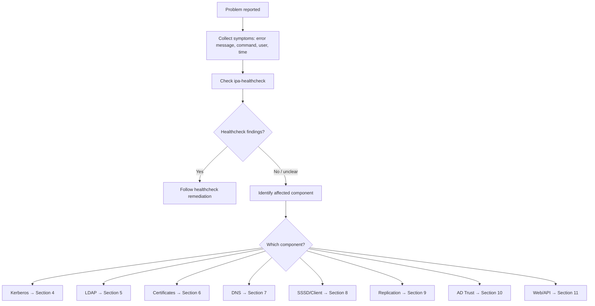
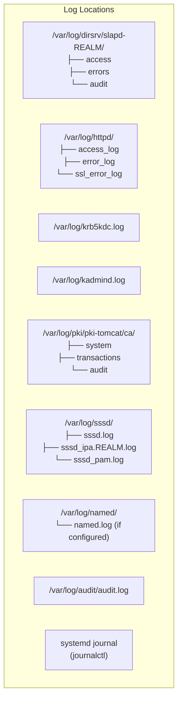
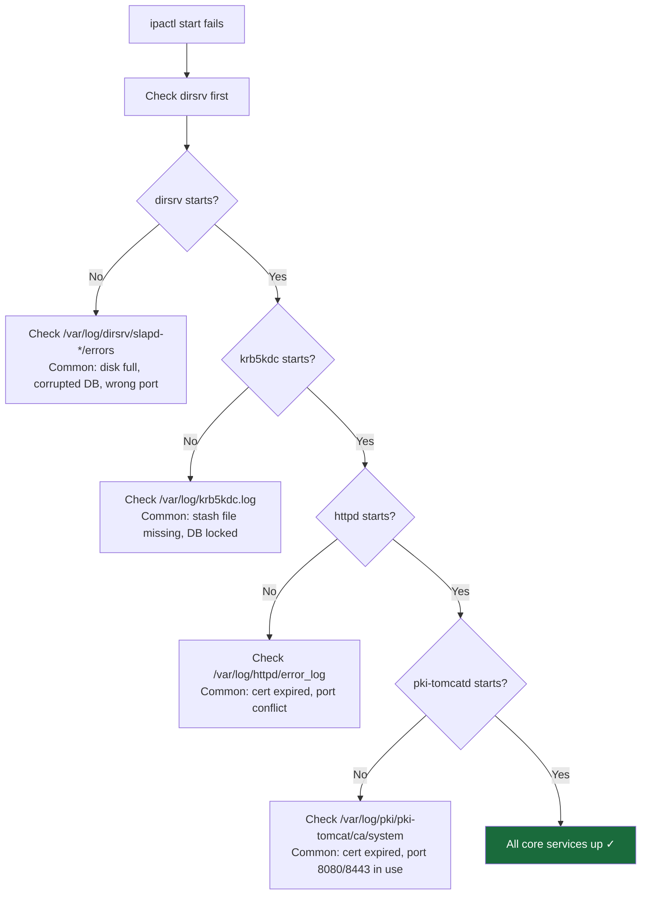
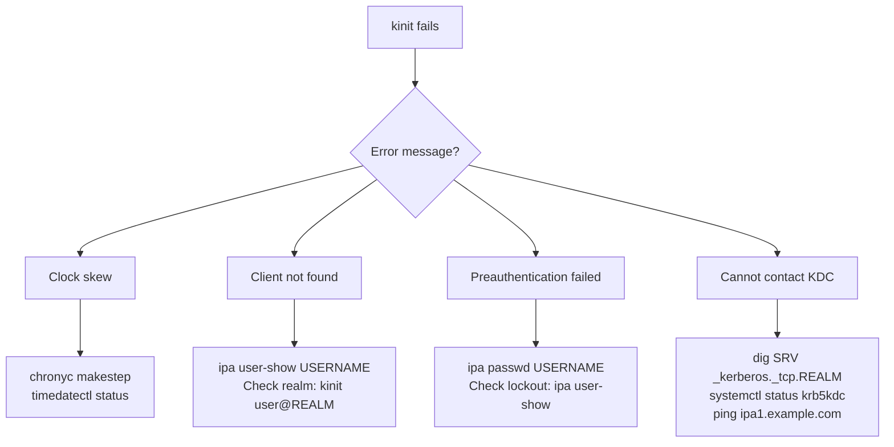
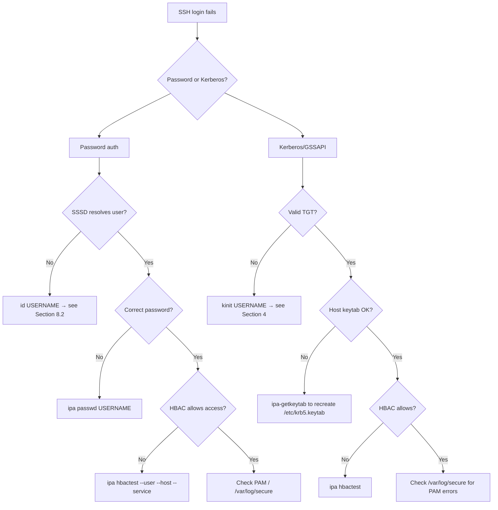

# Module 14 — Troubleshooting

> Systematic diagnosis and resolution of the most common FreeIPA failure scenarios on RHEL 10: service failures, Kerberos errors, replication issues, certificate problems, DNS failures, and client enrollment errors.

## Table of Contents

- [1. Troubleshooting Methodology](#1-troubleshooting-methodology)
- [2. Log Files and Diagnostic Tools](#2-log-files-and-diagnostic-tools)
- [3. Service Failures](#3-service-failures)
- [4. Kerberos Errors](#4-kerberos-errors)
- [5. LDAP and Directory Server Issues](#5-ldap-and-directory-server-issues)
- [6. Certificate and PKI Problems](#6-certificate-and-pki-problems)
- [7. DNS Failures](#7-dns-failures)
- [8. Client Enrollment and SSSD Issues](#8-client-enrollment-and-sssd-issues)
- [9. Replication Problems](#9-replication-problems)
- [10. AD Trust Issues](#10-ad-trust-issues)
- [11. Web UI and API Errors](#11-web-ui-and-api-errors)
- [12. ipa-healthcheck Deep Dive](#12-ipa-healthcheck-deep-dive)
- [13. Lab — Diagnose a Broken IPA Environment](#13-lab--diagnose-a-broken-ipa-environment)

---

## 1. Troubleshooting Methodology

### 1.1 Structured Approach



### 1.2 Information to Collect First

```bash
# Always collect this before diving deeper:

# 1. IPA version
ipa --version

# 2. Server status
sudo ipactl status

# 3. Healthcheck (most comprehensive single command)
sudo ipa-healthcheck --all 2>&1 | tee /tmp/healthcheck-$(date +%Y%m%d).txt

# 4. Kerberos ticket status
kinit admin 2>&1; klist

# 5. Recent errors in journal
sudo journalctl --since "1 hour ago" --priority=err

# 6. Disk space (often the silent killer)
df -h /var /tmp /

# 7. Time sync
chronyc tracking | grep "System time\|RMS offset"
timedatectl status
```

[↑ Back to TOC](#table-of-contents)

---

## 2. Log Files and Diagnostic Tools

### 2.1 Log File Map



### 2.2 Key Diagnostic Commands

| Command | Purpose |
|---------|---------|
| `sudo ipa-healthcheck --all` | Comprehensive health scan |
| `sudo ipactl status` | All IPA service statuses |
| `ipa topologysegment-find dc=...` | Replication topology and agreement status |
| `sudo getcert list` | All certmonger-tracked certs |
| `kinit admin && klist` | Kerberos connectivity test |
| `sudo wbinfo --ping-dc` | AD trust Netlogon test |
| `sudo sss_cache -E` | Flush SSSD cache |
| `dig +short SRV _kerberos._tcp.REALM` | DNS SRV lookup |
| `sudo testparm -s` | Samba config validation |
| `ldapsearch -x -H ldaps://...` | LDAP connectivity test |

### 2.3 Enabling Debug Logging

```bash
# SSSD debug
sudo sss_debuglevel --all 9
sudo systemctl restart sssd
sudo tail -f /var/log/sssd/sssd_example.com.log

# 389-DS access log verbosity (temporary)
sudo ldapmodify -x -H ldap://localhost \
    -D "cn=Directory Manager" -W << 'EOF'
dn: cn=config
changetype: modify
replace: nsslapd-accesslog-level
nsslapd-accesslog-level: 260
EOF

# KDC trace
KRB5_TRACE=/dev/stderr kinit admin 2>&1 | head -50

# Apache SSL debug (RHEL 10 uses mod_ssl — mod_nss was removed)
# In /etc/httpd/conf.d/ssl.conf (or IPA's /etc/httpd/conf.d/ipa.conf), temporarily set:
# LogLevel debug ssl:trace4
sudo systemctl reload httpd
```

[↑ Back to TOC](#table-of-contents)

---

## 3. Service Failures

### 3.1 IPA Services Won't Start

```bash
# Check overall status
sudo ipactl status

# Start all services (IPA-aware ordering)
sudo ipactl start

# If start fails, check each service individually
sudo systemctl status dirsrv@IPA-EXAMPLE-COM.service
sudo systemctl status krb5kdc.service
sudo systemctl status kadmin.service
sudo systemctl status httpd.service
sudo systemctl status pki-tomcatd@pki-tomcat.service
sudo systemctl status named.service
sudo systemctl status sssd.service
```

### 3.2 Service Startup Decision Tree



### 3.3 Common Service Start Errors

```bash
# Error: "Failed to start dirsrv" / DB corruption
sudo db2ldif -n userRoot -a /tmp/userroot-export.ldif \
    -s "dc=ipa,dc=example,dc=com"
# If db2ldif fails: restore from backup

# Error: KDC stash file missing
sudo kdb5_util stash -P 'MasterKey'

# Error: httpd port 443 already in use
# Step 1: identify the owning process/service
sudo ss -tlnp | grep ':443'
# Step 2: stop the owning systemd service (preferred — safer than kill)
# sudo systemctl stop <service-identified-above>
# Step 3: only as last resort if no service owns the socket
# sudo fuser -k 443/tcp  # ⚠️ kills processes abruptly; verify with ss first

# Error: pki-tomcatd certificate expired
# See Section 6 for certificate renewal procedures

# Disk full
df -h /var /tmp
sudo journalctl --vacuum-size=500M
sudo find /var/log -name "*.log.*" -mtime +30 -delete
```

### 3.4 Certmonger Service Issues

```bash
# Check certmonger status
sudo systemctl status certmonger

# List all tracked certs and their status
sudo getcert list

# Cert in NEED_CSR_GEN or CA_UNREACHABLE state
sudo getcert resubmit -i <request-id>

# Force immediate renewal attempt
sudo getcert resubmit -f /var/lib/ipa/certs/httpd.crt

# Check certmonger logs
sudo journalctl -u certmonger --since "1 hour ago"
```

[↑ Back to TOC](#table-of-contents)

---

## 4. Kerberos Errors

### 4.1 Common kinit Errors

| Error | Cause | Fix |
|-------|-------|-----|
| `Client not found in Kerberos database` | User doesn't exist or realm wrong | Check username and realm; `ipa user-show` |
| `KDC reply did not match expectations` | DNS/hostname mismatch | Verify hostname resolves correctly |
| `Clock skew too great` | Time difference > 5 min | `sudo chronyc makestep` |
| `Preauthentication failed` | Wrong password | Reset: `ipa passwd jsmith` |
| `KDC can't fulfill requested option` | Enctype not supported | Check permitted_enctypes in krb5.conf |
| `Cannot contact any KDC` | Network/DNS issue | `dig SRV _kerberos._tcp.EXAMPLE.COM` |
| `Credentials cache: No such file or directory` | ccache missing | `kinit` to create new ccache |
| `Ticket expired` | TGT lifetime exceeded | `kinit` again |
| `Credentials have been revoked` | Account locked/disabled | `ipa user-unlock jsmith` |

### 4.2 Kerberos Diagnostic Flow



### 4.3 KDC Log Analysis

```bash
# Watch KDC log in real time
sudo tail -f /var/log/krb5kdc.log

# Common log patterns:
# AS_REQ success:
# "AS_REQ (4 etypes {18 17 16 23}) 192.168.1.5: ISSUE: authtime ... admin@EXAMPLE.COM"

# Failed pre-auth:
# "AS_REQ (4 etypes ...) 192.168.1.5: PREAUTH_FAILED: admin@EXAMPLE.COM"

# Clock skew:
# "AS_REQ ... CLOCK_SKEW"

# Account locked:
# "AS_REQ ... CLIENT_NOT_FOUND"

# Search for all failures in the last hour
sudo grep -E "FAILED|ERROR|PREAUTH_FAILED|CLOCK_SKEW" \
    /var/log/krb5kdc.log | tail -30
```

### 4.4 Principal and Keytab Issues

```bash
# Verify a service principal exists
ipa service-show host/client1.example.com

# Retrieve/create keytab for a service
ipa-getkeytab -s ipa1.example.com \
    -p host/client1.example.com \
    -k /tmp/client1.keytab

# Test a keytab
kinit -kt /tmp/client1.keytab host/client1.example.com
klist

# Check keytab contents
klist -kt /tmp/client1.keytab

# Verify host keytab on client
sudo klist -kt /etc/krb5.keytab

# Re-create missing host keytab (must run on IPA server as admin)
ipa-getkeytab -s ipa1.example.com \
    -p host/client1.example.com \
    -k /etc/krb5.keytab
```

[↑ Back to TOC](#table-of-contents)

---

## 5. LDAP and Directory Server Issues

### 5.1 LDAP Connectivity Test

```bash
# Test plain LDAP
ldapsearch -x -H ldap://ipa1.example.com \
    -b "dc=ipa,dc=example,dc=com" \
    "(uid=admin)" uid

# Test LDAPS
ldapsearch -x -H ldaps://ipa1.example.com \
    -b "dc=ipa,dc=example,dc=com" \
    "(uid=admin)" uid

# Test with GSSAPI (Kerberos)
kinit admin
ldapsearch -H ldap://ipa1.example.com \
    -Y GSSAPI \
    -b "dc=ipa,dc=example,dc=com" \
    "(uid=admin)" uid
```

### 5.2 389-DS Common Errors

| Error | Log Location | Cause | Fix |
|-------|-------------|-------|-----|
| `Bad authentication` | access log | Wrong DM password or bind DN | Verify credentials |
| `Insufficient access rights` | access log | ACI blocks the operation | Review ACIs; use admin |
| `Size limit exceeded` | access log | Too many results | Add `--sizelimit` or narrow filter |
| `No such object` | access log | Wrong base DN | Verify domain name in base DN |
| `Connection refused` | - | 389-DS not running | `systemctl start dirsrv@REALM` |
| `TLS handshake failure` | errors log | Cert mismatch / TLS version | Check cert validity; crypto policy |
| Database corruption | errors log | Unclean shutdown / disk issue | `db2ldif`, restore backup |

### 5.3 389-DS Error Log Analysis

```bash
# Tail the error log
sudo tail -f /var/log/dirsrv/slapd-IPA-EXAMPLE-COM/errors

# Search for critical errors
sudo grep -iE "CRIT|fatal|error|failed" \
    /var/log/dirsrv/slapd-IPA-EXAMPLE-COM/errors | tail -30

# Check for disk-full errors
sudo grep -i "no space\|disk full\|ENOSPC" \
    /var/log/dirsrv/slapd-IPA-EXAMPLE-COM/errors

# Check replication errors specifically
sudo grep -i "repl\|replicate\|Consumer" \
    /var/log/dirsrv/slapd-IPA-EXAMPLE-COM/errors | tail -20
```

### 5.4 LDAP Database Recovery

```bash
# Export LDAP data before any recovery attempt
sudo systemctl stop dirsrv@IPA-EXAMPLE-COM.service

# Export to LDIF
sudo db2ldif -n userRoot \
    -a /var/lib/ipa/backup/emergency-$(date +%Y%m%d).ldif \
    -s "dc=ipa,dc=example,dc=com"

# Run database consistency check
sudo db2index -n userRoot

# If corruption detected — restore from backup
sudo ipa-restore /var/lib/ipa/backup/ipa-full-YYYY-MM-DD-HH-MM-SS

sudo systemctl start dirsrv@IPA-EXAMPLE-COM.service
```

[↑ Back to TOC](#table-of-contents)

---

## 6. Certificate and PKI Problems

### 6.1 Certificate Expiry

```bash
# Check all certmonger-tracked certs
sudo getcert list

# Look for MONITORING (good) vs CA_UNREACHABLE, NEED_CSR_GEN, etc.
sudo getcert list | grep -B5 -A2 -v "status: MONITORING"

# Check specific cert expiry dates
for f in /var/lib/ipa/certs/*.crt /etc/httpd/alias/*.crt 2>/dev/null; do
    echo "=== $f ==="
    openssl x509 -in "$f" -noout -subject -dates 2>/dev/null
done

# IPA CA cert expiry
openssl x509 -in /etc/ipa/ca.crt -noout -dates

# Dogtag-tracked certs
openssl x509 \
    -in /var/lib/pki/pki-tomcat/conf/alias/Server-Cert.crt \
    -noout -dates 2>/dev/null
```

### 6.2 Renewing Expired Service Certificates

```bash
# Force renewal of a specific cert
sudo getcert resubmit -i <request-id>

# Force renewal by file path
sudo getcert resubmit -f /var/lib/ipa/certs/httpd.crt

# If renewal fails with CA_UNREACHABLE — check pki-tomcatd
sudo systemctl status pki-tomcatd@pki-tomcat.service
sudo journalctl -u pki-tomcatd@pki-tomcat --since "1 hour ago"

# Check CA is actually responding
curl -sk https://ipa1.example.com/ca/ee/ca/ | head -20

# Restart Dogtag if needed
sudo systemctl restart pki-tomcatd@pki-tomcat.service
# Wait 60 seconds, then retry:
sudo getcert resubmit -i <request-id>
```

### 6.3 Renewing the IPA CA Certificate

```bash
# Check IPA CA cert expiry
ipa cert-show 1 --out=/tmp/ipa-ca.crt
openssl x509 -in /tmp/ipa-ca.crt -noout -dates

# The IPA CA cert is renewed by certmonger on the renewal master
# Check renewal master
ipa config-show | grep "CA renewal master"

# On the renewal master, force renewal:
sudo getcert list | grep "IPA CA"
# Find the request ID for IPA CA, then:
sudo getcert resubmit -i <ipa-ca-request-id>

# Monitor renewal
sudo getcert list -i <ipa-ca-request-id>
# Wait for: "status: MONITORING" and a future expiry date
```

### 6.4 Certificate Profile Errors

```bash
# Error: "Certificate request rejected: ..."
# Check Dogtag audit log for details
sudo tail -100 /var/log/pki/pki-tomcat/ca/audit

# Error: "Profile not found"
ipa certprofile-find   # List available profiles
ipa certprofile-show caIPAserviceCert  # Verify profile exists

# Error: "Key usage extension is missing"
# The CSR must include the correct key usage for the profile
# Re-generate CSR with proper extensions
openssl req -new -key service.key \
    -out service.csr \
    -reqexts SAN \
    -config <(cat /etc/pki/tls/openssl.cnf; echo "[SAN]\nsubjectAltName=DNS:service.example.com")
```

### 6.5 CRL Issues

```bash
# Check if CRL master is generating CRLs
ipa config-show | grep "CA renewal master"

# Verify CRL accessibility
curl -s http://ipa1.example.com/ipa/crl/MasterCRL.bin | \
    openssl crl -inform DER -noout -lastupdate -nextupdate

# CRL should update every 4 hours (default)
# If stale: check pki-tomcatd on the CRL master
sudo grep "crl.MasterCRL.enable=true" \
    /etc/pki/pki-tomcat/ca/CS.cfg
```

[↑ Back to TOC](#table-of-contents)

---

## 7. DNS Failures

### 7.1 DNS Diagnostic Checklist

```bash
# 1. Check named service
sudo systemctl status named

# 2. Verify bind-dyndb-ldap plugin loads
sudo named-checkconf /etc/named.conf
sudo journalctl -u named --since "10 min ago"

# 3. Test IPA internal DNS
dig @localhost ipa1.example.com A
dig @localhost -t SRV _kerberos._tcp.example.com

# 4. Test from client
dig @192.168.1.10 ipa1.example.com

# 5. Test reverse lookup
dig -x 192.168.1.10 @192.168.1.10
```

### 7.2 Common DNS Errors

| Error | Cause | Fix |
|-------|-------|-----|
| `SERVFAIL` | named stopped or bind-dyndb-ldap error | `systemctl restart named` |
| `NXDOMAIN` | Record doesn't exist | Add record: `ipa dnsrecord-add ...` |
| `REFUSED` | Client not in allowed recursion list | Check `allow-recursion` in named.conf |
| `connection timed out` | Firewall blocking port 53 | `firewall-cmd --add-service=dns` |
| SRV records missing | Not added at install | `ipa-server-install --setup-dns` or `ipa dnsrecord-add` |
| Forwarder not working | Wrong IP or port blocked | Test: `dig @forwarder_ip external.domain` |

### 7.3 bind-dyndb-ldap Issues

```bash
# Check if 389-DS is accessible to named
sudo -u named ldapsearch -x -H ldap://localhost \
    -b "cn=dns,dc=ipa,dc=example,dc=com" \
    "(objectClass=idnsZone)" idnsName | head -20

# Check named LDAP config
sudo cat /etc/named/ipa-ext.conf

# Error: "LDAP error: Can't contact LDAP server"
# Fix: ensure 389-DS is running before named
sudo systemctl status dirsrv@IPA-EXAMPLE-COM.service

# Restart named after 389-DS is confirmed running
sudo systemctl restart named
```

### 7.4 DNSSEC Troubleshooting

```bash
# Check DNSSEC signing status
ipa dnszone-show ipa1.example.com | grep -i "DNSSEC\|key"

# Check DNSSEC keys exist
ipa dnskey-find ipa1.example.com 2>/dev/null | head -5

# Verify DNSSEC validation
dig +dnssec ipa1.example.com @localhost | grep -E "RRSIG|AD flag"

# Check key rollover status
ipa dnsseckey-find ipa1.example.com 2>/dev/null

# OpenDNSSEC daemon
sudo systemctl status ods-enforcerd ods-signerd
sudo journalctl -u ods-enforcerd -u ods-signerd --since "1 hour ago"
```

[↑ Back to TOC](#table-of-contents)

---

## 8. Client Enrollment and SSSD Issues

### 8.1 ipa-client-install Failures

```bash
# Common failure: DNS not resolving IPA server
# Error: "Cannot find IPA master"
dig +short SRV _ldap._tcp.example.com   # Must return IPA server
nslookup ipa1.example.com

# Fix: specify server explicitly
sudo ipa-client-install \
    --server=ipa1.example.com \
    --domain=ipa1.example.com \
    --realm=EXAMPLE.COM \
    --principal=admin \
    --password='AdminPassword123!'

# Common failure: Time skew
# Fix: sync time before enrolling
sudo chronyc makestep

# Common failure: Host already enrolled
# Error: "Host already enrolled in an IPA domain"
# Fix: unenroll first (⚠️ irreversible — removes client config) or use --force
sudo ipa-client-install --uninstall
sudo ipa-client-install ...
```

### 8.2 SSSD Not Resolving Users

```bash
# Test: can SSSD resolve an IPA user?
id jsmith
getent passwd jsmith

# If failing:
# Step 1: Check SSSD is running
sudo systemctl status sssd

# Step 2: Check SSSD config
sudo sssctl config-check

# Step 3: Flush SSSD cache
sudo sss_cache -E
sudo systemctl restart sssd

# Step 4: Check SSSD domain log
sudo tail -50 /var/log/sssd/sssd_example.com.log

# Step 5: Enable debug and retry
sudo sss_debuglevel --all 9
sudo systemctl restart sssd
id jsmith
sudo tail -100 /var/log/sssd/sssd_example.com.log
```

### 8.3 SSSD Offline Mode Issues

```bash
# SSSD offline: IPA server unreachable
sudo sssctl domain-status ipa1.example.com

# Check what servers SSSD knows about
sudo sssctl server-list ipa1.example.com

# Force online re-check
sudo sssctl domain-status ipa1.example.com --active-server

# Manually force server discovery
sudo sss_cache -E
sudo systemctl restart sssd
```

### 8.4 SSH Login Failures (IPA Client)



```bash
# Check PAM authentication log
sudo tail -50 /var/log/secure | grep -E "sshd|pam_sss|pam_unix"

# Test HBAC rule
ipa hbactest \
    --user=jsmith \
    --host=client1.example.com \
    --service=sshd
```

[↑ Back to TOC](#table-of-contents)

---

## 9. Replication Problems

### 9.1 Replication Lag Detection

```bash
# Check replication status via 389-DS LDAP monitor (modern approach)
sudo ldapsearch -x -H ldap://localhost \
    -D "cn=Directory Manager" -W \
    -b "cn=monitor" \
    "(objectClass=nsds5replicationagreement)" \
    nsds5replicaLastUpdateStatus \
    nsds5replicaLastUpdateEnd \
    nsds5replicaUpdateInProgress

# Check via 389-DS monitor
sudo ldapsearch -x -H ldap://localhost \
    -D "cn=Directory Manager" -W \
    -b "cn=monitor" \
    "(objectClass=nsds5replicationagreement)" \
    nsds5replicaLastUpdateStatus \
    nsds5replicaLastUpdateEnd \
    nsds5replicaUpdateInProgress

# Healthy: "0 Replica acquired successfully: Incremental update succeeded"
# Problem: anything non-zero
```

### 9.2 Replication Error Codes

| Status Code | Meaning | Fix |
|------------|---------|-----|
| `0 … succeeded` | OK | None |
| `1 Can't acquire busy replica` | Peer busy | Wait and retry |
| `19 Replication error … Busy` | Peer busy | Wait and retry |
| `81 … Can't contact LDAP server` | Network issue | Check 389-DS on peer |
| `82 … Local error` | TLS/cert issue | Check cert validity on peer |
| `32 … No such object` | Schema mismatch | Run `ipa-ldap-updater --all` |
| `-1 Fatal replication error` | Severe | Check errors log; may need re-init |

### 9.3 Re-initializing Replication

```bash
# Re-initialize from a healthy replica (rebuilds all data on target)
# WARNING: destructive — target loses all local changes

# Modern approach: use ipa-replica-manage re-initialize (low-level 389-DS tool,
# still functional for full re-init when topology API is insufficient):
# From the TARGET replica:
sudo ipa-replica-manage -p 'DM_Password' re-initialize \
    --from=ipa1.example.com

# Alternatively, use the 389-DS nsds5replicaEnabled toggle to trigger re-init:
# sudo ldapmodify -x -H ldap://localhost -D "cn=Directory Manager" -W <<'EOF'
# dn: cn=<agreement>,cn=replica,...
# changetype: modify
# replace: nsds5replicaEnabled
# nsds5replicaEnabled: off
# -
# replace: nsds5replicaEnabled
# nsds5replicaEnabled: on
# EOF

# Force sync (triggers an immediate replication cycle):
sudo ipa-replica-manage -p 'DM_Password' force-sync \
    --from=ipa1.example.com

# Monitor progress
sudo ldapsearch -x -H ldap://localhost \
    -D "cn=Directory Manager" -W \
    -b "cn=monitor" \
    "nsds5replicaUpdateInProgress=TRUE" \
    nsds5replicaUpdateInProgress
```

### 9.4 Topology Disconnect Detection

```bash
# Verify topology is connected
ipa topologysuffix-verify domain
ipa topologysuffix-verify ca

# If disconnected: add segments to connect isolated replicas
ipa topologysegment-add domain \
    --leftnode=ipa-isolated.example.com \
    --rightnode=ipa1.example.com \
    --direction=both
```

[↑ Back to TOC](#table-of-contents)

---

## 10. AD Trust Issues

### 10.1 Trust Establishment Failures

```bash
# Error during ipa trust-add: "Cannot find AD domain"
# Check DNS forwarder for AD domain
dig +short SRV _ldap._tcp.ad.example.com
# If empty: fix the DNS forward zone
ipa dnsforwardzone-show ad.example.com

# Error: "Kerberos authentication failed"
# Check that IPA server can reach AD KDC
nc -zv dc1.ad.example.com 88

# Error: "NT_STATUS_ACCESS_DENIED"
# The AD admin account may lack trust creation rights
# Use Domain Admin or add to "Domain Admins" group

# Error: "Trust already exists"
ipa trust-del ad.example.com
ipa trust-add ad.example.com --admin=Administrator --password --type=ad
```

### 10.2 AD User Lookup Failures

```bash
# Cannot resolve AD user: id aduser@ad.example.com
# Step 1: Check winbind
sudo wbinfo --ping-dc --domain=ad.example.com
# If fails: check smb/winbind services

# Step 2: Check SSSD knows about AD subdomain
sudo sssctl domain-status ad.example.com

# Step 3: Flush SSSD cache
sudo sss_cache -E -d ad.example.com
sudo systemctl restart sssd

# Step 4: Check ID range
ipa idrange-show 'AD.EXAMPLE.COM_id_range'
# Verify BaseID doesn't conflict with IPA range

# Step 5: Debug SSSD
sudo sss_debuglevel --all 9
sudo systemctl restart sssd
id aduser@ad.example.com
sudo tail -100 /var/log/sssd/sssd_ad.example.com.log
```

[↑ Back to TOC](#table-of-contents)

---

## 11. Web UI and API Errors

### 11.1 Web UI Inaccessible

```bash
# Check Apache/httpd
sudo systemctl status httpd

# Check Apache error log
sudo tail -30 /var/log/httpd/error_log
sudo tail -30 /var/log/httpd/ssl_error_log

# Common causes:
# 1. httpd cert expired — check with getcert list
# 2. SELinux blocking httpd — ausearch -m avc | grep httpd
# 3. Port 443 not open — firewall-cmd --list-all
# 4. mod_ssl misconfiguration (mod_nss was removed in RHEL 10; IPA uses mod_ssl)

# Test HTTP redirect
curl -v http://ipa1.example.com/
# Should redirect to HTTPS

# Test HTTPS
curl -k https://ipa1.example.com/ipa/ui/ | head -20
```

### 11.2 API / CLI Errors

```bash
# Error: "did not receive Kerberos credentials"
# Fix: obtain a TGT first
kinit admin
ipa user-find | head -5

# Error: "Kerberos credentials expired"
kinit admin   # renew

# Error: "Certificate verify failed"
# IPA CA cert not trusted by client
sudo cp /etc/ipa/ca.crt /etc/pki/ca-trust/source/anchors/ipa-ca.crt
sudo update-ca-trust extract

# Error: "Connection refused" / "Unable to connect to IPA server"
# Check if IPA is running
sudo ipactl status

# Error: "Invalid credentials" in web UI
# Session expired — log out and back in
# Check /var/log/httpd/error_log for Kerberos errors
```

### 11.3 Checking the Dogtag CA Web UI

```bash
# CA web UI is at https://ipa1:8443/ca/ee/ca/
# If inaccessible:
sudo systemctl status pki-tomcatd@pki-tomcat.service

# Check Dogtag system log
sudo tail -30 /var/log/pki/pki-tomcat/ca/system

# Test CA health
curl -sk https://ipa1.example.com:8443/ca/admin/ca/getStatus | \
    python3 -m json.tool 2>/dev/null || \
    echo "CA not responding — check pki-tomcatd"
```

[↑ Back to TOC](#table-of-contents)

---

## 12. ipa-healthcheck Deep Dive

### 12.1 Running Targeted Checks

```bash
# List all available check sources
sudo ipa-healthcheck --list-sources

# Run specific sources
sudo ipa-healthcheck --source ipahealthcheck.ipa.certs
sudo ipa-healthcheck --source ipahealthcheck.ds.replication
sudo ipa-healthcheck --source ipahealthcheck.ipa.roles
sudo ipa-healthcheck --source ipahealthcheck.ipa.topology
sudo ipa-healthcheck --source ipahealthcheck.ipa.trust
sudo ipa-healthcheck --source ipahealthcheck.ipa.dns
sudo ipa-healthcheck --source ipahealthcheck.meta.services
```

### 12.2 Understanding Output

```bash
# JSON output for scripting
sudo ipa-healthcheck --all --output-type json > /tmp/hc.json

# Parse with Python
python3 << 'EOF'
import json
with open('/tmp/hc.json') as f:
    data = json.load(f)

for check in data:
    if check['result'] != 'SUCCESS':
        print(f"[{check['result']}] {check['source']}.{check['check']}")
        if check.get('msg'):
            print(f"  → {check['msg']}")
        for k, v in check.get('kw', {}).items():
            print(f"  {k}: {v}")
        print()
EOF
```

### 12.3 Common ipa-healthcheck Findings and Fixes

| Check | Common Result | Fix |
|-------|--------------|-----|
| `ipahealthcheck.ipa.certs.IPACertRevocation` | WARNING/ERROR | `getcert resubmit` |
| `ipahealthcheck.ipa.certs.IPACertExpiration` | WARNING | Renew cert before expiry |
| `ipahealthcheck.ds.replication.ReplicationConflictCheck` | WARNING | Resolve conflict entries in LDAP |
| `ipahealthcheck.ipa.topology.IPATopologyErrors` | ERROR | Add topology segments |
| `ipahealthcheck.ipa.roles.IPACRLManagerRunningCheck` | ERROR | Fix CRL master config |
| `ipahealthcheck.meta.services.ServiceCheck` | ERROR | `systemctl restart <service>` |
| `ipahealthcheck.ipa.dns.IPADNSSystemRecordsCheck` | WARNING | Verify DNS SRV records |

### 12.4 Scheduling ipa-healthcheck

```bash
# Create a systemd timer for daily health checks
sudo tee /etc/systemd/system/ipa-healthcheck.service << 'EOF'
[Unit]
Description=IPA Health Check
After=ipa.service

[Service]
Type=oneshot
ExecStart=/usr/bin/ipa-healthcheck --all --output-type json --output-file /var/log/ipa/healthcheck.json
EOF

sudo tee /etc/systemd/system/ipa-healthcheck.timer << 'EOF'
[Unit]
Description=Run IPA Health Check daily

[Timer]
OnCalendar=daily
Persistent=true

[Install]
WantedBy=timers.target
EOF

sudo systemctl daemon-reload
sudo systemctl enable --now ipa-healthcheck.timer
```

[↑ Back to TOC](#table-of-contents)

---

## 13. Lab — Diagnose a Broken IPA Environment

> **Scenario:** A colleague reports that users cannot log in. IPA services appear to be running but authentication is failing. Work through the diagnosis systematically.

### Lab 13.1 — Initial Triage

```bash
# Run the comprehensive healthcheck first
sudo ipa-healthcheck --all --output-type human 2>&1 | tee /tmp/lab-hc.txt
grep -E "ERROR|WARNING|CRITICAL" /tmp/lab-hc.txt

# Check all service status
sudo ipactl status

# Check recent journal errors
sudo journalctl --since "1 hour ago" --priority=err | head -50

# Check disk space (common silent failure)
df -h /var /tmp /
```

### Lab 13.2 — Test Kerberos

```bash
# Try to get a ticket
kinit admin
# Note the exact error message

# Check KDC is responding
nc -zv ipa1.example.com 88 && echo "KDC port open"

# Check clock
timedatectl status
chronyc tracking | grep "System time"

# If clock skew issue:
sudo chronyc makestep
kinit admin
```

### Lab 13.3 — Test LDAP

```bash
# Test LDAP connectivity
ldapsearch -x -H ldap://ipa1.example.com \
    -b "dc=ipa,dc=example,dc=com" \
    "(uid=admin)" uid 2>&1

# Test with auth
ldapsearch -x -H ldaps://ipa1.example.com \
    -D "uid=admin,cn=users,cn=accounts,dc=ipa,dc=example,dc=com" \
    -W -b "dc=ipa,dc=example,dc=com" \
    "(uid=admin)" uid 2>&1 | head -10
```

### Lab 13.4 — Check Certificates

```bash
# Quick cert check
sudo getcert list | grep -E "status:|expires:"

# Look for anything not MONITORING
sudo getcert list | grep -B5 -v "status: MONITORING" | grep -E "status:|Request ID:|File:"

# Check IPA CA cert
openssl x509 -in /etc/ipa/ca.crt -noout -dates

# If a cert is expired and causing login failure:
sudo getcert resubmit -i <id>
# Wait and check:
sudo getcert list -i <id>
```

### Lab 13.5 — Test User Resolution on Client

```bash
# On a client host:
sudo sss_cache -E
sudo systemctl restart sssd

# Test user lookup
id jsmith
getent passwd jsmith

# Test HBAC
kinit admin@EXAMPLE.COM
ipa hbactest \
    --user=jsmith \
    --host=$(hostname) \
    --service=sshd

# Review SSSD log
sudo tail -50 /var/log/sssd/sssd_example.com.log | \
    grep -iE "error|fail|warn"
```

### Lab 13.6 — Resolve and Verify Fix

```bash
# After identifying and fixing the root cause:

# Re-run healthcheck to confirm issues resolved
sudo ipa-healthcheck --all --output-type human 2>&1 | \
    grep -E "ERROR|WARNING|CRITICAL"
# Target: 0 ERRORs, minimal WARNINGs

# Confirm user login works
ssh -v jsmith@client1.example.com 2>&1 | \
    grep -E "Authenticated|denied|Permission|GSSAPI"

# Document findings
echo "Root cause: $(date)" >> /var/log/ipa/incident-$(date +%Y%m%d).log
```

[↑ Back to TOC](#table-of-contents)
