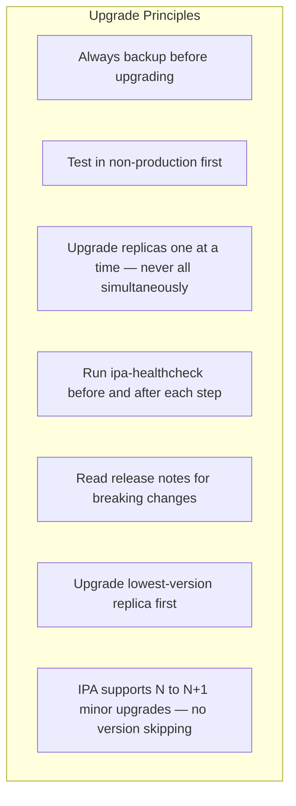
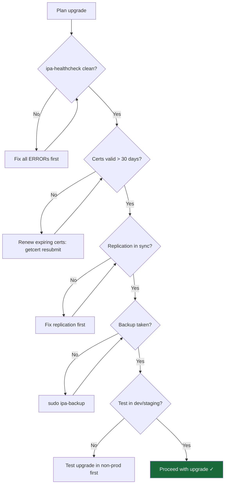
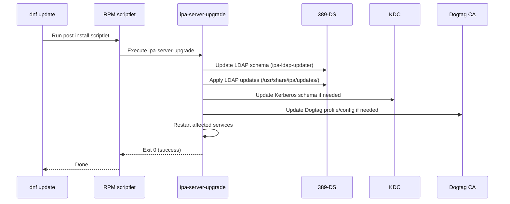
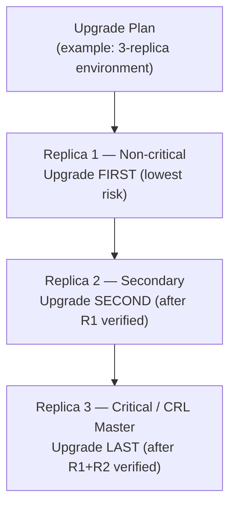
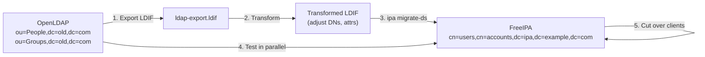
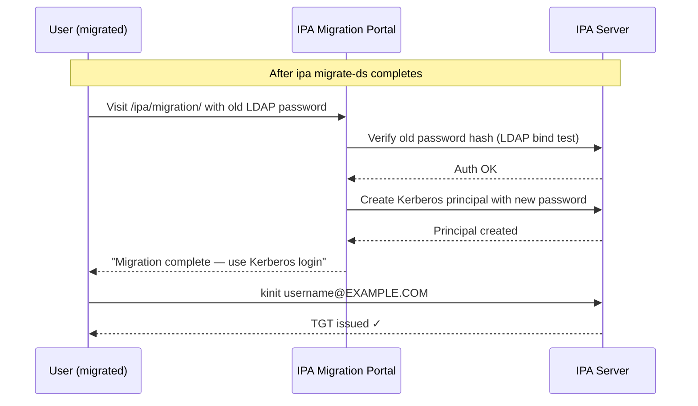
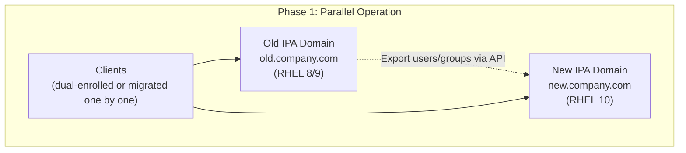
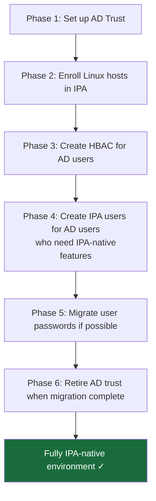

# Module 15 — Upgrade and Migration
[](./LICENSE.md)
[](https://access.redhat.com/products/red-hat-enterprise-linux)
[](https://www.freeipa.org)

> Safe upgrade procedures for FreeIPA on RHEL 10, RHEL minor-version upgrades, migrating from legacy LDAP/NIS/AD environments, and migrating between IPA domains on RHEL 10.

## Table of Contents

- [Recommended Background](#recommended-background)
- [Learning Outcomes](#learning-outcomes)
- [1. Upgrade Philosophy and Strategy](#1-upgrade-philosophy-and-strategy)
- [2. Pre-Upgrade Checklist](#2-pre-upgrade-checklist)
- [3. RHEL Minor-Version Upgrade with IPA](#3-rhel-minor-version-upgrade-with-ipa)
- [4. FreeIPA In-Place Upgrade](#4-freeipa-in-place-upgrade)
- [4.4 Re-Run or Roll Back Decision](#44-re-run-or-roll-back-decision)
- [5. Rolling Replica Upgrade](#5-rolling-replica-upgrade)
- [6. Post-Upgrade Verification](#6-post-upgrade-verification)
- [7. Migrating from OpenLDAP](#7-migrating-from-openldap)
- [8. Migrating from NIS](#8-migrating-from-nis)
- [9. Migrating Between IPA Domains](#9-migrating-between-ipa-domains)
- [10. Migration from Active Directory](#10-migration-from-active-directory)
- [11. Rollback Procedures](#11-rollback-procedures)
- [12. Lab — Rolling Upgrade and Migration Dry-Run](#12-lab--rolling-upgrade-and-migration-dry-run)
- [Key Takeaways](#key-takeaways)


---

## Recommended Background

- Complete Modules 00 through 14.
- Verified backups, healthy replication, and a maintenance window or lab environment.
- Comfort with package management, rollback planning, and data migration concepts.

## Learning Outcomes

By the end of this module, you should be able to:

- Plan and execute rolling upgrades without breaking replica availability.
- Verify post-upgrade health and decide when to continue or roll back.
- Use the supported migration tools and patterns for OpenLDAP, NIS, IPA, and AD.
- Translate upgrade strategy into concrete go/no-go checks.

---

## 1. Upgrade Philosophy and Strategy

### 1.1 Core Principles



### 1.2 Upgrade Types

| Type | Scope | Risk | Downtime |
|------|-------|------|----------|
| **dnf update** (RHEL minor) | OS packages including FreeIPA | Low–Medium | Rolling, near-zero |
| **FreeIPA version upgrade** | IPA packages and schema | Medium | Rolling, near-zero |
| **RHEL major version** | Full OS replacement | High | Per-server |
| **Domain migration** | Move to new IPA domain | High | Phased |

### 1.3 Version Support Matrix (RHEL 10)

| RHEL Version | FreeIPA Version | Dogtag | Python |
|-------------|-----------------|--------|--------|
| RHEL 10.0+ | 4.12.x | 11.x | 3.12 |

> RHEL 10 ships only FreeIPA 4.12.x — no older IPA versions. Cross-version upgrade paths (e.g., RHEL 9 → RHEL 10) involve an OS migration, not just a package upgrade.

[↑ Back to TOC](#table-of-contents)

---

## 2. Pre-Upgrade Checklist

### 2.1 Pre-Upgrade Health Assessment

```bash
# 1. Verify current state is healthy before upgrading anything
sudo ipa-healthcheck --all --output-type human 2>&1 | \
    grep -E "ERROR|WARNING|CRITICAL"
# Target: 0 ERRORs. Resolve before proceeding.

# 2. Check replication is in sync
ipa topologysuffix-verify dc=ipa,dc=example,dc=com
ipa topologysegment-find dc=ipa,dc=example,dc=com

# 3. Check certificate validity (don't upgrade with near-expiry certs)
sudo getcert list | grep -E "expires:|status:"

# 4. Verify all replicas are reachable
ipa server-find | grep "Server name"
for server in ipa1.example.com ipa2.example.com; do
    echo -n "$server: "
    nc -zv $server 389 2>&1 | grep -E "open|refused"
done

# 5. Check disk space (upgrades require free space)
df -h / /var /tmp
# Require at minimum: 2 GB free on /, 1 GB on /var

# 6. Take a full backup
sudo ipa-backup
ls -lh /var/lib/ipa/backup/
```

### 2.2 Pre-Upgrade Decision Tree



### 2.3 Notify Users

```bash
# Schedule a maintenance window
# Send notification email (example via mailx)
echo "FreeIPA upgrade scheduled: $(date -d 'next Saturday 02:00' '+%Y-%m-%d %H:%M')
Authentication will remain available via replicas during upgrade.
Expected downtime per server: ~15-30 minutes." | \
    mail -s "IPA Maintenance Notice" it-announce@example.com
```

[↑ Back to TOC](#table-of-contents)

---

## 3. RHEL Minor-Version Upgrade with IPA

### 3.1 RHEL Minor Version Upgrade Process

RHEL minor version upgrades (e.g., 10.0 → 10.1) are handled by `dnf update`. IPA packages are updated as part of this.

```bash
# Check what will be updated
sudo dnf check-update | grep -E "ipa|dirsrv|pki|sssd|krb5|samba"

# Review IPA-specific package updates
sudo dnf changelog ipa-server 2>/dev/null | head -50
```

### 3.2 Rolling Minor Version Upgrade

```bash
# Upgrade ONE replica at a time
# NEVER upgrade all replicas simultaneously

# Step 1: Identify the upgrade order
# Upgrade non-critical replicas first, leave the most critical for last

# Step 2: On the replica to upgrade:

# Verify pre-upgrade health
sudo ipa-healthcheck --all | grep -c '"result": "SUCCESS"'

# Apply updates
sudo dnf update -y

# Reboot if kernel was updated
sudo needs-restarting -r && echo "No reboot needed" || sudo reboot

# After reboot:
sudo ipactl status

# Run post-upgrade tasks (IPA auto-runs these, but verify)
sudo ipa-server-upgrade
# Output: "Update complete"

# Run healthcheck
sudo ipa-healthcheck --all | grep -E "ERROR|CRITICAL"

# Step 3: Verify replication still works from a different replica
ipa user-add upgrade-test --first=Upgrade --last=Test
# Verify it appears on other replicas within seconds

# Step 4: Move to next replica
ipa user-del upgrade-test
```

### 3.3 ipa-server-upgrade Details

`ipa-server-upgrade` runs automatically during `dnf update` via a package scriptlet. It:

1. Updates the 389-DS schema
2. Runs LDAP migrations (`ipa-ldap-updater`)
3. Updates Kerberos database schema if needed
4. Updates Dogtag CA configuration
5. Updates Apache/IPA configuration files

```bash
# Run manually if scriptlet failed or to verify
sudo ipa-server-upgrade

# Check what was done
sudo journalctl -u ipa-server-upgrade --since "today"
```

[↑ Back to TOC](#table-of-contents)

---

## 4. FreeIPA In-Place Upgrade

### 4.1 Upgrading FreeIPA Packages Only

When Red Hat releases a new FreeIPA point release within RHEL 10:

```bash
# Check available FreeIPA versions
sudo dnf list --available ipa-server

# Apply FreeIPA-specific update (RHEL 10 package names use 'ipa-' prefix)
sudo dnf update ipa-server \
               ipa-server-common \
               ipa-server-dns \
               ipa-server-trust-ad \
               ipa-client \
               python3-ipaserver \
               python3-ipaclient

# ipa-server-upgrade runs automatically
# Verify:
sudo ipactl status
sudo ipa-healthcheck --all | grep -E "ERROR|CRITICAL"
```

### 4.2 Schema Update Process



### 4.3 Handling Upgrade Failures

```bash
# If ipa-server-upgrade fails mid-run:

# Check the log
sudo journalctl -u ipa-server-upgrade
sudo cat /var/log/ipaupgrade.log

# Common fixes:
# 1. Not enough disk space
df -h /var
# Free up space, then re-run:
sudo ipa-server-upgrade

# 2. 389-DS not running
sudo systemctl start dirsrv@IPA-EXAMPLE-COM.service
sudo ipa-server-upgrade

# 3. Kerberos auth failure during upgrade
# Ensure admin TGT or use DM credentials:
sudo ipa-server-upgrade --debug

# 4. Schema conflict
# Usually requires Red Hat support — do not manually edit schema
```

### 4.4 Re-Run or Roll Back Decision

Use a simple go/no-go rule after a failed in-place upgrade:

- Re-run `ipa-server-upgrade` only after the underlying cause is identified and corrected.
- Roll back to backup when core services stay down, schema changes are incomplete, or replication no longer verifies cleanly.
- Do not continue to the next replica until the current node is healthy and post-upgrade checks pass.

```bash
# Minimum go/no-go checks before proceeding
ipactl status
ipa-healthcheck --all | grep -E "ERROR|CRITICAL"
ipa topologysuffix-verify domain
```

[↑ Back to TOC](#table-of-contents)

---

## 5. Rolling Replica Upgrade

### 5.1 Upgrade Order Strategy



### 5.2 Upgrade Order Decision Matrix

| Replica trait | Score | Upgrade guidance |
|--------------|-------|------------------|
| Handles CRL or CA renewal master duties | 5 | Upgrade late, after other replicas are validated |
| Serves most client traffic or DNS SRV weight | 3 | Upgrade after a quieter replica proves healthy |
| Hosts unique integration points or external dependencies | 2 | Upgrade only after rollback is clear |
| Low client load and no special roles | 1 | Best candidate for the first upgrade |

Start with the lowest-score replica, keep the highest-score replica for last, and document why each server landed in that order before the maintenance window begins.

### 5.3 Step-by-Step Rolling Upgrade

```bash
## === ON EACH REPLICA (one at a time) ===

# --- PRE-UPGRADE (per replica) ---
SERVER=ipa2.example.com

# 1. Verify replication is healthy
ipa topologysuffix-verify dc=ipa,dc=example,dc=com

# 2. Check clients are using OTHER replicas (no single point of failure)
# DNS SRV weight/priority should distribute clients

# --- UPGRADE ---

# 3. Apply OS updates on this replica
sudo dnf update -y

# 4. Reboot if kernel updated
sudo needs-restarting -r || sudo reboot

# 5. Verify IPA is up after reboot
sudo ipactl status

# 6. Run post-upgrade verification
sudo ipa-healthcheck --all | grep -E "ERROR|CRITICAL"

# 7. Test authentication via this replica specifically
KRB5_CONFIG=/etc/krb5.conf kinit admin@EXAMPLE.COM
klist

# --- VERIFY REPLICATION AFTER UPGRADE ---

# 8. Verify change replication (from a different replica)
ipa user-add postupgrade-test-$(hostname -s) \
    --first=Post --last=Upgrade
# Check it appears on other replicas
sleep 10
ssh ipa1.example.com \
    "ipa user-show postupgrade-test-$(hostname -s)"

# 9. Clean up test user
ipa user-del postupgrade-test-$(hostname -s)

# --- PROCEED TO NEXT REPLICA ---
```

### 5.4 Mixed-Version Compatibility

FreeIPA supports a brief **mixed-version window** during rolling upgrades. Within a single point-release series (e.g., 4.12.0 → 4.12.1), all replicas can continue to operate while upgrades are in progress.

> **Note:** Complete all replica upgrades within a reasonable time window. Do not leave replicas at different versions for more than a day or two.

[↑ Back to TOC](#table-of-contents)

---

## 6. Post-Upgrade Verification

### 6.1 Full Verification Checklist

```bash
# Run on each upgraded server and from clients

# 1. All services running
sudo ipactl status

# 2. ipa-healthcheck clean
sudo ipa-healthcheck --all --output-type human

# 3. Replication functional
ipa topologysuffix-verify domain
ipa topologysuffix-verify ca

# 4. CA issuing certificates
ipa cert-request \
    --principal=host/test-post-upgrade.example.com \
    /dev/stdin < /dev/null 2>/dev/null || \
    echo "Note: need a valid CSR — check CA is responding"

# 5. DNS resolving
dig +short ipa1.example.com
dig +short SRV _kerberos._tcp.example.com

# 6. Kerberos authentication
kinit admin
klist

# 7. IPA CLI functional
ipa user-find | tail -3
ipa host-find | tail -3

# 8. Web UI accessible
curl -sk https://ipa1.example.com/ipa/ui/ | \
    grep -c "FreeIPA" && echo "Web UI: OK"

# 9. Version check
ipa --version
rpm -q ipa-server
```

### 6.2 Version Verification

```bash
# Confirm all replicas are at the same version
for server in ipa1.example.com ipa2.example.com; do
    echo -n "$server: "
    ssh $server "rpm -q ipa-server --qf '%{VERSION}-%{RELEASE}\n'"
done
```

[↑ Back to TOC](#table-of-contents)

---

## 7. Migrating from OpenLDAP

### 7.1 Migration Overview



### 7.2 Export from OpenLDAP

```bash
# Export users from OpenLDAP
ldapsearch -x -H ldap://oldldap.example.com \
    -D "cn=admin,dc=old,dc=com" \
    -W \
    -b "ou=People,dc=old,dc=com" \
    "(objectClass=posixAccount)" \
    uid cn givenName sn uidNumber gidNumber homeDirectory \
    loginShell userPassword \
    -LLL > /tmp/old-users.ldif

# Export groups
ldapsearch -x -H ldap://oldldap.example.com \
    -D "cn=admin,dc=old,dc=com" \
    -W \
    -b "ou=Group,dc=old,dc=com" \
    "(objectClass=posixGroup)" \
    cn gidNumber memberUid \
    -LLL > /tmp/old-groups.ldif
```

### 7.3 Use ipa migrate-ds

`ipa migrate-ds` is the official tool for migrating from an existing LDAP directory:

```bash
kinit admin

# Migrate users and groups from OpenLDAP
ipa migrate-ds \
    --bind-dn="cn=admin,dc=old,dc=com" \
    --bind-pass='OldLDAPPass' \
    --user-container="ou=People" \
    --group-container="ou=Group" \
    --user-objectclass=posixAccount \
    --group-objectclass=posixGroup \
    ldap://oldldap.example.com

# Options:
# --continue           Continue on non-fatal errors
# --with-compat        Migrate compat tree entries
# --scope=sub          Search scope
# --group-overwrite-gid  Overwrite existing GID assignments
```

### 7.4 Password Migration

OpenLDAP password hashes (SSHA, MD5) are **not compatible** with Kerberos. Migrated users must reset their passwords:

```bash
# After migration, users must authenticate via the migration portal
# Enable migration mode:
ipa config-mod --enable-migration-mode=TRUE

# Users visit https://ipa1.example.com/ipa/migration/
# They enter old LDAP password → IPA creates Kerberos keys

# After migration period, disable migration mode:
ipa config-mod --enable-migration-mode=FALSE
```

### 7.5 Migration Flow Diagram



[↑ Back to TOC](#table-of-contents)

---

## 8. Migrating from NIS

### 8.1 NIS Is Removed in RHEL 10

NIS (`ypserv`, `ypbind`, `yp-tools`) is **not available** in RHEL 10. Migration to FreeIPA is mandatory before upgrading to RHEL 10.

### 8.2 Export NIS Maps

```bash
# Run on RHEL 8/9 NIS server before migrating to RHEL 10

# Export passwd map
ypcat passwd > /tmp/nis-passwd.txt

# Export group map
ypcat group > /tmp/nis-group.txt

# Export hosts map
ypcat hosts > /tmp/nis-hosts.txt

# Export netgroup map
ypcat netgroup > /tmp/nis-netgroup.txt

# Export automount maps
ypcat auto.master > /tmp/nis-auto.master.txt
ypcat auto.home > /tmp/nis-auto.home.txt
```

### 8.3 Import into FreeIPA

```bash
# Convert NIS passwd to IPA users (script example)
while IFS=: read login pass uid gid gecos home shell; do
    [[ "$uid" -lt 1000 ]] && continue  # skip system users
    first=$(echo "$gecos" | awk '{print $1}')
    last=$(echo "$gecos" | awk '{print $2}')
    [[ -z "$first" ]] && first="$login"
    [[ -z "$last" ]] && last="user"

    ipa user-add "$login" \
        --first="$first" \
        --last="$last" \
        --uid="$uid" \
        --gid="$gid" \
        --homedir="$home" \
        --shell="$shell" 2>/dev/null && echo "Added: $login"
done < /tmp/nis-passwd.txt

# Import groups
while IFS=: read groupname pass gid members; do
    [[ "$gid" -lt 1000 ]] && continue
    ipa group-add "$groupname" --gid="$gid" 2>/dev/null
    for member in $(echo "$members" | tr ',' ' '); do
        ipa group-add-member "$groupname" --users="$member" 2>/dev/null
    done
done < /tmp/nis-group.txt
```

### 8.4 Migrate Netgroups

```bash
# FreeIPA supports netgroups — import from NIS
# Parse NIS netgroup format and create IPA netgroups:

ipa netgroup-add webservers \
    --desc="Web servers netgroup (migrated from NIS)"
ipa netgroup-add-member webservers \
    --hosts=web1.example.com \
    --hosts=web2.example.com

# Migrate automount maps
ipa automountlocation-add main
ipa automountmap-add main auto.master
ipa automountmap-add main auto.home

# Import auto.home entries
ipa automountkey-add main auto.home \
    --key='/home' \
    --info='nfs.example.com:/exports/home/&'
```

[↑ Back to TOC](#table-of-contents)

---

## 9. Migrating Between IPA Domains

### 9.1 Scenario

Moving from `old.company.com` IPA domain to `new.company.com` IPA domain (e.g., after a company renaming or restructure).

### 9.2 Migration Architecture



### 9.3 Export from Old IPA Domain

```bash
# On old IPA server — export users to JSON
kinit admin@OLD.COMPANY.COM

# Export all users
ipa user-find --all --raw \
    --sizelimit=0 \
    --json > /tmp/old-users.json

# Export groups
ipa group-find --all --raw \
    --sizelimit=0 \
    --json > /tmp/old-groups.json

# Export HBAC rules
ipa hbacrule-find --all --raw \
    --sizelimit=0 \
    --json > /tmp/old-hbac.json

# Export sudo rules
ipa sudorule-find --all --raw \
    --sizelimit=0 \
    --json > /tmp/old-sudo.json
```

### 9.4 Import to New IPA Domain

```bash
# On new IPA server
kinit admin@NEW.COMPANY.COM

# Python script to bulk-import users from JSON export
python3 << 'PYEOF'
import json, subprocess

with open('/tmp/old-users.json') as f:
    data = json.load(f)

for user in data.get('result', {}).get('result', []):
    uid = user.get('uid', [''])[0]
    if not uid or uid in ('admin', 'krbprincipalauth'):
        continue

    cmd = ['ipa', 'user-add', uid,
           '--first', user.get('givenname', ['Unknown'])[0],
           '--last',  user.get('sn', ['User'])[0],
           '--email', user.get('mail', [''])[0] or f'{uid}@new.company.com',
    ]

    homedir = user.get('homedirectory', [''])[0]
    if homedir:
        cmd += ['--homedir', homedir]

    shell = user.get('loginshell', [''])[0]
    if shell:
        cmd += ['--shell', shell]

    result = subprocess.run(cmd, capture_output=True, text=True)
    if result.returncode == 0:
        print(f"  Added: {uid}")
    else:
        print(f"  SKIP/ERROR {uid}: {result.stderr.strip()}")
PYEOF
```

### 9.5 Re-enrolling Clients

```bash
# Re-enroll each client from old domain to new domain
# (run on each client host)

# Unenroll from old domain (⚠️ irreversible — removes client IPA config)
sudo ipa-client-install --uninstall

# Enroll in new domain
sudo ipa-client-install \
    --server=ipa1.new.company.com \
    --domain=new.company.com \
    --realm=NEW.COMPANY.COM \
    --principal=admin@NEW.COMPANY.COM \
    --password='AdminPassword123!' \
    --mkhomedir

# Verify
id admin@NEW.COMPANY.COM
kinit admin@NEW.COMPANY.COM
```

[↑ Back to TOC](#table-of-contents)

---

## 10. Migration from Active Directory

### 10.1 Two Strategies

| Strategy | Description | When to use |
|----------|-------------|-------------|
| **Trust + gradual migration** | Set up AD trust; migrate users over time | Large environments; minimize disruption |
| **ipa migrate-ds from AD LDAP** | Bulk import via LDAP query against AD | Smaller orgs; clean break from AD |

### 10.2 Bulk Import from AD via LDAP

```bash
kinit admin@EXAMPLE.COM

# Migrate users from AD (requires AD LDAP read access)
ipa migrate-ds \
    --bind-dn="CN=ServiceAcct,CN=Users,DC=ad,DC=example,DC=com" \
    --bind-pass='ServiceAcctPassword' \
    --user-container="CN=Users" \
    --user-objectclass=user \
    --group-container="CN=Users" \
    --group-objectclass=group \
    --schema=RFC2307bis \
    ldap://dc1.ad.example.com

# Note: AD uses different attribute names than POSIX LDAP
# IPA migrate-ds handles common mappings automatically
# uidNumber/gidNumber may not exist in AD — IPA auto-assigns
```

### 10.3 Gradual Migration via Trust



### 10.4 Password Hash Migration from AD

AD passwords cannot be exported — users must reset them:

```bash
# Option 1: Admin resets passwords for all users (bulk)
ipa user-find --sizelimit=0 --uid="ad-migrated-*" \
    --raw --json | \
    python3 -c "
import json,sys,subprocess
data=json.load(sys.stdin)
for u in data['result']['result']:
    uid=u['uid'][0]
    subprocess.run(['ipa','passwd',uid,'NewTempPass123!'],
                   capture_output=True)
    print(f'Reset: {uid}')
"

# Option 2: Self-service portal
ipa config-mod --enable-migration-mode=TRUE
# Users visit https://ipa1.example.com/ipa/migration/
# and enter their AD password

# IPA will:
# 1. Try to bind to AD LDAP with those credentials
# 2. If successful, create Kerberos keys in IPA
```

[↑ Back to TOC](#table-of-contents)

---

## 11. Rollback Procedures

### 11.1 Rollback from a Failed Upgrade

```bash
# If an upgrade fails and IPA is non-functional:

# Step 1: Assess damage
sudo ipactl status
sudo ipa-healthcheck --all 2>&1 | head -30

# Step 2: Try to recover in-place
sudo ipa-server-upgrade --debug

# Step 3: If in-place recovery fails — restore from backup
sudo ipactl stop
sudo ipa-restore /var/lib/ipa/backup/ipa-full-YYYY-MM-DD-HH-MM-SS

# Step 4: Verify restore
sudo ipactl status
kinit admin
ipa user-find | head -5

# Step 5: Downgrade packages (last resort — rarely possible cleanly)
# dnf downgrade ipa-server-X.Y.Z-N.el10.x86_64
# NOTE: Package downgrades may leave the DB in an incompatible state
# Restore from backup is preferred over downgrade
```

### 11.2 RHEL Package Rollback

```bash
# RHEL 10 supports dnf history for rollback
sudo dnf history list | head -10

# Undo the last transaction (package update)
sudo dnf history undo <transaction-id>

# Undo a specific IPA update
sudo dnf history info <transaction-id>   # review what changed
sudo dnf history undo <transaction-id>

# WARNING: After dnf rollback, run ipa-server-upgrade anyway
# because the DB may have been partially updated
sudo ipa-server-upgrade
```

### 11.3 Backup and Restore Quick Reference

```bash
# Create backup (includes LDAP, Kerberos, certs, configs)
sudo ipa-backup

# Create backup to specific path
sudo ipa-backup --dir=/mnt/backup/ipa

# List available backups
ls -lh /var/lib/ipa/backup/

# Restore (stops IPA, restores, starts IPA)
sudo ipa-restore /var/lib/ipa/backup/ipa-full-2026-02-26-02-00-00

# Restore with specific DM password
sudo ipa-restore \
    --password='DMPassword123!' \
    /var/lib/ipa/backup/ipa-full-2026-02-26-02-00-00

# After restore on single master — re-initialize all replicas
# (ipa-replica-manage re-initialize is still the correct low-level tool for this)
sudo ipa-replica-manage -p 'DM_Password' re-initialize \
    --from=ipa1.example.com
```

[↑ Back to TOC](#table-of-contents)

---

## 12. Lab — Rolling Upgrade and Migration Dry-Run

> **Scenario:** Perform a simulated rolling upgrade of a 2-replica environment, then perform a test migration of OpenLDAP users into IPA.

### Lab 12.1 — Pre-Upgrade Health Snapshot

```bash
# On ipa1 — capture baseline
TODAY=$(date +%Y%m%d)
sudo ipa-healthcheck --all --output-type json \
    > /tmp/pre-upgrade-health-${TODAY}.json

# Summarize
python3 -c "
import json
with open('/tmp/pre-upgrade-health-${TODAY}.json') as f:
    data = json.load(f)
total = len(data)
ok = sum(1 for r in data if r['result'] == 'SUCCESS')
print(f'Total checks: {total}')
print(f'Passing: {ok}')
print(f'Issues: {total - ok}')
"

# Create backup
sudo ipa-backup
ls -lh /var/lib/ipa/backup/
```

### Lab 12.2 — Simulate Upgrade on ipa2 (Replica)

```bash
# On ipa2 — check for available updates (dry-run)
sudo dnf check-update ipa-server

# Simulate upgrade (don't apply yet in a real scenario — just inspect)
sudo dnf update --downloadonly ipa-server

# Apply the upgrade
sudo dnf update ipa-server -y

# Verify
sudo ipactl status
sudo ipa-healthcheck --all | grep -E "ERROR|WARNING|CRITICAL"
rpm -q ipa-server
```

### Lab 12.3 — Verify Replication Post-Upgrade

```bash
# Create test object on ipa2 (just upgraded)
kinit admin
ipa user-add lab-repl-test --first=Lab --last=ReplTest

# Verify it replicated to ipa1 (not yet upgraded)
ssh ipa1 "kinit -kt /etc/krb5.keytab host/ipa1.example.com; ipa user-show lab-repl-test"

# Clean up
ipa user-del lab-repl-test
```

### Lab 12.4 — Simulate OpenLDAP User Migration

```bash
# In a real migration, prefer ipa migrate-ds against the source LDAP server:
# ipa migrate-ds ldap://old-ldap.example.com \
#   --user-container=ou=People \
#   --group-container=ou=Groups \
#   --with-compat

# Create a test LDIF representing OpenLDAP export
cat > /tmp/test-ldap-export.ldif << 'EOF'
dn: uid=miguser1,ou=People,dc=old,dc=com
objectClass: posixAccount
objectClass: shadowAccount
objectClass: inetOrgPerson
uid: miguser1
cn: Migrated User One
sn: One
givenName: Migrated
uidNumber: 5001
gidNumber: 5000
homeDirectory: /home/miguser1
loginShell: /bin/bash

dn: uid=miguser2,ou=People,dc=old,dc=com
objectClass: posixAccount
objectClass: inetOrgPerson
uid: miguser2
cn: Migrated User Two
sn: Two
givenName: Migrated
uidNumber: 5002
gidNumber: 5000
homeDirectory: /home/miguser2
loginShell: /bin/bash
EOF

# Manually import (simulating migrate-ds result)
# In a real migration, ipa migrate-ds handles this
for user in miguser1 miguser2; do
    ipa user-add "$user" \
        --first="Migrated" \
        --last="${user#miguser}" \
        --homedir="/home/$user" \
        --shell=/bin/bash 2>/dev/null && \
        echo "Imported: $user"
done

# Verify
ipa user-find | grep miguser

# Simulate password migration
ipa config-mod --enable-migration-mode=TRUE
echo "Migration mode enabled — users can now set passwords via /ipa/migration/"
ipa config-mod --enable-migration-mode=FALSE

# Clean up test users
ipa user-del miguser1 miguser2
```

### Lab 12.5 — Post-Lab Health Check

```bash
# Capture post-lab state
TODAY=$(date +%Y%m%d)
sudo ipa-healthcheck --all --output-type json \
    > /tmp/post-upgrade-health-${TODAY}.json

# Compare with pre-upgrade baseline
# Note: use an unquoted heredoc delimiter so shell variables expand correctly
python3 << EOF
import json

with open('/tmp/pre-upgrade-health-${TODAY}.json') as f:
    pre = {r['check']: r['result'] for r in json.load(f)}

with open('/tmp/post-upgrade-health-${TODAY}.json') as f:
    post = {r['check']: r['result'] for r in json.load(f)}

regressions = [(k, pre.get(k,'N/A'), v) for k, v in post.items()
               if v != 'SUCCESS' and pre.get(k) == 'SUCCESS']

if regressions:
    print("REGRESSIONS DETECTED:")
    for check, old, new in regressions:
        print(f"  {check}: {old} → {new}")
else:
    print("No regressions — upgrade successful ✓")
EOF
```


---

## Key Takeaways

- Successful upgrades start with health, backups, and a clear order of operations.
- Not every failed upgrade should be forced forward; rollback criteria matter.
- Migration tooling is safer than ad hoc imports when source systems are still active.
- Lifecycle work is where operational discipline pays off the most.

[↑ Back to TOC](#table-of-contents)

---

*Licensed under [CC BY-NC-SA 4.0](LICENSE.md) · © 2026 UncleJS*