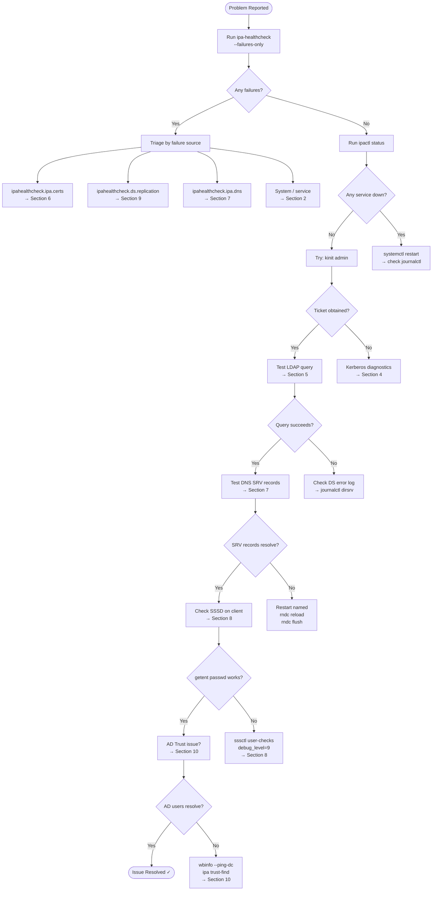

# CS-08 — Troubleshooting Cheatsheet
[](../LICENSE.md)
[](https://access.redhat.com/products/red-hat-enterprise-linux)
[](https://www.freeipa.org)

> Quick-reference diagnostics for FreeIPA on RHEL 10: service health, Kerberos, replication, certificates, DNS, SSSD, and AD trust.

> 🔁 **See also:** [Module 14 — Troubleshooting](../14_troubleshooting.md)

---

## Table of Contents

- [1. First Responder Checklist](#1-first-responder-checklist)
- [2. Service Health](#2-service-health)
- [3. Log Locations](#3-log-locations)
- [4. Kerberos Diagnostics](#4-kerberos-diagnostics)
- [5. LDAP / Directory Diagnostics](#5-ldap--directory-diagnostics)
- [6. Certificate & Certmonger Diagnostics](#6-certificate--certmonger-diagnostics)
- [7. DNS Diagnostics](#7-dns-diagnostics)
- [8. SSSD Diagnostics](#8-sssd-diagnostics)
- [9. Replication Diagnostics](#9-replication-diagnostics)
- [10. AD Trust Diagnostics](#10-ad-trust-diagnostics)
- [11. IPA API / WebUI Diagnostics](#11-ipa-api--webui-diagnostics)
- [12. Crypto Policy & FIPS Diagnostics](#12-crypto-policy--fips-diagnostics)
- [13. Emergency Recovery Commands](#13-emergency-recovery-commands)
- [14. Diagnostic Decision Tree](#14-diagnostic-decision-tree)

---

## 1. First Responder Checklist

Run these in order on any affected server before diving deeper.

```bash
# 1. IPA self-test
ipa-healthcheck --failures-only

# 2. All IPA-managed services
ipactl status

# 3. Kerberos ticket
kinit admin && klist

# 4. Basic LDAP query
ldapsearch -H ldapi://%2Frun%2Fslapd-IPA-EXAMPLE-COM.socket \
  -Y GSSAPI -b "dc=example,dc=com" "(uid=admin)" dn 2>&1 | head -20

# 5. DNS self-resolution
dig +short ipa1.example.com A
dig +short _kerberos._tcp.example.com SRV

# 6. Certificate expiry scan
for svc in $(getcert list | awk '/Request ID/{print $NF}'); do
  getcert list -i "$svc" | grep -E 'status|expires'
done

# 7. Replication status
ipa-replica-manage list --verbose
```

[↑ Back to TOC](#table-of-contents)

---

## 2. Service Health

### 2.1 ipactl

```bash
ipactl status            # all services
ipactl restart           # restart all (graceful)
ipactl stop && ipactl start   # full cycle

# Individual service restart
systemctl restart dirsrv@IPA-EXAMPLE-COM
systemctl restart krb5kdc
systemctl restart kadmin
systemctl restart httpd
systemctl restart pki-tomcatd@pki-tomcat
systemctl restart named
systemctl restart ipa-custodia
```

### 2.2 Service Status Detail

```bash
systemctl status dirsrv@IPA-EXAMPLE-COM --no-pager -l
systemctl status krb5kdc --no-pager -l
systemctl status pki-tomcatd@pki-tomcat --no-pager -l
systemctl status httpd --no-pager -l
systemctl status named --no-pager -l
systemctl status sssd --no-pager -l
systemctl status ipa-custodia --no-pager -l
```

### 2.3 Port Checks

```bash
# From client or external host
ss -tlnp | grep -E '80|88|389|443|464|636|749'

# Expected open ports on IPA server
# 80/tcp   - HTTP (redirect to HTTPS)
# 88/tcp   - Kerberos KDC
# 88/udp   - Kerberos KDC
# 389/tcp  - LDAP
# 443/tcp  - HTTPS (WebUI / API)
# 464/tcp  - kpasswd
# 464/udp  - kpasswd
# 636/tcp  - LDAPS
# 749/tcp  - kadmin

# Firewall check
firewall-cmd --list-services
firewall-cmd --list-ports
```

### 2.4 ipa-healthcheck

```bash
# Full run
ipa-healthcheck

# Failures only (CI-friendly)
ipa-healthcheck --failures-only

# JSON output for SIEM/monitoring
ipa-healthcheck --output-type json --failures-only

# Specific source
ipa-healthcheck --source ipahealthcheck.ipa.certs
ipa-healthcheck --source ipahealthcheck.ds.replication
ipa-healthcheck --source ipahealthcheck.ipa.dna
```

[↑ Back to TOC](#table-of-contents)

---

## 3. Log Locations

| Component | Log Path |
|-----------|----------|
| 389-DS (Directory) | `/var/log/dirsrv/slapd-IPA-EXAMPLE-COM/errors` |
| 389-DS access | `/var/log/dirsrv/slapd-IPA-EXAMPLE-COM/access` |
| KDC | `/var/log/krb5kdc.log` |
| kadmin | `/var/log/kadmind.log` |
| Apache / WebUI | `/var/log/httpd/error_log` |
| Apache access | `/var/log/httpd/access_log` |
| Dogtag CA | `/var/log/pki/pki-tomcat/ca/debug.*.log` |
| Dogtag systemd | `journalctl -u pki-tomcatd@pki-tomcat` |
| Certmonger | `/var/log/certmonger.log` |
| SSSD | `/var/log/sssd/sssd.log`, `sssd_<domain>.log` |
| Named | `/var/log/named/named.log` (or `journalctl -u named`) |
| IPA install | `/var/log/ipaserver-install.log` |
| IPA upgrade | `/var/log/ipaupgrade.log` |
| IPA client install | `/var/log/ipaclient-install.log` |
| Custodia | `journalctl -u ipa-custodia` |
| ipa-healthcheck | `/var/log/ipa/healthcheck/` |

```bash
# Live tail of multiple logs simultaneously
journalctl -f -u krb5kdc -u dirsrv@IPA-EXAMPLE-COM -u httpd -u pki-tomcatd@pki-tomcat

# Last 100 lines of DS errors
journalctl -u dirsrv@IPA-EXAMPLE-COM -n 100 --no-pager

# Search for errors in DS log
journalctl -u dirsrv@IPA-EXAMPLE-COM --since "1 hour ago" | grep -i 'err\|fail\|cannot'
```

[↑ Back to TOC](#table-of-contents)

---

## 4. Kerberos Diagnostics

### 4.1 Ticket Issues

```bash
# Get ticket with verbose output
KRB5_TRACE=/dev/stderr kinit admin

# List tickets
klist -v

# Destroy and re-obtain
kdestroy -A && kinit admin

# Check ccache location
echo $KRB5CCNAME
ls -la /tmp/krb5cc_$(id -u)

# Test specific service ticket
kvno host/client.example.com
kvno HTTP/ipa1.example.com
```

### 4.2 KDC Configuration

```bash
# Check KDC config
cat /etc/krb5.conf
cat /var/kerberos/krb5kdc/kdc.conf

# Verify realm in KDC
kadmin.local -q "getprincs" | head -20

# Check a principal
kadmin.local -q "getprinc admin"
kadmin.local -q "getprinc host/ipa1.example.com"

# Check policy
kadmin.local -q "getpol default"
```

### 4.3 KDC Log Analysis

```bash
# Recent KDC errors
journalctl -u krb5kdc --since "30 min ago" | grep -iE 'error|fail|denied'

# Authentication failures
grep "FAILED" /var/log/krb5kdc.log | tail -30

# Expired password errors
grep "KDC_ERR_KEY_EXPIRED" /var/log/krb5kdc.log | tail -20
```

### 4.4 Account Lockout

```bash
# Check lockout state
ipa user-show jdoe --all | grep -E 'lock|fail|time'

# Unlock an account
ipa user-unlock jdoe

# Check global lockout policy
ipa pwpolicy-show global_policy

# Check per-group policy
ipa pwpolicy-show admins
```

### 4.5 OTP / MFA

```bash
# List OTP tokens for user
ipa otptoken-find --owner=jdoe

# Disable a token
ipa otptoken-mod <token-id> --ipatokenDisabled=TRUE

# Check if user requires MFA
ipa user-show jdoe --all | grep authtypes
```

### 4.6 PKINIT / Smart Card

```bash
# Test PKINIT
kinit -X X509_user_identity=PKCS11: jdoe

# Verify PKINIT is enabled on KDC
ipa config-show | grep pkinit
grep pkinit /etc/krb5.conf
```

[↑ Back to TOC](#table-of-contents)

---

## 5. LDAP / Directory Diagnostics

### 5.1 Connectivity

```bash
# LDAP via socket (fastest, server-local only)
ldapsearch -H ldapi://%2Frun%2Fslapd-IPA-EXAMPLE-COM.socket \
  -Y EXTERNAL -b "cn=config" "(cn=config)" dn 2>/dev/null | head -5

# LDAP via network with GSSAPI (from client)
ldapsearch -H ldap://ipa1.example.com -Y GSSAPI \
  -b "dc=example,dc=com" "(uid=admin)" dn

# LDAPS
ldapsearch -H ldaps://ipa1.example.com:636 \
  -D "cn=Directory Manager" -W \
  -b "dc=example,dc=com" "(uid=admin)" dn
```

### 5.2 User / Group Lookups

```bash
# Find user
ldapsearch -H ldapi://%2Frun%2Fslapd-IPA-EXAMPLE-COM.socket \
  -Y EXTERNAL -b "cn=users,cn=accounts,dc=example,dc=com" "(uid=jdoe)"

# Find group
ldapsearch -H ldapi://%2Frun%2Fslapd-IPA-EXAMPLE-COM.socket \
  -Y EXTERNAL -b "cn=groups,cn=accounts,dc=example,dc=com" "(cn=admins)"

# Count all users
ldapsearch -H ldapi://%2Frun%2Fslapd-IPA-EXAMPLE-COM.socket \
  -Y EXTERNAL -b "cn=users,cn=accounts,dc=example,dc=com" \
  "(objectClass=inetOrgPerson)" dn 2>/dev/null | grep "^dn:" | wc -l
```

### 5.3 Directory Manager Password Reset

```bash
# Only possible locally as root
dsconf slapd-IPA-EXAMPLE-COM config replace nsslapd-rootpw="$(pwdhash -s PBKDF2_SHA256 'NewPassword123!')"
# OR
ldappasswd -H ldapi://%2Frun%2Fslapd-IPA-EXAMPLE-COM.socket \
  -Y EXTERNAL -D "cn=Directory Manager" -S
```

### 5.4 Schema & Index Issues

```bash
# List indexes
dsconf slapd-IPA-EXAMPLE-COM index list

# Reindex after schema change
dsconf slapd-IPA-EXAMPLE-COM index reindex --wait

# Check schema
dsconf slapd-IPA-EXAMPLE-COM schema objectclass list | grep ipa
```

### 5.5 DS Performance

```bash
# Connection count
ldapsearch -H ldapi://%2Frun%2Fslapd-IPA-EXAMPLE-COM.socket \
  -Y EXTERNAL -b "cn=monitor" "(objectClass=*)" currentconnections 2>/dev/null

# Slow query threshold (ms)
dsconf slapd-IPA-EXAMPLE-COM config get nsslapd-idletimeout nsslapd-ioblocktimeout
```

[↑ Back to TOC](#table-of-contents)

---

## 6. Certificate & Certmonger Diagnostics

### 6.1 Certmonger Status

```bash
# List all tracked certs
getcert list

# Summary (ID + status + expiry)
getcert list | grep -E "Request ID|status|expires"

# Check specific request
getcert list -i 20240101120000

# Trigger manual renew
getcert resubmit -i 20240101120000

# Monitor renew in real-time
watch -n5 'getcert list | grep -E "Request ID|status|expires"'
```

### 6.2 Certificate Expiry Scan

```bash
# All certs tracked by certmonger
getcert list | awk '/expires/{print $0}' | sort

# IPA-specific cert files
for cert in \
  /etc/ipa/ca.crt \
  /var/lib/ipa/certs/httpd.crt \
  /var/kerberos/krb5kdc/kdc.crt \
  /etc/dirsrv/slapd-IPA-EXAMPLE-COM/Server-Cert.pem; do
  [ -f "$cert" ] && echo "=== $cert ===" && \
    openssl x509 -noout -enddate -in "$cert" 2>/dev/null
done

# Dogtag CA cert
openssl x509 -noout -enddate \
  -in /etc/pki/pki-tomcat/alias/ca.crt 2>/dev/null || \
  certutil -L -d /etc/pki/pki-tomcat/alias -n "caSigningCert cert-pki-ca" | grep "Not After"
```

### 6.3 Dogtag CA Diagnostics

```bash
# Dogtag service status
systemctl status pki-tomcatd@pki-tomcat --no-pager

# Dogtag CA log (most recent debug log)
ls -lt /var/log/pki/pki-tomcat/ca/ | head -5
tail -100 /var/log/pki/pki-tomcat/ca/debug.$(date +%Y-%m-%d).log 2>/dev/null || \
  ls /var/log/pki/pki-tomcat/ca/debug.*.log | sort | tail -1 | xargs tail -100

# Check CA subsystem status via API
curl -sk https://ipa1.example.com:8443/ca/admin/ca/getStatus | python3 -m json.tool

# List recent cert requests
ipa cert-find --sizelimit=10 --timelimit=10

# Check CRL generation
ipa crlgen-manage status
```

### 6.4 IPA RA Agent Certificate

```bash
# Check IPA RA cert
getcert list -d /etc/httpd/alias -n ipaCert

# Verify RA cert is trusted by Dogtag
openssl verify -CAfile /etc/ipa/ca.crt /var/lib/ipa/ra-agent.pem
```

### 6.5 NSS Database Issues

```bash
# List certs in NSS db
certutil -L -d /etc/dirsrv/slapd-IPA-EXAMPLE-COM/
certutil -L -d /etc/httpd/alias/

# Verify cert chain
certutil -V -u V -d /etc/dirsrv/slapd-IPA-EXAMPLE-COM/ -n "Server-Cert"

# Check OCSP/CRL config
ipa config-show | grep -i crl
```

[↑ Back to TOC](#table-of-contents)

---

## 7. DNS Diagnostics

### 7.1 Basic Resolution

```bash
# Forward lookup
dig ipa1.example.com A
dig ipa1.example.com AAAA

# Reverse lookup
dig -x 192.168.1.10

# SRV records (required for Kerberos)
dig _kerberos._tcp.example.com SRV
dig _kerberos._udp.example.com SRV
dig _kerberos-master._tcp.example.com SRV
dig _kpasswd._tcp.example.com SRV
dig _ldap._tcp.example.com SRV

# LDAP SRV for auto-discovery
dig _ldap._tcp.example.com SRV

# IPA-specific records
dig ipa-ca.example.com A
```

### 7.2 DNSSEC

```bash
# Test DNSSEC validation
dig +dnssec example.com SOA
dig +dnssec +short example.com A

# Check zone signatures
dig example.com DNSKEY
dig example.com RRSIG

# DNSSEC status
ipa dnssec-show example.com

# Force zone re-sign
ipa dnszone-mod example.com --dnssec=TRUE

# Key status
ipa dnskey-find --zone=example.com
```

### 7.3 Named / bind-dyndb-ldap

```bash
# Named status
systemctl status named --no-pager -l

# Check named configuration
named-checkconf /etc/named.conf
named-checkconf /etc/named/ipa-options-ext.conf

# Zone check
named-checkzone example.com /var/named/dynamic/example.com

# Reload zones without restart
rndc reload
rndc reload example.com

# Flush DNS cache
rndc flush

# Check LDAP plugin connectivity
journalctl -u named --since "10 min ago" | grep -i 'ldap\|dyn\|err'
```

### 7.4 IPA DNS Records

```bash
# List all DNS zones
ipa dnszone-find

# Show all records in zone
ipa dnsrecord-find example.com

# Check specific record
ipa dnsrecord-show example.com ipa

# Validate DNS from IPA perspective
ipa dns-resolve ipa1.example.com
```

[↑ Back to TOC](#table-of-contents)

---

## 8. SSSD Diagnostics

### 8.1 SSSD Status & Restart

```bash
# Service status
systemctl status sssd --no-pager -l

# Restart (clears caches)
systemctl restart sssd

# Invalidate cached users/groups
sss_cache -G    # groups
sss_cache -U    # users
sss_cache -E    # everything

# Flush completely
sss_cache -E && systemctl restart sssd
```

### 8.2 SSSD Debug Logging

```bash
# Enable debug on-the-fly (no restart)
sssctl debug-level 9             # global
sssctl debug-level 9 --domain=example.com

# Set via config (persistent)
# In /etc/sssd/sssd.conf under [domain/example.com]:
# debug_level = 9

# Watch SSSD domain log
tail -f /var/log/sssd/sssd_example.com.log

# Watch NSS log (getent calls)
tail -f /var/log/sssd/sssd_nss.log

# Grep for specific user
grep "jdoe" /var/log/sssd/sssd_example.com.log | tail -30
```

### 8.3 User / Group Resolution

```bash
# NSS lookup
getent passwd jdoe
getent group admins
id jdoe

# SSSD-native lookup (bypasses NSS cache)
sssctl user-show jdoe
sssctl group-show admins

# Check if user is known
sss_cache -u jdoe   # refresh cache for user

# Diagnostic info
sssctl user-checks jdoe
```

### 8.4 SSSD Configuration

```bash
# Validate SSSD config
sssctl config-check

# Show effective config
sssctl domain-list
sssctl domain-status example.com

# IPA domain status
sssctl domain-status example.com --active-server
sssctl domain-status example.com --servers
sssctl domain-status example.com --last
```

### 8.5 SSSD Database (Cache)

```bash
# Location of SSSD cache DB
ls -la /var/lib/sss/db/

# Dump cache (read-only tool)
sss_debuglevel 0  # reset

# Remove cache (forces re-fetch from IPA)
systemctl stop sssd
rm -f /var/lib/sss/db/*.ldb
systemctl start sssd
```

[↑ Back to TOC](#table-of-contents)

---

## 9. Replication Diagnostics

### 9.1 Replication Status

```bash
# List all replicas (modern API)
ipa topologysegment-find dc=ipa,dc=example,dc=com
ipa topologysuffix-find

# Legacy low-level tools (still functional, but prefer topology API above):
# NOTE: ipa-replica-manage / ipa-csreplica-manage are not deprecated outright
# but are low-level 389-DS wrappers — use topology API for day-to-day management.
ipa-replica-manage list
ipa-replica-manage list --verbose

# Check replication agreements
ipa-replica-manage list -p <DM-password> ipa1.example.com

# Show replication status for a replica
ipa-replica-manage status ipa2.example.com

# csrepl (CA subsystem replication)
ipa-csreplica-manage list
ipa-csreplica-manage status ipa2.example.com
```

### 9.2 Replication Errors in DS Log

```bash
# Replication errors
journalctl -u dirsrv@IPA-EXAMPLE-COM --since "1 hour ago" | \
  grep -iE 'repl|agmt|nsds5|error' | head -40

# Check replication agreement state via LDAP
ldapsearch -H ldapi://%2Frun%2Fslapd-IPA-EXAMPLE-COM.socket \
  -Y EXTERNAL \
  -b "cn=config" \
  "(objectClass=nsds5ReplicationAgreement)" \
  nsds5replicaLastUpdateStatus \
  nsds5replicaLastUpdateStart \
  nsds5replicaLastUpdateEnd \
  2>/dev/null
```

### 9.3 CSN / RUV Conflicts

```bash
# Check for replication conflicts (tombstones)
ldapsearch -H ldapi://%2Frun%2Fslapd-IPA-EXAMPLE-COM.socket \
  -Y EXTERNAL \
  -b "dc=example,dc=com" \
  "(nsds5ReplConflict=*)" dn nsds5ReplConflict 2>/dev/null

# Count conflict entries
ldapsearch -H ldapi://%2Frun%2Fslapd-IPA-EXAMPLE-COM.socket \
  -Y EXTERNAL \
  -b "dc=example,dc=com" \
  "(nsds5ReplConflict=*)" dn 2>/dev/null | grep "^dn:" | wc -l
```

### 9.4 Force Replication Sync

```bash
# Initialize/force full sync from master to replica
ipa-replica-manage force-sync --from=ipa1.example.com

# Re-initialize a replica (destructive — use with care)
ipa-replica-manage re-initialize --from=ipa1.example.com

# For CA replication
ipa-csreplica-manage force-sync --from=ipa1.example.com
ipa-csreplica-manage re-initialize --from=ipa1.example.com
```

### 9.5 Topology API

```bash
# List topology segments
ipa topologysegment-find dc=example,dc=com

# Check topology suffix
ipa topologysuffix-find

# Verify connectivity
ipa topologysegment-verify dc=example,dc=com ipa-to-ipa2
```

[↑ Back to TOC](#table-of-contents)

---

## 10. AD Trust Diagnostics

### 10.1 Trust Status

```bash
# List trusts
ipa trust-find
ipa trust-show ad.corp

# Verify trust
ipa trust-fetch-domains ad.corp

# Test with wbinfo
wbinfo --ping-dc -d ad.corp
wbinfo -u          # list AD users (use with care in large environments)
wbinfo --online-status

# Check winbind
systemctl status winbind --no-pager -l
```

### 10.2 SSSD + AD Trust

```bash
# Check AD trust domain in SSSD
sssctl domain-list
sssctl domain-status ad.corp

# Look up AD user
id jdoe@ad.corp
getent passwd jdoe@ad.corp

# SID lookup
sss_cache -u jdoe@ad.corp
wbinfo --sid-to-uid=S-1-5-21-...
wbinfo --uid-to-sid=$(id -u jdoe@ad.corp)
```

### 10.3 SSSD Log for AD Trust

```bash
# Watch subdomain log
tail -f /var/log/sssd/sssd_ad.corp.log

# Check for SID/PAC errors
grep -iE 'sid|pac|trust|krb5' /var/log/sssd/sssd_ad.corp.log | tail -30
```

### 10.4 DNS Cross-Realm

```bash
# Check AD DNS forwarder in IPA
ipa dnsforwardzone-find

# Verify cross-realm SRV resolution
dig _kerberos._tcp.ad.corp SRV
dig _ldap._tcp.ad.corp SRV

# Test cross-realm Kerberos
kinit jdoe@AD.CORP
kvno host/ipa1.example.com@EXAMPLE.COM
```

### 10.5 Trust Re-establishment

```bash
# Remove and re-add trust
ipa trust-del ad.corp
ipa trust-add --type=ad ad.corp --admin=Administrator --password

# Restart SSSD after trust changes
systemctl restart sssd
sss_cache -E
```

[↑ Back to TOC](#table-of-contents)

---

## 11. IPA API / WebUI Diagnostics

### 11.1 API Connectivity

```bash
# Basic API ping
curl -sk https://ipa1.example.com/ipa/json \
  -H "Content-Type: application/json" \
  -H "Referer: https://ipa1.example.com/ipa" \
  -d '{"method":"ping","params":[[],{}]}' | python3 -m json.tool

# With Kerberos auth (kinit first)
curl -sk --negotiate -u : https://ipa1.example.com/ipa/json \
  -H "Content-Type: application/json" \
  -H "Referer: https://ipa1.example.com/ipa" \
  -d '{"method":"user_find","params":[[],{"all":false,"sizelimit":5}]}' \
  | python3 -m json.tool
```

### 11.2 Apache / HTTPD

```bash
# Apache error log
tail -50 /var/log/httpd/error_log

# IPA WSGI errors
journalctl -u httpd --since "30 min ago" | grep -i error

# Check mod_auth_gssapi
httpd -M 2>/dev/null | grep gss

# SSL certificate used by Apache
openssl s_client -connect ipa1.example.com:443 -servername ipa1.example.com \
  </dev/null 2>/dev/null | openssl x509 -noout -enddate -subject
```

### 11.3 Session / Cookie Issues

```bash
# Verify IPA session is working
echo '{"method":"ping","params":[[],{}]}' | \
  curl -sk --negotiate -u : -X POST https://ipa1.example.com/ipa/json \
  -H "Content-Type: application/json" \
  -H "Referer: https://ipa1.example.com/ipa" \
  -d @- | python3 -c "import sys,json; d=json.load(sys.stdin); print(d.get('result',{}))"
```

[↑ Back to TOC](#table-of-contents)

---

## 12. Crypto Policy & FIPS Diagnostics

### 12.1 Active Policy

```bash
# Current system-wide crypto policy
update-crypto-policies --show

# Check for FIPS
fips-mode-setup --check
cat /proc/sys/crypto/fips_enabled   # 1 = FIPS on, 0 = off

# What ciphers/MACs are allowed
update-crypto-policies --show | xargs -I{} cat /usr/share/crypto-policies/policies/{}.pol 2>/dev/null || \
  ls /etc/crypto-policies/back-ends/
```

### 12.2 TLS Cipher Negotiation

```bash
# What cipher was negotiated with IPA LDAP
openssl s_client -connect ipa1.example.com:636 -starttls ldap \
  </dev/null 2>/dev/null | grep -E 'Cipher|Protocol|Server certificate'

# What cipher was negotiated with HTTPS
openssl s_client -connect ipa1.example.com:443 \
  </dev/null 2>/dev/null | grep -E 'Cipher|Protocol|Verify'

# Test specific TLS version
openssl s_client -connect ipa1.example.com:443 -tls1_2 </dev/null 2>/dev/null | grep 'Cipher\|Protocol'
openssl s_client -connect ipa1.example.com:443 -tls1_3 </dev/null 2>/dev/null | grep 'Cipher\|Protocol'
```

### 12.3 FIPS Mode Checks

```bash
# Ensure FIPS-required crypto policy
update-crypto-policies --set FIPS

# Verify Kerberos is not using RC4 (must be absent in RHEL 10)
kadmin.local -q "getprinc admin" | grep -i enc

# Verify no weak keys in keytab
klist -eK /etc/krb5.keytab 2>/dev/null | grep -iE 'rc4|des|arcfour'

# Check NSS FIPS mode
certutil -d /etc/httpd/alias/ -K
```

[↑ Back to TOC](#table-of-contents)

---

## 13. Emergency Recovery Commands

### 13.1 Directory Manager Password Unknown

```bash
# Reset Directory Manager password (must be on the server, as root)
systemctl stop dirsrv@IPA-EXAMPLE-COM
ns-slapd -D /etc/dirsrv/slapd-IPA-EXAMPLE-COM -w /etc/dirsrv/slapd-IPA-EXAMPLE-COM/dse.ldif &
sleep 3
ldappasswd -H ldap://localhost:389 -x \
  -D "cn=Directory Manager" -w current_pass \
  -s "NewPassword123!"
kill %1
systemctl start dirsrv@IPA-EXAMPLE-COM
```

### 13.2 Admin Kerberos Principal Locked/Missing

```bash
# Unlock via kadmin.local (run on KDC host as root)
kadmin.local -q "modprinc -unlock admin"

# Reset admin password
kadmin.local -q "cpw admin"

# Re-add admin principal if missing
kadmin.local -q "addprinc admin"
```

### 13.3 CA Not Responding

```bash
# Restart Dogtag
systemctl restart pki-tomcatd@pki-tomcat

# Check Dogtag startup errors
journalctl -u pki-tomcatd@pki-tomcat -n 100 --no-pager | grep -iE 'error|exception|fail'

# Verify Dogtag cert (subsystem cert) is valid
certutil -L -d /etc/pki/pki-tomcat/alias/ | grep -v "^$"
certutil -V -u V -d /etc/pki/pki-tomcat/alias/ -n "subsystemCert cert-pki-ca"

# Dogtag port check
ss -tlnp | grep 8443
curl -sk https://localhost:8443/ca/admin/ca/getStatus
```

### 13.4 Restore from Backup

```bash
# List available backups
ls -lt /var/lib/ipa/backup/

# Restore (stops all IPA services first)
ipa-restore /var/lib/ipa/backup/ipa-full-YYYY-MM-DD-HH-MM-SS

# Data-only restore (keeps current config)
ipa-restore --data /var/lib/ipa/backup/ipa-data-YYYY-MM-DD-HH-MM-SS

# Verify after restore
ipactl status
kinit admin
ipa user-find --sizelimit=3
```

### 13.5 Unresponsive Replica Removal

```bash
# Force-remove replica from topology
ipa server-del ipa2.example.com --force

# Clean up replication agreements
ipa-replica-manage del ipa2.example.com --force

# Clean up CA replication if applicable
ipa-csreplica-manage del ipa2.example.com --force

# Clean up DNA range (if replica held a range)
ipa-replica-manage dnarange-show
# Manually reassign range if needed
ipa-replica-manage dnarange-set ipa1.example.com 1000-1999
```

[↑ Back to TOC](#table-of-contents)

---

## 14. Diagnostic Decision Tree



---

*Platform: RHEL 10 | FreeIPA 4.12.x | SSSD 2.9.x | Certmonger 0.79.x | Dogtag 11.x*

[↑ Back to TOC](#table-of-contents)

---

*Licensed under [CC BY-NC-SA 4.0](../LICENSE.md) · © 2026 UncleJS*