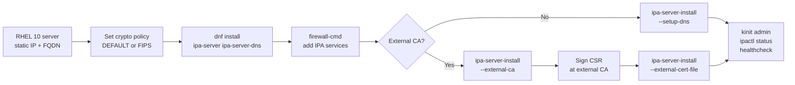
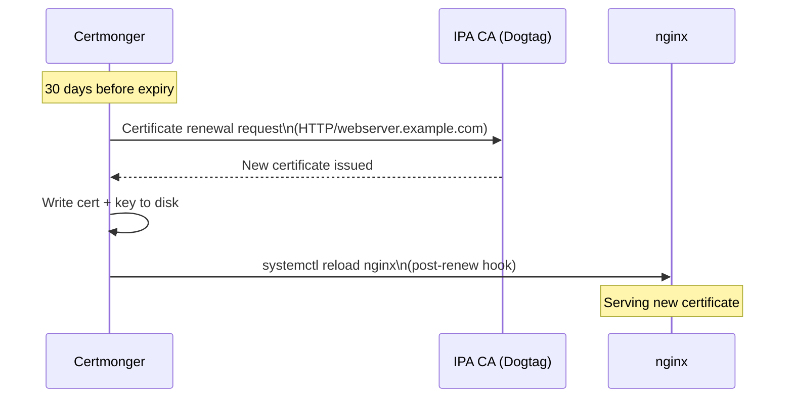
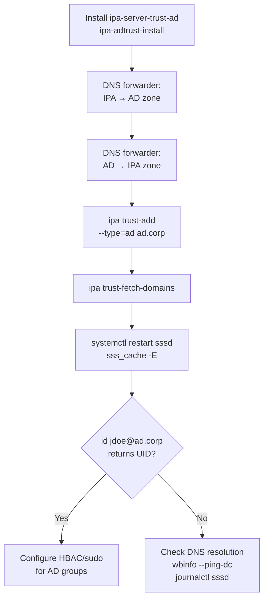
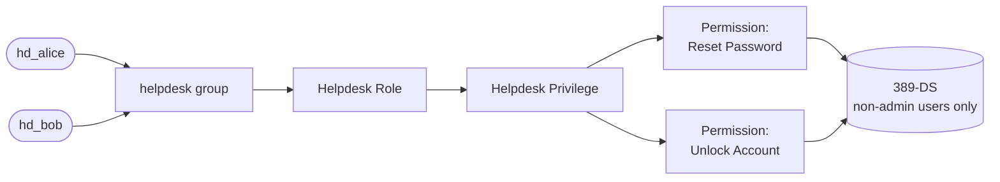
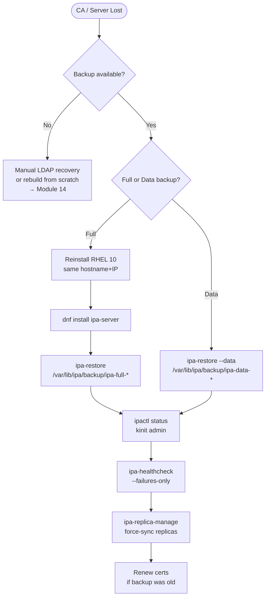
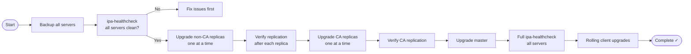

# CS-09 — Operational Recipes
[](../LICENSE.md)
[](https://access.redhat.com/products/red-hat-enterprise-linux)
[](https://www.freeipa.org)

> 12 step-by-step runbooks for production FreeIPA operations on RHEL 10.

> 🔁 **See also (reference guide — spans all modules):** [Module 02 — Installation](../02_installation.md) · [Module 05 — Host Enrollment](../05_host_enrollment_sssd.md) · [Module 09 — Certificates: Fundamentals](../09_certificate_management_fundamentals.md) · [Module 11 — AD Trust](../11_ad_trust.md) · [Module 12 — Replication](../12_replication_topology.md) · [Module 13 — Security Hardening](../13_security_hardening.md) · [Module 14 — Troubleshooting](../14_troubleshooting.md) · [Module 15 — Upgrade & Migration](../15_upgrade_migration.md)

---

## Table of Contents

- [R-01 — Install a Production-Ready IPA Master](#r-01--install-a-production-ready-ipa-master)
- [R-02 — Add a CA Replica](#r-02--add-a-ca-replica)
- [R-03 — Enroll a RHEL 10 Client](#r-03--enroll-a-rhel-10-client)
- [R-04 — Issue and Auto-Renew a Service Certificate](#r-04--issue-and-auto-renew-a-service-certificate)
- [R-05 — Set Up an AD Trust from Scratch](#r-05--set-up-an-ad-trust-from-scratch)
- [R-06 — Create a Helpdesk Operator with Scoped RBAC](#r-06--create-a-helpdesk-operator-with-scoped-rbac)
- [R-07 — Enable FIPS 140-3 Mode Before IPA Install](#r-07--enable-fips-140-3-mode-before-ipa-install)
- [R-08 — Safely Decommission a Replica](#r-08--safely-decommission-a-replica)
- [R-09 — Recover from a Lost CA (Restore from Backup)](#r-09--recover-from-a-lost-ca-restore-from-backup)
- [R-10 — Migrate Users from OpenLDAP](#r-10--migrate-users-from-openldap)
- [R-11 — Perform a Rolling Upgrade Across Replicas](#r-11--perform-a-rolling-upgrade-across-replicas)
- [R-12 — Harden an IPA Server to Security Baseline](#r-12--harden-an-ipa-server-to-security-baseline)

---

## R-01 — Install a Production-Ready IPA Master

**Goal:** Deploy a single, fully-functional IPA master server with integrated DNS and a two-tier CA hierarchy on RHEL 10.

**Prerequisites:**
- RHEL 10 server, minimum 4 vCPU / 8 GB RAM / 40 GB disk
- Static IP, FQDN set in `/etc/hostname` (e.g. `ipa.example.com`)
- Forward and reverse DNS entries exist (or will be managed by IPA)
- Time synchronisation (chrony) running
- No conflicting hostname in `/etc/hosts` (127.0.0.1 must not resolve to the FQDN)

### Step 1 — Pre-flight checks

```bash
# Verify hostname
hostname -f          # must return ipa.example.com

# Check /etc/hosts — remove any line mapping 127.x.x.x to the FQDN
grep $(hostname) /etc/hosts

# Time sync
chronyc tracking | grep "Leap status"

# Subscription / repo
subscription-manager status
dnf repolist | grep -i ipa
```

### Step 2 — Set crypto policy (DEFAULT or FIPS — never LEGACY)

```bash
update-crypto-policies --show   # expect DEFAULT or FIPS
# If LEGACY or FUTURE, reset to DEFAULT
update-crypto-policies --set DEFAULT
```

### Step 3 — Install packages

```bash
dnf install -y ipa-server ipa-server-dns bind-dyndb-ldap
```

### Step 4 — Open firewall

```bash
firewall-cmd --permanent --add-service={freeipa-ldap,freeipa-ldaps,freeipa-replication,freeipa-trust,dns,kerberos,kpasswd,http,https,ntp}
firewall-cmd --reload
firewall-cmd --list-services
```

### Step 5 — Run the installer

```bash
ipa-server-install \
  --domain=example.com \
  --realm=EXAMPLE.COM \
  --ds-password="$(systemd-ask-password 'DS Manager password: ')" \
  --admin-password="$(systemd-ask-password 'Admin password: ')" \
  --hostname=ipa.example.com \
  --ip-address=192.168.1.10 \
  --setup-dns \
  --forwarder=8.8.8.8 \
  --forwarder=8.8.4.4 \
  --auto-reverse \
  --mkhomedir \
  --no-ntp \
  --unattended
```

> **External CA variant:** Add `--external-ca` for a two-stage install where a CSR is signed by an external root CA. Run `ipa-server-install --external-ca` first, sign the CSR, then re-run with `--external-cert-file`.

### Step 6 — Verify installation

```bash
kinit admin
ipa user-find admin --all | head -20
ipactl status
ipa-healthcheck --failures-only
```

### Step 7 — Post-install hardening (quick)

```bash
# Enforce TLS 1.2+ (already DEFAULT policy on RHEL 10, but confirm)
update-crypto-policies --show

# Disable anonymous LDAP bind
ldapmodify -H ldapi://%2Frun%2Fslapd-EXAMPLE-COM.socket -Y EXTERNAL <<'EOF'
dn: cn=config
changetype: modify
replace: nsslapd-allow-anonymous-access
nsslapd-allow-anonymous-access: off
EOF

# Enable CRL publication
ipa crlgen-manage enable
ipa crlgen-manage status
```

### Decision Flow



[↑ Back to TOC](#table-of-contents)

---

## R-02 — Add a CA Replica

**Goal:** Promote a second RHEL 10 host to a full IPA replica with its own CA instance for high availability.

**Prerequisites:**
- Working IPA master (R-01 complete)
- Second RHEL 10 host with static IP, FQDN `ipa2.example.com`
- Network connectivity between master and replica on all IPA ports
- DNS A record for `ipa2.example.com` already in IPA DNS

### Step 1 — Prepare the replica host

```bash
# On ipa2.example.com
hostname -f           # must return ipa2.example.com
chronyc tracking | grep "Leap status"
update-crypto-policies --show   # DEFAULT or FIPS — must match master

dnf install -y ipa-server ipa-server-dns bind-dyndb-ldap
firewall-cmd --permanent --add-service={freeipa-ldap,freeipa-ldaps,freeipa-replication,freeipa-trust,dns,kerberos,kpasswd,http,https,ntp}
firewall-cmd --reload
```

### Step 2 — Add DNS record from master (if not already present)

```bash
# On ipa1.example.com (master)
kinit admin
ipa dnsrecord-add example.com ipa2 --a-rec=192.168.1.11
ipa dnsrecord-add 1.168.192.in-addr.arpa 11 --ptr-rec=ipa2.example.com.
```

### Step 3 — Run replica installer

```bash
# On ipa2.example.com
ipa-replica-install \
  --setup-ca \
  --setup-dns \
  --forwarder=8.8.8.8 \
  --principal=admin \
  --admin-password="<admin-password>" \
  --mkhomedir \
  --unattended
```

> `--setup-ca` installs a Dogtag CA clone on this replica — **required** for CA HA.

### Step 4 — Verify replication

```bash
# On master
ipa-replica-manage list
ipa-replica-manage status ipa2.example.com

# On replica
ipactl status
kinit admin
ipa user-find admin

# CA replication
ipa-csreplica-manage list
ipa-csreplica-manage status ipa2.example.com
```

### Step 5 — Verify topology

```bash
ipa topologysegment-find dc=example,dc=com
ipa topologysegment-find cn=cas
ipa-healthcheck --failures-only
```

### Step 6 — Update client /etc/ipa/default.conf (optional)

```bash
# On clients, add replica as fallback server
# /etc/sssd/sssd.conf: ipa_server = ipa1.example.com, ipa2.example.com
```

[↑ Back to TOC](#table-of-contents)

---

## R-03 — Enroll a RHEL 10 Client

**Goal:** Join a RHEL 10 workstation or server to an existing IPA domain so that IPA users can log in with Kerberos SSO.

**Prerequisites:**
- IPA server running
- Client RHEL 10 host with network access to IPA server
- DNS SRV records for the IPA domain resolve correctly from the client
- An IPA admin account (or a one-time password for unattended enrolment)

### Step 1 — Pre-flight on the client

```bash
# Verify DNS resolves IPA server
dig ipa1.example.com A
dig _kerberos._tcp.example.com SRV

# Verify time sync
chronyc tracking | grep "Leap status"

# Ensure no stale SSSD or Kerberos config
```

### Step 2 — Install IPA client packages

```bash
dnf install -y ipa-client
```

### Step 3 — Discover and enrol

```bash
# Interactive (prompts for admin password)
ipa-client-install \
  --domain=example.com \
  --realm=EXAMPLE.COM \
  --server=ipa1.example.com \
  --mkhomedir \
  --enable-dns-updates

# Unattended (provide password inline — avoid in scripts; use OTP instead)
ipa-client-install \
  --domain=example.com \
  --realm=EXAMPLE.COM \
  --server=ipa1.example.com \
  --principal=admin \
  --password="<admin-password>" \
  --mkhomedir \
  --enable-dns-updates \
  --unattended
```

**Unattended with OTP (preferred for automation):**

```bash
# On IPA server: generate one-time password for the host
# Step 1 — create the host object (if it doesn't already exist)
ipa host-add client1.example.com --ip-address=192.168.1.20 --force
# Step 2 — set/generate an OTP on the existing host object
ipa host-mod client1.example.com --otp="$(openssl rand -hex 16)"

# On client
ipa-client-install \
  --hostname=client1.example.com \
  --domain=example.com \
  --realm=EXAMPLE.COM \
  --server=ipa1.example.com \
  --password="<OTP>" \
  --mkhomedir \
  --enable-dns-updates \
  --unattended
```

### Step 4 — Verify enrolment

```bash
# On client
kinit admin
klist
id admin
getent passwd admin
ssh -l admin localhost   # tests GSSAPI login
```

### Step 5 — Apply HBAC (optional — allow specific service/group)

```bash
# On IPA server — restrict login to specific host group
ipa hbacrule-add allow_sysadmins --servicecat=all
ipa hbacrule-add-user allow_sysadmins --groups=sysadmins
ipa hbacrule-add-host allow_sysadmins --hosts=client1.example.com

# Disable the default allow_all rule (production environments)
ipa hbacrule-disable allow_all
```

[↑ Back to TOC](#table-of-contents)

---

## R-04 — Issue and Auto-Renew a Service Certificate

**Goal:** Issue a TLS certificate for a custom service (e.g. `nginx`) running on an enrolled client, tracked by Certmonger for automatic renewal.

**Prerequisites:**
- Client enrolled in IPA (R-03 complete)
- Service principal created in IPA
- Certmonger installed and running on the client

### Step 1 — Create the service principal in IPA

```bash
# On IPA server
kinit admin
ipa service-add HTTP/webserver.example.com
```

### Step 2 — Allow the host to manage the cert (if issuing from the host itself)

```bash
# On IPA server — grant host permission to retrieve its own cert
ipa service-allow-retrieve-cert HTTP/webserver.example.com \
  --hosts=webserver.example.com
```

### Step 3 — Request certificate via Certmonger (on the client)

```bash
# On webserver.example.com
# Ensure keytab is present
klist -k /etc/krb5.keytab | grep "host/"

# Request certificate
mkdir -p /etc/nginx/ssl
getcert request \
  -f /etc/nginx/ssl/server.crt \
  -k /etc/nginx/ssl/server.key \
  -K HTTP/webserver.example.com \
  -N "CN=webserver.example.com,O=EXAMPLE.COM" \
  -D webserver.example.com \
  -g 4096 \
  -C "systemctl reload nginx"   # post-renew hook

# Monitor request
getcert list
watch -n5 'getcert list | grep -E "Request ID|status|expires"'
```

### Step 4 — Verify certificate

```bash
getcert list | grep -A8 "webserver"

# Inspect the issued cert
openssl x509 -noout -text -in /etc/nginx/ssl/server.crt \
  | grep -E "Subject:|Issuer:|Not After|DNS:"
```

### Step 5 — Configure nginx to use the cert

```bash
# /etc/nginx/conf.d/ssl.conf (snippet)
# ssl_certificate     /etc/nginx/ssl/server.crt;
# ssl_certificate_key /etc/nginx/ssl/server.key;
# ssl_protocols       TLSv1.2 TLSv1.3;

nginx -t && systemctl reload nginx
```

### Step 6 — Verify auto-renewal is active

```bash
# Certmonger checks expiry and renews ~30 days before expiry by default
# Confirm tracking is set to CA_IPA
getcert list | grep -E "CA:|track"

# Manual trigger (test renewal)
getcert resubmit -f /etc/nginx/ssl/server.crt
getcert list | grep status
```

### Renewal Flow



[↑ Back to TOC](#table-of-contents)

---

## R-05 — Set Up an AD Trust from Scratch

**Goal:** Establish a one-way forest trust from FreeIPA to Active Directory so that AD users can authenticate against IPA-managed resources.

**Prerequisites:**
- IPA master with DNS integration
- AD domain controller reachable from IPA server
- Bi-directional DNS resolution between `example.com` and `ad.corp` (or DNS forwarders configured)
- IPA CA (not external CA-only) — Trust Controller requires a full CA
- AD Administrator credentials

### Step 1 — Install trust components on IPA server

```bash
# On IPA master
dnf install -y ipa-server-trust-ad
ipa-adtrust-install \
  --add-sids \
  --add-agents \
  --enable-compat \
  --netbios-name=EXAMPLE \
  --admin-name=admin \
  --admin-password=<admin-password>
```

### Step 2 — Configure DNS forwarders

```bash
# Forward AD DNS zone to AD DC
ipa dnsforwardzone-add ad.corp \
  --forwarder=192.168.2.10 \
  --forward-policy=only

# Verify resolution
dig @192.168.1.10 _kerberos._tcp.ad.corp SRV
dig @192.168.1.10 _ldap._tcp.ad.corp SRV
```

### Step 3 — Verify IPA DNS is reachable from AD DC

```bash
# On AD DC (PowerShell)
# Resolve-DnsName _kerberos._tcp.example.com -Type SRV -Server 192.168.1.10
# If not, add a DNS conditional forwarder on AD for example.com → 192.168.1.10
```

### Step 4 — Establish the trust

```bash
# On IPA master
kinit admin
ipa trust-add \
  --type=ad \
  ad.corp \
  --admin=Administrator \
  --password
# Enter AD Administrator password when prompted
```

### Step 5 — Fetch AD domains

```bash
ipa trust-fetch-domains ad.corp
ipa trust-show ad.corp
```

### Step 6 — Verify AD user resolution

```bash
# Restart SSSD to pick up new trust
systemctl restart sssd && sss_cache -E

# Look up AD users
id jdoe@ad.corp
getent passwd jdoe@ad.corp
getent group "domain users@ad.corp"

# Kerberos cross-realm
kinit jdoe@AD.CORP
kvno host/ipa1.example.com
```

### Step 7 — Configure HBAC / sudo for AD users (optional)

```bash
# Create external group mapping AD group
ipa group-add --external ad_admins_ext
ipa group-add-member ad_admins_ext \
  --external "S-1-5-21-<domain-SID>-512"   # Domain Admins SID

# Create POSIX group and nest the external group
ipa group-add posix_ad_admins --gid=60001
ipa group-add-member posix_ad_admins --groups=ad_admins_ext

# Grant SSH access via HBAC
ipa hbacrule-add allow_ad_admins --servicecat=all
ipa hbacrule-add-user allow_ad_admins --groups=posix_ad_admins
ipa hbacrule-add-host allow_ad_admins --hostcat=all
```

### Trust Setup Flow



[↑ Back to TOC](#table-of-contents)

---

## R-06 — Create a Helpdesk Operator with Scoped RBAC

**Goal:** Create a `helpdesk` role that allows operators to reset user passwords and unlock accounts, but grants no other administrative access.

**Prerequisites:**
- IPA admin access
- User group for helpdesk operators already exists (or create it here)

### Step 1 — Create the helpdesk group and users

```bash
kinit admin

# Create group
ipa group-add helpdesk --desc="Helpdesk operators"

# Create helpdesk users
ipa user-add hd_alice --first=Alice --last=Smith \
  --email=a.smith@example.com --password
ipa user-add hd_bob   --first=Bob   --last=Jones \
  --email=b.jones@example.com --password

# Add to group
ipa group-add-member helpdesk --users=hd_alice --users=hd_bob
```

### Step 2 — Identify required privileges

```bash
# List all built-in privileges related to users
ipa privilege-find | grep -i "user\|password\|unlock"
```

The following built-in privileges cover the helpdesk use case:
- `Reset a user's password` — allows `passwd` on users
- `Modify Users` — allows unlock, limited attribute writes

### Step 3 — Create a custom permission (restrict to non-admin users only)

```bash
# Custom permission: modify only accounts in cn=users (not admins)
ipa permission-add "Helpdesk: Reset Password" \
  --type=user \
  --attrs=userpassword,krbPasswordExpiration,krbLastPwdChange \
  --bindtype=permission \
  --right=write \
  --filter='(!(memberOf=cn=admins,cn=groups,cn=accounts,dc=example,dc=com))'

ipa permission-add "Helpdesk: Unlock Account" \
  --type=user \
  --attrs=nsAccountLock,krbLoginFailedCount,krbLastFailedAuth,krbLastSuccessfulAuth \
  --bindtype=permission \
  --right=write \
  --filter='(!(memberOf=cn=admins,cn=groups,cn=accounts,dc=example,dc=com))'
```

### Step 4 — Create privilege and add permissions

```bash
ipa privilege-add "Helpdesk Privilege" \
  --desc="Reset passwords and unlock non-admin accounts"

ipa privilege-add-permission "Helpdesk Privilege" \
  --permissions="Helpdesk: Reset Password" \
  --permissions="Helpdesk: Unlock Account"
```

### Step 5 — Create role and assign privilege

```bash
ipa role-add "Helpdesk Role" \
  --desc="First-line support: password reset and account unlock"

ipa role-add-privilege "Helpdesk Role" \
  --privileges="Helpdesk Privilege"
```

### Step 6 — Assign role to helpdesk group

```bash
ipa role-add-member "Helpdesk Role" --groups=helpdesk
```

### Step 7 — Verify

```bash
# Confirm role membership
ipa role-show "Helpdesk Role"

# Test as hd_alice: reset a test user password
kinit hd_alice
ipa passwd testuser
# Should succeed

# Attempt privileged action (must fail)
ipa user-del testuser 2>&1 | grep -i "denied\|not allowed"

# Attempt to reset admin password (must fail)
ipa passwd admin 2>&1 | grep -i "denied\|not allowed"
```

### RBAC Model



[↑ Back to TOC](#table-of-contents)

---

## R-07 — Enable FIPS 140-3 Mode Before IPA Install

**Goal:** Install IPA on a RHEL 10 host running in FIPS 140-3 mode, using RSA-3072 keys and SHA-256 minimum.

**Prerequisites:**
- RHEL 10 host (bare-metal or VM) — FIPS must be enabled **before** IPA install
- FIPS mode requires a reboot to activate kernel FIPS enforcement
- Access to RHEL subscription or offline repo with `fips` packages

### Step 1 — Enable FIPS mode (pre-install)

```bash
# Enable FIPS — this modifies the kernel cmdline and installs fips packages
fips-mode-setup --enable

# MANDATORY reboot
reboot
```

### Step 2 — Verify FIPS is active after reboot

```bash
fips-mode-setup --check
# Output: FIPS mode is enabled.

cat /proc/sys/crypto/fips_enabled
# Output: 1

update-crypto-policies --show
# Output: FIPS
```

### Step 3 — Verify crypto policy details

```bash
# Confirm RSA minimum key length = 3072 in FIPS
cat /usr/share/crypto-policies/policies/FIPS.pol | grep -i rsa_min_size
# min_rsa_size = 3072

# Confirm no RC4/DES
cat /usr/share/crypto-policies/policies/FIPS.pol | grep -iE 'rc4|des|arcfour'
# Should be empty (excluded)
```

### Step 4 — Install IPA packages

```bash
dnf install -y ipa-server ipa-server-dns bind-dyndb-ldap
```

### Step 5 — Run IPA installer with FIPS-compatible options

```bash
ipa-server-install \
  --domain=example.com \
  --realm=EXAMPLE.COM \
  --ds-password="<DS-password>" \
  --admin-password="<admin-password>" \
  --hostname=ipa.example.com \
  --ip-address=192.168.1.10 \
  --setup-dns \
  --forwarder=8.8.8.8 \
  --mkhomedir \
  --no-ntp \
  --unattended
```

> IPA detects FIPS mode automatically and configures Dogtag, NSS, and Kerberos accordingly. No extra flags are needed — the installer adapts.

### Step 6 — Verify FIPS-compliant key sizes

```bash
# CA signing cert key size (must be ≥ 3072 in FIPS mode)
certutil -L -d /etc/pki/pki-tomcat/alias \
  -n "caSigningCert cert-pki-ca" | grep "Public Key"

# IPA server LDAP cert
certutil -L -d /etc/dirsrv/slapd-EXAMPLE-COM \
  -n "Server-Cert" | grep "Public Key"

# Kerberos encryption types — no DES, no RC4
kadmin.local -q "getprinc admin" | grep -i "key:"
```

### Step 7 — Verify Kerberos enctypes are FIPS-allowed

```bash
# Expected enctypes on RHEL 10 FIPS:
# aes256-cts-hmac-sha384-192 (preferred)
# aes128-cts-hmac-sha256-128

# Confirm in KDC config
grep default_tkt_enctypes /etc/krb5.conf
grep default_tgs_enctypes /etc/krb5.conf
```

### Step 8 — Run health check

```bash
kinit admin
ipa-healthcheck --failures-only
ipactl status
```

### FIPS Readiness Flow

```mermaid
flowchart TD
    A[RHEL 10 fresh install] --> B[fips-mode-setup --enable]
    B --> C[reboot]
    C --> D{fips_enabled = 1?}
    D -- No --> E[Check kernel cmdline:\ncat /proc/cmdline | grep fips]
    D -- Yes --> F[update-crypto-policies --show\nExpect: FIPS]
    F --> G[dnf install ipa-server\nipa-server-dns]
    G --> H[ipa-server-install\n--setup-dns ...]
    H --> I[Verify key sizes ≥ 3072\nVerify enctypes = AES-SHA2]
    I --> J[ipa-healthcheck\n--failures-only]
```

[↑ Back to TOC](#table-of-contents)

---

## R-08 — Safely Decommission a Replica

**Goal:** Remove a replica from the IPA topology without data loss, ensuring remaining replicas continue to serve all services.

**Prerequisites:**
- At least **2 other working replicas** remain after removal (including at least 1 CA replica)
- No clients exclusively pointing to the replica being removed
- Admin access to IPA

### Step 1 — Assess current topology

```bash
kinit admin

# List all servers and their roles
ipa server-find --all | grep -E "Server name:|Enabled roles:"

# Check topology
ipa topologysegment-find dc=example,dc=com
ipa topologysegment-find cn=cas

# Check CA replicas
ipa-replica-manage list --verbose
ipa-csreplica-manage list
```

### Step 2 — Verify minimum viable topology after removal

```bash
# After removing ipa2.example.com, you must still have:
# - ≥ 2 replicas with connected topology (no islands)
# - ≥ 1 CA replica

# Run topology check
ipa topologysegment-verify dc=example,dc=com <segment-name>
```

### Step 3 — Migrate clients away from the replica

```bash
# On each client pointing to ipa2.example.com, update sssd.conf:
# ipa_server = ipa1.example.com, ipa3.example.com
# (remove ipa2.example.com)

# Restart SSSD on affected clients
systemctl restart sssd
```

### Step 4 — Remove CA role first (if applicable)

```bash
# Check if ipa2 has CA role
ipa server-role-find --server=ipa2.example.com --role="CA server"

# If it has CA role, demote it first
ipa-ca-install --uninstall   # run on ipa2.example.com, NOT here
# OR via server-del which handles this automatically (Step 5)
```

### Step 5 — Remove the replica from IPA topology (from master)

```bash
# This removes all topology segments, service entries, and replication agreements
ipa server-del ipa2.example.com

# Confirm removal
ipa server-find
ipa topologysegment-find dc=example,dc=com
```

### Step 6 — Uninstall IPA on the removed replica (optional but recommended)

```bash
# On ipa2.example.com
# ⚠️ IRREVERSIBLE — take a backup first; -U = unattended, skips confirmation prompt
ipa-server-install --uninstall -U
```

### Step 7 — Clean up DNS (optional)

```bash
# On master
kinit admin
ipa dnsrecord-del example.com ipa2 --a-rec=192.168.1.11
ipa dnsrecord-del 1.168.192.in-addr.arpa 11 --ptr-rec=ipa2.example.com.
```

### Step 8 — Verify final topology

```bash
ipa-healthcheck --failures-only
ipa server-find
ipa topologysegment-find dc=example,dc=com
```

[↑ Back to TOC](#table-of-contents)

---

## R-09 — Recover from a Lost CA (Restore from Backup)

**Goal:** Restore a full IPA environment (or CA subsystem only) after catastrophic CA failure, using an `ipa-backup` archive.

**Prerequisites:**
- A valid `ipa-backup` archive exists (full or data-only)
- At least one IPA server is online (for data-only restore), or the backup is being restored to the original host (for full restore)
- RHEL 10 with same hostname/IP as the backed-up server (for full restore)

### Step 1 — Identify available backups

```bash
ls -lth /var/lib/ipa/backup/
# Output:
# ipa-full-2026-02-01-03-00-00/   ← full backup (includes config + data)
# ipa-data-2026-02-26-03-00-00/   ← data-only backup
```

### Step 2 — Full restore (entire server lost)

```bash
# On a fresh RHEL 10 server with the same hostname and IP
# Install IPA packages first
dnf install -y ipa-server ipa-server-dns

# Copy backup archive to /var/lib/ipa/backup/ (from external storage)
# rsync or scp from backup NFS/S3 mount

# Run restore (stops all IPA services automatically)
ipa-restore /var/lib/ipa/backup/ipa-full-2026-02-01-03-00-00

# The restore will prompt for Directory Manager password
```

### Step 3 — Data-only restore (config intact, data corrupted)

```bash
# Stops dirsrv and pki-tomcat, restores LDAP data only
ipa-restore --data /var/lib/ipa/backup/ipa-data-2026-02-26-03-00-00
```

### Step 4 — Post-restore verification

```bash
ipactl status
kinit admin
ipa user-find --sizelimit=5
ipa cert-find --sizelimit=5

# Re-run health check
ipa-healthcheck --failures-only

# Verify CA is operational
curl -sk https://localhost:8443/ca/admin/ca/getStatus | python3 -m json.tool
```

### Step 5 — Re-initialise remaining replicas from restored master

```bash
# On master (restored server), force-reinitialise replicas
ipa-replica-manage force-sync --from=ipa1.example.com

# For CA replication
ipa-csreplica-manage force-sync --from=ipa1.example.com

# On each replica, check sync
ipa-replica-manage status ipa1.example.com
```

### Step 6 — Renew certificates if backup was old

```bash
# Check all cert expiry
getcert list | grep -E "Request ID|status|expires"

# Force renew all certs
for id in $(getcert list | awk '/Request ID/{print $NF}'); do
  echo "Resubmitting $id"
  getcert resubmit -i "$id"
  sleep 2
done

# Monitor
watch -n10 'getcert list | grep -E "Request ID|status"'
```

### Recovery Flow



[↑ Back to TOC](#table-of-contents)

---

## R-10 — Migrate Users from OpenLDAP

**Goal:** Migrate user accounts, groups, and passwords from an existing OpenLDAP directory to FreeIPA using `ipa migrate-ds`.

**Prerequisites:**
- FreeIPA installed and operational
- OpenLDAP server accessible over LDAP from the IPA master
- OpenLDAP uses standard `inetOrgPerson` / `posixAccount` schema
- Passwords stored in `{SSHA}` or `{MD5}` — note: only certain hash types are migrated; plaintext requires a forced reset

### Step 1 — Enable migration mode in IPA

```bash
kinit admin
ipa config-mod --enable-migration=TRUE

# Verify
ipa config-show | grep migration
# Output: Enable migration mode: TRUE
```

### Step 2 — Test migration in dry-run first

```bash
# Preview what would be migrated (no changes made)
ipa migrate-ds \
  --with-compat \
  --schema=RFC2307 \
  --user-container=ou=people \
  --group-container=ou=groups \
  --base-dn=dc=oldcompany,dc=local \
  --bind-dn="cn=admin,dc=oldcompany,dc=local" \
  --bind-pass="<ldap-admin-password>" \
  --continue \
  ldap://ldap.oldcompany.local \
  2>&1 | head -60
```

### Step 3 — Run the migration

```bash
ipa migrate-ds \
  --with-compat \
  --schema=RFC2307 \
  --user-container=ou=people \
  --group-container=ou=groups \
  --user-ignore-attribute=shadowWarning,shadowInactive,shadowLastChange \
  --user-ignore-objectclass=shadowAccount \
  --base-dn=dc=oldcompany,dc=local \
  --bind-dn="cn=admin,dc=oldcompany,dc=local" \
  --bind-pass="<ldap-admin-password>" \
  --continue \
  ldap://ldap.oldcompany.local
```

### Step 4 — Verify migrated accounts

```bash
# Count migrated users
ipa user-find --sizelimit=0 | grep "Number of entries"

# Spot-check
ipa user-show jdoe

# Check group membership
ipa group-show developers
```

### Step 5 — Password migration (users must re-authenticate)

```bash
# Passwords are NOT migrated as Kerberos keys by default
# Users must log in via the migration web page to re-hash their password

# Enable migration page
ipa config-show | grep migration

# Users visit: https://ipa1.example.com/ipa/migration
# They enter their old LDAP password → IPA creates a Kerberos key

# Alternative: Force password reset for all migrated users
for user in $(ipa user-find --sizelimit=0 | awk '/User login/{print $NF}'); do
  ipa user-mod "$user" --password-expiration="$(date -u +%Y%m%d%H%M%SZ)"
done
```

### Step 6 — Disable migration mode after completion

```bash
ipa config-mod --enable-migration=FALSE
ipa config-show | grep migration
```

### Step 7 — Validate SSH logins

```bash
# From an enrolled client
kinit jdoe   # use migrated password
ssh -l jdoe client1.example.com
```

[↑ Back to TOC](#table-of-contents)

---

## R-11 — Perform a Rolling Upgrade Across Replicas

**Goal:** Upgrade all IPA servers in a multi-replica environment from one RHEL 10 minor version to the next (e.g. 10.0 → 10.1) without service interruption.

**Prerequisites:**
- ≥ 2 replicas (so one is always serving clients during upgrade)
- All replicas healthy (`ipa-healthcheck --failures-only` returns clean)
- Tested upgrade procedure in a staging environment first
- Backup taken immediately before starting

### Step 1 — Take a full backup of every server

```bash
# On each IPA server (master and all replicas)
ipa-backup --data    # data-only (faster)
# OR for full config + data:
ipa-backup

ls -lth /var/lib/ipa/backup/ | head -5
```

### Step 2 — Verify current health

```bash
kinit admin
ipa-healthcheck --failures-only
ipa-replica-manage list --verbose
ipa topologysegment-find dc=example,dc=com
```

### Step 3 — Upgrade replicas first (non-CA replicas first, then CA replicas)

```bash
# On ipa-replica1.example.com (non-CA replica)
dnf upgrade -y ipa-server ipa-client sssd krb5-server bind-dyndb-ldap

# Run IPA upgrade script (applies schema/data migrations)
ipa-server-upgrade

# Verify
ipactl status
ipa-healthcheck --failures-only
```

### Step 4 — Wait for replication to catch up

```bash
# From master, verify replica is in sync
ipa topologysuffix-verify dc=example,dc=com
```

### Step 5 — Upgrade CA replicas

```bash
# On ipa-ca-replica.example.com
dnf upgrade -y ipa-server ipa-client sssd krb5-server pki-ca

ipa-server-upgrade

ipactl status
ipa-healthcheck --failures-only
```

### Step 6 — Upgrade the master last

```bash
# On ipa1.example.com (master)
dnf upgrade -y ipa-server ipa-client sssd krb5-server pki-ca bind-dyndb-ldap

ipa-server-upgrade

ipactl status
ipa-healthcheck --failures-only
```

### Step 7 — Post-upgrade validation

```bash
# From admin workstation
kinit admin
ipa user-find --sizelimit=3
ipa cert-find --sizelimit=3
ipa topologysegment-find dc=example,dc=com
ipa-healthcheck --failures-only --output-type json | python3 -m json.tool
```

### Step 8 — Upgrade IPA clients (rolling, no downtime)

```bash
# On each client host (can be batched via Ansible)
dnf upgrade -y ipa-client sssd

# No ipa-client-install re-run needed for minor upgrades
systemctl restart sssd
```

### Upgrade Order



[↑ Back to TOC](#table-of-contents)

---

## R-12 — Harden an IPA Server to Security Baseline

**Goal:** Apply security hardening to a running IPA server covering crypto policy, LDAP access controls, Kerberos hardening, audit, and minimal attack surface.

**Prerequisites:**
- Operational IPA server (R-01 complete)
- Admin access

### Step 1 — Enforce DEFAULT or FIPS crypto policy (never LEGACY)

```bash
update-crypto-policies --show
# If LEGACY:
update-crypto-policies --set DEFAULT
# For highest assurance:
# fips-mode-setup --enable && reboot  (only if not yet FIPS — see R-07)
```

### Step 2 — Disable anonymous LDAP binds

```bash
ldapmodify -H ldapi://%2Frun%2Fslapd-EXAMPLE-COM.socket -Y EXTERNAL <<'EOF'
dn: cn=config
changetype: modify
replace: nsslapd-allow-anonymous-access
nsslapd-allow-anonymous-access: off
EOF

# Verify
ldapsearch -H ldap://ipa1.example.com -x -b "" -s base namingContexts 2>&1 | \
  grep -i "Insufficient\|success"
```

### Step 3 — Enforce minimum TLS version

```bash
# RHEL 10 DEFAULT policy already enforces TLS 1.2+ — verify:
openssl s_client -connect ipa1.example.com:443 -tls1 </dev/null 2>&1 | grep "no peer certificate\|ssl handshake"
openssl s_client -connect ipa1.example.com:636 -tls1 </dev/null 2>&1 | grep "no peer certificate\|ssl handshake"
# Both should fail (TLS 1.0 rejected)
```

### Step 4 — Harden Kerberos enctypes

```bash
# /etc/krb5.conf — ensure no weak enctypes
grep -E 'des|rc4|arcfour' /etc/krb5.conf && echo "WARNING: weak enctype found" || echo "OK"

# Force principals to use AES only
kadmin.local -q "modify_policy -minlife 1d -maxlife 10h -maxrenewlife 7d -history 5 default"

# Set global Kerberos ticket policy
ipa krbtpolicy-mod --maxlife=36000 --maxrenew=604800
```

### Step 5 — Enable account lockout policy

```bash
# Global password policy
ipa pwpolicy-mod global_policy \
  --maxpwdlife=90 \
  --minpwdlife=1 \
  --historysize=10 \
  --minclasses=3 \
  --minlength=14 \
  --maxfailcount=5 \
  --failinterval=300 \
  --lockouttime=600

ipa pwpolicy-show global_policy
```

### Step 6 — Disable the default allow_all HBAC rule

```bash
# Check if allow_all is enabled (production servers must disable it)
ipa hbacrule-show allow_all | grep enabled

ipa hbacrule-disable allow_all

# Verify all needed access is covered by explicit rules
ipa hbacrule-find --enabled=TRUE
```

### Step 7 — Enable CRL generation and OCSP

```bash
ipa crlgen-manage enable
ipa crlgen-manage status

# Verify CRL URL is in issued certs
openssl x509 -noout -text -in /var/lib/ipa/certs/httpd.crt | grep "CRL Distribution"
```

### Step 8 — Enable IPA audit logging

```bash
# Enable DS audit log
dsconf slapd-EXAMPLE-COM config replace nsslapd-auditlog-logging-enabled=on
dsconf slapd-EXAMPLE-COM config replace nsslapd-auditlog=/var/log/dirsrv/slapd-EXAMPLE-COM/audit

# Verify
dsconf slapd-EXAMPLE-COM config get nsslapd-auditlog-logging-enabled
```

### Step 9 — Configure firewall — principle of least exposure

```bash
# Allow only necessary services
firewall-cmd --permanent --set-default-zone=drop
firewall-cmd --permanent --zone=drop --add-service=ssh

# Create dedicated IPA zone for trusted network
firewall-cmd --permanent --new-zone=ipa-zone
firewall-cmd --permanent --zone=ipa-zone --add-source=192.168.1.0/24
firewall-cmd --permanent --zone=ipa-zone --add-service={freeipa-ldap,freeipa-ldaps,freeipa-replication,kerberos,kpasswd,dns,https,http}
firewall-cmd --reload
firewall-cmd --zone=ipa-zone --list-all
```

### Step 10 — Disable unused IPA components

```bash
# Disable NIS compat plugin if not needed
ipa config-mod --enable-compat=FALSE   # only if no NIS clients

# Disable migration mode (should already be off)
ipa config-mod --enable-migration=FALSE

# Verify
ipa config-show | grep -E 'migration|compat'
```

### Step 11 — Run full health check and document baseline

```bash
ipa-healthcheck --failures-only --output-type json \
  | tee /root/ipa-baseline-$(date +%Y%m%d).json

# Also capture:
ipa-healthcheck --output-type json \
  | python3 -m json.tool > /root/ipa-full-healthcheck-$(date +%Y%m%d).json

echo "Hardening complete. Baseline saved."
```

### Hardening Checklist

| Control | Command | Expected |
|---------|---------|----------|
| Crypto policy | `update-crypto-policies --show` | `DEFAULT` or `FIPS` |
| FIPS | `cat /proc/sys/crypto/fips_enabled` | `1` (if FIPS required) |
| Anonymous LDAP | `nsslapd-allow-anonymous-access` | `off` |
| TLS 1.0 rejected | `openssl s_client -tls1 ...` | Handshake failure |
| Weak Kerberos enctypes | `grep -E 'des\|rc4' /etc/krb5.conf` | No matches |
| Account lockout | `ipa pwpolicy-show global_policy` | `maxfailcount ≥ 5` |
| allow_all HBAC disabled | `ipa hbacrule-show allow_all` | Disabled |
| CRL generation | `ipa crlgen-manage status` | Enabled |
| DS audit log | `nsslapd-auditlog-logging-enabled` | `on` |
| Healthcheck | `ipa-healthcheck --failures-only` | Zero failures |

---

*Platform: RHEL 10 | FreeIPA 4.12.x | Dogtag 11.x | SSSD 2.9.x | Certmonger 0.79.x | OpenSSL 3.2.x*

[↑ Back to TOC](#table-of-contents)

---

*Licensed under [CC BY-NC-SA 4.0](../LICENSE.md) · © 2026 UncleJS*